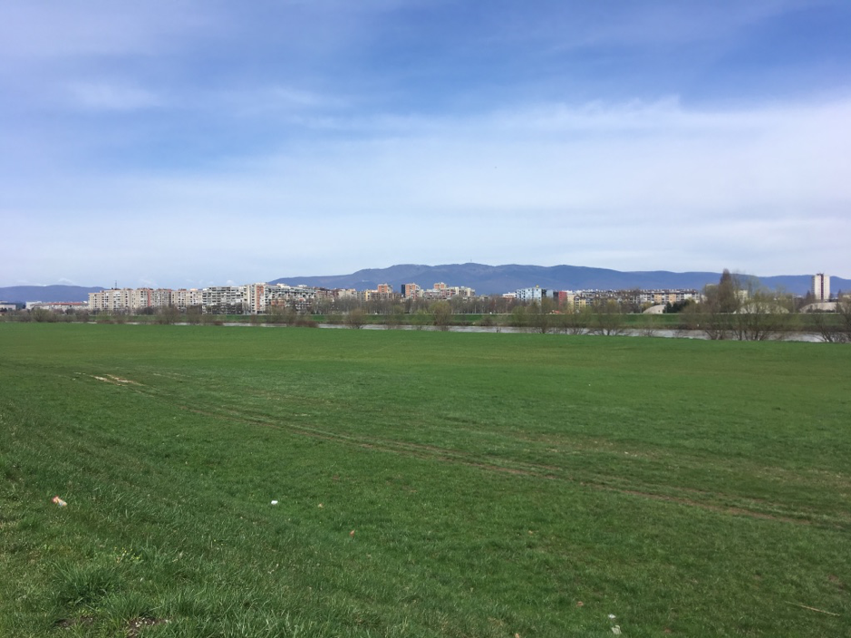
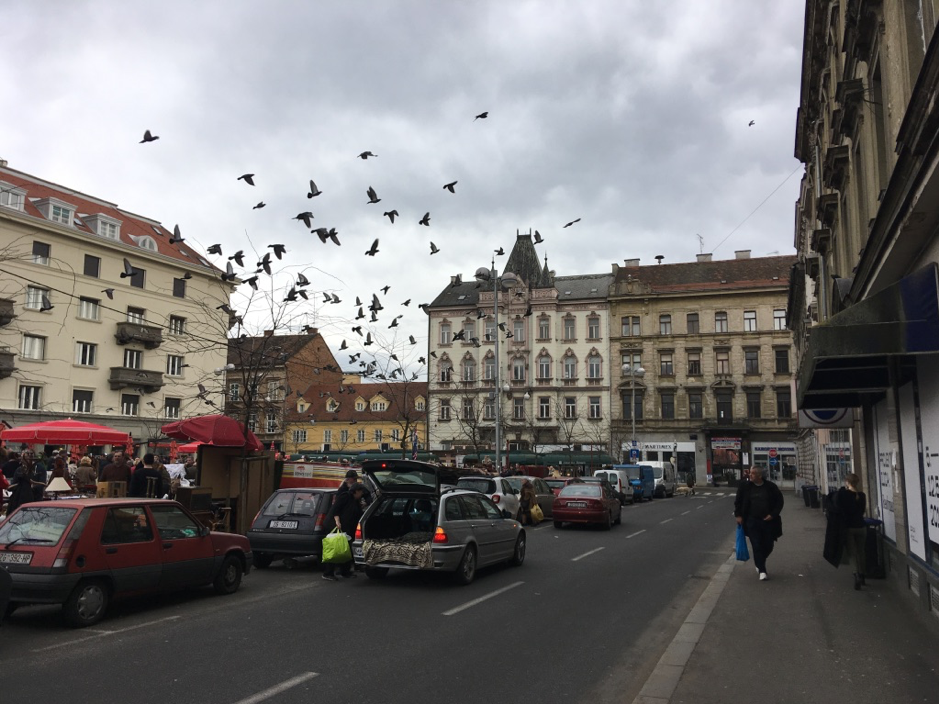
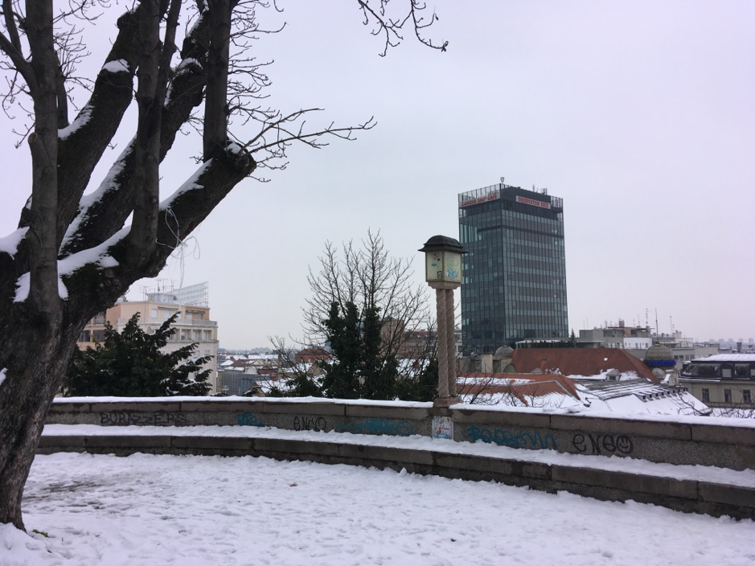
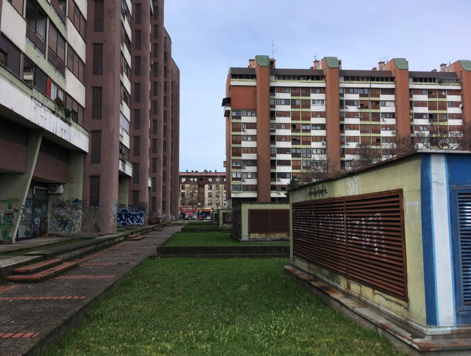

---
Pr-id: Scenes of Independence
P-id: DeepPockets
A-id: 3
Type: article
Book-type: anthology
Anthology item: article
Item-id: unique no.
Article-title: title of the article
Article-status: accepted
Author: Sepp Eckenhaussen
Author-email:   corresponding address
Author-bio:  about the author
Abstract:   short description of the article (100 words)
Keywords:   50 keywords for search and indexing
Rights: CC BY-NC 4.0
...

# Introduction: A Mapping Exercise

Zagreb, Rebecca West says, ‘has the endearing characteristic, noticeable
in many French towns, of remaining a small town when it is in fact quite
large’.[^1] She wrote these words in the late 1930s, when Zagreb had
just over two hundred thousand inhabitants. By 2019, this number has
almost quadrupled. Yet a similar feeling captures me while roaming the
city today. It seems like Zagreb is a capital and a village at the same
time. It is almost impossible to get lost in the streets, squares and
parks squeezed between Mount Medvenica and the Sava River.

Zagreb – between Sava and Medvenica.

According to West, Zagreb’s village-like character is ‘a lovely
spiritual victory over urbanization’.[^2] A dubious compliment. Within a
few years after West’s visit, two hundred thousand refugees of World War
II settled in the city, affirming that in Zagreb, too, the force of
urbanization is more than capable of bending the laws of spiritual life.
It could hardly be said that West was naïve, though. Her fist
thick *Black Lamb and Grey Falcon: A Journey Through Yugoslavia *is
widely regarded as one of the greatest – some say the most foreseeing –
books ever written about Yugoslavia. It describes with great finesse and
pointy humor the life of the Balkan peoples during centuries of
hardships and the constant political quarrels amongst Serbs, Croats,
Slovenes, Bosniaks, Albanians, and Macedonians. If anything, West’s
spiritualist interpretation of life in Zagreb hints to the understanding
that this is a city that is not so easily readable.

The Britanski Trg market on an average weekday.

Zagreb is a fragmented city; its many neighborhoods seem to be different
worlds. Even the city center, which is not very vast, is split up into
three parts: one for politics, one for religion, and one for life. The
old city, located on a hill and called Gornji Grad (upper town), is the
seat of the Croatian government. From here, the county’s rulers have a
wide view over the rest of the city and the Pannonian Basin beyond it.
Over the past decades, Gornji Grad’s old age and altitude have also made
it into a well-visited tourist attraction. As a result, a visitor of
Gornji Grad will encounter the strange mix of formal power and touristic
entertainment usually reserved for royal palaces. On the slope of the
hill stands Zagreb’s magnificent cathedral with its towers in eternal
scaffolds, surrounded by the clerical complexes. This is Kaptol.
Together Gornji Grad and Kaptol are the epicenter of Croatian political
and clerical power, which are deeply intertwined.

A view from Gornji Grad.

At the foot of the hill, Donji Grad (lower town) begins. This part of
the city, built in the nineteenth century, is surrounded by Gornji Grad
on the north and the Green Horseshoe on all other sides. The Green
Horseshoe consists of three boulevards modeled after the Ringstraße in
Vienna. Its main elements are leafy parks, botanical gardens, and
neo-renaissance pavilions designed to simultaneously impress and relax
flaneurs and other passers-by. In Donji Grad, one can find the main
shopping street Ilica, restaurants, hotels, a handful of one-room
cinemas, the botanical gardens, the train station, and the main square
Trg Ban Jelačić - usually simply called Trg. It is here that public
everyday life takes place. The fact that Zagreb’s urban life is this
concentrated is quite joyful since hardly a day of Zagreb life passes
without a random encounter with a friend or colleague.

The statue of Ban Jelačić on Zagreb’s central square.

A few kilometres to the East of the city centre one finds the green
pearl of Zagreb: Maksimir Park. The huge park contains five basins full
of turtles, a small zoo, a restaurant pavilion overlooking the tops of
the trees, and enough lush green and small pathways to wander around for
a full day. No wonder young families, dog-walkers, sunbathers and
tourists flock the park whenever the sun comes out. It was built by
Zagreb’s bishops in the late 18th century and was the first large public
park in South-Eastern Europe. A statement of civilization. The famous
Yugoslavian writer Miroslav Krleža, who can be called the archetype of
Croatian authorship, wrote about Maksimir in his 1926 *Journey to
Russia:*

> Where does Europe begin and Asia end? That is far from easy to define:
> while the Zagreb cardinals’ and bishops’ Maksimir Park is definitely a
> piece of Biedermeier Europe, the village of Čulinec below Maksimir
> Park still slumbers in an old Slavic, archaic condition, with wooden
> architecture from ages prehistorical, and Čulinec and Banova Jaruga to
> the southeast are the immediate transition to China and India, snoring
> all the way to Bombay and distant Port Arthur.[^3]

So, this wonderful place of leisure, so progressive at the time of its
construction, shows the particular of position Zagreb in cultural
discourse; an explosive position on ‘the fault line between
civilizations’.[^4] This strange place on the brink of East and West has
for centuries played an important role in the identification of Croatian
culture, both from inside and out, and contributed to the Balkan’s
reputation as the ‘Powder Keg of Europe’.[^5] For is it not inevitable
that, when cultures so different from one another meet in one place,
clashes ensue? Croatia is, in other words, on the frontier of the
Culture Wars.[^6]

Around the old city of Zagreb, beyond the comfort of the Viennese
boulevards of the lower town and the picturesque alleys of the upper
town, socialist-era architecture arises. Walking through the maze of
streets and courtyards just south of the city center, a visitor might
run into the impressive sight of the Rakete: a complex of three
rocket-shaped towers designed by Centar 51 in 1968, which will soon be
discovered by photographers with a brutalist fetish. And even further
south, cut off from the rest of the city by the river Sava, is Novi
Zagreb (New Zagreb). This part of town was built by the order of Marshal
Tito to accommodate for a new, socialist urban life. Between the typical
socialist high rises, a huge horse racing track was built, a new
national library, and, more recently, the Museum of Contemporary Art.
But despite these grand public works, social life in Novi Zagreb takes
place mainly in the cafés of its malls and on the gigantic flea market
Hrelić.

High rises in Novi Zagreb.

In this fragmented city with its many testimonies of a rich and
turbulent history lives a unique culture. There is the culture embodied
by the stately Viennese-style buildings of the Museum of Modern Art, the
Archaeological Museum, the Art Pavilion, and the National Theatre, which
take up unmistakably symbolic spaces along the promenades of the Green
Horseshoe. But then there is also another, more interesting culture in
Zagreb. This other culture emerged after Yugoslavia disintegrated in
1991 and Croatia became an independent state for the first time since
the Middle Ages. Insiders refer to it as ‘independent’ or
‘non-institutional culture’.

Independent culture is just as present in the city center as the grand
institutions, yet not immediately recognizable to the outsider. A
stone’s throw away from the Archaeological Museum, hidden away in the
arcade of a courtyard there is the small Galerija Nova. Galerija Nova is
the only exhibition space in Zagreb structurally presenting art
exhibitions which carry solidarity with migrants – a highly sensitive
topic in this country on the border of the European Union. One block
further still, in the back of another courtyard, Multimedia Institute
and Hacklab MAMA is located, the base for Croatian media art and digital
culture since the early 2000s. It also happens to be the best library in
the fields of new media and commons in Croatia. A few minutes eastward
by bike, in the poche Martićeva Street, there is a café which at first
glance looks like any other. Once inside, however, it turns out that
Booksa is a hotspot of cultural life, where cultural workers come to
drink coffee, meet, work, and read. A few tram stops from Booksa, in the
fold line between the railroads and The Westin Zagreb, there is an old
pharmaceutical factory. Today, it is a former squat called Medika.
Instead of medicines, it now produces punk concerts and glitch art
exhibitions.

I could go like this on for a while. Because with every visit to one of
these places, one meets people and finds out about other places like it:
the experimental dance company BADco., curatorial collective BLOK, news
outlet Kulturpunkt, youth culture hub Pogon, anarchist bookshop Što
Čitaš?, the old socialist Student Centre, platform organizations
Clubture and Right to the city, and Documenta – Centre for Dealing with
the Past. Like a distributed web, these organizations permeate the urban
tissue of Zagreb. They make up a kind of village-like social system in
which most people know each other personally and have often worked
together at some point. Independent culture is a scene.

Now, if I’m raising the impression independent culture is either a
subculture or a purely local phenomenon, I should correct myself
immediately. Independent culture includes well-known, (internationally)
established organizations. A quick look at MAMA and Galerija Nova is
enough to illustrate this point. MAMA’s programs include many Croatian
contributors, but also Catherine Malabou, Geert Lovink and Pussy Riot.
The institute published the latest book by the French philosopher
Jacques Rancière, one of my personal favorites amongst contemporary
thinkers. WHW, the curatorial collective which directs Galerija Nova,
works with internationally renowned artists like Mladen Stilinović,
Sanja Iveković, and David Maljković. They have, moreover, been appointed
as director of Kunsthalle Wien in the summer of 2019. While certainly
embedded locally, independent culture is thus an internationally
oriented scene.

It is hard to pinpoint exactly what type of culture is created in
independent culture, while the practices of the various organizations in
it differ so much. It includes but is not limited to dance, performance
art, theatre, visual arts, new and old media, experimental cinema,
festivals, education, community work, research, discursive programs,
networking, and advocacy. It is clear that independent culture
transgresses the boundaries of traditional cultural disciplines. The
only general characteristic is that while all of these organizations
work with culture, none work within the strict confinements of the art
world or artistic production – a characteristic so common that it cannot
define a scene. So, what is it that connects the scene, apart from
personal relations, a shared urban environment, and the fact everyone in
it does ‘something with culture’?

If anything, the organizations within independent culture are united by
common political outlook (not to be confused with a political agenda).
Their programming embodies a conglomeration of activist discourses
leaning to the left of the political spectrum. Amongst other things,
they focus on anti-fascism, pacifism, commons activism, feminism and
queer activism, decoloniality, and ecological activism. Some would say
that Yugonostalgia is rather common in independent culture, others would
say that they’re Yugofuturist. In order to be able to have this
political agency in the context of Croatia, which is predominantly ruled
by right-wing and nationalist forces, the scene is organized separately
from the state-funded cultural infrastructure. This shows by
approximation what the independence is that holds together Zagreb’s
independent cultural scene. Being rooted in grassroots activisms rather
than large institutions governed by state and local governments,
independent culture claims to work, indeed, independently from the
dominant power of the state.

But contradictions abound. From the moment of its emergence in the
1990s, the independent cultural infrastructure depended largely on
international philanthropist organizations such as the George Soros
Foundation, the Rosa Luxembourg Foundation, and the European Cultural
Foundation, as well as for-profit organizations such as the Viennese
Erste Bank. Then, since the mid-2000s, international funds have
retreated from Croatia, making independent cultural organizations more
reliant on state funding, effectively incentivizing them to engage in
advocacy, self-institutionalization, and cultural policy-making. It is
questionable, then, how independent or non-institutional the independent
cultural scene really is at this point. Is it a product of local urgency
and grassroots engagement, or neoliberal and neo-imperial phenomena like
globalization and cultural entrepreneurship? Is it possible that it is
both? And if so, what is the interrelation between these forces?

In its analysis of independent cultures, the following text is at times
sharp and critical. The struggles it speaks of are real, and addressing
them can, as I have learned, be sensitive at times. Yet, in the end, my
account is always informed by solidarity. I deeply appreciate the
existence of the organizations gathered under the umbrella of
independent cultures. Sensing the political subjectivity and
collectivity of the scene, however fragile, is a relieving and inspiring
experience, especially when coming from Amsterdam, a place where
neoliberal hegemony is by now so complete that elements of collective
resistance are nearly completely absent from the circuits of cultural
production.

My goal in writing has been to instrumentalize my semi-outside
perspective and to create an analysis that makes sense to and is useful
for the reader in the local context. At the same time, I reckon that the
question of independence (in- and outside of culture) is a globally
relevant one. This book, therefore, discusses two different (although
not separate) questions: What does independent culture in Zagreb look
like to an outsider? And what insights do the struggles in Zagreb’s
independent culture provide into the regimes of global neoliberalisms in
culture and beyond?

[^1]: Rebecca West, *Black Lamb and Grey Falcon: A Journey Through
    Yugoslavia* (London and Edinburgh: Canongate, 2006(1942)), 47.

[^2]: West, *Black Lamb and Grey Falcon,* 47.

[^3]: Miroslav Krleža, *Journey to Russia,* trans. Will Firth (Zagreb:
    Sandorf, 2017), 26.

[^4]: Georges Castellan, ‘Les Balkans: poudrière du XXe siècle,’
    *Guerres mondiales et conflicts contemporains,* no. 217 (January
    2005), 5-15.

[^5]: Samuel P. Huntington, ‘The Clash of Civilizations?’ *Foreign
    Affairs,* vol. 72, no. 3 (Summer 1993).

[^6]: The Balkans have also been the battleground of military power
    struggles between West and East for centuries. The expansion of the
    Ottoman Empire was put to a halt by Western-European forces in the
    Balkans in the 16th and 17th century. In the early 20th century, the
    fall of the Ottoman Empire and the emergence of nation-states
    solidified the border between the liberal, Christian West and the
    Islamic East. Forced mass migrations and assimilations of ethnic and
    religious minorities took place, displacing Ottoman Christians West
    and Balkan-inhabiting Muslims East of the Bosporus. The friction
    caused between the ethnically and religiously diverse populations
    that had inhabited the Balkans for centuries, led to two Balkan Wars
    in 1912 and 1913. In 1914, by firing the mere couple of gun shots
    that killed Archduke Franz-Ferdinand of Austria, the Bosnian Gavrilo
    Princip triggered what was briefly considered the Third Balkan War,
    but is now known as the First World War. This series of events
    gained the Balkans their reputation as the ‘Powder Keg of Europe’, a
    reputation that was reinforced once again in reactions to the
    Yugoslav Wars in the 1990s. Moreover, the idea of the Balkans as a
    ‘Powder Keg’ was deepened by the rise of global identity politics
    heralded by the fall of the Iron Curtain in 1989. In *The Clash of
    Civilizations?* (1993), the American historian Samuel S. Huntington
    argued that after what Francis Fukuyama famously called the ‘end of
    history’, the ‘great divisions among humankind and the dominating
    source of conflicts will be cultural. \[…\] The clash of
    civilizations will dominate global politics. The fault lines between
    civilizations will be battle lines of the future.’ This theory was
    utilized, if not designed, to justify the US in upholding the
    aggressive foreign policy rhetoric it has used throughout the Cold
    War up to the present day. The argument that the Balkans are on the
    fault line of civilizations served in this agenda as a justification
    to keep regarding this area as the place where the West fights off
    the East. Huntington, ‘The Clash of Civilizations?’, 22.
