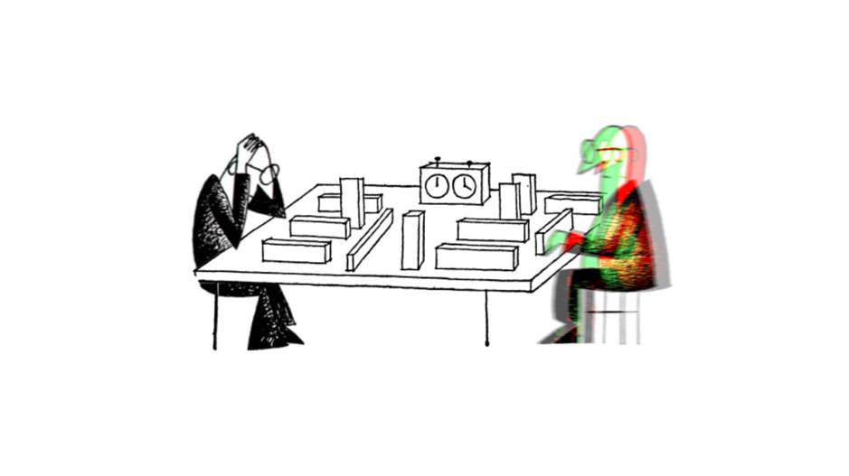
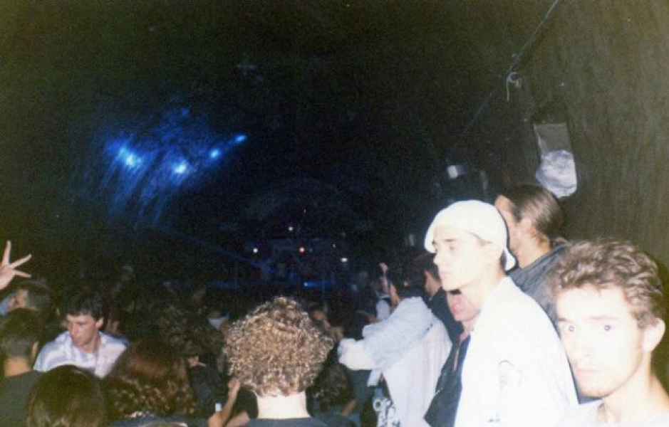
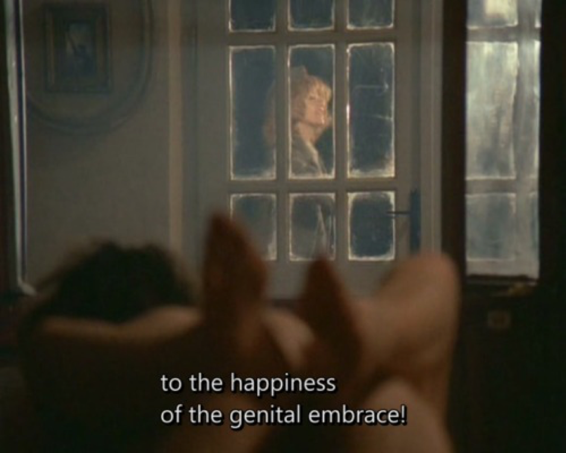
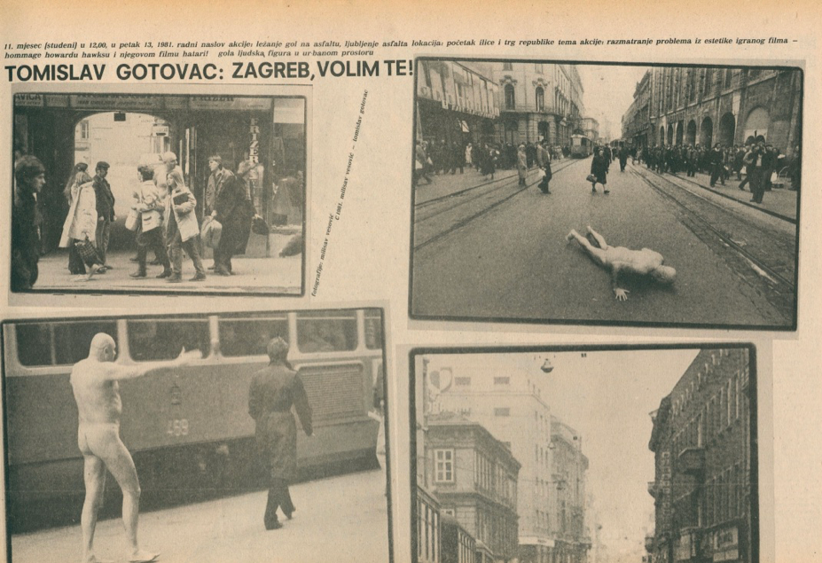
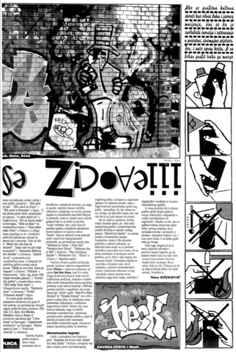
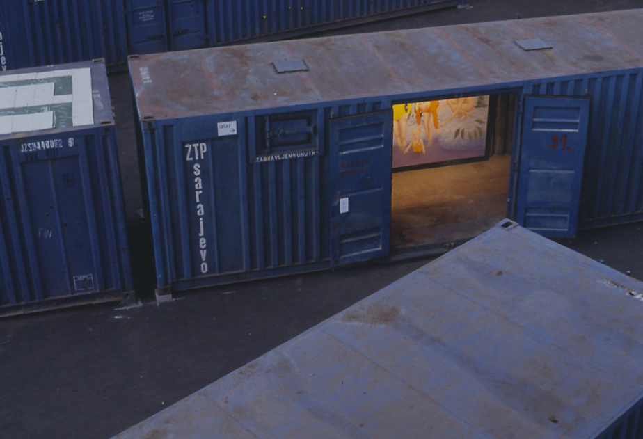
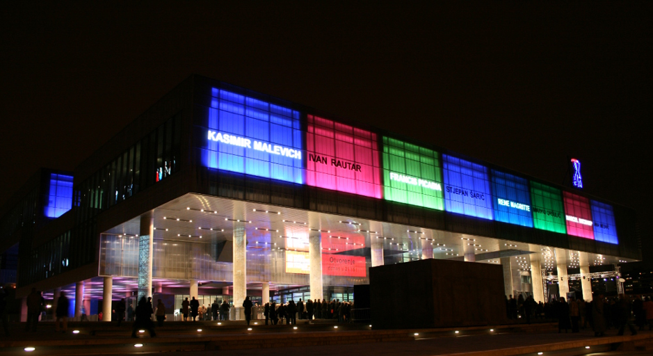
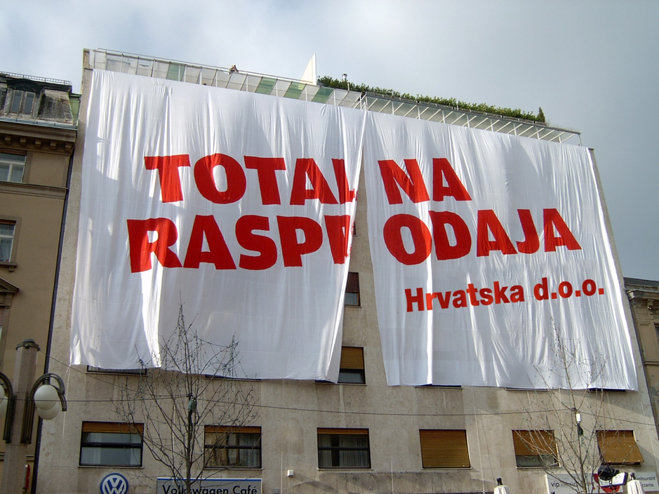
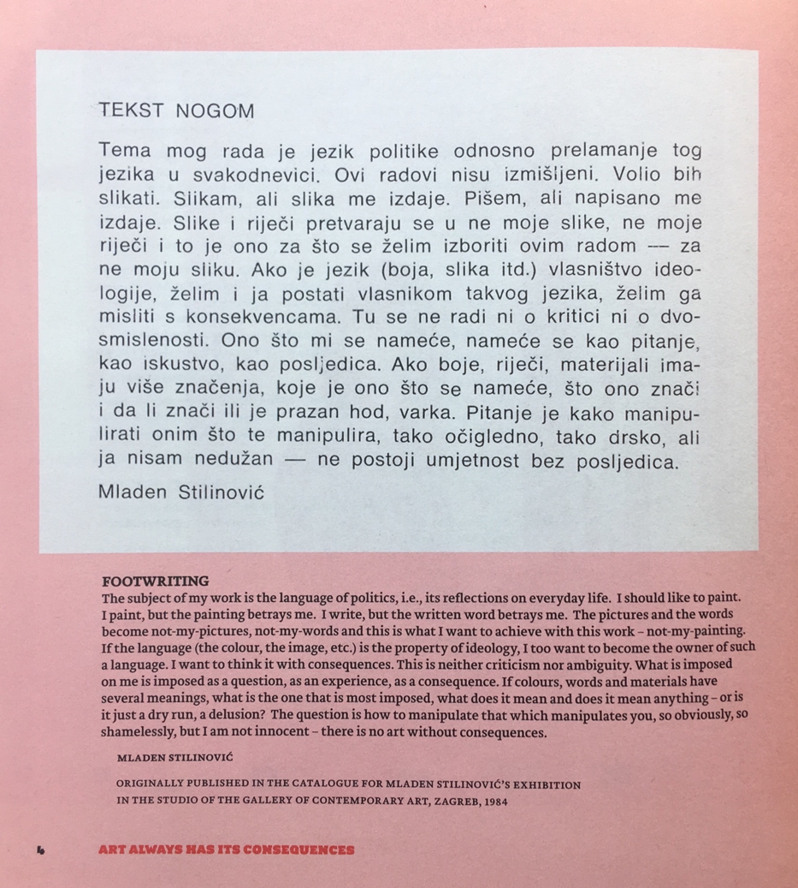
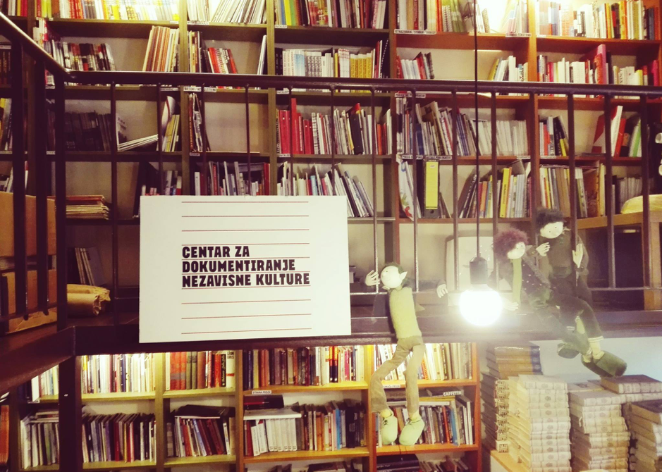

---
Pr-id: Scenes of Independence
P-id: DeepPockets
A-id: 3
Type: article
Book-type: anthology
Anthology item: article
Item-id: unique no.
Article-title: title of the article
Article-status: accepted
Author: Sepp Eckenhaussen
Author-email:   corresponding address
Author-bio:  about the author
Abstract:   short description of the article (100 words)
Keywords:   50 keywords for search and indexing
Rights: CC BY-NC 4.0
...

Still from David Maljković, *Afterform* (2013). Courtesy of Annet Gelink
Gallery.

# 1. Genealogy: How Are Independent Cultures Born?

Yugoslavia broke up in 1991, and despite the general consideration that
independent cultures emerged concurrently, this historical narrative
takes off in the Socialist Yugoslav era and re-examines some cultural
legacies it left behind. After 1991, I discern three subsequent phases
in the history of independent culture. These are characterized by
different attitudes, discourses, and material circumstances within and
around the scene. This conclusion is drawn from; my examination of
‘organic’ literature produced within the field of independent culture;
some theoretical interventions from outside-perspectives and critical
theory of a general character; the loosely structured interviews I
conducted with actors from the independent cultural scene – including
curators, theoreticians, professors, students, funders, and artists;
observations made during visits to most of the independent cultural
spaces in Zagreb; and discussions with my friends from the Academy of
Fine Art’s New Media Department and from the performance art community.

Writing an ethnographic account of the peace movements during the
Yugoslav Wars, sociologist and activist Paul Stubbs formulated a
‘nethnographic’ methodology. The netnography ‘usefully draw\[s\] on
ethnographer as informant and embrace\[s\] the reflexive dimension such
that reflexivity is applied not just to the work of individual
ethnographers, but to the methodology as a whole’ and thus achieves a
‘multi-voiced netnography’.[^1] In line with this approach, I use
extensive quotations from interviews and conversations in the following
text. By incorporating different voices from the field of independent
culture, I engage with various views on socialist histories and cultural
heritage. This has also involved considering different takes on the
character of civil society and the arguments that are formulated from
these perspectives. Most important is the way in which history is
articulated from them, whether that be as a source of inspiration for
contemporary practice and activism or as a factual deduction and
disinterested understanding. I simultaneously discuss institutional
developments in artistic and cultural production, political changes,
artistic tendencies, important developments in discourse, historiography
and theory. The point in doing so is to engage with the interrelation
between these different historical events and the problems that arise
from attempting to comprehend them; thereby to confront how our thinking
of the past influences our attitudes in the present.

As such, the following is a genealogy rather than a history. The
difference, according to Michel Foucault, is that a genealogy ‘opposes
itself to the search for “origins”’ so typical of traditional
histories.[^2] In a genealogy, history is not considered to be a pure
reality covered by the dust of time, waiting to be uncovered ‘as it
really was’, or the material of grand narratives, but a complicated
tissue of discourse resulting from the interplay of power relationships
and the distribution of capital. The task of the genealogist is to
explore the way beings have been disciplined by power in the past. This
can be done, Foucault suggests, by looking for the ‘Herkunft’
(discursive commencement) rather than the ‘Ursprung’ (historical
essence) of historical events.

The image that appears from this genealogical account of independent
cultures in Zagreb is full of shifts and breaks, caused by wars, changes
of governments, the conception of new ideas, and other factors that
determine how beings are disciplined by power. But I do not suppose
there is progress in the history of independent cultures. Writing
through this bourgeois myth of progress and linear chronology would only
result in a boring *Abendland-*image of emergence, peak and decline. In
fact, as much as there are disruptions, there is a continuity in the
praxis of independent cultures as it peaked repeatedly in the 1970s, the
early 2000s, and, in some sense, today. Independent culture is a living
culture that constantly morphs and transforms. Who knows what shape it
will take tomorrow, when the circumstances are different from today? In
the face of this liveliness, I cannot write anything else than a
situated, effective history of the praxis of independent cultures.[^3]

## 1.1. What Is a Genealogy Today?

How exactly can a genealogy intervene in the living discourse of the
past at present? What does it mean to write a genealogy today? Foucault
wrote his genealogies in the 1970s, the late days of Fordist labor
relationship dominance. Since then, due to incessant globalization,
automation and the rise of the internet, a shift to post-Fordist labor
took place in the (former) West and created new regimes of disciplining.
Italian autonomist philosopher Franco ‘Bifo’ Berardi has pointed out
that regimes of power like social media and the platform economy no
longer aim to discipline the body of their subjects, as was the case for
the 20th-century ruling class. Rather, they discipline the soul and put
it to work.[^4]

The type of soul work dominant in independent cultures is ‘abstract
labor’, defined by Bifo as value-producing time with no relation to the
specific and concrete utility that the produced objects might have.[^5]
Since the rise of digital media and the high-tech industries, abstract
labor has become widespread, including trades like PR, design, web
development, and most of all, the creative industries. But the oldest
and most archetypical type of abstract labor could be said to be the
creation of high art by the autonomous artist genius. The artist genius
attains such a level of specialization that the value of their labor
equals the uniqueness of their abstract skills beyond any reference to
use value. For instance, the rumor goes that Pablo Picasso was once
approached by a stranger in a restaurant and asked to scribble a drawing
on a napkin. Picasso complied and said that ‘this will be 40.000 Francs,
please’. The stranger was astonished and objected: ‘But you did that in
30 seconds!’, to which Picasso replied: ‘You’re wrong. It took me 40
years to become Picasso.’ This example perfectly shows Bifo’s point that
abstract labor ‘manipulates absolute abstract signs, but its recombining
function is more specific the more personalized it gets, therefore ever
less interchangeable’.[^6]

Every worker of today’s global culture class follows Picasso’s example,
geared up with a silver laptop and an organically decomposable mug of
artisanal coffee to use the manipulation of abstract signs to strive for
uniqueness rather than homogeneity. The paradoxical situation resulting
is that, even though these high-tech workers function like any other
type of homogenous work force most of the time, they identify as unique
creatives. ‘Consequently’, Bifo says, ‘*high tech* workers tend to
consider labor as the most essential part in their lives, the most
specific and personalized’.[^7]

This new situation requires a different focus for the genealogist too,
because the mental automatisms and types of alienation that characterizes high
tech workers because of their complete identification with their jobs are nothing
like factory workers’ physical alienation in which producing bodies become
interchangeable. Instead of the split between
body and soul caused by Fordism, we encounter an internal split of the
soul in post-Fordist labor relationships. Due to the rise of
neoliberalism and the dismantling of public social systems, the
precarious circumstances in which the soul of high-tech workers is
employed results in the internal split of the soul as creative entity
and the soul as entrepreneurial entity. While the creative soul creates
freely and abstractly, the entrepreneurial soul of the high-tech worker
enters into market competition to compensate for the failing social
systems.

Independent culture in Zagreb is a circuit full of such abstract
high-tech labor. Indeed, the precariousness of mental work is an often
talked-about subject in the scene, felt deeply by its members on a daily
basis. Their condition means that they have to take care of themselves
through the market or funding competition – while being uncertain about
their survival from year to year. What’s more, the instrumentalized use
of precarization by governments is one of the structural threats
independent cultural organizations deal with. For many of these
organizations, a year without government funding can easily mean the
end. Precarity is therefore the red thread in my genealogy of
independent cultures.

To address this state of precarity, I borrowed some important
definitions from Isabell Lorey’s *State of Insecurity: Government of the
Precarious (Futures)* (2012). The four key concepts Lorey expands upon
in this book are: *precarization*, *precariousness*, *precarity*, and
*governmental precarization*. The most general of these terms is
precarization, which refers to the phenomenon of living with the
unpredictable, the contingent.[^8] It is the umbrella term, under which
the other three are grouped. Precariousness, precarity, and governmental
precarization are three respectively social-ontological, discriminatory,
and historical dimensions of precarization.

Precariousness refers to the socio-ontological state of insecurity: all
human beings are born into society, disposing of nothing but a harmless
and necessarily mortal body. We all know: leave a baby alone and it dies
within days. The fact that any full-grown human is alive is because they
have taken the necessary care to postpone inevitable death. From the
moment we are born, we are dependent upon social structures and the care
of others. Precariousness is, then, not necessarily something we are
born *with,* but necessarily something we are born *into.* Thus,
precariousness is not a natural condition, but at the same time socially
constructed and unavoidable. It is shared by all, yet divides and
individualizes. Judith Butler has put it this way: ‘Although precarious
life is a generalized condition, it is, paradoxically, the condition of
being conditioned’.[^9] Since precariousness is this unavoidable,
pre-intentional condition shared by all, it exists outside of power
relationships, *before* power relationships.

Precarity, on the other hand, is the moment when the fear of precarious
life turns into power and constitutes a hierarchic categorization of
precariousness and becomes regulatory.[^10] Instead of facing the
unavoidable danger of precarious life, the fear deflected and projected
onto more controllable entities: the lives and actions of others. (Why
am I feeling so weak and vulnerable in everyday life? Must be the queers
and the immigrants.) Through the discriminatory logic by which some
privileged groups project their fear onto others, a hierarchic
categorization of forms of life is created. Precarity can thus be
understood as a functional effect of political and legal forms of
regulation that should ideally function as protection from
precariousness. Clearly, the exclusive and regulatory effects of
precarity do not only create a sense of safety, but are also closely
linked to racism, anti-Semitism, homophobia, etc.

Importantly, this regulatory dimension of precarity is neither necessary
nor natural, but a contingently-historically constructed phenomenon. The
status quo of power relations in the industrial-capitalist era have from
the start been dependent on the individualized, and therefore
biopolitically governable, labor market. This was justified in the
discourse around individual responsibility and the *sovereign
citizen*.[^11] Since a sovereign citizen is free to pick their own means
of existence (jobs, health care, insurance, social circles, etc.), they
are also responsible for the upkeep of their existence and to deal with
all the insecurities it comes with. Leap forward in time: with the
emergence of the internet, post-Fordist modes of production, including
both cognitive and creative work, precarious living and working
circumstances have become normalized. What is more, in this context,
normalized means: happily internalized. We, the creative class, all want
the freedom of flexible jobs and the ability to work from our MacBooks
in any coffee bar around the world. Thus, without any struggle,
precarization (and the privilege to be without it) have become an
essential tool of contemporary neoliberal government.

Here, Lorey asserts, we discern the third dimension of precarization:
governmental precarization.[^12] Governmental precarization, according
to Lorey, not only entails a precarization of wage labor, but also of
existence in general. The emergence of governmental precarization and
neoliberalism (the marketization of (every facet of) life) are related.
Economic deregulations and the abandonment of Fordist labor have created
not only created freedom and flexibility, but also income disparities,
precarity and fear. The more individuated and the more marketized our
European condition has gotten, the more normalized precarious life has
become. But, Lorey emphasizes, the fact that precarious life has
normalized and become a tool of governance under neoliberalism, does not
mean that insecurity itself has normalized, too. On the contrary, as
nation-states proceed to dismantle one social security structure after
another, more and more emphasis is put on national security. These fears
were then (pseudo-)resolved on the nation-state level by militarization
and repression of the Other.

The fear of alien social bodies, terrorism, Islam, racial dilution,
cultural digression and aggression towards asylum seekers have all
increased with the rise of the precarity. This ideologically installed
fear is then eased by rising military budgets, xenophobic refugee
policies, and strongman leaders. Hence, the functional dimension
precarity has been institutionalized and has become the foundational
mechanism of government.

Now, let’s start at point zero: the disintegration of the Socialist
Federal Republic of Yugoslavia.

## 1.2. Point Zero: The Disintegration of Yugoslavia

1991 saw the disintegration of Yugoslavia. After a decade of political
crisis and ‘no future’, the Fukuyaman ideology of the post-historical
condition – the idea that all major ideological struggles had been
played out when the Iron Curtain fell in 1989 and that
liberal-democratic capitalism had come out definitively victorious –
finally and violently caught up with Yugoslavia. Slovenians, Bosniaks,
Croats, Serbs, Serbian Croats, Croatian Bosniaks, Bosnian Serbs, Serbian
Bosniaks, Bosnian Croats, and Croatian Serbs fought each other in
shifting alliances. Historians still debate whether these are four
separate Yugoslav Wars or a single civil war. In any case, as soon as
images of Serbian concentration camps went viral on every possible
Western news outlet, it became clear that ‘something’ had to be done.
The U.N. intervened while Milošević marched. Even though the Dutch
military forces failed to fulfil their duty, the Yugoslav People’s Army
ceased its campaign under the threat of NATO bombing. The borders of a
divided Yugoslav area started to take shape, and the rest is history*.*
A history, moreover, that was later neatly separated from the
post-historical present day by means of legal closure in The Hague. With
some irony, it can be said that the Iron Curtain separating East from
West was replaced by the curtain of justice separating history from the
present.

But the Yugoslav Wars have been the subject of many a historiography and
I will refrain from writing one more here. It is already clear to all
that the war time was a period of such radical social, institutional,
political, ideological, and cultural change and destruction, that it can
be rightfully marked as a point zero. What is of interest to me, and
what is in some sense the core of this book, is the question what
happens *after* point zero. In the aftermath of the Second World War,
Theodor W. Adorno famously stated that ‘to write a poem after Auschwitz
is barbaric’. Auschwitz was an obvious point zero. And continuing the
cultural practices of the ‘civilized’ society that led to the atrocities
of the Holocaust – such as writing an old-fashioned poem – without
questioning the role of cultural production and narratives within that
civilization had become a moral impossibility after this point zero.
Now, if the Yugoslav Wars are the point zero in this case, at stake is
the barbarism of poetry after Srebrenica.

### 1.2.1. Transitology

A quintessential idea in the liberal discourse of post-history was that
of ‘transition’. Directly following the fall of the Iron Curtain in
1989, departments of ‘transformation studies’ or ‘transitology’ were
established throughout universities in Westeren Europe and the United
States as schisms of Area Studies and Soviet and Comparative Communist
Studies. These departments studied and supported the fall of
authoritarian and totalitarian regimes in Eastern Europe and their
transition into the Western democratic model. The foundational
hypothesis of transitology was paraphrased by transitologist James
Hughes, stating that: ‘The basic premise is self-evidently normative and
linear: that the values, structures and political procedures of advanced
Western democracies are the most developed and should be transplanted
\[to the rest of the world\]’.[^13] The insights generated in these
departments were soon adopted by the policymakers of Western governments
as well as the International Monetary Fund and the World Bank and used
to formulate plans for the establishments of free markets, civil
societies, and democratic institutions in the East. More than a
theoretical enterprise, transitology thus became a practical tool for
the smooth implementation of the Western ideals of democracy, free
market prosperity, and the open society. It is therefore that the notion
of ‘the period of post-socialist transition’ has come to be used as a
synonym to ‘the 1990s’ in Eastern Europe, including the former Yugoslav
area.[^14]

In hindsight, not everyone is as happy with the impact of transitology.
In his article *Children of Post-Socialism* (2015), the critical
theorist Boris Buden argued that the post-socialist transition was not
just a traumatic lived experience of war or simply a period of time in
between two societal models, but also a discursive tool of neo-imperial
and neoliberal subjugation of the (former) East by the (former) West by
means of ‘repressive infantilization of societies that have recently
liberated themselves from communism’.[^15] The dominant idea was that,
after the end of history, the only rational way forward for
post-socialist countries was to follow the lead (or the tutelage) of the
already-democratic (former) West by ways of direct imitation. Buden
elaborates on the consequences of this demand to imitate:

> Not only \[were\] the protagonists of the democratic revolutions
> robbed of their victory and turned into losers; at the same time, they
> have been put under tutelage and doomed blindly to imitate their
> guardians in the silly belief that this will educate them for
> autonomy. It is not only the arbitrariness of the new rulers, but
> above all the logic of their rule that reveals itself.[^16]

What was this new post-socialist and post-historical logic? In their
book *Welcome to the Desert of Post-Socialism* (2015), Igor Štiks and
Srećko Horvat unpack how the post-socialist transition played out
materially and conclude that:

> The dismantling of the remnants of the socialist state was legitimised
> by demands for the rapid reduction of the omnipresent state apparatus.
> This process usually entailed the dismantling of existing social
> protection as well as privatisation \[…\] or the total corruption of
> what remained of the state apparatus. \[…\] When the dust finally
> settled, ordinary citizens found themselves not only in a devastated
> country, but also with empty pockets and without the old social safety
> net.[^17]

It appears that, as the curtain of history fell, the dominant logic of
rule was not so much ridden of its teleologic progressivism, but rather
of the aspiration of emancipation and Bildung that had always been
present in the grand narratives of modernism.

Jacques Rancière formulated an elegant theory about the workings of this
post-socialist logic of rule. In his essay *Time, Narration, Politics*
(2017), Rancière analyzed how the so-called end of the grand narratives
was in fact a redistribution of the hierarchy of temporalities creating
a new ‘relation between justice and the order of time’.[^18] The
analysis is quite technical, but nonetheless worth reproducing briefly,
because it shows how a new conception of time helped solidifying the
Western hegemony after 1989 by determining which histories could and
which histories could not be perceived of as historical realities
leading to the reality of the present.

At first, Rancière states that the post-historical era advocated by the
likes of Francis Fukuyama seem to have a temporality where ‘the bare
reality of time, stripped of any inner truth and any promise of justice
and brought back to its ordinary course’. This is why liberal capitalist
democracy could sincerely be perceived as the logical end to history: it
was supposedly the neutral or ordinary course of time, beyond the
distortions of ideology, an *absolute present*. But, Rancière continues,
‘it soon turned out \[…\] that this absolute present had not so easily
gotten rid of the passions engendered by the weight of the past and the
anticipation of the future’.[^19] As we can tell in hindsight, the
then-deemed ‘outdated’ discourses of protectionism and ethno-nationalist
narratives were revived in both (former) East and (former) West pretty
soon after 1990. Rancière asserts that ‘it thus appears that the
simplistic opposition between the past illusion of history and the solid
realities of the present hides a division inside the “present” itself, a
conflict about what is present and what a present is’.[^20]

The struggle implied here concerns the ‘orderly’ hierarchical
distribution of temporalities and forms of life. It plays out between
those who can actively shape the time that might arrive – those living
in the time of science – and those who passively receive time – those
living in the time of ignorance. From this understanding of the
so-called grand narratives as animated by the split of knowledge of
necessity and possibility on the one hand and ignorance thereof on the
other, between the know-it-alls and the know-nothings, it was clear that
the powerful had not stopped claiming their monopoly to knowledge of
history. Rancière:

> Neither the plot of historical necessity, nor its inner splitting have
> vanished in the so-called reign of the present. \[…\] While the end of
> the grand Marxist narrative was loudly trumpeted everywhere,
> capitalist and State domination simply took over the principle of
> historical necessity. \[…\] Historical teleology was replaced by a
> simple alternative: either the lone possible produced by good
> management of the existing order or the great collapse.[^21]

While the division between knowledge and ignorance of history persisted,
the type of knowledge attributed to the know-it-alls changed: in the
place of ‘historical justice’ now came the neoliberal mantra of ‘good
management’.

This hegemonic view of world history after the end of history, divided
by ‘good management’ (the West) and ‘great collapse’ (the rest) has the
perverse characteristic of obscuring the historical material condition
of Yugoslavia. What was actually true is rendered inconceivable by the
simple dichotomy on which the hegemonic narrative hinges: Yugoslavia
never belonged to either East or West.[^22]

### 1.2.2. Non-Alignment

In September 1961, the first *Conference of Heads of State or Government
of Non-Aligned Countries* was held in Belgrade on the initiative of
Yugoslav president Josip Broz Tito.[^23] The majority of all countries
around the world that were never colonial powers (both former colonized
countries and non-colonizing countries) united for the first and so far
last time in history. Thereby, they constituted a non-Eastern,
non-Western world power: the Third World. Today, ‘third world’ sounds
like a negative stigma to us in the former West, since we have forgotten
the decolonial potential of the Non-Aligned Movement (NAM). But that is
not to say it never existed. A 1967 report on ‘The Yugoslav Experiment’
by the CIA stated:

> Yugoslavia is a Communist state in name and in theory, but in practice
> it is a fully independent state which has rejected most of the
> “socialist” experience of other Communist states, including the USSR.
> It has deliberately removed a large portion of its economy from direct
> centralized controls, and despite its retention of a one-party
> political system, it has largely freed its people from arbitrary
> authority.[^24]

There was no space for the memory of this material reality in the
post-historical world history simplistically divided into the exemplary
West and the derivative rest. Three world orders – Non-Aligned, Marxist,
and Capitalist – were reduced to two – West and East.[^25]

The ideological acrobatics with which conservative historians
appropriated the distribution of temporalities and legitimized the
flattening out of history as well as the abandonment of historical
justice, was illustrated well if somewhat Yugostalgically by Ozren
Pupovac in *Why is the Experience of Yugoslavia Important Today?*
(2013).[^26] Pupovac describes how, under the influence of conservative
thinkers, a legalization of theorizing about politics has taken place.
This postulates the legal framework of the nation-state as the
foundation of a sovereign people, instead of the other way around. This
legalization of thought denies the sheer possibility that the construct
of the nation-state is contingent and maybe imperfect. Therefore,
Pupovac concludes:

> Political reaction today thrives on obscurity. We can probably find no
> better use for the concept of “dominant ideology” than to describe
> that peculiar subjective operation – present at almost every step in
> our political everydayness – which assures us that every willed
> rupture with the ordinary course of things, every trace of a
> collective idea of emancipation, remains obscure and unreadable.[^27]

Pupovac echoes Buden’s critique of the discourse of post-socialist
transition and normalization, adds to that an explicit Marxist critique
of ideology, and hints at two aesthetic components of the political
struggle for emancipation: the ‘rupture’ between historical reality and
*sensible experience* that makes emancipation ‘obscure and unreadable’.
I think it is about time for historians like myself to take the history
of the NAM seriously and overcome the dogmas of Westphalian political
theory.

### 1.2.3. Schizophrenic Modernisms and Impossible Avant-Gardes

A similar discussion played out with regard to Yugoslav art within a
construct of art history that maybe, just maybe is imperfect. In the
modernist narratives of art history, Yugoslavia has consequently been
presented as ambivalent at best, and schizophrenic at worst. This is
because they are part of the socialist-communist East, yet flirt with
the capitalist-democratic West.[^28] For instance, the influential
Yugoslavian art historian Ješa Denegri developed the concept of
‘moderate modernism’ to describe how Socialist Yugoslavia’s cultural
policies and institutional cultural productions leaned simultaneously to
the East and the West and thereby receded in moderateness.[^29]
Denegri’s account is insightful, and undoubtedly right in pointing out
that state influence neutralized criticality in cultural production to a
large extent. Both artistic communities and the public were indeed
relatively well-aware of and centered on the Western-European art
historical tradition.[^30] But Denegri lacks criticality towards the
political workings of the concept of modernism and ignores the critical
potentials of the historical context of non-alignment.

Braco Dimitrijević, ‘Diagram of the Formal Evolution of Art’ in
*Tractatus Post Historicus* (1976).

Why modernism, or at least its Western model, is an exclusive regime of
historiography in need of critique was elaborated, again, by Rancière:

> The idea of modernity is a questionable notion that tries to make
> clear-cut distinctions in the complex configuration of the aesthetic
> regime of arts. It tries to retain the forms of rupture, the
> iconoclastic gestures, etc., by separating them from the context that
> allows for their existence: history, interpretation, patrimony, the
> museum, the pervasiveness of reproduction… The idea of modernity would
> like there to be only one meaning and direction in history, whereas
> the temporality specific to the aesthetic regime of the arts is a
> co-presence of heterogeneous temporalities.[^31]

Exactly in this denial of co-presence of heterogeneous temporalities,
Yugoslavia was always-already disqualified for not being univocally
Western, that is, not running at the supposed fore-front of historical
development.

This is best illustrated by the example of *New Art Practice in
Yugoslavia: 1960-1978,* an exhibition which took place in the Gallery of
Contemporary Art in Zagreb in 1978, the catalogue of which is still one
of the most important literary contributions to the canonical narrative
of experimental or ‘retro-avant-garde’ in Yugoslavia.[^32] In the
catalogue’s foreword, Marijan Susovski states that ‘art is not formal
evolutionism’ but a social and dialectical process defined by
‘confrontations with out-dated attitudes towards art in the new social
situation’. An example fitting exactly in this logic is the *Tractatus
Post Historicus*, a booklet written by the young and rebellious
Yugoslavian artist Braco Dimitrijević’s in 1976*.* Dimitrijević wrote:

> The idea of art history as consequent and linear evolution is only
> possible if all cases which don’t fit in line with dominating style
> cliché are overlooked and eliminated. (For instance I’m sure that in
> Rococo there was at least one artist applying esthetic principles
> close to minimal art, but he remained unknown because the collective
> taste and sensibility weren’t ready to accept his ideas.) This model
> of art history is only a reflection of general history because it
> reflects the ideas of Western man about his own history as a series of
> changes which through conflicts and struggles nevertheless result in
> so called “progress”.[^33]

The funny thing is that, if there is no formal evolution in art, exactly
the rejection of formal progress (and the middle-class *Weltanschauung*
on which it is based) becomes the only step forward for the new
generation. Accordingly, the contemporary social evolution of Yugoslav
art was presented in *New Art Practice in Yugoslavia* as a
social-generational break. So, while Susovski rejected formal
evolutionism, he simply replaced it with social evolutionism.

In the catalogue’s next chapter, *Art in the Past Decade,* written by
Denegri, the ‘next step’ in the socially evolving process of art
history is again defined as a generational break of the conceptualists
with the formalist pre-occupations of their predecessors. Since
development can only be seen from the outside, measurement of this
development necessitates some kind of extrinsic measuring unit. The
extrinsic unit used by Denegri to measure the development of Yugoslav
art was what he called the ‘general’ or ‘international context’ which
was in fact the Western context. In qualifying the generational break in
Yugoslav art as one of art historical progress, Denegri repetitively and
exclusively compared it to Western phenomena like Arte Povera in Italy,
*Op Losse Schroeven* in the Stedelijk Museum Amsterdam, *When Attitudes
Become Form* at Kunsthalle Bern, and *The New Art* at the Hayward
Gallery in London.

Why would Yugoslav art historians embrace these narratives? Why was it
important to use the West as a measuring tool? It would be farfetched to
suppose that this imperialist logic of art history was internalized
because of a tremendous intrinsic agreement. It is more sensible to see
this as a self-interested but ineffective attempt to emancipate
Yugoslavia from a ‘peripheral’ to ‘central’ position in world history as
seen through the dominant eye of the West. Just after the Second World
War, Western Europe had successfully adopted the American model of
modernist art, the model of the victorious nation, and thereby gained
itself a central position in terms of common-sense art history. This is
exemplified by Alfred Barr’s depiction of the origins of modern art,
which shows that the American liberal-nationalist favorite movement,
Abstract Expressionism, is a direct successor of the European
avant-gardes. If Western Europe had been able to emancipate itself like
this, why wouldn’t Yugoslavia be able to do the same?

However, the effect of this internalization was not emancipation. On the
contrary, because of the socialist context of Yugoslavia, this reactive
attitude reinforced the image of Yugoslav modernity as an impossible
balancing act between Orientalism and Occidentalism, or, at most, of an
*almost* Western modernity, always just one step behind. What the
catalogue of *New Art Practice in Yugoslavia* shows is, then, the Other
avant-garde, the derivative avant-garde, the impossible avant-garde. The
histories of radical and critical practices in Yugoslavia are rendered
‘impossible histories’ by the fact that narratives like Denegri’s –
which evaluates Yugoslav art history in terms of Westerness – are
dominant.[^34] Thus, by partly simultaneous, partly post-factual
internalization of (former) Western standards of modernity, the
co-presence of temporalities inherent to the Non-Aligned experience was
denied. Instead a discourse was created in which Yugoslav art history is
necessarily considered always-already failed.[^35]

Even if the NAM’s import was mainly political and economic, there was a
tendency towards creating a Non-Aligned cultural sphere and even a
Non-Aligned school of thought. Every summer between 1964 and 1974,
renowned thinkers from former East and West, including Herbert Marcuse,
Henri Lefebvre, and Jürgen Habermas, would gather on the Yugoslav island
of Korčula to teach students from all over the world.[^36] These summer
schools were the work of the Praxis School philosophers*,* based in the
Belgrade Workers’ University and internationally renowned for the
philosophical Marxist journal *Praxis*.[^37] In their journal, ‘the
Praxis School emphasized the writings of the young Marx while subjecting
dogmatic Marxism to one of its strongest criticisms’.[^38] This led the
philosophers to develop a humanist strand of Marxism, with a dynamic
view on the human being, a focus on praxis and creativity, and
consideration of aesthetic issues.[^39] During the 1968 student
uprisings in Belgrade, which were different from the Western examples
because these protestors demanded *more* socialism rather than the end
of capitalism, Praxis School professors did not just join the students,
they led them.[^40] The story goes that, during one of the Korčula
summer schools, Ernst Bloch looked out over the Mediterranean Sea after
a long day of discussions, a glass of wine in his hand, and remarked
that this must be ‘Dionysian socialism’.[^41]

Hotel Croatia, designed by Slobodan Miličević, 1973. This luxurious
Hotel Croatia in Cavtat, a few hundred kilometres South-East of Korčula,
was the site of the state-issued Summer School to which the Praxis
Summer School was a critical antipode.

The resistant internationalist attitude that characterized the Praxis
School was also present in Yugoslavia’s cultural life and at times
seeped through to official or ‘first line’ culture. As a non-colonial
country, Yugoslavia’s foreign cultural programs were strongly connected
to former colonies through their common anti-imperialist struggle. The
Slovenian curator Teja Merhar has demonstrated that Yugoslavia
officially collaborated with at least fifteen African, seven
South-American, and eleven Asian countries on cultural projects during
the 1960s and 1970s with concise research in archives throughout the
former Yugoslav area. These collaborations ranged from exchanges of
resources and traveling movies and exhibitions, to conventions on
culture and full-fledged cultural programs.[^42] Merhar’s research is a
part of *Southern Constellations: The Poetics of the Non-Aligned*
(2019), an exhibition in Ljubljana’s Museum of Modern and Contemporary
Art Metelkova and the very first historical account of the cultural
dimension of the NAM by a major institution.

Next to compiling a lot of unseen data, the exhibition and its catalogue
show a range of striking examples of non-aligned culture and arts in
Yugoslavia. In 1977, the Museum of African Art was established in
Belgrade, claiming to be the ‘only European anticolonial museum’.[^43]
Architects and urban planners from Yugoslavia and several African
countries collaborating on cross-overs of Yugoslav, ‘tropical’, and
internationalist modernisms.[^44] A large exhibition of contemporary
Yugoslav prints toured through India in 1976 and 1977. Under the
auspices of the United Nations, several huge pan-Yugoslav exhibitions,
including works from all three worlds, were created at the Art Pavilion
of Slovenj Gradec between 1966 and 1985.[^45] In Podgorica (then
Titograd) the Gallery of Art of the Non-Aligned Countries ‘Josip Broz
Tito’ was opened in 1984, providing a permanent exhibition space for
works of art from almost 60 countries in Latin America, Asia, Africa and
Europe.[^46]

One exhibit stands out especially. The proto-conceptualist work of the
Croatian artists’ brotherhood Gorgona is one of the best represented
clusters of art from former Yugoslavia.[^47] Historians never fail to
observe Gorgona’s kinship to Western art-world stars like Piero Manzoni,
Lucio Fontana, and Yves Klein, nor do they forget that Gorgona was
Croatia’s representation at the 1997 Venice Biennale. Yet, two years
earlier, Gorgona’s work was also shown at the international exhibition
*Contemporary Art of the Non-Aligned Countries* in Jakarta, Indonesia, a
fact that usually escapes the dominant narrative.[^48] It’s not just
historians who are to blame for this. No documentation of the latter
event ever reached the archive, or all of it was removed from storage at
the organizing institution HDLU. This left no official traces in Croatia
of it ever happening. Fortunately, the political implications of
Gorgona’s exhibition in Jakarta is remembered by the show’s curator Nada
Beroš and described in *Southern Constellations*:

> I saw presenting non-state art at such a highly state exhibition in a
> faraway country in Asia as a small-scale but very important subversion
> of the leaden atmosphere of 1990s Croatia, where the country’s
> official politics, institutions, the media and also the artists
> wholeheartedly endeavored to prove that “we belonged in (Western)
> Europe”.[^49]

Surely, Yugoslavia’s cultural dominants were flawed. There is no denying
that culture in Yugoslavia was instrumentalized as a tool of foreign
policy and subjected to Tito’s political opportunism, often leaving
little room for a critical, grassroots culture.[^50] Moreover, while
both publics and artists were preoccupied with the West, Yugoslavia’s
cultural identification as an ‘older brother’ to other non-aligned
countries was imperialist in its own way. However, it is equally true
that a large part of the cultural production in Yugoslavia was
characterized by internationalism, anti-imperialism and the search for
resistant modernisms. All in all, the historical narrative unearthed by
*Southern Constellations* is distinctly different from the common tale
of schizophrenic modernisms and impossible avant-gardes.

After 1991, however, this heritage of the NAM and its critical cultural
implications became somewhat of an inconvenient truth. As Bojana Piškur,
the curator of *Southern Constellations,* put it:

> Today, the Non-Aligned Movement is politically speaking considered
> more or less something of an anachronism. The fate of this unique
> constellation is probably one of the least understood phenomena of our
> times, but it is certain that its disappearance from the world’s
> political stage is directly linked to the rise and triumph of
> neoliberalism, especially after 1989.[^51]

Indeed, the erasure of the Non-Aligned reality from the dominant account
of Yugoslav history has been rather useful for the post-1991 neoliberal
and nationalist re-valuation of historical Croatian cultural identity.
Its effects on today’s geopolitical situation are clear, and are
personified by strongmen like Hungarian President Orbán, former Croatian
Prime Minister Tomislav Karamarko, and President Duda of Poland. Fed up
with being bossed around, these men reject the tutelage of (former)
Western European powers. In reaction to an EU proposal on so-called
‘migrant quotas’ in 2015, Duda said: ‘I won’t agree to a dictate of the
strong. I won’t back a Europe where the economic advantage of the size
of a population will be a reason to force solutions on other countries
regardless of their national interests’.[^52] At the same time, coming
from right-wing, conservative, anti-socialist parties, these politicians
deny the alternatives to imperial liberalism presented by the ideals and
histories of socialism and Non-Alignment. In other words, they reject
the dominance of the former West but still accept the liberal
end-of-history narratives created in the former West. It is not
surprising that ethnonationalism is instead presented as the only way to
be emancipated from Western tutelage.

To blame art (history) for the rise of authoritarianism would be an
enormous overstatement. However, it has certainly contributed to the
erasure of non-aligned memory in the dominant narratives of modernity.
With *Southern Constellations*, Ljubljana’s Museum of Contemporary Art
Metelkova is the first major art institution in former Yugoslavia to
criticize this status quo and to show how non-alignment ‘enabled the
powerless to hold a dialogue with the powerful’.[^53] It would be
interesting critical historiographers, institutions, and cultural
workers to go one step further and ask: what could a non-aligned
contemporaneity be?

The general context of the early ‘90s in Croatia is clear: war, the end
of history, a post-socialist transition, the erasure of the NAM, and the
promises of a real, democratic, capitalist liberalism. [^54] How exactly
were independent cultures born from this scenario?

*Under City Rave,* 30 November 1993, Grič tunnel, Zagreb.

## 1.3. Independencies of Independence

‘It took place over the weekend in the capital city of Zagreb. The
all-night party of 3000 people took place in former president Tito’s
nuclear fall-out center, under the city of Zagreb. And MTV News were
there to capture some all-too-rare *positive* images of the
country’.[^55] Thus spoke the anchor woman of the MTV program Pepsi DJ
MAG on the 30th of November 1993. Next thing, an ecstatic raver
identified as Robert shouts into the camera:

> We love music. We want peace. The whole world knows that. \[…\] We
> want peace and we want another life. We hope for a better time; we
> hope for Europe. We want peace in the whole world. Help us. We want
> peace and we want to rave.[^56]

Through the lens of MTV, we see *Under City Rave*, the first-ever techno
rave in Croatia: a bunker full of under-sized black leather jackets,
flashlights and the beats of London DJs flowing like the waves of an
ocean on acid.

As one British DJ noted: ‘Rave is about unity, and I hope that tonight,
some unity can come towards Croatia, that young people can really
express themselves, through the oldest mode of communication that’s
known to man and that’s called dancing’.[^57] The rave was a joyfully
lived peace manifesto of moving bodies. Under the war-torn city of
Zagreb, the last generation of Tito’s Pioneers conjured a new social
choreography: energetic, liberating, experimental, peaceful, and
juvenile. But also individualized and tokenized. A singular, primal
celebration of life sponsored by Pepsi Cola and Croatia Airlines.[^58]

*Under the City Rave* is an illustrative example of independent cultures
between 1991 and 2000, showing exactly what type of independence was
sought. For instance, *Under City Rave* was co-organized by the British
party collective URO and the Museum of Contemporary Art Zagreb. So, it’s
immediately clear that there was not a very strict distinction between
institutional and independent culture. The independence of independence
culture was rather achieved through its modus operandi.

‘We had a kind of ironic distance \[from our material circumstances\]’,
the former editor of independent cultural anti-war magazine *Arkzin,*
Boris Buden, remarked, ‘if someone would have confronted us with the
term “independent culture” we would have probably laughed and said:
“We’re not independent. We’re paid by this dirty money from Soros, from
the Greens.” We were not economically independent, there was no
chance.’[^59] Dejan Kršić, *Arkzin*’s designer, continued: ‘To be
realistic, this issue of capital and independence from capitalism was
not on the table. There was a war going on. We were concerned with human
rights, Balkanism, nationalism. We only turned towards critique of
capitalism later, around 1997.’[^60] So, the independence desired by
cultural actors initially was not the Western conception of independence
– independence as financial self-determination. What they sought was
independence from the cultural dominants of post-Yugoslav militarism and
an escape from war.

Mladen Stilinović, *Sav novac je prljav, sav novac je naš / All Money Is
Dirty, All Money Is Ours*, 2006. Collage: acrylic and banknote on
cardboard, 20 x 50 cm. Courtesy of Branka Stipančić.

### 1.3.1. The Institutional Crisis

In Yugoslavia, even under self-management socialism, all (cultural)
institutions had been controlled by the local, national, or federal
governments. As discussed before, the official international policies
resulting from Yugoslavia’s political outlook were mostly
anti-imperialist and non-aligned. In terms of domestic cultural
policies, the institutional situation allowed for a limited cultural
liberalism with important pockets of critical practice on the one hand
and clear limitations on the freedom of cultural expression on the
other.

In 1971, film director Dušan Makavejev premiered his hilarious
masterpiece *W.R.: Mysteries of the Organism*. In this
documentary-pop-collage-philosophical-film-essay three stories
intertwine: the biography of Wilhelm Reich – Freud’s student in sex
therapy and famous critic of fascism and its sexual origins, who died in
a 1950s American prison while his books were ordered to be burned
throughout the country (this story consists of documentary footage shot
by Makavejev in the US while on a Ford Foundation grant); scenes of
gender- and war-critical street performances in New York; and an
allegorical story, set in Belgrade, of two sexually liberated women and
the interrelation between the socialist and the sexual revolutions. In
his critique of the sexually repressive American Dream, Stalin’s
sexually repressive Red Fascism, and his promotion of the eternal
revolution of the workers’ socialist state as an eternal orgasm,
Makavejev crossed the boundaries of Tito’s policies. *Mysteries of the
Organism* was instantly banned from the cinemas and Makavejev was exiled
from Yugoslavia.

Still from Dušan Makavejev, *W.R.: Mysteries of the Organism* (1971).

Ten years after Makavejev’s exile, in November 1981, the experimental
film maker and performance artist Tomislav Gotovac made his work
*Zagreb, I love you!* by running down Ilica Street to Republic Square
(today Ban Jelačić Square) naked and lying down to kiss the pavement.
Questioning the boundaries between public and private spheres, Gotovac
tested the limits of Yugoslavia’s cultural liberalism once again.
According to Darko Šimičić, researcher at the Tomislav Gotovac
Institute, this work was ‘an ice-breaker’ because ‘it was impossible
that any institution would support him’ in making such work.[^61] That
is to say, none of the larger institutions like the Gallery of
Contemporary Art or the Gallery of Naïve Art could support it. However,
contrarily to Makavejev, Gotovac did not face any severe consequences
from his public interventions and remained a well-known and beloved
figure in the Zagreb art world. A state-funded but less representative
Zagreb student newspaper, *Studentski List,* even published
documentation of the performance and later reported on the court case
filed against Gotovac.

These two examples illustrate a general condition: the boundaries of
cultural freedom were clear and strict, but Yugoslavia’s ‘own path in
socialism’ – policies that were formulated around the time Non-Alignment
was established – also provided important pockets of critical practice
within the repressive institutions: student newspapers, neighborhood
cultural centers, youth centers, artists’ clubs, and film clubs. Next to
*Studentski List*, such critical spaces in Zagreb included *Magazine
Polet*, Galerija Nova, ZKM, Galerija Studentski Centar, and the Extended
Media Gallery (PM Gallery) in HDLU.[^62] Ivet Ćurlin, a member of the
curatorial collective WHW that now directs Galerija Nova, summarized the
situation as such: ‘There was quite a big state-sponsored culture, that
was quite independent \[from the big cultural institutions\].’[^63]

 

Tomislav Gotovac, *Zagreb, volim te!* (Zagreb, I love you!) in
*Studentstki List,* no. 37, vol. 792, November 20, 1981. Sarah Gotovac
collection / Courtesy of the Tomislav Gotovac Institute, Zagreb.

This equilibrium of expression and repression was turned upside down in
the institutional crisis that took place during and after the turbulent
period of the Yugoslav Wars – roughly from 1991 to 1995. Tomislav Medak
remembers the moment the post-Yugoslav institutional crisis was
triggered:

> \[The nationalist government of newly established state of Croatia\]
> instrumentalized the cultural system with the mission of trying to put
> as much distance as possible between Croatian and Serbian or Yugoslav
> cultural identity. In that mission, there was little room for various
> segments of the diversified cultural biotope existing before 1991.
> \[Therefore,\] the cultural system was flattened out, reduced to that
> which was purposeful to the politics of national identity. \[…\] Many
> people, particularly those who were doing work in high modernism and
> internationalism, left the cultural institutions because they were
> either highly marginalized within the institutions or simply
> fired.[^64]

The government headed by Franjo Tudjman used cultural identity-politics
to promote the national identity of the newly born state. The common
Serbo-Croatian language was abandoned using the leap from socialism to
liberalism as an excuse. Almost 3 million books were reportedly burned
in a bookocide (Knjigocid) to purge libraries of books with socialist
approaches or authors from foreign former-Yugoslav countries. The
influence of Yugoslavian popular music was denied and the music was
banned from national broadcast channels. If, before 1991, there was room
in the institutions for the transnational and transgressive work of
movements like Gorgona or New Tendencies, the nationalist agenda of the
young nation-state replaced that with phenomena like Croatian Naïve Art:
a supposedly authentic Croatian school of painting celebrating rural
life in Croatia.

Stjepan Večenaj, *Untitled,* 1990. Večenaj was one of the Croatian Naïve
Artists, whose work increased in popularity immensely after the
disintegration of Yugoslavia.

Unsurprisingly, this war-time institutional crisis did not only affect
the ‘biotope’ of culture, but also that of academia. As Ljiljana
Kolešnik argued in *The Recent History of Art History in Croatia and the
Crisis of Institutions Today* (2013), it became increasingly harder for
art historians and theoreticians to work with experimental methods and
on topical subjects:

> \[The\] Croatian Liberation War, the process of transition and the
> ensuing accelerated class division of the post-socialist Croatian
> society, the outspoken politicization of the traditional institutional
> infrastructure of art world surrounding the very process of
> establishing national scenes of visual arts, the sudden inflow of new
> theoretical paradigms (feminist, post-structuralist, neo-historicist,
> post-colonial), and a series of “turns” within the disciplinary field
> of art history (linguistic, visual, philosophical, global) –
> positively resulted in a new crisis of the profession \[of the art
> historian\] and in its reconfiguration in terms of redistributing the
> roles and blurring the borders between institutional and
> extra-institutional art-historical practices.[^65]

In the same article, Kolešnik elaborated on the structural character of
the crisis, which in fact continues up to the present day. The cultural
heritages of Bosnia and Herzegovina and Serbia have been rendered
inaccessible. Art and academic institutions in Croatia have seen
sustained cuts to funding and imposition of neoliberal logics. All
Croatian cultural heritage institutions have been instrumentalized by
local (i.e. national, as opposed to Yugoslav) economic and political
elites.[^66] All in all, ideological as well as material structures have
made it increasingly harder to work and write critically in cultural
institutions throughout former Yugoslavia, especially when invoking the
emancipatory potential of Non-Aligned or Yugoslav experiences.

### 1.3.2. Everything Changed, or Did It?

Different accounts from actors in the field show one remarkable
contradiction when reflecting upon the institutional crisis. Some, like
Tomislav Medak and Boris Buden, argue that the cultural system underwent
a major transformation. Others, like Dea Vidović and Emina Višnić, argue
that the problem of the institutional field was exactly the lack of
innovation and transformation. Although she acknowledges that ‘almost
all alternative spaces, for alternative culture were closed during the
‘90s’, Vidović, director of the Kultura Nova Foundation, argues that
‘the whole cultural system in Croatia continued to work almost in the
same way as in the cultural field under Socialism. Basically, \[this\]
means that it was completely focused on public culture and public
cultural institutions’.[^67] This post-Yugoslav institutional cultural
sphere was never privatised, unlike other Yugoslav-era public goods,
such as public infrastructure, the national oil company, and real
estate. Therefore, reflecting on the emergence of independent cultures
in 2007, Emina Višnić, who is now the CEO of Rijeka 2020: Cultural
Capital of Europe, went as far as to state that ‘even today,
\[institutional culture\] functions, more or less, in accordance with
out-dated and inadequate principles inherited from a previous era.’[^68]
In other words: nothing changed between 1991 and 2007.

This apparent contradiction is easily explained. A transition took
place, which did not deliver the anticipated liberalisation and
modernisation, but rather its opposite. The cultural infrastructure was
reformed in a way that reminds some of the negative aspects associated
with Yugoslav Socialism: nationally or locally centralized government of
public institutions, culturally conservative and nationalist agendas,
lack of experiment, political appointment of people in high-ranking
positions within cultural institutions, slow and bureaucratized
decision-making processes, inflexible institutions, nepotism, and
corruption. Boris Buden asserted: ‘It was not that we had an old system
and now market democracy started. We had a modern system: market
socialism. What happened was re-feudalization. Relations of dependency
and political power became more important in launching media and getting
money after 1990 than they were before.’[^69]

So, whether it was because of a transition or the exact lack thereof, it
seems clear that there was an institutional crisis in post-Yugoslav
culture. As Ana Dević put it, this crisis manifested itself as a
‘systematic lack of institutional engagement in the field of museum
collections, theoretical interpretations, archives, and knowledge about
the history of contemporary art. \[…\] This inadequate functioning of
existing institutions \[…\] encouraged the creation of a “parallel
system” of cultural activity and circulation of art’.[^70]

This is where the concurrent narratives of disruption and continuation
become a bit more difficult. As actors moved away from the institutions
of socialist-era state-controlled associational life and established
independent culture as an extraterritorial space, they created a
parallel system that was on the one hand new and on the other hand a
continuation of the ‘spirit’ of Yugoslav culture. Ivet Ćurlin remarked
that extra-institutional independent cultural work and historiography
were necessary to save the legacies of Yugoslavia’s critical culture:

> For us \[in WHW\], it was important to establish these generational
> links that were not being established by the institutions. If you
> wanted to find out something about Sanja Iveković, Goran Trbuljak,
> Mladen Stilinović, Vlado Martek, or Tomislav Gotovac, you had to meet
> them and work with them. \[…\] Things were radically different in the
> 1990s and 2000s. Now, \[in 2018,\] it’s kind of accepted that the
> legacy of conceptual art of the ‘60s and ‘70s is something that we
> should look back on. But back then, any kind of practice that was
> clearly connected to the former Yugoslav space, was considered as “not
> properly Croatian”. So, we stepped into the vacuum of the
> institutional crisis and nationalist culture.[^71]

Identification with the critical legacies of Yugoslav culture thus
became one of the core tenets of independent culture by those who were
pushed out of the institutions. Mika Buljević finds that a continuous
‘trajectory can be seen from the 1960’s onwards, through different
regimes, through different legal frameworks. In the 2000’s, with the
liberalisation of the law, with the freedom of association, and with
some kind of governmental recognition, the \[same\] scene flourished or
exploded.’ In other words, the scene of alternative Yugoslav culture,
which was exiled from the institutions after 1991, transformed into the
scene of independent culture through a process of NGO-ization. This is
the dominant narrative circulated amongst independent cultural workers
today: Yugoslav-era critical culture and the parallel system of
post-Yugoslav independent culture are based on one and the same
scene.[^72]

### 1.3.3. New Media Between Grassroots Culture and Imperialism

A foundational and catalyzing entity in the parallel system was the
pacifist movement Anti-War Campaign (ARK). ARK was established in Zagreb
in 1991, the first year of the war, and connected a broad range of peace
activists throughout Yugoslavia.[^73] The founding of ARK marked what
was probably the most important grassroots organization established in
early Croatian civil society, and one of the main starting points of
present-day independent cultures. Also, the history of ARK offers a
prime example of the delightful combination of activist networking,
atomization and liberal proceduralism characterizing Croatia’s *native
NGOs* of the 1990s, to borrow Gayatri Spivak’s term. Independent
cultural worker Tomislav Medak states:

> The various actors – ethnic and sexual minorities, anti-war and
> human-rights activists, journalists and public intellectuals, artists
> and cultural workers, and dissenters in general found themselves in
> opposition to the nationalist politics, and all converged around the
> Anti-War Campaign and several media outlets, most prominently the
> Feral Tribune.[^74]

Many civil society actors active today in Croatia were involved in or
inspired by the activities of ARK. Some examples of these include
Croatia’s main environmental justice advocate Zelena akcija (Green
Action), the news outlet H-alter, feminist knowledge institution Centar
za ženske studije, Amnesty International Croatia, Multimedia Institute,
Attack!, the collective behind Medika, and Documenta: Centre of Peace
Studies.[^75] Aspiring to be a ‘network of networks’ and attempting to
circumvent national censorship in the pre-Skype era, in 1992 ARK
established ZaMir*,* a bullet board system communication network to
connect all of these peace activists throughout Serbia, Croatia,
Slovenia, and Bosnia via an e-mail list.[^76] Thus, making use of
tactical new media, peace activists from all of the former Yugoslav
regions could communicate freely, though not without effort.

The cultural components of ARK’s struggle were important for two
reasons, as WHW-curator and researcher Ana Dević has explained. First,
the peace movement commenced in the shape of artistic street actions,
adopting the visual language of counter-culture, and second, Dević
considers the entire anti-war campaign to be a resistance against the
unmaking of ‘wide-spread, all-Yugoslav, urban, cosmopolitan and
genuinely non-ethnonationalistic cultural identity’.[^77] The Anti-War
Movement clung on to commonality. However, as Dora Komnenović described,
the initially ‘authentic’, pan-Yugoslav movement quickly turned into a
‘projectized’, nationally active organization with international
financial aids.[^78] Also, as soon as military activities started and
ethno-nationalist sentiments increased, ARK was framed by political
elites as ‘“yugonostalgic”, pro-Serbian quislings, foreign mercenaries
and multi-coloured devils’.[^79] In other words, because ARK was
critical of the newly established national order, it was framed as an
enemy of the people.

Strangely enough, the peace movement was also instrumentalized by the
national Croatian government. The Croatian government sought to be
acknowledged as a European nation, they therefore carefully complied
with the rules of liberalism. Prohibit ARK from operating in civil
society would have been a blatant breach of those rules.[^80] Hence, the
Croatian government simply had to accept ARK’s existence and activities.
In being an example of a necessarily tolerated opposition, ARK was an
example to later civil society organizations. Komnenović therefore
argues that ARK ‘successfully failed’: ‘Even if it failed to stop the
war, the Croatian anti-war movement constituted an important step in the
development (and emergence) of many Croatian civil society
organizations.’[^81]

Making use of this failsafe strategy, ARK shifted its focus from direct
anti-war activism to more general human rights and civil society work
within the first years of its existence. Thereby, Paul Stubbs argued:

> Crucially, \[ARK\] evolved into a set of more or less defensive
> projects seeking inter alia to protect the human rights of oppressed
> groups and individuals, establish the right to conscientious
> objection, and deal with emerging victims of war including refugees,
> displaced persons, and abused women. At the same time, it was being
> squeezed, more or less willingly, into an emerging shape of the
> non-governmental organization qualifying for grants from international
> donors.’[^82]

Thus, ARK was of constitutive importance to Croatian civil society and
assumed a tolerated counter-subjective position (‘to resist an
overwhelming nationalist homogenisation’) very similar to those taken
later by independent cultures.[^83]

There is another perceivable connection between ARK and the birth of
independent cultures. In 1991, the anti-nationalist fanzine *Arkzin* was
established in Zagreb, and in 1993 it was adopted as the ‘official’
fanzine of the Peace Movement.[^84] It started off as a strictly
political zine and later fortnightly newspaper, aesthetically
characterized by Dejan Kršić’s experimental design and regular features
of de-skilled political cartoons.[^85] Soon after its establishment,
still during war-time, it started including discussions around new media
and performance art, prostitution, electronic music, and other
socio-cultural matters associated mainly with youth and protest
culture.[^86]

Full-spread article instructing the production of graffities, *Arkzin:
Magazine of the Croatian Anti-War Campaign,* no. 11, 1994, p. 16-17.
Accessed through
<https://monoskop.org/media/text/arkzin/arkzin_II_11.pdf>.

*Arkzin:* *Political Pop Megazin,* vol. 4, no. 1, August 1997, p. 52.

In 1997 and 1998, *Arkzin* published several issues as a radical pop
culture magazine, expanding even more on issues of radical culture and
theory, such as the relation between the internet, visual art, and soft
porn.[^87] It included articles by Boris Buden, Slavoj Žižek, and Geert
Lovink, amongst others. Klaudio Štefančić remarked that *Arkzin* was
unique in that it ‘was the only magazine that systematically covered
events on the international scene of new media by their extensive
definition \[…\], which included the culture of DJ’s, VJ’s, electronic
music created and distributed via computers, urban club culture,
etc.’[^88] In fact, this affinity with the broad field of new media had
always been a central feature of the Peace Movement.

Technically speaking, ARK was not a Croatian NGO. Since the law allowing
NGOs to be established in Croatia would only be passed in 1995, the NGO
behind the Peace Movement was registered in Amsterdam rather than
Zagreb, which leads to an important reflection to the Amsterdam-based
researcher: there is a significant tradition of cultural exchange
between these two cities, which was intensified by the atrocities of the
Yugoslav Wars in the 1990s. During this violent period, many artists and
intellectuals emigrated from Yugoslavia to the area which was in those
years transforming from the actual West into the former West. A small
but important Yugoslav diaspora settled in Amsterdam, including people
such as Darko Fritz, Sandra Sterle, Dubravka Ugrešić and Dan Oki.

Still from Darko Fritz, *Illegal Immigrants Dis.Information,* 2003,
online work*,* screenshot from the video* Migrant Navigator
Tools*,* *2004, <https://vimeo.com/167345081>. Courtesy of the artist.

Media and communication were the main benefits for the grassroots
movement engendered by this Zagreb-Amsterdam-relationship. All media in
former Yugoslavia was strictly controlled by the national governments,
independent anti-nationalist and anti-war communication across the new
borders was extremely hard. ZaMir was in fact set up by new media
artists and activists to facilitate free communication through access to
telephone and internet connections via a laptop in the Netherlands. Even
though it was a Croatian-language periodical published in Zagreb, three
members of *Arkzin*’s advisory and editorial boards were either
Amsterdam-based or moving between the two cities at the time: Dubravka
Ugrešić, Geert Lovink, and Jo van der Spek. During the first Next 5
Minutes tactical media festival in 1993, which took place in De Balie,
Amsterdam, the organization Press Now was set up by journalists and
activists with the sole purpose of stimulating independent journalism in
(former) Yugoslavia. The biggest tactical media experiment of them all
was the establishment of the Independent Media Center (IMC) in 1999, an
international network of collectively run critical media outlets. Not
only did the entire IMC fiercely critique of the imperial politics of
the WTO, but the Dutch IndyMedia was especially focused on the cultural
and political goings-on in former Yugoslavia, where the Kosovo War was
still waging. The newly emerging, grassroots, politicized culture of new
media transcended national cultures and provided opportunities for
transnational, transversal action and solidarity between Amsterdam and
Zagreb.

In 1998, some years after the war in Croatia ended, *Arkzin* stopped
making magazines. Instead, it started publishing books, the first of
which was a Croatian translation of the *Media Archive* by Adilkno
(Agency for the Advancement of Illegal Knowledge), a predominantly Dutch
squatters’ and writers’ collective with close ties to the Anti-War
Movement.[^89] In the preface for this Croatian edition of the *Media
Archive*, Adilkno wrote the following media-skeptical reflection:

> It is clear to Adilkno that the war in Former Yugoslavia is the
> European antipode of the Gulf War. If, there, history seemed to be
> replaced by video games, here, the age-old human butcher entered the
> stage. The existential approach of the fellow citizen was in direct
> opposition to the American longing for virtuality. The media were
> abused, but the idea of reality just kept nagging away at the
> conscience of the European Kulturmensch.[^90]

Media culture – identifier of liberalism – might have had its tactical
uses to grassroots organizations, it might have born the promise of
liberation, but by now it had somehow become clear that the atrocities
of the Yugoslav Wars had been gravely mediatized in documentaries,
interviews, and news reports to cater to the (former) Western European
fetishism of the real. There was more to the relation between Amsterdam
and Zagreb and to the proliferation of liberal-critical values than
grassroots solidarity.

### 1.3.4. NGO-ization: Perfect Machines and the Managed Avant-Garde

Even though Croatia’s national cultural policies were informed by
nationalism and neo-conservatism from the start, simultaneous tendencies
of neoliberalization inherent to the adopted model of capitalist liberal
democracy shaped the social, political and cultural arenas. Within this
new state model, there was no possibility of direct oppression of
cultural actors outside of the institutional sphere. So, while critical
voices were ousted from the institutional sphere, many self-organizing
cultural workers started to work in the newly established sphere of
civil society. These newly emerging actors benefited from the neoliberal
aspects of the new Croatian condition, assuming the legal form of the
NGO, receiving funding from Western philanthropic foundations, and to
some extent territorializing on the expanding market of creative
industries. Next to an increase in grassroots engagement, the
disintegration of Yugoslavia caused a large increase of international
philanthropic funding for culture, arts, and civil society which was
‘invested’ in the region. The most important fund was the Soros
Foundation from New York.

The Soros Foundation, established by the American Hungarian stock market
broker George Soros, set out to support the post-socialist transition by
founding over 20 Open Society Foundations (OSF), one for every
post-socialist country except for Hungary, which had two. Thus,
inevitably the Open Society Foundation Croatia was founded in 1993. As
was the case for all Open Society Foundations, one sub-organization of
the OSF Croatia was the Soros Center for Contemporary Art (SSCA). In
most countries, the SSCA was a proponent of the artistic tenet of
transition: the transition from socialist realism to ‘contemporary art’.
The former Yugoslavia, of course, was a different case. Except for the
brief period between 1945 and 1949, when Tito was more Stalinist than
Stalin, Yugoslavia had no official doctrines of artistic production, no
forced socialist realism. So, what did the cultural transition in this
case represent?

The co-founder and former director of the SSCA Chisinau, Octavian Esanu,
wrote a booklet which like no other describes the Soros approach to
contemporary art. To begin with, Esanu remarks that all the
non-conformists and cultural dissidents were suddenly called
contemporary artists by the SCCA.[^91] The foundation thereby adopted a
discourse which arose in early the 20th-century UK and US and which was
notedly adverse to that of ‘modern art’.[^92] If, under modernism,
artistic life was dominated by a few highly visible artist personas,
contemporary art is run by an invisible workforce of mediators,
curators, and managers. Rather than by utopian ideas or activism,
contemporary art is determined by the regulating structures of civil
society and the market (gallery, fair, museum): it is free of
ideological or propagandistic constraints and therefore *open.* With the
idea of contemporary art, the SCCA introduced the Western model of the
‘managed avant-garde’. It did so by postulating three very clear goals
for the SCCA Network: ‘1) to promote contemporary art \[…\] 2) to
exchange information among its members 3) to organize an annual festival
or exhibition’.[^93] The SCCA was a smoothly running PR machine for
contemporary art striving towards an open society.

What did this mean on the ground in Croatia? Soros singlehandedly
financed a boom of a wide range of non-governmental organizations,
amongst which MAMA Multimedia Institute and the Anti-War Campaign. The
Center for Contemporary Art funded international residencies for
Croatian artists, organized topical exhibitions, and built up archives
of documentation on contemporary artistic productions.[^94] Moreover, it
supported already existing NGOs such as Atelijeri Lazareti in Dubrovnik
and other important organizations – both financially and by facilitating
collaborations.[^95] This influx of money and expertise created the
space for many new, young, experimental actors in Zagreb’s cultural life
to establish themselves as cultural professionals, and a diversification
of the cultural field took place in the 1990s. According to Emina
Višnić, these new ‘organizations were mostly self-centered, they worked
more or less independently, and the whole field of became
atomized’.[^96]

So, while the institutional cultural sphere was cleansed of dissidents,
new opportunities for subaltern voices to speak arose outside of it. It
seems that this simultaneous withdrawal from the institutional sphere
and re-politicization of culture in civil society during the
transitional crisis is best characterized as autonomist. In spite of
this, there was not a generally anarchist, tautologically
self-affirmative or anti-social attitude amongst these organizations. On
the contrary, it seems that independent cultural workers often embraced
the promises of the post-socialist transition and the introduction of
liberal democracy. Goran Sergej Pristaš, who was active in the
independent Center for Drama Arts since 1996, characterized this period
as one of ‘proceduralism’: ‘a period in which \[independent cultures\]
leaned on the legacies of democratic decision-making’.[^97]

Now, the question is why this proceduralism of the cultural transition
towards the ‘open society’ was embraced by artists and activists alike
in Croatia. At least partly, they were motivated by idealistic reasons,
arguing that the idea of open society was aligned with the legacies of
anti-nationalism and anti-fascism they supported. As Geert Lovink put
it, the SSCA was a ‘perfect machine’ for the emancipation of subaltern
voices.[^98] However, there was also a pragmatic element to embracing an
‘open society’-discourse in former Yugoslavia. Internationally funded
foundations were necessarily a constitutive part of the newly emerging
parallel system in a country ruled by chaos. During the war-torn 1990s,
the SCCA was one of the few – if not the only – institution to
structurally fund contemporary artistic practices.[^99] Ultimately, it
was clear that hardly anything could be produced in terms of critical
culture without Soros or other international funding bodies.

Operating in civil society and running on private money thus,
independent cultures were part of the rise of the logic of creative
industries and benefited from being a symbol of it.[^100] What might
have been suspected already from the example of *Under the City Rave*
was thus true. In effect, the independencies of the independent cultures
that emerged from the newly independent state of Croatia embodied an
entirely new type of dependence: dependence upon liberal models of
cultural production, the systemic sphere of civil society, and the money
of (Western, private) philanthropists.

Dejan Kršić and Boris Buden argue that there was a sense of half
critical, half complacent irony in this pragmatic embrace of
NGO-ization, liberal discourse, and cultural industries:

> Of course, we were part of the Human Rights discourse to get the money
> from the Western sources. I remember we had one file on a computer
> full of phrases like “development of civil society” and “free and
> independent media”. We would just cut and paste these to feed them,
> but we knew that it was stupid. We said: “We want freedom and Human
> Rights and civil society development.” But at the same time we were
> laughing about it, because civil society was part of the problem.
> Civil society was the Catholic Church, this fascist institution that
> controls the State. Do we want a stronger civil society? No, we don’t.
> We want a policeman to protect us from the too strong civil
> society![^101]

All in all, this first phase in the history of independent cultures in
Croatia seems to have been a stage of independencies from independence:
the singular ‘independence’ refers to the cultural dominants of the
newly established independent state of Croatia, while with the plural
‘independencies’ refers to the anti-nationalist logic of independent
cultures. The independence of the new state of Croatia was
post-historical, culturally conservative or revisionist, economically
crony capitalist, and nationalist in every sense. The independencies
characterizing the logic of independent cultures were independent
exactly from this nationalism of the new independent state of Croatia.
But at the same time, independent cultures made use of the same
post-historical and liberal discourses of transitology. Hence, from the
moment of their birth, independent cultures created space for
anti-hegemonic and anti-political subjectivities – but also for
embracing neoliberalism.

The problems inherent to this pragmatism still haunt independent
culture. For instance, the Amsterdam-based European Cultural Foundation
(ECF), a lottery-money funded grant-giving organization, has donated
money to independent culture for decades and continues to provide
project-based funding. This means that independent cultures in Croatia
remain partially dependent upon the Dutch lotteries to this day. But, in
all fairness, this is a very small part of the funding received by
independent cultural organizations. Most money today comes from local
and national governments, because the scene overcame its condition of
atomization and almost complete dependency upon philanthropism in the
early 2000s and started a process of systemic territorialization.

## 1.4. Systemic Territorialization

Pictures of 59 shipping containers scattered across a huge warehouse
show the first image of independent cultures *as a scene*. Peeking into
the containers, they capture an oil painting of a bathing family,
strange devices with EU flags, SM dolls, a lizard-headed toy pilot,
hundreds of people standing between a billboard depicting oral sex and a
band playing on a large red stage, youngsters hanging around on yellow
mattresses, automated graffiti writing vehicles, shady yellow figures on
white backgrounds, and charcoal-black diamond sculptures.[^102] These
pictures were taken in January 2001, during the 26th Youth Salon of the
Croatian Association of Artists. The organization and curation of the
Salon were the first activities of a new collective that gave itself the
suitable name Kontejner.[^103]

Installation shot of the 26th Youth Salon in Zagreb Fair’s 5th Pavilion,
organized by Kontejner.

In hindsight, Kontejner-curators Olga Majcen Linn and Sunčica Ostoić
still consider this first activity of the collective as their biggest
one:

> The exhibition took place in Novi Zagreb and was an experiment to
> reflect on the space of art in Zagreb and the position where the new
> Museum of Contemporary Art would be built. We used cargo containers to
> build a city structure, opened it up to the independent cultural scene
> and invited subcultures like skaters and basketball players. \[…\] Art
> was mingled with all these other urban situations and types of
> creativity. \[…\] This empowering and stimulating event, which lasted
> for three weeks, was the first gathering of the Croatian scene in the
> space of 10.000 square meters. Along with international organizations,
> artists and theorists, they generated an enormous amount of energy
> while presenting their art and cultural practice.[^104]

The energetic and experimental scenery of the industrial pavilion at the
Zagreb Fair provided space for more than containers full of art. One
contained the MAMA library, another hosted a vegetarian community
kitchen by Attack!, and one which Močvara used to organize their program
of concerts. Political commentary, civil society networking, pop
culture, sports and artistic practices flowed into one another with
apparent self-evidence – not only in terms of programming, but also for
the pubic: ‘The city-like structure provoked city-like behavior. While a
concert took place on the Youth Salon city main square, the clubs were
also working. This collaborative process made it into a huge attraction.
It was very well visited; many people were coming in all the
time.’[^105] So, the scene of independent cultures became visible to the
public.

Installation shots of the 26th Youth Salon in Zagreb Fair’s 5th
Pavilion, organized by Kontejner.

The sense of joint venture, common agendas and public awareness – that
surrounded the independent cultural scene and was so tangible at the
Youth Salon – was typical for the early 2000s. The years of 1999 and
2000 were, according to Petar Milat, ‘a threshold (and not just for the
culture of Croatia)’.[^106] While the constellations of power in Croatia
where still relatively new and solidifying, a small break occurred. In a
rapid sequence of events, Croatia’s autocrat president Franjo Tudjman
passed away, the conservative-nationalist party lost power, and a
progressive-liberal coalition started governing the country. All of a
sudden, the legitimacy of independent cultures was acknowledged by
national and local authorities and a limited part of the financial
resources dedicated to culture were granted to the independent
scene.[^107] Within this ‘crack’ provided by the socialist-liberal
government, new possibilities appeared and independent cultures
reconfigured their internal discourses and external tactics. New actors
entered the scene assuming inventive, flexible, project-based
organizational forms like curatorial collectives and festivals.

The new acknowledgement of non-institutional culture and the possibility
for all of these various actors to gather and present themselves as a
scene, resulted in a growing sense of networked communality amongst
different organizations. Even the very term ‘independent culture’ was
coined in this time.[^108] This sense of normalization, of being an
integral and legitimate part of the cultural system, had a profound
effect on the organization of civil society. According to Teodor
Celakoski, independent cultures started ‘taking real positions within
the cultural system’.[^109] Different organizations started gathering on
platforms and in tactical networks such as Clubture, Operation:City,
PolicyForum and Zagreb – Cultural Kapital of Europe 3000, thereby
practicing advocacy, diversifying their funding (now also drawing from
municipal and national foundations and funding programs), and
re-engaging in affirmative political action.

At the same time, the Open Society Foundation, previously one of the
sole funders of independent culture, lost much of its relevance to the
scene. Because of the seeming normalization, the Soros Foundation
started, first, to spin off a series of NGOs, including Multimedia
Institute (mi2), Centre for Drama Arts (CDU), the FACTUM film production
company, and the SCCA (later Institute of Contemporary Art), and then
slowly to retreat from the Croatian context. Mission accomplished, or so
it seemed.

Generally, it can be stated that independent cultural organizations were
no longer satisfied upholding a parallel, alternatively funded cultural
system but started claiming space within the hegemonic cultural system.
Looking back, Goran Sergej Pristaš describes this period as a
‘prescriptive phase’ in which independent cultures ‘stepped into a role
of active proposing of policy and organization’.[^110] Independent
cultures started to really believe in their ability to change the world
around them.

### 1.4.1. A Crack in the System

How exactly did this crack in the political system work? In January
2000, the first social-democrat-liberal coalition (consisting of SDP,
HSLS, and other minor parties) of the independent state of Croatia was
established.[^111] The new government introduced a system of cultural
councils to manage the allocation of the budget for culture, which
included one Council for Media Culture (later called Council for New
Media Cultures and today named Council for Innovative Cultural and
Artistic Practices). According to Tomislav Medak, this council was of
great strategic importance to the funding of emerging independent
cultures: the council ‘used the notion of (new) media culture, which
used to denote the video art, computer art or, maybe, the conceptual art
practices that have been around since the 1970s but that are still today
not fully considered as part of the visual arts, as an umbrella to
finance a range of new non-institutional cultural practices’.[^112] In
similar vein, Dea Vidović asserts that the establishment of this council
‘was the first step in our cultural system to change the position of
independent culture, because this specific council opened up finance for
different NGOs which work in different media’.[^113]

The formation of the National Foundation for the Development of Civil
Society in 2003, which ran on lottery funds, was another important
change in policy. Furthermore, the liberal-socialist coalition relaxed
the Croatian law on establishing NGOs in 2001, making it much easier to
gain NGO status, thereby contributing to the NGO-boom. Whereas they
previously existing only abroad, the infrastructures for collecting
funding for civil society work were thus also established within
Croatia. Vidović argued that ‘it’s definitely a neoliberal model and for
many governments, it was a kind of excuse to cut funding. \[Yet,\] it
was the inspiration and proof that it’s possible to establish a new
institution, to give support to civil society organizations, to support
some of the democratic instruments.’[^114]

The conservatives of HDZ returned to power once again in 2003. But by
then, independent cultural organizations had already taken advantage of
the temporary crack in the system.

### 1.4.2. The Transcendental Shack

Multimedia Institute was one of the important organizations to benefit
this chain of events. In mid-1999, they were established as a spin-off
of the Open Society Institute – Croatia (OSI), employing mainly software
developers from the Soros Foundation and young Croatian
cultural-theoretical workers. They received funding from the OSI to open
the venue MAMA in the courtyard of Preradovićeva 18 in 2000. Despite the
dot-com venture capitalist takeover of the field of cybernetics in the
second half of the 1990’s, there was a distinct atmosphere of euphoria
around the establishment of this hack lab and net.culture club. It was
the place where people played around and experimented; made and played
electronic music; established a copyleft music label; danced;
choreographed; and organized the experimental music festival
Otokultivator on the island of Vis.[^115] MAMA was buzzing with activity
and optimism.

According to Petar Milat, the purpose of the space was, ‘to become a
kind of living room for the Zagreb alternative scene’.[^116] Visitors
today will still find MAMA with its original airport-inspired design:
grey walls, concrete floor, red furniture, red light-box signposts,
screens and cables scattered throughout the space. This interior tells
us that MAMA is a no-space or Temporary Autonomous Zone, and a mother
ship where ‘the most vulnerable, the most fragile minorities, mostly but
not exclusively culture-wise’ are hosted.[^117] These groups included
theorists, hackers, LGBTQ+ people, feminists, greens, animal rights
activists, etc. By hosting this broad variety of subcommunities, MAMA
created a transversal space for chance encounters. It became a
‘transcendental shack’ for the scene.[^118]

Screenshot of the website of Otokultivator Festival, organized by
Multimedia Institute, EASA and URK on the island of Vis, 2001-2003,
[www.desk.org:8080/ASU2/mi2mama.pro.otokultivator](http://www.desk.org:8080/ASU2/mi2mama.pro.otokultivator).

### 1.4.3. Tactical Networks

Of course, a mere sentiment of communality in a moment of political
tailwind was not enough to establish independent cultures a scene. A
crucial strategy in the maintenance of these cultural organizations –
beyond the (in hindsight) brief crack in nationalist politics – was to
establish durable and tactical networks, essentially a systemic
territorialization. Antonija Letinić stressed:

> \[Actors in the independent cultural field soon\] recognized that one
> of the main ways \[to maintain themselves was\] to network, to
> exchange, to support each other. They were all dealing with
> institutional critique, contemporary culture, new experimental
> artistic practices, DIY culture, culture of youth, progressive,
> critical, experimental culture: different streams within the arts and
> culture, that would not be included in, for example, “modern
> art”.[^119]

Thus, it was necessary to create ‘a platform that would encourage
exchange of programs, touring of programs through different cities and
places’, and that would also promote the decentralization of the
Zagreb-centered cultural system.[^120]

In 2001, Multimedia Institute brought together 15 independent cultural
and youth organizations throughout Croatia. In 2002, the network
proposed a multi-annual partnership with the Open Society Institute –
Croatia and held its first Assembly, which was the foundational moment
of Clubture. Clubture was conceived of as ‘a non-profit, participatory
network of organizations, which aims to strengthen the independent
cultural sector through program networking, raising public awareness,
encouraging organizational development within the sector, as well as
promoting change in the institutional framework’.[^121] It was designed
as a catalyst for long-term collaborative practices within the
independent cultural scene, while the improvement of resource (space)
allocation for urban cultural and youth organizations was set as its
short-term goal. The first proof of Clubture’s effectiveness was
delivered already in 2003, when they successfully campaigned to preserve
the government funding for Cultural Councils.[^122] In 2007, the
organization gathered over 80 organizations.[^123] The projects Clubture
realized were, and still are, initiated by its member organizations
(peer-to-peer), are managed with participatory decision-making
processes, and are evaluated with criteria consisting of socio-cultural
values that indicate ‘the potential to positively influence the
development of a socio-cultural capital’.[^124]

In 2003, another important tactical network, *Zagreb Cultural Kapital
3000,* was launched by CDU, mi2, Platforma 9.81, and WHW, later to be
joined by Shadow Casters, BLOK, Community Art, and Kontejner. Its
mission statement claims that this network appropriated (in hindsight
successfully) the language of creative industries in order to question
it.[^125] With the establishment of Clubture and Zagreb Cultural
Kapital, ‘social activism’, tactical networks and the prospect of
systemic transition through institutional territorialization formally
entered independent cultures for the first time.[^126] The sense of
optimist communality materialized in tactical networks.

### 1.4.4. Bastardization/Hybridization

Now that the political climate was favorable for independent cultures,
the idea arose that an independent cultural organization did not have to
be radically anti-systemic to be important to the scene or society. It
appeared that NGOs could also partake in the cultural system and
territorialize it. Take, for example, Booksa, a book club and
independent bookshop which opened in 2004. According to co-founder Mika
Buljević, their goal was to ‘promote literature and to connect
literature to other art fields, but also to society and living
culture’.[^127] As a gathering and co-working space, Booksa started
sharing MAMA’s role as the meeting point for the scene, which it retains
up to today.[^128] This is however not to say that MAMA and Booksa are
the same. Booksa leans much more towards being a café than a transversal
no-space. And, indeed, there is a different logic at play. Booksa is one
of the first independent cultural organizations to self-finance a
significant segment of its income by charging small membership fees and
selling drinks. Additionally, Booksa turns into a market place for
locally grown organic vegetables once a week. In doing so, Booksa both
embraces market logic – even though only at the community level – and
promotes its resilience to funding cuts.

In 2003 WHW took over the post of directing Galrija Nova as an NGO,
rather than as one or more private persons. This is a second example of
the hybridization of independent cultures. Ivet Ćurlin remembers that
‘this was quite revolutionary, or very innovative at the time. There
were no such things as public-private partnerships. \[…\] It was really
important that we continued working and ran the space as a collective,
so we negotiated this contract’.[^129] Klaudio Štefančić, the curator of
Galerija Galženica just outside of Zagreb, finds that this affirmative
stance towards creative industries had an emancipatory effect for the
entire scene:

> WHW started to play the role of four young successful women, a living
> proof that it was possible to be successful in the cultural market
> (they were and still are free-lancers). \[…\] Reading about the
> international success of WHW in the Croatian media, every young art
> historian and scholar has learned that you don't have to work in some
> dusty museum to call yourself a curator, that curating is not a boring
> job in the cold museum depot, but that it means traveling all over the
> world, working in beautiful architectonic spaces, meeting new people,
> getting new experiences, and so on. Accidentally, and in spite of
> their effort to criticize neoliberal capitalism, WHW became one of the
> Croatian symbols of the creative industries. \[…\] And we needed that
> story of four young women capable of earning money without help from
> the corrupted political elite.[^130]

Around 2007, the city tried to kick WHW out of Galerija Nova. WHW
resisted and was able to negotiate a new contract using the fact that it
was by then internationally recognized and had curated the Istanbul
Biennial – thereby appeasing Croatia’s insecurities regarding how
Western they are as a nation – as leverage. However, this new contract
has expired too, and WHW has used Galerija Nova without a contract for
the last five years, thus they occupy a legal grey zone, turned from a
hybrid into a bastard.

Through their innovative non-governmental models, Booksa and WHW tried
to find a middle ground between autonomy and institutionalization,
striving to contribute to a ‘hybridization’ or ‘bastardization’ of
institutional culture and independent cultures. By being partly
affirmative of the hegemonic cultural system, they were capable of
providing a public infrastructure for the scene. They created a public
space where social values such as emancipation of the LGBTQ community,
anti-fascism, and protection of urban commons can be articulated and
where civil discourse can emerge. There are more examples of
organizations like this. As Buljević noted, Pogon is another ‘example of
such hybridization of the system, where public-civil partnerships have
been established. Public-civil partnerships, not public-private
partnerships, are a good direction.’[^131] But, while this type of
systemically moderate practice gained momentum in the early 2000s, other
directions were also opened up.

### 1.4.5. Marx and Suicidal Clothes at Badel

‘Marx and Suicidal Clothes as Part of Program at Badel’, *Jutarnji List*
headlined on the 27th of August 2005. Badel, an abandoned industrial
warehouse in the center of Zagreb, and the neighboring property Gorica,
were occupied by a number of independent cultural organizations on the
initiative of curatorial collective BLOK and Platforma 9.81.[^132]
During a ten-day festival the scene organized an extensive cultural
program attended by 15,000 people – one of the biggest manifestations of
independent culture so far.[^133] The program included works by Lara
Mamula, Ana Hušman, and Boris Bakal & Shadow Casters, amongst others,
and probably featured burning garments.[^134] On the opening day, even
the Mayor of Zagreb, Milan Bandić, showed up to officially open the
festival. Impressed by the number of visitors, Bandić promised that the
site would be turned into a cultural youth center. But the promise
remained unfulfilled, and the Badel and Gorica properties remain unused
up to the present day.

So, the Badel-Gorica festival turned out to be a culturally vibrant,
while politically ineffective exercise. But despite its lack of direct
political effectiveness, or maybe because of it, the Badel festival was
an important catalyzing moment of political subjectivation of the
independent cultural scene. It became clear that, politically, an
energetic gathering of tactical networks in culture in itself was not
enough – that new, better and smarter modes of practice were necessary.

On this issue, Tomislav Medak has argued:

> The events around the Badel-Gorica industrial site made us aware that
> we were dealing with a much broader process of social transformation
> \[beyond culture\], one that started with the process of privatization
> of social property in the 1990’s \[and that\] what we were facing was
> the continuation of that privatization of worker-managed factories and
> the bailed-out banking sector. Privatization of companies is perceived
> as a criminal primitive accumulation. Privatization of space was a
> continuation of that process, a second privatization.[^135]

In this way, a Marxist perspective on the injustices of the
post-Socialist situation was articulated at Gorica. It was this
experience of economic injustice which later enabled Right to the City
to become a mass movement. What is more, something that was already
notable at the 26th Youth Salon became obvious from the Badel-Gorica
occupation: curatorial collectives make up a foundational part of
independent cultures.

‘Marx i odjeća za suicide, dio programa u Badelu’, *Jutarnji List,* 27
August 2005,
<http://urbanfestival.blok.hr/05/pdf/Jutarnji-list-27-08-05.pdf>.

Since around 2000, one curatorial collective after another was
established in Zagreb, most notably What, How & for Whom?/WHW (1999),
Kontejner (2000), BLOK (2001), and later DeLVe (2009). Initially being
flexible, playful, loose, informal, low-cost, event-focused and nomadic,
these organizations were able to take advantage of the new
socio-political reality. WHW and BLOK were amongst the first independent
cultural organizations to operate almost entirely without Soros funding
but instead with money from the national and municipal
governments.[^136] This nomadic existence also meant that curatorial
collectives were, from the outset, focused on the local and urban
embedding of artistic production. They examined the impact of art in the
transformation of urban spaces. They brought a microscope to the
exclusionary workings of spatial borders and they highlighted the role
of art in the accumulation of capital.[^137] It will hardly have
surprised anyone that BLOK brought Marx to Badel.

Since the early 2000s, both WHW and BLOK had started running venues on a
long-term basis, Galerija Nova and BAZA respectively. In that sense,
only Kontejner remained a nomadic curatorial collective. Still, all
three continue to be important actors in the independent cultural field,
as they continue to be concerned with the (problems of) artistic
production and its ‘use value’ in relation to urban space, (art)
history, knowledge, emancipation, and the public.[^138]

### 1.4.6. Talking to the Public

This concern with ‘the public’ required independent cultures to take on
the new role of creators and distributors of public discourse, a role
that was fitting to the rising optimism and the new ambitions of
systemic territorialization. Independent cultures had to uphold an
effective flow of advocacy in order to reach out to the public and enter
the public discourse This also to solidified their positions as real
actors in the system. Therefore, in 2005, Clubture established the
online portal www.kulturpunkt.hr to cater
to two needs of the scene: a visible medium that would function as a
bridge to the audience, and a space for critical contextual
analysis.[^139] Then, in 2009, Kulturpunkt was spun off from Clubture,
and Kursiv was established as the NGO behind it. Within the limitations
of the legal framework, Kursiv was set up to be a horizontally governed
organization with equal decision-making power amongst its editors. Since
then it has been running the portal as a steady flow of information on
what is happening in contemporary culture and arts, civil society,
media, and education from a left-leaning perspective. It is therefore
one of the only steady influences of independent cultures on popular
discourse in Croatia and as such of major importance.

Screenshot of Kulturpunkt.hr.

Also, since Kursiv was established, Kulturpunkt started fulfilling
another important role on the interface of independent cultures and
public discourse: being an entry point to the scene for the younger
generation. Kulturpunkt was one of the first organizations to realize
that most independent cultural workers are members of the same
generation and, if independent cultures were really to be a durable
player in the system, something should be done about this. So, since
2009 they have organized the Journalistic School and, since 2011,
*Criticism: Past, Present, Future*, a program that deals with
affirmation of critical discourses in media on contemporary cultural and
artistic practices. The Journalistic School has been especially
important because its freely accessible program has educated about 100
participants. From these roughly 30 have continued working in media,
independent cultures, civil society organizations, or cultural
institutions.[^140] This means that the education provided by
Kulturpunkt is both a driving force of public discourse and an important
portal where younger generations can become acquainted with the
production of independent cultures.

## 1.5. Prefigurative Practices

An exodus from the city center of Zagreb took place on the night of
December 11, 2009. Masses of people crossed the Sava river southwards
and wandered into the barren lands of Novi Zagreb. On the crossroads of
Većeslava Holjevca and Dubrovnik Avenues, they convened to witness
something never seen before. Over the past seven years, a grand new
municipal Museum of Contemporary Art had been erected there. There was a
coffee bar, a restaurant, a rooftop terrace, a movie theatre, a library,
a lecture room, a kids’ workshop, residence studios, offices, an
underground garage, and thousands of square meters of exhibition space.
From the outside, every wind direction had its own eye candy. The
Western wall of the building was one big neon screen. On the Southern
side, large colorful panels paid homage to four artists represented in
the museum collection and four random passers-by: Kasimir Malevich, Ivan
Rautar, Francis Picabia, Stjepan Śarič, René Magritte, Marko Oršulić,
Marcel Duchamp, and Ana Mešnić.[^141] On this side, too, the building’s
concrete access platform blended into a small waterfall temple*.*[^142]
From the opposite North wing, two large slides screwed out of the
building, back in, and out again.[^143] Only from the East could Igor
Franić’s architectural creation be observed in its purity: an elegant
silver block box on slim white pillars.[^144] Something much more grand
than the opening of a building was happening here. Born on this night
was not just a new museum, not just a new cultural system, but a new
culture!

The new building of the Museum of Contemporary Art in Novi Zagreb during
its opening night, 11 December 2009. View on the South façade, including
Braco Dimitrijević’s *Posthistorical Dyptich* (2009) and the silhouette
of Mirosław Balka’s *Eyes of Purification* (2009) in the foreground.

Things have changed since 2009. The MSU is still open, but visitors can
easily wander through the enormous museum without seeing a soul. The
museum restaurant is closed. So are the wardrobe, the coffee bar, and
the rooftop terrace. The huge ‘collection in motion’ has remained
largely motionless. The waterfall temple, a work by Mirosław Balka with
the title *Eyes of Purification*, stands empty and graffiti-clad, the
water no longer running through. After my first visit to the MSU in
2018, during which I met exactly three other visitors, I expressed my
wonder to a Croatian friend. ‘Really?’ he replied, ‘I was there
yesterday, and it was completely full. There were at least ten visitors
besides myself.’

But back to the start of the millennium, to the birth of a new culture.
The prestigious project of the new museum building clearly showed the
governmental ambition for Zagreb to be a culturally progressive and
influential city. Independent cultures were doing well at this time, and
the city government’s attitude offered new prospect. By 2006, many
independent cultural organizations had been established and were able to
sustain their practices with sufficient funding from local sources.
‘Independent culture was producing the most important programs here,’
Ivet Ćurlin said, ‘but also the most important discourse, the most
important advocacy, and it was opening up to other, younger, smaller
actors’.[^145] Successes like that of the Badel-Gorica festival and the
establishment of Clubture showed that independent cultures had
accumulated a critical mass with the ability to mobilize resistance on a
large scale. The issues of impact of artistic production raised before
by What, How & for Whom/WHW and BLOK started to have a broader resonance
within the scene. Unsurprisingly, the ambitions of independent cultures
grew even bigger: to be trendsetters of the new cultural system at
large.

At the same time, independent cultural actors began being more aware of
their responsibilities as social actors with an (admittedly limited)
amount of power. For instance, according to Petar Milat, organizations
started ‘to reflect on \[their\] own role within the process of
gentrification’ because they ‘realized that \[they\] could be misused or
instrumentalized by the city government’.[^146] Of course, being a ‘real
actor’ in a system that might misuse them was not enough to independent
cultures. Instead, a new type of independence was sought, the
independence of a collective counter-subjectivity to oppose the
reasonably mistrusted dominant system. It was thought by some that the
only way forward from the old-fashioned cultural system co-opted by
nationalist agendas was the way of independent cultures. So, again, a
renewed discourse of self-understanding was formulated by the
independent cultures, in which they presented themselves as the only
logical prefiguration of a new cultural system.

There are two important elements to this new discourse: a majoritarian
focus, and the emergent prefiguration of a post-transitional condition.
Up to this point in around 2007 independent cultures were ‘primarily
interested in minoritarian issues in society…\[the movement was\] not
anti-systemic. \[…\] There was no central place of articulation, no
shared political program, but there were minoritarian forms of
opposition,’ according to Tomislav Medak.[^147] This changed around 2007
and 2008, when the economic crisis set in and independent cultural
organizations ‘started to look at the majoritarian issues, such as
labor, public ownership, issues that concern the larger part of the
citizenry if not everyone. It relates to how the housing system is being
transformed and transitioned, providing opposition to on top of how
minority-groups in the system are being repressed’.[^148]

The second element in the prefigurative discourse of independent
cultures was that of emerging culture in the post-socialist condition.
For the most part, independent cultures were, as Dea Vidović describes
in her 2012 PhD, ‘emerging culture’ in this period. Emergent culture is
a dialectical term coined by the Marxist cultural theoretician Raymond
Williams to describe counter-hegemonic culture that, on the one hand,
struggles against cultural and political structures and the
commercialization of culture, while, on the other hand, it aspires to
become dominant itself.[^149] In the context of Croatian independent
cultures, Vidović – and there seems to be some contradiction with the
Marxist/Williamsian take on emergent subjectivity here – connected
‘emerging cultures to terms such as flexibility, hybridity, networking,
dynamic, interactive etc. as opposed to those terms which can still be
connected to Croatian and Zagreb public cultural institutions, such as
static, homogenous, isolated, passive etc.’.[^150]

Within this context of prefigurative practices and majoritarian focus,
the discourse of post-socialist transition became relevant once again,
this time as a positive tool for the advocacy of independent cultures.
In this case, the discourse of transition and normalization presumed 1)
an initial dichotomy between rigid, old-fashioned, uncritical, inapt
state institutions (museums, cultural institutions, art academies,
schools and universities, etc.) and critical, flexible, action-oriented,
progressive cultural networks, platforms, and organizations, and 2) a
desired, if not necessary, reform of state policy and institutions,
informed by the practices and actions of new actors – such as the
independent cultural scene – which would lead to a renewed aptitude of
already-existing institutions and stabilize into a ‘normal’ situation of
liberal democratic capitalism. Independent cultures started actively
producing historiography and presenting themselves as a prefiguration of
the general post-transitional cultural system.

Hence, independent cultures moved from a counter-systemic position to an
agonistic or anti-systemic one, while simultaneously embracing the
institution as a space for transformation.

‘Clearance Sale,’ public intervention by Right to the City and Green
Action on the occasion of the dubiously managed redevelopment of a
monumental property in the Lower Town (between Varšavska, Gundulićeva,
Ilica, Preobraženska and Petra Preradovića Square), December 2006,
<http://timeline.pravonagrad.org/#12>.

### 1.5.1. Right to the City

Just as it was during the 26th Youth Salon and the Badel-Gorica
festival, collective transformations of public space remained central to
the subjectivation of independent cultures. In 2006, Pravo na Grad
(Right to the City) was established, with the aim of protecting urban
commons and public space. Pravo na Grad constituted a collective
political subjectivity that was unprecedented. Contrary to Badel-Gorica,
it was an action-based critique of the material regimes of property
distribution in Zagreb rather than an *ad hoc* tactical collaboration.

What exactly where the material regimes against which Right to the City
started acting? In *Taking Stock of Post-Socialist Urban Development*
(2007), Kiril Stalinov observed that ‘the Leitmotiv of post-socialist
urban change’ is privatization.[^151] Croatia is no exception to this
rule. After the disintegration of Yugoslavia in 1991, the unique
Yugoslav system of proprietorship – known as ‘community ownership’ – was
dismantled. This was done by nationalizing all real estate with
community-ownership status, and immediately after de- nationalizing
.[^152] The market that this created was hardly regulated. Even though
most citizens cheaply acquired ownership of their own homes because of
the ‘resident’s right’ in the early 1990’s, lack of regulations created
the opportunities for predatory accumulation.[^153]

In their study of the development of urban planning in Zagreb, Branko
Cavrić and Zorica Nedović-Budić conclude that ‘as a result of the overly
flexible approach to planning and development, a lot of room remains in
the system for land speculation, illegal construction, and environmental
degradation’.[^154] Tomislav Medak argues that the real estate market
only escalated under the socialist-liberal-democrat coalition
established in 2000, rather than under the previous nationalist
governments:

> In the early 2000’s, as the nationalists were demoted from power and a
> social-democrat led government came into power, some barriers to
> foreign investments suddenly fell down. The Croatian banking system
> was bailed out in the end of the 1990’s, and then it was sold off to
> mostly Italian and Austrian banks. Then, the money started to roll in
> and the building boom started. The building boom was predating on
> spatial recourses left disused after the privatization in the
> 1990’s.[^155]

Two discussions from independent cultures that informed this rise
emerged around 2010 and 2011, centering around the notions of
‘gentrification’ and ‘commons’. Ana Kutleša from BLOK explained that
gentrification became a frequent buzzword within and beyond independent
cultures:

> We felt the need to reflect on this process. Although in Croatia
> gentrification is very different from that in Western countries,
> because of the legacy of socialism and different distributions of
> property and wealth, \[…\] we also have to be aware that art, as part
> of economic processes, can be misused, especially in the case of
> public space management.[^156]

Thus, independent cultures were a fundamental contributor to the
anti-gentrification movement. This crystalized in 2006, when the
then-informal platform organization Right to the City was established.

This string of events not only changed the public discourse, but also
altered the make-up of independent cultures. With the co-establishment
of this organization inspired by Henri Lefebvre, ‘the first proper, big
social movement in Croatia to take people to demonstrate on the streets’
was born.[^157] Independent cultural actors claimed a direct political
voice and agency in a primarily political struggle. No longer a subject
to the rule of the governments, independent cultures became a
counter-subject with emancipatory, utopian, and prefigurative
imaginations.

In order to fight privatization and enclosure, Right to the City used
the narrative of the (urban) commons to connect actors from the
independent cultural scene to environmental activists and youth
organizations.[^158] Tomislav Tomašević, who works at the Zagreb-based
Institute of Political Ecology, remarked that these different sectors,
now coming together in action, ‘had different methods: Green Action was
focused on civil disobedience and public actions, while independent
culture used performances. In the Right to the City-campaign, we
combined the two’.[^159] Some of these early actions included the
distribution of billboard advertisements showing abandoned land-mark
properties with the text ‘clearance sale’. This drew attention to many
properties, mostly industrial heritage landmarks, that were left unused
until redevelopment investors stepped in. Over the course of years,
Right to the City grew in size and power. The movement’s humorous
actions mobilized significant civil resistance involving thousands of
people and finally caused the government to succumb in a number of
cases.[^160]

### 1.5.2. A Bottom-Up Approach to Cultural Policy-Making

The best written example of independent cultures’ prefigurative
aspirations is Clubture’s publication *A Bottom-Up Approach to Cultural
Policy-Making: Independent Culture and New Collaborative Practices in
Croatia* (2007). In this volume, Emina Višnić formulated the first
formal definition of independent culture in English:

> All those organisations that (a) have not been set up by the state or
> by other external organisations but have established themselves; (b)
> that independently decide on their organisational structures, bodies
> and processes of decision-making and management; and (c) that depend
> neither on the state or any other entity for their programme of
> content or finances.[^161]

It is interesting to note that this formal definition probably did apply
to most independent cultural organizations back in 2007 (this is
something I can’t tell for certain), but by now hardly any cultural
organization is financially independent from the state – let alone of
‘any other entity’. Also note that this sounds a lot like a definition
of entrepreneurship: to make something up on one’s own initiative,
effort, and risk. Maybe, Višnić’s definition is more applicable to
companies than to independent cultural organizations. In any case, its
logic is a prime example of what Julia Kristeva would call
‘entrepreneurial freedom’.[^162]

It becomes clear why this entrepreneurial attitude in independent
cultures was supposedly of import to the entire cultural system further
on in *A Bottom-Up Approach to Cultural Policy-Making*. Although the
political and social reality in Croatia has been characterized by a
rapid political and economic transition after 1991, as is the case in
most post-socialist countries, Višnić argues that this is not the case
for the institutional cultural system: ‘Even today, it functions, more
or less, in accordance with out-dated and inadequate principles
inherited from a previous era’.[^163] The basic argument in this text is
that a post-socialist transition is therefore still necessary in
cultural institutions, and that independent culture should be considered
a prefiguration of the post-transitional institutional condition.

In analyzing *A Bottom-Up Approach to Cultural Policy-Making*, some
problems of the prefigurative advocacy discourse become clear. It is
true that the existence of the larger cultural institutions as well as
some important organizational characteristics have remained unchanged
since 1991. For instance, the directors of all major cultural
institutions are directly appointed by political leaders on the national
or municipal level. However, Višnić’s claim is problematic both on
theoretical and historical levels. Theoretically, it uses the
teleological argument of belated modernism that makes transitology so
problematic. One could address the problems of institutional culture –
and even argue for the necessity of institutional transformation –
without assuming that the problems addressed stem from the fact that
institutional culture is part-and-parcel of an old-fashioned system that
was in hindsight defunct from the start. Moreover, it is incorrect that
the Yugoslav cultural system has remained entirely intact. Even though
the larger cultural institutions and their governance structures might
have remained the same or similar, the people appointed within these
institutions and the programmatic characteristics have changed
significantly. Also, fringe or alternative spaces for cultural
production facilitated by the system in Yugoslavia have been largely
defunded and deinstitutionalised.

This is not to say that the prefigurative advocacy of independent
cultures was unsuccessful. In 2011, the Kultura Nova Foundation was
established by the national government of Croatia with the specific aim
to fund independent cultures. According to its director Dea Vidović,
‘Kultura Nova is definitely a result of successful advocacy processes
led by civil society organizations’.[^164] It promotes participatory
governance and the evaluation of art in terms of ‘positive social
change’.[^165] Vidović acknowledges that, for pragmatic reasons,
independent cultures embraced these discourses, and in general adopted
neoliberal values.[^166] However, since the retreat of the Soros
Foundation, Kultura Nova is the only foundation that funds independent
cultural organizations on a structural basis and thereby relieves the
general precarity of the scene to a certain degree.

The ‘plenum’ at the Faculty of Philosophy of the University of Zagreb in
2009, in *The Occupation Cookbook: Or the Model of Occupation of the
Faculty of Humanities and Social Sciences in Zagreb* (New York & London:
Minor Compositions, 2009), 36. Photos by Boris Kovačev. Design by Dejan
Kršić.

### 1.5.3. The Student Occupation of the Faculty of Philosophy

In Croatia, as in virtually every other part of the world, (higher)
education has been incessantly privatized over the past decades, causing
unrest and protests amongst students and teaching staff. This unrest
came to a peak in 2009, when the Ministry of Education announced a plan
to implement tuition fees for University students:

> For thirty-five days in spring and two weeks in autumn more than
> twenty universities all over Croatia were occupied, with students
> practically running them. \[…\] The students set up citizens’ plenary
> assemblies – called ‘’plenums’’. \[…\] The most active plenum at the
> Faculty of Humanities and Social Sciences \[i.e. the Faculty of
> Philosophy\] gathered up to 1,000 individuals each evening to
> deliberate on the course of action.[^167]

Rather than using traditional forms of protest, such as marches and
petitions, the protestors at the University of Zagreb experimented with
prefigurative practices of direct democracy. As Marc Bousquet has argued
in *The Occupation Cookbook: Or the Model of the Occupation of the
Faculty of Humanities and Social Sciences in Zagreb* (2009):

> The goal of this renovation and reopening \[of the University by its
> inhabitants\] is to inhabit school spaces as fully as possible, to
> make them truly inhabitable – to make the school a place fit for
> living within the broader social context.[^168]

Discussions fueled by the protests included contestation of the
‘consensus that the introduction of tuition fees in higher education was
principally indisputable’ as well as broader discussions on EU accession
and liberalisation, erosion of social rights, and the meaning of
democracy.[^169]

Tomislav Medak, Petar Milat and Ana Kutleša all argued separately that
these protests were of major importance in independent cultures’ turn
towards majoritarian issues and, I would add, prefigurative practices.
Kutleša simply stated: ‘It introduced Marxist discourse. \[…\] That says
it all’.[^170] Medak elaborated:

> By that time Right to the City had emerged as a mass movement,
> alongside student protests and student occupations, which would become
> a big moment of subjectivation for a generation younger than us. Most
> of them have by now entered civil society, working mostly not in
> culture, but as media, research, or worker-support organizations, such
> as Breed.[^171]

Other such organizations include the critical media outlet Bilten and
Slobodni Filosofski. Milat even sees these student protests as ‘a very
specific break’ that created the most important ‘turn’ in independent
cultures. According to Milat, ‘a new facet of cultural activism arose:
the Marxist or neo-Marxist perspective’, which replaced independent
cultures’ left-liberal ‘broad, umbrella-like agenda of caring about
minoritarian issues from a transversal perspective’.[^172]

### 1.5.4. Historiographical Turn

Mladen Stilinović, *Footwriting,* 1984, in *Art Always Has Its
Consequences* (Zagreb: What, How, and for Whom/WHW, 2010), 4.

Historicization (mainly self-historicization) is one other aspect that
entered the discourses surrounding independent cultures in the late
2000s. According to Goran Sergej Pristaš, independent cultures started
‘looking back at the 1960s and 1970s, into different collaborative and
individual practices in the arts, into the ways they related to
questions of work and labor, questions of valorization of the arts,
questions of critique, and so on. We somehow rewrote the history of what
we were doing and where we came from to be in line with the 1960s and
1970s (not necessarily 1980s)’.[^173]

Ana Dević’s article *Politicization of the Cultural Field: Possibilities
of a Critical Practice* (2009) is a perfect example of such historical
re-orientation and its importance within the prefigurative discourse. To
affirm the prefigurative and transformative potential of independent
cultures in the late 2000s, Dević cited the legacy of the critical
artistic practices of the 1960s and 1970s in this text. The aim of
*Politicization of the Cultural Field* was to outline ‘the contours of
various forms of critical practices, their critique of existing
institutions, and the creation of innovative institutional forms and
processes of self-institutionalization from the local perspective,
marked by “problems with the institutions”.’[^174] The implicit pretense
is that independent cultures prefigured the solution to these problems
with institutions. To make this argument, Dević sketched a continuity
from artistic practices of institutional critique from the 1960s and
1970s in Croatia and independent cultures in 2009, stating that
independent cultures were building directly upon the legacy of
institutional critique, as well as extra-institutional and interspatial
cultural activity. Dević continued to argue that independent cultures
were not, like historical institutional critique, an ‘alternative’
culture, but rather ‘an ever increasing number of informal,
self-organized, networked organizations, the institutionalization of
which is taking place in the precarious and oscillating conditions of
institutional spaces “in between”.’[^175] This kind of
self-institutionalization, which is at stake in the field of independent
culture, was, to Dević, a viable third way to ‘two equally problematic
models of institutions’: 1) the traditional, non-functional,
state-funded model, and 2) the populist, globalist ‘cultural enterprise’
model. With this emphasis on self-institutionalization, Dević advocated
‘creating a model for politicizing cultural practices and establishing
modes of collaboration that will influence even the field of dominant
cultural ideology’.[^176]

A typical example of how these aspirations of pro-active collaborative
historicization played out in the practice of cultural production is
*Art Always Has Its Consequences,* a two-year ‘collaborative platform’
of new media center\_kuda.org in Novi Sad, tranzit.hu in Budapest,
Muzeum Sztuki in Lódź, and WHW in Zagreb, in collaboration with the
Subversive Film Festival in Zagreb. ‘Collaborative platform’, in this
case, certainly meant ‘collaborative fund-raising’, for the range of
funders was as broad as that of the collaborators, including Erste
Foundation, the European Commission, the ECF, the National Cultural Fund
of Hungary, the Ministry of Culture of Croatia, the Croatian National
Foundation for the Development of Civil Society and the Zagreb Office
for Culture, Education and Sport. Drawing on regional and often
socialist-era art (history), *Art Always Has Its Consequences* ‘explored
practices through which art reaches it audience and their significance
for broader relations between art and society, focusing on four thematic
strands: the history of exhibitions, artists’ texts, conceptual design,
typography, and institutional archives’.[^177] Specifically, by
including them into the resulting exhibition the platform aimed to
(re)politicize canonical neo- and retro-avant-gardistic works by artists
like Sanja Iveković, Mangelos, Vlado Martek, and Mladen Stilinović.
Thus, the institutional history of art was invoked to address
majoritarian issues from the perspective of the contemporary cultural
‘collaborative platform’ with all its emancipatory as well as neoliberal
implications.

An important moment in the historiographical turn of independent
cultures was the establishment of the independent cultures’
community-archive. In 2009, Kursiv started the program *InFocus*, which
soon changed its name to *ABC of Independent Culture*. Initially, *ABC
of Independent Culture* consisted of an archive of oral history
including transcripts of interviews with people from the scene.[^178]
The material was later expanded by others, and, currently, Kursiv
produces approximately five to ten new interviews for *ABC* on an annual
basis.[^179] In 2011, when Booksa decided to close down its bookshop,
the freed-up space was used to establish an offline part of *ABC,* the
Center for Documentation of Independent Culture, the archive of
independent cultures. The organizations started actively collecting
magazines, fanzines, books, flyers, program booklets, and publications
from other organizations. The Center for Documentation of Independent
Culture was set up as a community archive, which means that its ordering
principle, as formulated by Buljević, is ‘the community decides what
goes in and what stays out’.[^180] This principle entails two
sub-principles: contributors must be part of the independent cultural
scene and contributors decide which of their materials are relevant to
the collection. Hence, the ordering principle of the archive relies on
the definition of independent culture, which, in this case, is taken
from Kultura Nova’s and Pogon’s definitions, in addition to the social
relations built up during Kursiv’s and Kulturtreger’s work. The archive
is therefore not primarily inquisitive or critical, but rather focused
on functioning as a community-based, open, and affirmative collection,
which preserves valuable and unique documents.

Centar za dokumentiranje nezavisne kulture (Center for Documentation of
Independent culture) in Booksa, Martićeva ulica 14.

[^1]: Paul Stubbs, ‘The ZaMir (For Peace) Network: From Transnational
    Social Movement to Croatian NGO,’ in *Internet Identities in
    Europe,* <https://bib.irb.hr/datoteka/233303.stubbs.pdf>, 72

[^2]: Michel Foucault, ‘Nietzsche, Genealogy, History,’ in *Language,
    Counter-Memory, Practice: Selected Essays and Interviews,* D.F.
    Bouchard, ed. (Ithaca: Cornell UP, 1977 (1971)), 140.

[^3]: I use the notion of praxis in line with that of the school of
    critical theory, ‘in which the performatives of praxis are seen to
    be \[…\] directly associated with the entwined phenomena of
    discourse, communication, and social practices’, to signify that the
    discourses shaping the practices of independent culture as discussed
    below mainly emerged from the field itself in reaction to changing
    social and political realities and shifting regimes of power. Calvin
    O. Schrag, ‘Praxis,’ *Cambridge Dictionary of Philosophy*, Robert
    Audi, ed. (Cambridge, MA: Cambridge UP, 1999), 731, *Gale Virtual
    Reference Library*,
    <http://link.galegroup.com/apps/doc/CX3450001234/GVRL?u=amst&sid=GVRL&xid=f25e1fba>,
    accessed 21 May 2018.

[^4]: Franco ‘Bifo’ Berardi, *The Soul at Work: From Alienation to
    Autonomy* (Los Angeles, CA: Semiotext(e), 2009), 21-24.

[^5]: Bifo, *The Soul at Work*, 75.

[^6]: Bifo, *The Soul at Work*, 75.

[^7]: Bifo, *The Soul at Work*, 76.

[^8]: Isabell Lorey, *State of Insecurity: Government of the Precarious
    (Futures),* trans. Aileen Dereeg (New York and London: Verso, 2015
    (2012)), 12.

[^9]: Judith Butler, ‘Precarious Life, Grievable Life,’ in *Frames of
    War: When Is Life Grievable?* (London: Verso, 2009), 23, as cited in
    Lorey, *State of Insecurity,* 32.

[^10]: Lorey, *State of Insecurity,* 34.

[^11]: Lorey, *State of Insecurity,* 25.

[^12]: Lorey, *State of Insecurity,* 79.

[^13]: Hugh James, ‘Transition Models and Democratization in Russia’ in
    *Russia After the Cold War,* ed. Mike Bowker and Cameron Ross
    (Harlow, New York: Longman, 2000), 21, as cited by Octavian Esanu,
    *The Transition of the Soros Centers to Contemporary Art: The
    Managed Avant-Garde* (Kiev: CCCK, 2008), 6.

[^14]: Octavian Esanu, *The Transition of the Soros Centers to
    Contemporary Art: The Managed Avant-Garde* (Kiev: CCCK, 2008), 5-7.

[^15]: Boris Buden, ‘Children of Post-Communism,’ in *Welcome to the
    Desert of Post-Socialism: Radical Politics after Yugoslavia,* Igor
    Štiks and Srećko Horvat, eds. (New York: Verso, 2015), 125.

[^16]: Buden, ‘Children of Post-Communism,’ 133.

[^17]: Igor Štiks and Srećko Horvat, ‘Radical Politics in the Desert of
    Transition,’ in *Welcome to the Desert of Post-Socialism: Radical
    Politics after Yugoslavia,* Igor Štiks and Srećko Horvat, eds. (New
    York: Verso, 2015), 5.

[^18]: Jacques Rancière, ‘Time, Narration, Politics,’ in *Modern Times*
    (Zagreb: MAMA Multimedia Institute, 2018), 14.

[^19]: Rancière, ‘Time, Narration, Politics,’ 15.

[^20]: Rancière, ‘Time, Narration, Politics,’ 16.

[^21]: Rancière, ‘Time, Narration, Politics,’ 22-23.

[^22]: Except the period between 1945-1949 when Tito was allied with
    Stalin, and Yugoslavia had typical Eastern Bloc communist policies
    such as, plan economy and socialist realism as the only
    state-approved type of culture.

[^23]: ‘Non-Aligned Movement,’ *Wikipedia,* 5 April 2019,
    <https://en.wikipedia.org/wiki/Non-Aligned_Movement>.

[^24]: Central Intelligence Agency, ‘National Intelligence Estimate
    Number 15-67: The Yugoslav Experiment,’ 13 April 1967,
    <https://www.cia.gov/library/readingroom/docs/DOC_0000272967.pdf>.

[^25]: An influential example of these politics of history, that were
    mainly fueled by the US, is Samuel P. Huntington, ‘’The Clash of
    Civilizations?’’ *Foreign Affairs,* vol. 72, no. 3 (Summer 1993),
    22-49.

[^26]: Ozren Pupovac, ‘Why is The Experience of Yugoslavia Important
    Today?’ in *Sweet Sixties: Spectres and Spirits of a Parallel
    Avant-garde*, Georg Schöllhammer and Ruben Arevshatyan, eds.
    (Berlin: Sternberg Press, 2013), 481-496.

[^27]: Pupovac, ‘Why Is the Experience of Yugoslavia Important Today?’
    481.

[^28]: See, for instance, Tvrtko Jakovina, ‘Historical Success of
    Schizophrenic State: Modernisation in Yugoslavia 1945-1974,’ in
    *Socialism and Modernity: Art, Culture, Politics 1950-1974,* ed.
    Ljiljana Kolešnik (Zagreb: Institute of Art History & Museum of
    Contemporary Art, 2012), 7-44.

[^29]: Importantly, Denegri distinguished between the institutionally
    supported ‘first line’ in cultural production and the
    extra-institutional ‘second line’. According to Denegri radical and
    avant-garde practices took place during the socialist era. This
    localization of the radical – strictly outside of state-governed
    cultural institutions – is problematic with regard to historical
    reality, as will be elaborated below. Ješa Denegri, ‘Inside or
    Outside “Socialist Modernism?” Radical Views on the Yugoslav Art
    Scene 1950-1970,’ in *Impossible Histories: Historical Avant-gardes,
    Neo-avant-gardes, and Post-avant-gardes in Yugoslavia, 1918-1991,*
    ed. Dubravka Djurić and Misko Suvaković (Cambridge, Mass., London:
    The MIT Press, 2003), 170-208.

[^30]: This is convincingly shown in Jasna Jaksić’s *Art on Tour: The
    Invention of the Audience* (2015), which elaborates the ‘didactic
    exhibition’ of Western modernist art traveling though Yugoslavia.
    The exbhition was ‘probably the most visited exhibition of
    contemporary art in what was then Yugoslavia’, having been on
    display in Zagreb, Rijeka, Sisak, Belgraja, Skopje, Novi Sad, Bečej,
    Karlovac, Maribor, Sremska Mitrovia, Osijek, Bjelovar, and
    Ljubljana. Jasna Jaksić, ‘Art on Tour: The Invention of the
    Audience,’ in *Didactic Exhibition,* Fokus Grupa and Jasna Jaksić,
    eds. (Zagreb and Rijeka: Museum of Contemporary Art Zagreb and Fokus
    Grupa), 5-11.

[^31]: Rancière, *Politics of Aesthetics,* 21.

[^32]: The exhibition included works of many artists who were already or
    would later become internationally recognized, such as Marina
    Abramović, Braco Dimitrijević, Tomislav Gotovac, the Group of Six
    Artists, Sanja Iveković, Jagoda Kaloper, Julije Knifer, Ivan
    Kožarić, Dalibor Martinis, OHO Group, and Goran Trbuljak.

[^33]: Braco Dimitrijević, *Tractatus Post Historicus,* Aaron Levy (ed),
    Pennsylvania: Pennsylvania UP, 2009 (1976), 28.

[^34]: Dubravka Djurić and Misko Suvaković, eds. *Impossible Histories:
    Historical Avant-gardes, Neo-avant-gardes, and Post-avant-gardes in
    Yugoslavia, 1918-1991* (Cambridge, Mass., London: The MIT Press,
    2003).

[^35]: Ješa Denegri, ‘Art in the Past Decade,’ in *The New Art Practice
    in Yugoslavia 1966-1978,* Marijan Susovski, ed. (Zagreb: Gallery of
    Contemporary Art, 1978), 5-12. Marijan Susovski, ed. *The New Art
    Practice in Yugoslavia 1966-1978* (Zagreb: Gallery of Contemporary
    Art, 1978). Marijan Susovski, ‘Foreword,’ in *The New Art Practice
    in Yugoslavia 1966-1978,* Marijan Susovski, ed. (Zagreb: Gallery of
    Contemporary Art, 1978), 3. Braco Dimitrijević, *Tractatus Post
    Historicus* Aaron Levy, ed. (Philadelphia: Slought Books, 2009
    (1976)).

[^36]: ‘Repertorium: Praxis,’ *Memory of the World,* 28 November 2014,
    <https://www.memoryoftheworld.org/blog/2014/10/28/praxis-digitized/>.

[^37]: The founders of the Praxis School included Gajo Petrović, Milan
    Kangrga, and Mihailo Marković. The period between 1963 and 1974, in
    which they organised the Korčula Summer School, is regarded as the
    peak of Praxis School activity. All issues of *Praxis* have been
    digitized in Multimedia Institute’s program *Memory of the World*
    and can be found at:
    <https://praxis.memoryoftheworld.org/#property=authors>. For the
    most part, the authorities were not very fond of the school, despite
    the fact that they promoted socialism and critiqued both centralism
    and nationalism. After 1974, the school stopped working in this
    constellation and fell apart in different factions. During the
    1990’s, Zagreb’s members of the Praxis School remained avid
    anti-nationalists and took active part in the anti-war campaigns. In
    Zagreb, Milan Kangrga published regularly in the anti-war newspaper
    Feral Tribune, while Mihailo Marković joined Milošević’s Socialist
    Party in Belgrade. Today, the legacy of the Praxis School is
    cherished within the independent cultural scene. MAMA organized the
    first post-war meeting of various members of the editorial board
    again in Korčula, helped Rosa Luxemburg Stiftung to organize a
    conference on Korčula a few years later, and digitised the archive
    of the Praxis School, thus making it publicly available. In its
    engagement with both aesthetic and social issues, independent
    culture often works on the same anti-nationalist interface of
    Marxism and liberal humanism that the Praxis School sought to
    inquire.

[^38]: Joseph Bien and Heinz Paetzold, ‘Praxis School,’ *Cambridge
    Dictionary of Philosophy*, Robert Audi, ed. (Cambridge, MA:
    Cambridge UP, 1999), 731-732, *Gale Virtual Reference Library*,
    <http://link.galegroup.com/apps/doc/CX3450001234/GVRL?u=amst&sid=GVRL&xid=f25e1fba>,
    accessed 21 May 2018.

[^39]: Two important works testifying to this development of ‘socialist
    humanism’ are Gajo Petrović, *Marx in the Mid-Twentieth Century*
    (New York: Anchor Books, 1967 (1965)) and Mihailo Marković *From
    Affluence to Praxis: Philosophy and Social Criticism* (Ann Arbor:
    Michigan UP, 1974).

[^40]: Hrvoje Klasić, ‘1968: Yugoslavia and Student Protests,’
    *YouTube,* Accessed 26 April 2018,
    <https://www.youtube.com/watch?v=LoSXQUwA2Jw&t=753s>.

[^41]: Klasić, ‘1968.’ This seaside residence was not so privileged as
    it might sound now. As part of Tito’s internationalist agenda, an
    extensive plan of tourism was implemented and dozens of hotels –
    highlights of Modernist architecture – and highways were built on
    the Adriatic coast to attract foreign tourists as well as to
    accommodate Yugoslav workers and their families with yearly free
    holidays.)

[^42]: Teja Merhar, ‘International Collaborations in Culture between
    Yugoslavia and the Countries of the Non-Aligned Movement,’ in
    *Southern Constellations: The Poetics of the Non-Aligned*
    (Ljubljana: Museum of Contemporary Art Metelkova, 2019), 43-71.

[^43]: Merhar, ‘International Collaborations in Culture Between
    Yugoslavia and the Countries of the Non-Aligned Movement,’ 56.

[^44]: Piškur, ‘Southern Constellations,’ 14.

[^45]: Andreja Hribernik and Katarina Hergold Germ, ‘Art Pavilion
    Slovenj Gradec: International Exhibitions at the Art Pavilion
    Slovenj Gradec: Collaborations with Third World Countries,’ in
    *Southern Constellations: The Poetics of the Non-Aligned*
    (Ljubljana: Museum of Contemporary Art Metelkova, 2019), 83-87.

[^46]: ‘The Gallery of Art of the Non-Aligned Countries ‘’Josip Broz
    Tito’’,’ in *Southern Constellations: The Poetics of the
    Non-Aligned* (Ljubljana: Museum of Contemporary Art Metelkova,
    2019), 113-115.

[^47]: Nena Dimitrijević curated an important exhibition and wrote a
    monograph on Gorgona, *Gorgona: umjetnost kao nacin postojanja*,
    exhibition catalogue (Zagreb: Gallery of Contemporary Art, 1977).
    Since, the work of Gorgona has been collected by institutions like
    the MoMA and slowly entered into the Western canon.

[^48]: Nada Beroš, ‘Gorgona in Jakarta: On the Cutting Edge of the
    Edge?’ in *Southern Constellations: The Poetics of the Non-Aligned*
    (Ljubljana: Museum of Contemporary Art Metelkova, 2019), 118. To my
    knowledge, only one previous exhibition contextualized Gorgona
    primarily in the NAM. This was an exhibition with the descriptive
    title ‘Non-Aligned Modernity: Eastern-European Art and Archives from
    the Marinko Sudac Collection’, held in Milan in the Fall of 2016.
    ‘Non-Aligned Modernity,’ *Unblock Magazine,*
    <http://www.unblockmagazine.com/art-culture/2016/on-aligned-modernity>,
    accessed 8 May 2019.

[^49]: Beroš, ‘Gorgona in Jakarta,’ 118. Italics in original.

[^50]: A great account of the politics behind Tito’s capricious cultural
    policies can be found in Armin Medosch, *Automation, Cybernation and
    the Art of New Tendencies (1961-1973),* Artistic Doctoral thesis
    (London: Goldsmiths University of London, 2012).

[^51]: Piškur, ‘Southern Constellations,’ 20.

[^52]: Wojciech Moskwa and Piotr Skolimowski, ‘Poland’s Duda Blasts EU
    ‘Dictate of the Strong’ on Migrants,’ *Bloomberg,* 8 September 2015,
    <https://www.bloomberg.com/news/articles/2015-09-08/polish-president-blasts-eu-dictate-of-the-strong-on-migrants>.

[^53]: Vijay Prashad, *The Darker Nations: A People’s History of the
    Third World* (New York: The New Press, 2007), xviii, as cited in
    Piškur, ‘Southern Constellations,’ 15.

[^54]: Some helpful texts, ranging from traditional academic
    publications to radical/activist perspectives;

    Jason Robertson, ‘The Life and Death of Yugoslav Socialism,’
    *Jacobin Magazine Online,* 17 July 2017,
    <https://jacobinmag.com/2017/07/yugoslav-socialism-tito-self-management-serbia-balkans>;
    Ana Dević, ‘Ethnonationalism, Politics, and the Intellectuals: The
    Case of Yugoslavia,’ part of ‘I: Disintegrating Multiethnic States
    and Reintegrating Nations: Two Essays on National and Business
    Cultures,’ *International Journal of Politics, Culture and Society*,
    vol. 11, no. 3 (1998), 375-409; Mark Mazower, *The Balkans* (London:
    Weidenfeld & Nicolson, 2000); Dejan Jović, *Yugoslavia: A State that
    Withered Away* (West Lafayette, Indiana: Purdue UP, 2009); Juraj
    Katalenać, ‘Yugoslav Self-Management: Capitalism Under the Red
    Banner,’ *Insurgent Notes: Journal of Communist Theory and
    Practice,* 5 October 2013,
    <http://insurgentnotes.com/2013/10/yugoslav-self-management-capitalism-under-the-red-banner/>;
    Stevo Djurasković, *The Politics of History in Croatia and Slovakia
    in the 1990s* (Zagreb: Srednja Europa, 2016).

[^55]: ‘Under City Rave – Tunel Grič, 30.10.1993, Zagreb (Pt.1),’
    *YouTube,* https://www.youtube.com/watch?v=Yt4Px59VkrM, accessed 18
    January 2019, emphasis in original. The bunker was neither built by
    Tito, nor as a shelter from nuclear warfare. Instead, it is a
    regular bomb shelter built in the Second World War by the Ustaše
    government. It has been open to the public as a tourist attraction
    since 2016. ‘Grič Tunnel (Zagreb),’ *Wikipedia*,
    https://en.wikipedia.org/wiki/Grič\_Tunnel\_(Zagreb)*,* accessed 13
    March 2019.

[^56]: ‘Under City Rave.’

[^57]: ‘Under City Rave – Tunel Grič, 30.10.1993, Zagreb (Pt.2),’
    *YouTube,* https://www.youtube.com/watch?v=HIh25h3Wrug*,* accessed
    18 January 2019.

[^58]: *Under City Rave* was co-organized by the British collective URO
    and the Museum of Contemporary Art Zagreb. The sponsors of the event
    included, amongst others, Pepsi, Diesel, Croatia Airlines, Tuna Film
    and Pizzeria Bambi. Lucia Brajlo, ‘Jedan, jedini, nepovljivi: ‘Under
    City Rave 93’,’ *MixMag*,
    https://mixmagadria.com/feature/jedan-jedini-neponovljivi-under-city-rave-93/,
    15 June 2015. The notion of the ‘social choreography’ was coined by
    the Yugofuturist collective TkH \[Walking Theory\], to describe
    collective and physical experience of ideology while avoiding the
    use of ‘mass’, ‘crowd’, or ‘multitude’. See TkH’s artistic
    documentary *Yugoslavia: How Ideology Moved Our Collective Body*
    (2013), https://vimeo.com/ondemand/yugoslavia.

[^59]: Boris Buden, interview by author, audio-recorded interview, Kino
    Europa, 5 May 2018.

[^60]: Dejan Kršić, interview by author, audio-recorded interview, Kino
    Europa, 5 May 2018.

[^61]: Darko Šimičić, interview by author, audio recorded conversation,
    Tomislav Gotovac Institute, 12 March 2018.

[^62]: Magazine Polet was a weekly publication by the Socialist Youth of
    Croatia, which wrote on rock music, photography, sub-culture and
    comics. Gotovac sold copies of Polet during several of his street
    performances. Galerija Nova was then a property of the socialist
    youth. Studentski Centar Gallery still exists today but has become
    less relevant. Extended Media Gallery (PM Gallery) was established
    within the Croatian Association of Visual Artists (HDLU) by members
    of the PODROOM group. Even though it is hardly important to
    independent cultures today, PM Gallery fulfilled an important role
    for many years. In terms of material structures, especially remnants
    of student culture and new media from the Yugoslav era, are still
    present in the contemporary urban and property management of Zagreb.
    For instance, the cultural center of the socialist youth prior to
    1991was in the property complex on Ulica Nikola Tesla that now
    houses ZKM theatre, Galerija Nova, and Radio 101. An even more
    direct continuity from the socialist era is the Studentski Centar
    (SC), a large terrain housing multiple student-run organizations,
    including the SC Gallery and &TD Theatre. Although SC is no longer
    as important as it was in Yugoslavia, it is still a significant
    actor in independent culture. Furthermore, youth culture is an
    important concern to several newly established independent cultural
    organizations, such as Pogon, Močvara, and MAMA. Buljević, interview
    by author, 15 March 2018. Medak, interview by author, 29 March 2018.
    Šimičić, interview by author, 12 March 2018. Šimičić, interview by
    author, 12 March 2018. Buden and Kršić, interview by author, 5 May
    2018.

[^63]: Ivet Ćurlin, interview by author, audio-recorded interview,
    Galerija Nova, 25 May 2018.

[^64]: Medak, interview by author, 29 March 2018.

[^65]: Ljiljana Kolešnik, ‘The Recent History of Art History in Croatia
    and the Crisis of Institutions Today,’ *Život Umjetnosti,* no. 93
    (2013), 12.

[^66]: Kolešnik, ‘The Recent History of Art History in Croatia and the
    Crisis of Institutions Today,’ 14-16.

[^67]: Vidović, interview by author, 9 April 2018.

[^68]: Emina Višnić, *A Bottom-Up Approach to Cultural Policy-Making:
    Independent Culture and New Collaborative Practices in Croatia*
    (Amsterdam & Bucharest: Policies for Culture, 2007), 9.

[^69]: Buden, interview by author, 5 May 2018.

[^70]: Ana Dević, ‘Politicization of the Cultural Field: Possibilities
    of a Critical Practice,’ *Život Umjetnosti* 85 (2009), 20.

[^71]: Ćurlin, interview by author, 25 May 2018.

[^72]: It is true that there are some striking artistic resonances
    between these two phenomena. In 2001, twenty years after his
    benchmark performance of nudity, Tomislav Gotovac participated in
    the first UrbanFestival with a performance of cleaning graffiti-clad
    facades. Two other performances in that year’s festival were Vlasta
    Delimar’s *Lady Godiva* and *Appartment* by Alexandra Schuller,
    Gregor Kamnikar, and Slavo Vajt, both using nudity and questioning
    the delimitations between the public and private spheres. See:

    <http://urbanfestival.blok.hr/urbanfestival.blok.hr/01/pdf/Jutarnji%20list%2c%2027.%20srpnja%202001.pdf>.

[^73]: Documenta – Center for dealing with the past, one of the
    ‘successors’ of the Anti-War Campaign, is still an active NGO
    holding, preserving, and distributing documentation of its prior
    existence. Dora Komnenović, ‘(Out)living the War: Anti-War Activism
    in Croatia in the Early 1990s and Beyond,’ *Journal on Ethnopolitics
    and Minority Issues in Europe,* vol. 13, no. 4 (2014), 111-128.

[^74]: Dietachmair, ‘From Independent Cultural Work to Political
    Subjectivity,’ 210-211. The point is illustrated, too, by the
    accounts of Croatian war-activists involved in ZaMir*,* as quoted by
    Stubbs: ‘We were different from each other before the war. Our
    opposition to the war brought us together. After the war, we were
    able to be different again.’ Stubbs, ‘The ZaMir (For Peace)
    Network*,’* 70. Slightly differently, Medak elaborated: ‘The
    closeness of these various factions, running from centrist
    liberalists to anarchist factions, has to do with the fact that
    there was an external repression, or an enemy, a negative factor,
    that made it come together. \[…\] Franjo Tudjman and his nationalist
    politics provided cohesion for the opposition, as long as he was in
    power.’ Medak, interview by author, 29 March 2018.

[^75]: *Antiratna kampanja 1991.-2011.: Neispričana povijest,* Vesna
    Janković and Nikola Mokrović, eds. (Zagreb: Documenta – Centar za
    suočavanje s prošlošću, 2011), 132-133.

[^76]: ‘Originally *ZaMir* in Zagreb was run from a Dutch activist’s
    laptop until a grant from the Government of Switzerland allowed for
    the purchase of the first ‘server’, a 386 40 MHz computer with a
    ‘massive’ 400 MB hard-disk. For many years it was a bulletin board
    system (BBS), using Cross-Point software as an off-line reader, a
    program running on DOS, and only available in the German language.’
    Stubbs, *‘The ZaMir (For Peace) Network,’* 73. In the establishment
    of this BBS, the tacit knowledge of new media artists, a field
    always closely related to artistic research and social practices,
    was extremely valuable. ZaMir continued to exist throughout and
    after the war, providing a communication infrastructure of activist
    advocacy campaigns and starting a unique non-profit Internet Content
    Provider. ‘Zamir,’ *Monoskop,* <https://monoskop.org/Zamir>,
    accessed 1 July 2018.

[^77]: Ana Dević, ‘Anti-War Initiatives and the Un-Making of Civic
    Identities in the Former Yugoslav Republics,’ *Journal of Historical
    Sociology,* vol. 10, no. 2 (June 1997), 127. This statement may have
    a Yugostalgic ring to it, but it should be acknowledged that the new
    national governments indeed promoted national identities through
    cultural identity-politics. On the level of popular culture, the
    abandonment of the common Serbo-Croatian language, the purging of
    libraries of books with socialist approaches or authors from foreign
    former-Yugoslav countries, and the discrediting of Yugoslav-wide
    popular musical legacies are good examples. This emphasis on
    national identities will be elaborated below, in discussion of the
    institutional crisis.

[^78]: Dević, ‘Anti-War Initiatives and the Un-Making of Civic
    Identities in the Former Yugoslav Republics,’ 113.

[^79]: Komnenović, ‘(Out)living the War,’ 115. Dević has argued that
    this ‘ethno-nationalist mobilization was orchestrated from above,
    while the only grassroots, civic resistance to the war-mongering
    agendas had an anti-ethnonationalist character’. Dević, ‘Anti-War
    Initiatives and the Un-Making of Civic Identities in the Former
    Yugoslav Republics,’ 128.

[^80]: Komnenović, ‘(Out)living the War,’ 116.

[^81]: Komnenović, ‘(Out)living the War,’ 122.

[^82]: Stubbs, ‘Networks, Organisations, Movements,’ 15.

[^83]: Stubbs, ‘Networks, Organisations, Movements,’ 17.

[^84]: Vesna Janković and Nikola Mokrović, ‘Arkzine Fact Sheet: Stages,
    Publicers, Formats, Supplements,’ in *Prospects of Arkzin,* Tomislav
    Medak and Petar Milat, eds. (Zagreb: Arkzin & Multimedia Institute,
    2013), 14-15. As Komnenović elaborated, Arkzin was one of the
    Anti-War Campaign’s four main activities, next to peace-building,
    documentation, and human-rights activism. Kmnenović, ‘(Out)living
    the war,’ 114.

[^85]: For an impression of Kršić’s work, see Marko Golub and Dejan
    Kršić, *Art is Not a Mirror, It Is a Hammer* (Zagreb: What, How &
    for Whom and Croatian Designers Association, 2016).

[^86]: See, for instance, the full-spread article giving instructions on
    how to produce graffities on Image 2.

[^87]: See Image 3.

[^88]: Klaudio Štefančić, ‘New Media, New Networks,’ *Monoskop,* 2017
    (2008),
    [https://monoskop.org/images/c/c0/Stefancic\_Klaudio\_2008\_2017\_New\_Media\_New\_Networks.pdf](https://monoskop.org/images/c/c0/Stefancic_Klaudio_2008_2017).

[^89]: See Arkzin’s official website: <http://arkzin.net/index.php>.
    Dejan Kršić, designer and one of the central figures in Arkzin,
    joined the curatorial collective WHW in the early 2000’s. To keep
    the name and legacy alive, he has used the brand name Arkzin every
    now and then for publications by WHW/Kršić. In 2013, the archive of
    Arkzin was digitised by Multimedia Institute and made available on
    Monoskop, the book *Prospects of Arkzin* was published, and a major
    exhibition on the history of Arkzin took place in WHW’s Galerija
    Nova. The digital archive of Arkzin can be found on
    <https://monoskop.org/Arkzin>. Tomislav Medak and Petar Milat, eds.
    *Prospects of Arkzin* (Zagreb: Arkzin & Multimedia Institute, 2013).

[^90]: Adilkno/Bilwet, ‘Inleiding bij de Kroatische editie van het
    Media-Archief,’ <https://thing.desk.nl/bilwet/bilwet/CROABILW.txt>,
    accessed 18 January 2019. Translation by author.

[^91]: Esanu, *The Transition of the Soros Centers to Contemporary Art,*
    4.

[^92]: Esanu traces back this discourse to the establishments of the
    Institutes of Contemporary Art \#

[^93]: Esanu, *The Transition of the Soros Centers to Contemporary Art,*
    15-16.

[^94]: The first artist to receive funding from SSCA Croatia for a
    residency in New York was Tomislav Gotovac. In 1993, the SSCA
    curated a large exhibition on the relation between artistic
    production and the experience of the war. The SSCA archive, now
    housed in the ICA, is still a unique collection of documentation
    from the 1990s. Some impression can be gained from the outdated
    website of the SCCA: <http://www.scca.hr/eng/about_us.html>. Vukmir,
    interview by author, 9 March 2018.

[^95]: See: <http://www.arl.hr/hr#naslovnica>. In the 1990s and early
    2000s, Art Workshop Lazereti was directed by artist and curator
    Slaven Tolj, currently director of the Museum of Modern and
    Contemporary Art in Rijeka and one of the most influential figures
    in independent cultures.

[^96]: Višnić, *A Bottom-Up Approach to Cultural Policy-Making,* 12.

[^97]: Pristaš, interview by author, 14 May 2018.

[^98]: Aaron Moulton and Geert Lovink, ‘The Soros Center Was a Perfect
    Machine’, *ArtMargins,* 15 July 2019,
    https://artmargins.com/the-soros-center-was-a-perfect-machine-a-dialogue-between-aaron-moulton-and-geert-lovink/.

[^99]: Other smaller but important funds for early Croatian cultural
    production in civil society included the Rosa Luxembourg Stiftung
    and the Dutch national funds for ‘ontwikkelingssamenwerking’
    (development-collaboration).

[^100]: It should be noted that the parallel system established in the
    1990’s was not the exclusive terrain of independent cultures but was
    situated within the general context of the ‘creative industries’.
    Some art market existed in Yugoslavia already since the 1960’s. Yet,
    there were never creative industries like those in Western Europe
    and the US.

[^101]: Buden and Kršić, interview by author, 5 May 2018.

[^102]: For this picture gallery, see: ‘21^st^ Youth Salon,’
    *Kontejner,* <https://www.kontejner.org/en/projekti/salon-mladih>,
    accessed 17 January 2019.

[^103]: Kontejner, which was at that point a collective of art history
    students, collaborated with four curators for the exhibition: Slaven
    Tolj of Art radionica Lazareti in Dubrovnik, Michal Koleček from the
    Czech Republic, and Jurij Krpan and Vuk Ćosić both from Slovenia.
    The Croatian army helped moving the containers, which were leant for
    free by their owner.

[^104]: Olga Majcen Linn and Sunčica Ostoić, interview by author,
    audio-recorded Skype call, 12 June 2019.

[^105]: Majcen Linn and Ostoić, interview by author, 12 June 2019.

[^106]: Milat, interview by author, 8 March 2018.

[^107]: Višnić, *A Bottom-Up Approach to Cultural Policy Making*, 43-44.

[^108]: Buljević, interview by author, 15 March 2018.

[^109]: Celakoski, ‘Tactical Media and Right to the City.’

[^110]: Pristaš, interview by author, 14 May 2018.

[^111]: For general facts and analysis of the fragmented parliamentary
    political situation of Croatia in the early 2000’s, see Mirjana
    Kasapoović, ‘Coalition Governments in Croatia: First Experience
    2000-2003,’ *Politička misao: časopis za politologiju*, vol. 40, no.
    5 (Spring 2004), 52-67.

[^112]: Medak, interview by author, 29 March 2018.

[^113]: Vidović, interview by author, 9 April 2018.

[^114]: Vidović, interview by author, 9 April 2018.

[^115]: Multimedia Institute quite literally created the spaces for many
    of the actors in the independent cultures to start working by being
    based in MAMA and extending their practices far beyond it. Mi2 did
    groundbreaking work, especially in its early years, by, for
    instance, organizing the culture and tech festival Otokultivator on
    the island Vis, running a copyleft electronic music production
    company, and providing space for the first independent contemporary
    dance platform Eks-Scena. Over the following two decades, Multimedia
    Institute went on to produce the Human Rights Festival, an extensive
    editing and publishing program, lectures by internationally renowned
    theoreticians and activists, and several digital archives, while the
    practices of advocacy and political activism were taken over by
    other organizations (sometimes including the same people). By now,
    Multimedia Institute has published nearly 40 books, all of which are
    available on Monoskop: <https://monoskop.org/MaMa>. These books
    include everything from translations of Italian autonomists and a
    catalogue of Arkzin to Jacques Rancière’s latest book *Modern Times*
    (2018)*.* The major importance of Multimedia Institute thereby
    shifted from the pragmatic level to the discursive level. What
    nonetheless remained constant is mi2’s influential, even iconic,
    role as one of the largest and most durable actors in the scene.

[^116]: Milat, interview by author, 8 March 2018. Because of his love
    for the Italian autonomists, Milat prefers the terms ‘alternative
    culture’ or ‘autonomous culture’ over ‘independent culture’ but
    refers to the same scene.

[^117]: Milat, interview by author, 8 March 2018. For an elaboration of
    Hakim Beys term TAZ/Temporary Autonomous Zone, see ‘Temporary
    Autonomous Zone,’ *Wikipedia,*
    <https://en.wikipedia.org/wiki/Temporary_Autonomous_Zone>.

[^118]: Milat, interview by author, 8 March 2018.

[^119]: Antonija Letinić, interview by author, audio-recorded interview,
    Kursiv office, 3 April 2018.

[^120]: Letinić, interview by author, 3 april 2018.

[^121]: Višnić, *A Bottom-Up Approach to Cultural Policy-Making,* 19.

[^122]: Medak, interview by author, 29 March 2018.

[^123]: Višnić, *A Bottom-Up Approach to Cultural Policy-Making,* 18.

[^124]: Višnić, *A Bottom-Up Approach to Cultural Policy-Making,* 18.

[^125]: ‘Zagreb – European Capital of Culture 3000,’ *mi2.hr,*
    <http://m.mi2.hr/en/suradnje/zagreb-kulturni-kapital-evrope-3000/>,
    accessed 29 June 2018.

[^126]: ‘Zagreb – European Capital of Culture 3000.’

[^127]: Buljević, interview by author, 14 March 2018.

[^128]: The NGO Kulturtreger was established to run the venue Booksa,
    but it later also developed three more ‘flagship programs’: the web
    portal Booksa.hr, the Centre for Documenting Independent Culture,
    and an educational program. Buljević, interview by author, 14 March
    2018.

[^129]: Ćurlin, interview by author, 25 May 2018.

[^130]: Klaudio Štefančić, correspondence with author. WHW did get some
    funding from the government during their first four years in the
    gallery, consisting of one salary to be divided over four curators,
    payment for guards, and some investment in furniture (including the
    purchase of a few dozen Vitra Panton chairs).

[^131]: Buljević, interview by author, 14 March 2018.

[^132]: This event was officially BLOK’s fifth Urban Festival, which
    took place within the context of the
    platform-collaborations/projects Zagreb Cultural Kapital 3000 and
    Operation:City.

[^133]: BLOK, ‘Urban Festival 2005 Editorial,’ *Urban Festival,*
    <http://urbanfestival.blok.hr/05/eng/editorial.html>, accessed 29
    June 2018.

[^134]: For the program, see ‘Urban Festival Zagreb 9-17 September
    2005,’ *Urban Festival,*
    <http://urbanfestival.blok.hr/05/eng/programme.html>, accessed 22
    May 2018.

[^135]: Dietachmair, ‘From Independent Cultural Work to Political
    Subjectivity,’ 216-217.

[^136]: According to Ana Kutleša, the playful nature and flexible format
    in the early days of BLOK and its main activity, the Urban Festival,
    enabled this mode of practice. Kutleša stressed that BLOK started
    professionalising around 2005 or 2006 (official employment by BLOK,
    differentiation of programs, structural funding from the National
    Fund of Civil Society Development) and received its and only first
    Soros funding in 2011. Ana Kutleša, interview by author, audio
    recorded interview, BAZA, 11 May 2018.

[^137]: Illustratively for independent cultures in general, these
    curatorial collectives entered the scene from different backgrounds
    and perspectives. WHW includes mainly art historians and has focused
    on the intersections of social practices and visual arts from the
    outset. BLOK, on the other hand, was established by a heterogeneous
    group of students from throughout the faculties and initially
    focused on international theatre studies, contemporary performance,
    everyday life and urban interventions. In this approach, it was
    mainly inspired by theoretical perspectives derived from Debordian
    situationism and psychogeography. Kutleša, interview by author, 11
    May 2018.

[^138]: This is certainly not to say that these organizations still
    exactly what they did around 2000. BLOK has recently become
    concerned with issues of social and community art with a direct,
    grassroots interventionist focus, organizing programs such as
    Artists for Neighborhood and Micropolitics. See:
    <http://www.blok.hr/en>. WHW often takes approaches that are
    theoretical and international rather than focused on direct, local
    interventions in public space. Next to running an extensive
    exhibition program in Galerija Nova, WHW has curated the 11^th^
    Istanbul Biennial in 2009 and contributed extensively to Tania
    Bruguera’s *Arte Útil* program, amongst other things. ‘11^th^
    Istanbul Biennial,’ *Frieze,* 1 November 2009,
    <https://frieze.com/article/11th-istanbul-biennial>. ‘Really Útil
    Confessions: A Conversation between Nick Aikens, Annie Fletcher,
    Alistair Hudson, Steven ten Thije, and What, How & for Whom/WHW,’ in
    *What’s the Use? Constellations of Art, History, and Knowledge: A
    Critical Reader,* Nick Aikens, Thomas Lange, Jorinde Seijdel, and
    Steven ten Thije, eds. (Amsterdam: Valiz, 2016), 448-465. According
    to Ivet Ćurlin, this international focus causes WHW to be ‘more
    present on the local scene at times, and less present at other’.
    Ćurlin, interview by author, 25 May 2018. Yet, all three have been
    of constitutive importance to the independent cultural scene. They
    have an extensive publishing record and a concern for the education
    of a younger generation of artists in common. Since 2016, BLOK has
    been organizing the Political School for Artists and from next year
    onwards WHW will run the WHW Academy*.*

[^139]: Kulturpunkt was the second ever independent medium to be
    established in Croatia (after H-Alter, which dealt with civil
    society and ecology). Letinić, interview by author, 3 April 2018.

[^140]: Letinić, interview by author, 3 April 2018.

[^141]: These panels are a work by Braco Dimitrijević, *Posthistorical
    Dyptich* (2009).

[^142]: This is Mirosław Balka’s *Eyes of Purification* (2009).

[^143]: This is Carsten Höller, *Double Slide* (2009).

[^144]: The Croatian architect Igor Franić designed the new building of
    the MSU after winning an international competition. It is unclear
    whether Franić’s Croatian nationality was of import in the selection
    process.

[^145]: Ćurlin, interview by author, 25 May 2018.

[^146]: Milat, interview by author, 8 March 2018.

[^147]: Medak, interview by author, 29 March 2018.

[^148]: Medak, interview by author, 29 March 2018.

[^149]: In her 2012 PhD, Dea Vidović wrote about the non-institutional
    or independent cultural field in Zagreb between 1990 and 2010 from a
    Cultural Studies perspective – as practiced in Zagreb by academics
    such as Andrea Zlatar. Vidović found the term ‘independent culture’
    of very limited use value for critical analysis: ‘If you use this
    kind of term, basically, you cover the whole area: private and civil
    sector, profit as well as non-profit’, including, for instance
    ‘for-profit, private companies, in the audio-visual sector.’
    Instead, Vidović used the term ‘emerging cultures’, as developed by
    Raymond Williams in *Marxism and Literature* (1977), which
    differentiates between dominant, emerging, and residual cultures.
    Thus, like ‘non-institutional’, ‘independent’, and ‘alternative’,
    the definition of ‘emergent cultures’ hinges on a dichotomy that
    demarcates it from the mainstream culture. Yet, emerging culture is
    a more strictly demarcated notion than independent culture. ‘I was
    interested only in the part of the independent cultural scene which
    started with the advocacy process, fighting for changing their
    position in the whole cultural system. I found the term of emerging
    culture very useful to explain my basic interest.’ Vidović,
    interview by author, 9 April 2018. Dea Vidović, ‘Summary: The
    Development of Emerging Cultures in the City of Zagreb (1990-2010),’
    unpublished PhD-Thesis.

[^150]: Dea Vidović, ‘Summary.’

[^151]: Kiril Stalinov, ‘Taking Stock of Post-Socialist Urban
    Development: A Recapitulation,’ in *The Post-Socialist City,* Kiril
    Stalinov, ed. (Dordrecht: Springer, 2007), 7.

[^152]: ‘The Right to the City: Zagreb’s Spatial Politics, recorded with
    Iva Marčetić in Zagreb,’ *The Funambulist Podcast,* 1 October 2015,
    <https://thefunambulist.net/podcast/iva-marcetic-the-right-to-the-city-zagrebs-spatial-politics>. 

[^153]: ‘The Right to the City.’

[^154]: Branko Cavrić and Zorica Nedović-Budić, ‘Urban Development,
    Legislation, and Planning in Post-Socialist Zagreb,’ in *The
    Post-Socialist City,* Kiril Stalinov, ed. (Dordrecht: Springer,
    2007), 391.

[^155]: Medak, interview by author, 29 March 2018.

[^156]: Kutleša and Hanaček, interview by author, 11 May 2018.

[^157]: Milat, interview by author, 8 March 2018

[^158]: Petar Milat explained that the people around MAMA, who had
    started the activist discussion on the commons in the early 2000’s
    in the context of philosophy, digital media and publishing, started
    recognizing urban development as a topic to be considered within the
    commons discourse. Milat, interview by author, 8 March 2018.

[^159]: Tomislav Tomašević, interview by author, audio-recorded
    interview, Institute of Political Ecology, 9 May 2018.

[^160]: One of the major achievements of Right to the City was the
    implementation of a citizen’s petition for a referendum aimed at
    preventing the long-term private concession of the national highway
    network in Croatia. For a chronological overview of Right to the
    City’s activities, see ‘Pravo na grad: arhiva,’
    <http://timeline.pravonagrad.org/>, accessed 25 June 2018, or
    Danijela Dolenec, Karin Doolan, Tomislav Tomašević, ‘Contesting
    Neoliberal Urbanism on the European Semi-periphery: The Right to the
    City Movement in Croatia, *Europe-Asia Studies,* vol. 69, no. 9
    (November 2017), 1401-1429.

[^161]: Višnić, *A Bottom-Up Approach to Cultural Policy-Making*, 10.

[^162]: Julia Kristiva unpacks the concept of entrepreneurial freedom
    and its Kantian roots in Julia Kristeva, *Hatred and Forgiveness,*
    Jeanine Herman, trans. (New York: Columbia UP, 2010).

[^163]: Višnić, *A Bottom-Up Approach to Cultural Policy-Making*, 9.

[^164]: Vidović, interview by author, 9 April 2018.

[^165]: One of Kultura Nova’s mission statements is that it promotes
    ‘positive social change’, which was defined by Dea Vidović as
    follows: ‘Positive social change could be different things in
    different times, in different political systems, different
    geographical areas, different countries, and so on. But, basically,
    it should be inclusive, open, equal, this kind of values. They make
    positive changes.’ This concept is, to Vidović, connected to
    contemporary culture, which is defined by Kultura Nova as
    ‘everything that is happening right now, and which is actual.’ In
    Kultura Nova’s definition, this ‘contemporary culture’ produces
    ‘positive social change’ mainly in two ways: ‘Firstly, it is very
    experimental, the direction of artistic practices, testing new
    ideas, models, orientations. It could be very progressive, in the
    sense of experimentation and innovation. \[…\] And the second one is
    social engagement.’ Importantly, one should ‘be aware that what is
    innovative in Knin, definitely is not innovative in Zagreb.’ Thus,
    the discourse of social impact has entered the field of cultural
    policy in Croatia and was more or less equaled with living culture.
    Participatory governance is one of the main focuses of the advocacy
    in and for the independent cultures, represented by organizations
    such as Clubture and Kultura Nova. In 2007, Emina Višnić wrote about
    the scene, that ‘its players can be recognized as the key (and maybe
    only) force to continuously press for participatory cultural
    policies – policies that include as many stakeholders as possible in
    the decision-making processes and in the monitoring of their
    implementation.’ Višnić, *A Bottom-Up Approach to Cultural
    Policy-Making,* 6. For Kultura Nova’s promotion of participatory
    governance, see the Participatory Governance in Culture project:
    <http://participatory-governance-in-culture.net>.

[^166]: Vidović, interview by author, 9 April 2018.

[^167]: Štiks and Horvat, ‘Radical Politics in the Desert of
    Transition,’ 13-14.

[^168]: Marc Bousquet, ‘Introduction’ in *The Occupation Cookbook: Or
    the Model of Occupation of the Faculty of Humanities and Social
    Sciences in Zagreb,* translated by Drago Markiša (London & New York:
    Minor Compositions, 2009), 7.

[^169]: *The Occupation Cookbook: Or the Model of Occupation of the
    Faculty of Humanities and Social Sciences in Zagreb,* translated by
    Drago Markiša (London & New York: Minor Compositions, 2009), 76-78.

[^170]: For BLOK, the introduction of Marxist discourse meant a shift
    away from the discussion around public space characterized by
    authors such as Chantal Mouffe. The conversation moved towards a
    majoritarian-Marxist perspective critiquing privatization and
    liberalization. It also coincided with the introduction of young,
    recently graduated curators Kutleša and Hanaček into the collective.
    Ana Kutleša, interview by author, audio recorded interview, BAZA, 11
    May 2018.

[^171]: Medak, interview by author, 29 March 2018.

[^172]: Milat, interview by author, 8 March 2018.

[^173]: Pristaš, interview by author, 14 May 2018.

[^174]: Dević, ‘Politicization of the Cultural Field,’ 18.

[^175]: Dević, ‘Politicization of the Cultural Field,’ 20-21.

[^176]: Dević, ‘Politicization of the Cultural Field,’ 32.

[^177]: ‘Introduction,’ in *Art Always Has Its Consequences* (Zagreb:
    What, How & for Whom/WHW, 2010), 5.

[^178]: Vidović, interview by author, 9 April 2018.

[^179]: Letinić, interview by author, 3 April 2018. All texts and videos
    can be found on Kulturpunkt:
    <http://www.kulturpunkt.hr/category/rubrikaprojekt/projekti/abeceda-nezavisne-kulture>.
    This material has been used to create exhibitions on several
    occasions.

[^180]: Buljević, interview by author, 15 March 2018.
