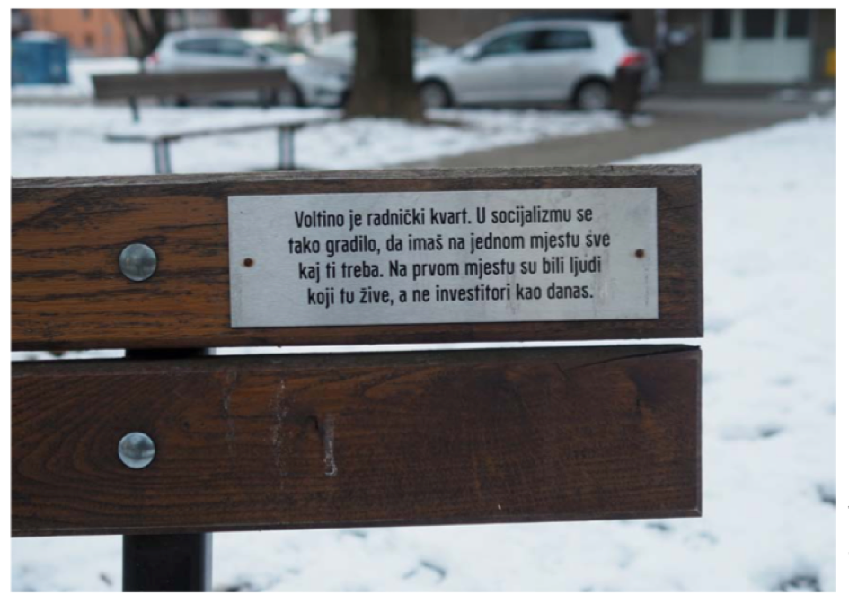
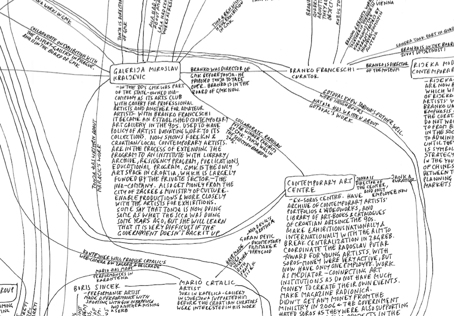
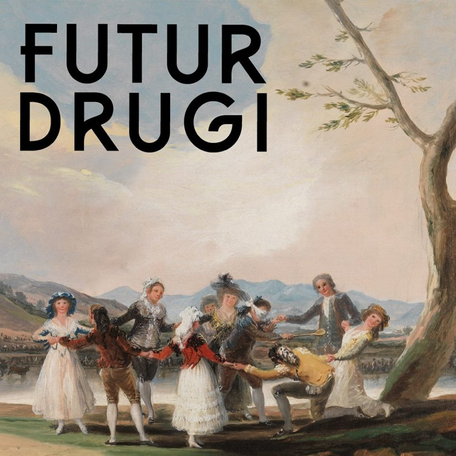

---
Pr-id: MoneyLab
P-id: INC Reader
A-id: 10
Type: article
Book-type: anthology
Anthology item: article
Item-id: unique no.
Article-title: title of the article
Article-status: accepted
Author: name(s) of author(s)
Author-email:   corresponding address
Author-bio:  about the author
Abstract:   short description of the article (100 words)
Keywords:   50 keywords for search and indexing
Rights: CC BY-NC 4.0
...

> *She asked herself, whether it was of historical significance that her
> life had split in fragments. Did fragmentation have different
> categories, depending on the intentions of the fragmentee? If the
> fragment were truly a symbol of modernity, then she was indeed truly
> modern. Does a fragmented city become a radically critical city, due
> to its formal qualities? Neither theoretically, nor disarticulatedly,
> nor sublimely. Subliminally, she thought. Subli*mi*nimally, she
> thought.*

Still (image and citation) from Nicole Hewitt, *This Woman is Called
Jasna, Episode 3: Ruins,* 2015-2017, as performed at Sonic Acts Festival
2018, Amsterdam.

# 2. Today: Whose Independent Cultures Are These?

Despite adverse conditions, independent cultures have managed to sustain
themselves for several decades. They have become an alter-establishment
through years and years of struggling, proliferating, territorializing,
politicizing, and theorizing. At the same time, the limits of
independent cultures have been tested over the past few years. Croatia’s
ascendance to the European Union in 2013 was followed almost immediately
by a neoconservative and nationalist back-lash. Large budget cuts have
struck the cultural field. New actors with less subversive or critical
political agendas and more hierarchic internal governance structures
have emerged and appropriated the spaces of civil society. The resulting
precarization of independent cultures was met with varying responses
from the scene. While some independent cultural organizations have
become more institutionalized, others have ceased to exist. Yet others
have adapted themselves to work in other fields such as the political
sphere or the squatting. An important question has become how
non-institutional this non-institutional cultural scene still actually
is. In this difficult time, which could even be called a crisis, the two
most important questions appear to be: to which social groups do
independent cultures – and the spaces they have created over the past
twenty-five years – belong? And, what are viable forms for independent
cultures to remain vocally critical yet safe today?

## 2.1. The Backlash

### 2.1.1. Inside the European Union

On the 1st of July 2013, Croatia became a member state of the European
Union after nine years of candidacy. This is arguably the moment that
Croatia’s epic journey through the ‘desert of post-socialist transition’
came to a definite end. According to Tomislav Medak:

> Now that we reached our promised political eschaton of being a member
> of the NATO and the EU, we find ourselves in the EU that is ridden by
> a similar type of polarization as pre-war Yugoslavia was. The
> hegemonic narrative is collapsing. There is no developmental promise.
> \[…\] Something else is happening, which follows a similar trajectory
> as the processes of the political swing to the right elsewhere in
> Europe.

Something else, in this case, is the rise of anti-European,
neo-conservative politics throughout and beyond Europe. Goran Sergej
Pristaš argues that ‘the situation we are in now, on a European scale,
reminds me of Yugoslavia in the 1980s: it’s a situation of institutional
collapse, of the re-introduction of problems of disbalances between
countries. The discourse on the right to capital is coming back in a
much larger scale.’[^1] With some cynicism, one can argue that the final
steps in Croatia’s ‘translation’ to the (former) West coincided with the
start of the end of the global regimes of the translational condition.
Unsurprisingly, Croatia’s long-awaited entry into the EU was soon met
with a neo-conservative backlash.

Joseph Daul, Chairman of the EPP Group in the European Parliament, and
Tomislav Karamarko, former leader of HDZ, 2016.

In February 2016, a heavily right-wing coalition came into power. This
was led by HDZ’s controversial President Tomislav Karamarko. Karamarko’s
Minister of Culture, Zlatko Hasanbegović – if possible even more
controversial than Karamarko himself – ‘immediately mounted an attack on
independent media and progressivist culture across both institutional
and non-institutional domains’.[^2] For instance, the Board of Directors
was removed from Kultura Nova and eventually the Director was withdrawn
for some months too, all because Hasanbegović postponed assigning new
members and renewing employee contracts.[^3] Some organizations had to
fold, such as the critical cultural magazine *ZAREZ* – the direct
offspring of the ‘90s Peace Network discussed before*.* The Karamarko
coalition collapsed in June 2016, but HDZ was voted back into power and
continues to govern with a different president up to today.

The consecutive right-wing governments in Croatia implemented many
policies which resulted in major cuts to the structural funding of
culture. The national budget for culture was reduced from 1.2% in the
early 2000s to 0.48% in 2018.[^4] According to Jasna Jaksić, curator at
the Museum of Contemporary Art, this trend has made it increasingly
difficult to realize anti- or non-hegemonic programs within the
institutional sphere as well as outside of it.[^5] It is even harder for
new initiatives to find the necessary funding to get going. Dea Vidović
understands the situation as a structural lack of appreciation of
‘living culture’.[^6] These policies are part of a tendency of shrinking
public spaces and contribute to a general precarization of cultural
workers in both institutions and in independent cultures.

Interestingly, independent cultures have, according to Goran Sergej
Pristaš, reacted to the privatization, defunding, and dissolution of the
institutional sphere with ‘a bit of left-wing conservatism’. According
to him, independent cultures started promoting ‘a protectionism of the
institutions that comes from the insight that only back-up for cultural
production and development of discourses in culture are related to the
existence of the institutions. \[…\] From our experience,
destabilization of the institutional sphere leads to destabilization of
the entire field.’[^7] What this insight shows, is that the so-called
neo-conservative backlash is destructively reactionary rather than
conservative. A sense of duty towards institutional culture is awakened
in the independent cultural scene once again. For instance, Ivet Ćurlin
of WHW remarked that, ‘looking back, I doubt whether it was a good
decision to abandon the institutions at such early stage’ in the
1990s.[^8]

### 

### 2.1.2. A Body with Two Right Hands

The past five years have shown that there is a remarkable interrelation
between neoliberalism and neoconservatism in the case of Croatia, in the
sense that these phenomena are mutually stimulating rather than mutually
exclusive. To my understanding, neoliberalism is essentially an
anti-modern economic progressivism. It is, in Wendy Brown’s words, the
‘stealth revolution’ of the progressive marketisation and
commodification of all facets of life – including health care,
education, public transport, and housing. It abandons any traditional
liberal-humanist aspiration of democratic emancipation in the name of
the market and individual freedom. Accordingly, the liberal tradition of
appreciating critical and emancipatory cultural practices is replaced
with nationalistic and neoconservative reactionary cultural identity
politics. In this definition, neoconservatism is the nationalist,
post-historic, identity-political supplement of neoliberalism: a culture
based on market fueled traditionalism devoid of the aspiration to
emancipate or evoke a sense of historical justice. Neoliberalism and
neoconservatism then appear to be two sides of the same coin.

The dynamic between neoliberalism and neoconservatism in Croatia is
exemplified by the dismantling of social security and community
ownership. Since the 1960s the free market has slowly taken over in
Yugoslavia and has dramatically increased in the last three decades.
This has led to sky-rocketing property prices and incessant
gentrification in urban centers.[^9] Simultaneously, the system of
social security from the socialist-Yugoslav era has been almost entirely
dismantled. This privatization and insecurity have been compensated for
by the national security politics of a militarized state, keen on
fending off ‘alien bodies’.[^10] Typical neoliberal tendencies are fixed
by typical social conservative ones. The discriminatory logic that is
the basis of these policies is informed by Catholic-oriented
identitarianism and authoritarian nationalism.

It is sometimes thought that the current decline of the hegemony of
Fordist labor relations, which was based on the independence of the man
and the domestication of the woman, leads to the emancipation of women
as workers. In Croatia, however, the opposite can be observed: while the
Yugoslavian constitution included a right to work for women and men
alike, women today seem to become more domesticated in Croatia. In close
resemblance of the case of America, as analyzed by Melinda Cooper, the
evaporating system of social security in Croatia were replaced with
‘family values’ and ‘responsible paternity’.[^11] Tomislav Medak
considers the 2008 financial crisis to be a historical turning point in
the resurgence of Croatian conservatism:

> This \[global financial crisis\] showed how the hegemony of liberal
> democracies can no longer be sustained. It seems clear that
> globalization, free markets, internationalization of capital has put
> limits on democratic process to have a say in what is most fundamental
> to the people -- how they work and how they can reproduce themselves.
> \[…\] In Croatia, this has a lot to do with the plight of rural areas
> after the collapse of Socialist (semi-) planned economy, which set up
> factories in smaller places across this rural territory, creating
> along institutions of welfare, healthcare, education, culture. After
> 1991 those factories collapsed. In those areas, the expanded family is
> now the dominant institution of welfare, and the church the dominant
> institution of culture. So, the principle concerns of neoconservatism
> these days (“gender ideology”, minority rights, multiculturalism) echo
> the actual reality of these people.[^12]

Therefore, the clerically promoted, family-based model of production is
more thoroughly established in Croatia now than it was under Yugoslav
socialism. At the same time, present-day neoconservatism can be
considered exactly a solidifying counter-reaction which allows global
neoliberalism to find its way into the local tissues of Croatian
society.[^13] Neoliberalism and neoconservatism in the Croatian context
cannot be understood as opposing tendencies, but as different aspects of
the same self-contradictory condition. Croatia is a prime example of
‘repressive liberalism’.[^14]

For independent cultures, this understanding presents some important
questions. If the precondition for the existence of independent cultures
is the result of neoliberalization while independent cultural actors
have also struggled against the neoconservatism for decades, the
following paradoxical situation ensues: the common ground that civil
society and independent cultures created in their struggle might have
served the enemy that was the very reason of the commonality of their
struggle.

The 2019 rally of U ime obitelji (In the name of the family). ‘Ovo je
izbor’ translates to ‘This is a choice’.

## 2.2. The State of Civil Society

The ultimate question in this discussion is: to whom does the civil
sphere belong? Whose words have the most influence there? What makes
this question so tricky is that the openness of the civil sphere and of
public spaces is sometimes self-undermining. In being common, spaces of
civil action are always constantly re-negotiated and vulnerable to
appropriation.

Independent cultures in Croatia today are harshly confronted with these
ideological contradictions. Organizations like Right to the City,
Clubture, and Zagreb je NAŠ!, that are in fact institutionalized NGOs,
have continued to use grassroots strategies. But in the early 2010s, a
new right-wing and conservative movement emerged, which used the same
trick: In the Name of the Family. Rather than a real grassroots
organization, this movement was coordinated by the politician Zeljka
Markić, promoting pro-life and anti-queer sentiments ‘in the name of the
family’.[^15] This movement has dominated the forum of public space over
the past years, in pro-life marches and a petition against the Istanbul
Convention (a treaty to fight domestic violence).[^16] Ivet Ćurlin said
that ‘the emergence of In the Name of the Family was a turning point and
wake-up call for all of us as to what civil society is and how they
caught up with us and appropriated it’.[^17]

At the same time, progressive spaces are being cut, reformed, or closed.
In 2017, while In the Name of the Family received the government funding
it applied for, WHW, Documenta – Centre for Dealing with the Past,
DrugoMore, and Močvara did not. Studentski Centar, which has been
running independent programs in theatre, film, and art since the 1960s,
is slowly but structurally choked – the last in a series of incidents
being the eviction of Klubvizija, an amateur film club, from their film
lab. One more example is the NGO behind Kino Europa, who have
successfully run their venue for a decade with generally high-quality
screenings and, for instance, hosting the Subversive Festival. Milan
Bandić, the mayor of Zagreb, served them notice of eviction, meaning
that the organization would have to vacate their premises within months.
He cited ‘renovations’ as the cause for such disruption. Spontaneous
crowds, mobilized through social media, amassed in protests of the
eviction, but to no apparent effect.

If it wasn’t obvious before, these occurrences made it very clear that
civil society is not per definition critical or progressive, nor the
exclusive terrain of independent cultures. It is a space that is
extremely vulnerable to corruption and can be appropriated by
anti-European, nationalistic movements, as well as clerical
organizations and anti-egalitarian campaigns.

The growing understanding of these developments has caused actors within
the independent cultural scene to question their position within the
social and cultural system – as a result they have become less
optimistic and more critical.[^18] They had already realized by the
mid-2000s that they could be instrumentalized, being products, to some
extent, of neoliberal mechanisms. However, now, as neoliberalism and
neoconservatism are more and more clearly revealed as two sides of the
same coin, the question rises if it will not be the independent cultural
organizations that will be instrumentalized, but the systemic space they
created. Tomislav Tomašević noted:

> We can see the limits of liberal discourse of human rights. As if
> these rights only entail the already existing legal procedure, the
> conservatives say: “You cannot change the constitution.” “Why not?”
> “Because the constitution is democratic.” We say: “We are for
> democracy, but not that kind of democracy.” And so, you enter this
> level of abstraction. It’s this liberal trap you fall into, really.
> \[…\] So, there are limits to the discourse and concepts of civil
> society, and people are quite aware of it since the referendum against
> gay marriage. Now, some are even saying that there are two civil
> societies in Croatia, even though it doesn’t make sense
> conceptually.[^19]

What to make of this schizophrenic condition of civil society? How to
deal with these new insights?

### 2.2.1. The Limits of Discourse

This pressing topic on the status of civil society has been
much-discussed on the scene. For instance, a panel discussion with
Ekaterina Degot, Lidija Krienzer Radojević, Goran Sergej Pristaš, and
Branislav Dimitrijević took place at WHW’s Galerija Nova on the 7th of
May 2018.[^20] It addressed the theoretical problematics around the
concept of civil society, its historical developments, and its relation
to critical cultural production. The question raised was whether civil
society is to be understood as a Gramscian-Marxist concept or as an
essentially (neo)liberal model.

The most interesting position was developed by Ekaterina Degot who
addressed the relationship between civil society and civil disobedience,
as present in two different traditions of thought: the former Western
and the former Eastern traditions. Degot remarked that there were
certain romantic ideas in Eastern Europe during the post-WWII era which
led to the establishment of the Leninist parallel infrastructure of
workers’ and other clubs – an infrastructure which functioned were
independent from the state.[^21] It was this romantic idea, Degot
argues, which was the foundation of the present-day concept of ‘civil
society’. Important to note is that this independent infrastructure was
basically conceived of and used as a structure for civil disobedience.
According to Degot, it was this very same romanticism of independence
and disobedience – still present in today’s former-Eastern notion of
civil society – that made critical voices naïvely tolerant of the market
after 1989.

However, in the former West, civil society was always anti-market, yet
it had its own forms of naivety. These (former) Western civil society
organizations tended to regard the state as a system that has social
obligations and therefore assumed it to be a reliable partner for
collaboration. Yet, the core characteristic of neoliberal government is
its unreliability, or disinterest, in the field of general welfare and
social goods. While the state retreats, it appropriates the rhetoric of
the traditionally left-leaning civil society (social impact, resilience,
participation, etc.) to realize its liberal agenda of transferring
social responsibility to civil society and especially to culture. Degot
concluded with the remark that civil society today could learn something
from the former Eastern, romantic tradition of state-critical civil
disobedience.

We find a similar critique of civil society’s liberal naivety in Sezgin
Boynik’s somewhat controversial article *New Collectives: Art Networks
and Cultural Policies in Post-Yugoslav Spaces* (2012).[^22] Other than
the title suggests, this article speaks exclusively about the
independent cultural scene in Zagreb. Boynik described the emergence of
independent cultures in the 1990s as a ‘shift from a state-centered
socialist planning strategy to de-centralized and neo-liberal
open-market networking’ in the field of cultural production.[^23] He
argues that independent cultures (called ‘new collectives’ by Boynik)
invoke a flattened-out understanding of the heritage of socialist
self-management in order to managerialize and instrumentalize artistic
and cultural production. Thereby, independent cultures reduce art and
culture ‘to a pillar for the unobstructed flow of the capital’.[^24]

Boynik is right in pointing out that exactly through the pragmatism of
resistant, critical, anti-nationalist, pacifist, queer, and Marxist
cultural practices, neoliberal values and models were (accidentally)
adopted too, ultimately leading to the instrumentalization of the
cultures at hand or the systemic territory they created.[^25] In similar
vein, the Slovenian philosopher Slavoj Žižek formulated a profound
suspicion of civil society’s identity-politics in his typical ruthless
style as early as 1999:

> The domain of global capitalist market relations is the Other scene of
> the so-called repoliticization of civil society advocated by the
> partisans of “identity politics” and other postmodern forms of
> politicization: all the talk about new forms of politics bursting out
> all over \[…\] ultimately resembles the obsessional neurotic who talks
> all the time and is otherwise frantically active precisely in order to
> ensure that something – what really matters – will not be disturbed,
> that it will remain immobilized.[^26]

The tone and style of Žižek’s words simultaneously uncover the positives
and negatives of generalizing critique of civil society such as Boynik’s
and his own. Boynik’s and Žižek’s highly theoretical and univocal
analyses of civil society are on one hand productive and necessary
provocations. On the other these critiques should be critiqued for they
reduce civil to the monolithic Other – the exact strategy employed by
the nationalists and conservatives.

For instance, the division between Yugoslav era ‘first collectives’ and
present-day ‘second collectives’ which Boynik needs in order to uphold
his critique as valid, is too simple or monolithic when confronted with
the ‘evidence’ – the track record of independent cultures. Tomašević
remarked truthfully:

> Traveling around Europe, I often encounter this paradigm on civil
> society as a (neo)liberal instrument within leftist movements. But in
> Croatia, a good part of the NGOs have been fighting these tendencies
> and undermining the neoliberal project, while using money from the EU,
> etc. The simplified narrative of civil society does not completely fit
> the reality of the NGOs established in Croatia over the past 20
> years.[^27]

Besides, there is no art market in Croatia, and there never was. It is
therefore nonsensical to say that independent culture marketized
cultural production in Croatia. And even if culture was reduced to a
mere instrument of capital by anyone in post-1991 Croatia, it was in the
circles of nationalist-conservative politicians and policy-makers. To
disqualify independent cultures as a pillar of the unobstructed flow of
capital or as the frenzy of a neurotic is simply cynical.

The rejection of this type of cynical critiques would then lead to a
liberal-leaning interpretation of the state of civil society: that the
current model *does* work. Yet, the current problems can’t really be
denied either. What happens when civil society is theorized based on
supportive solidarity rather than cynicism? A good example is Pascal
Gielen and Philipp Dietachmair’s introduction to their book *The Art of
Civil Action* (2017). Gielen and Dietachmair produced three concepts to
make sense of the construct of civil society: ‘civil space’, ‘civic
space’, and ‘public space’.[^28] They define civil space as ‘a space
that remains fluid, a place where positions still have to be taken up or
created’.[^29] It is not yet a regulated space, at the doorstep of
legality, inherently risky to enter. Civil space is the space inhabited
by grassroots movements. As such, civil space is contrasted to civic
space, which is defined as ‘the place that is established or has taken
roots in policies, education programs, regulations or laws’.[^30] It
follows from this opposition between civil and civic spaces that there
is a possibility to insurrect the fluidity of civil space – to question,
criticize, and alter the dominantly ossified civic space. Gielen and
Dietachmair convincingly interpret the recent wave of civil protest in
Europe (Zapatistas, Theatro Valle, Recetas Urbanas, Maagdenhuis,
Refugees Welcome, etc.) as such contra-civic civil resistance.[^31]

Then there is a third space defined by Gielen and Dietachmair: public
space. Public space is ‘the space we can enter freely, that is or should
be accessible to anyone’.[^32] It is differentiated from civil space, in
the sense that the former is a passive, faciliatory space of free
exchange, whereas the latter is a space of active organization and
formation. Civil space thus needs public space, but public space also
needs civil space for it to be claimed as public. ‘The interaction
between both constitutes the famous *praxis,* where the action is suited
to the word but also where actions can and may be put in words’.[^33]

Gielen and Dietachmair ingeniously borrow conceptual tools from both
Marxist and liberal-democratic discourse to differentiate between civil
and civic space and therefore to avoid essentialism or cynicism. As a
result, it becomes impossible to claim that all civil society is simply
an instrument to power, while it accounts for the threat that
instrumentalization might always happen. Yet, this theory of ‘civil’,
‘civic’, and ‘public’ spaces falls short because it upholds an
unproblematized acceptance of Habermasian liberal-democratic values
(‘human rights’, the ‘sovereign public’, ‘civil rights’) and the
teleology implied in liberal-democratic discourse (every society strives
for openness and democracy). The examples it discusses are selected
through progressive cherry-picking, leaving out examples like In the
Name of the Family. It fails to account for the fact that civil society
and grassroots organizations throughout Europe, especially in the former
East, are increasingly advocating nationalism, ethno-centrism,
protectionism, religious dogmatism, and other values that are in direct
contradiction to the classical concepts of democracy and human rights.
The existence of these organizations highlights the inherent
contradictions within the model of liberal-democratic capitalism.[^34]
And so, the discussion loops back on itself. Neither the liberal model
nor the Marxist critique can account for the actual phenomena as they
played out historically. Neither a cynical, nor a defensive take on the
potentials of civil society leads anywhere.

The trick is to be realistic and see the truth in both. The urban
sociologist Kerstin Jacobsson spent many years researching civil society
and grassroots movements in former Eastern Europe, often asking the same
question: is civil society resistant and independent, or instrumental to
the neoliberal system? In *The Development of Urban Movements in Central
and Eastern Europe* (2016), she concluded that ‘an “either-or view” of
social movements – either they are engaged in contentious action or they
become service organizations or self-help groups – is not helpful to
understand collective action in this social context \[of post-socialist
countries\]’.[^35] True enough, there is something to say for both
Marxist and liberal interpretations of civil society, as resistant and
as affirmative, even though the cultural dominants at present are most
certainly neoliberal. But for a definite answer, this question is much
too generalizing.

It is most helpful to acknowledge the internalized neoliberal values and
strategies in independent cultures in order to decode those strands of
their subjectivities and retain a critical moving base. In other words,
the situation calls for what Irit Rogoff called ‘criticality’ rather
than dismissive self-critique:

> That double occupation in which we are both fully armed with the
> knowledges of critique, able to analyse and unveil while at the same
> time sharing and living out the very conditions which we are able to
> see through. As such we live out a duality that requires at the same
> time both an analytical mode and a demand to produce new
> subjectivities that acknowledge that we are what Hannah Arendt has
> termed “fellow sufferers” of the very conditions we are critically
> examining.[^36]

Criticality, in the current situation, calls for a questioning of
independent cultures’ fundamental common subjectivities. For if
post-Foucauldian scholars like Judith Butler, Isabell Lorey, and Wendy
Brown have taught us anything, it is that neoliberalism is not a system
outside of the subject, but an internalized governance of living
bodies.[^37]

### 2.2.2. Resistant or Complaisant Precarization?

To go one step further into this discussion, let’s return to the
intricacies of precarious life once again. The issues of the
neo-conservative backlash, precarization of the cultural sphere, and
right-wing appropriation of civil society call for a re-evaluation of
precarious labor and a differentiated understanding of precarity. It is
clear by now that precarious life is one of the most prominent and
arguably defining characteristics of independent cultures. But what is
independent culture’s relation to governmental precarization?[^38] Is it
complaisant or resistant?

The shrinking system of social security and the closed off nature of
Croatia’s institutional cultural system necessitated independent
cultures to establish and professionalize *outside* of any social
security.[^39] Tomislav Medak remarked:

> It’s basically self-exploitation all the way. I’m active in BADco.,
> which is the most established and institutionalized dance company and
> theatre collective in the independent culture in Zagreb. Our funding
> is such that we, a group of six, cannot live off of that. The level of
> precarity is huge.[^40]

According to Dea Vidović, this precarious position of post-Fordist labor
was adopted readily by many actors within the field, including herself:

> When we started to operate, we were completely obsessed with what we
> did. We said that we worked 24/7, all the time, during the weekend. We
> worked as if we were working for some multilateral company. \[…\] We
> contributed to the creation of this precarious condition for
> ourselves. We interpreted not having long-term contracts as being
> mobile’.[^41]

This individualized promise of autonomy in precarious life reflects a
*double ambivalence of self-governance* observed by Isabell Lorey. The
pastoral power system of Western governmentality exists exactly by the
grace of such individualization. Moreover, since the 18th century, the
laws on which this pastoral power system is based were no longer on the
authorities of the king or the church, but that of the sovereign
citizens.[^42] This means that the self-determination of individual
sovereign citizens cannot be dissociated with a voluntary acceptance of
the historical reality of collective sovereignty. The double ambivalence
observed is, therefore, this: the ambivalence of self-government and
being governed, and the ambivalence within self-governance, of a
voluntarily making oneself complaisant and refusing to do exactly
that.[^43]

The question whether independent cultures hold a complaisant or
resistant attitude towards neoliberal governance and the resulting
precarization is most convincingly answered by: both.

Precarization in independent cultures is both a strength and a weakness,
a basis of struggle against and vulnerability to neoliberal governance.
Independent cultural workers have dealt with this in several ways over
the past few years. This ambivalence between resistant and complaisant
precarization brings up the question whether the civil society can be
territorialized as a commons.

### 2.2.3. Common/s

Seeing as independent cultures adapt and morph continuously, the
practice of the commons presents one of the different shapes they might
take. In fact, if there is any common political agenda to the actors on
the independent cultural scene today, it is probably the collective
struggle for the commons. As such, commons discourse provides a
framework for resistant precarization.

For at least twenty-five years, Zagreb has seen a tendency of incessant
enclosure of commons: loss of socialist-era civil rights, sand streaming
of institutional culture, destruction of monuments, privatization of
public spaces, and the impoverishment of the (higher) educational
system. I would even go as far as to say that the recent right-wing
appropriation of the sphere of civil society, in being an
instrumentalization of open space for repressive ends, is an enclosure
of the commons – an enclosure, moreover, against which proponents of a
functional, open, liberal civil society were not and could not have been
harnessed.

As almost always, protests against these enclosures seem to have had
little effect and are mostly perceived as one-off actions. Still,
appreciation for the commons, and anger against their often-corrupt
enclosures, are broadly shared sentiments and a basis of struggle. The
logic of liberal democracy, which divides everything into private and
public, fails to accommodate for commonality. But also, the traditional
materialist conceptions of the commons held by both traditional social
scientists and Marxists fall short here. A struggle for the commons can
never be a one-off action to (re-)appropriate material resources or
means of production from the possession of dominant regimes. The
territorialization of civil society as a commons instead requires a
continuous process of *commoning*, which includes care,
community-building, and the cultivation of common subjectivities.

Silvia Federici has studied commons around the world for years from a
feminist perspective. Two ‘lessons’ from Federici’s *Feminism and the
Politics of the Commons* give insight in what this continuous process of
commoning is:

> The first lesson we can gain from the \[global historical\] struggles
> is that the “commoning” of the material means of reproduction is the
> primary mechanism by which a collective interest and mutual bonds are
> created. It is also the first line of resistance to a life of
> enslavement and the condition for the construction of autonomous
> spaces undermining from within the hold that capitalism has on our
> lives.[^44]

This means that commoning has a profound function, not only in the
distribution of resources, but also in the autonomous, or independent,
production of social values. The ‘impact’ of commoning is therefore
never just the material result of particular actions or protests. It
also contributes to the creation of a counter-subjectivity, which works
towards a common world. The second lesson follows from this social and
ethical position of commoning:

> No common is possible unless we refuse to base our life and our
> reproduction on the suffering of others, unless we refuse to see
> ourselves as separate from them. Indeed, if commoning has any meaning,
> it must be the production of ourselves as a common subject. This is
> how we must understand the slogan “no commons without community.” But
> “community” has to be intended not as a gated reality, a grouping of
> people joined by exclusive interests separating them from others, as
> with communities formed on the basis of religion or ethnicity, but
> rather as a quality of relations, a principle of cooperation and of
> responsibility to each other and to the earth, the forests, the seas,
> the animals. [^45]

Federici’s lessons uncover the necessity of a glocal approach to
commoning. It needs both a micropolitics based on empathetic
subjectivities that are generated by inclusive local communities, in
addition to a macropolitics that is informed by an awareness of the
globally shared condition – one where we all have to live with limited
resources.

Some powerful examples of micropolitical commoning are found in Zagreb’s
independent cultural and civil society scenes. For decades, both MAMA’s
transcendental shack and Booksa have been functioning as common rooms
for various communities. Most of BLOK’s programs, such as ‘artists for
neighborhood’, the ‘political school for artists’, and ‘micropolitics’,
explicitly address the commons. In 2015, the Institute of Political
Ecology (IPE) was established, a small research institute which
proactively aims to forge connections between grassroots organizations
and academia (similarly to what the Centre for Women’s Studies has been
doing since 1995). Mainly, it publishes books such as *Commons in South
East Europe: Case of Croatia, Bosnia & Herzegovina and Macedonia* (2018)
and practices Dionysian commonism by organizing the Green Academy summer
school on the Adriatic coast. Thereby, IPE underpins the discourse on
topics like climate justice, commons, green economies, commons, and
degrowth with academic credibility in Croatia.

*‘Voltino is a workers’ block. That’s how things were built under
socialism, so you had everything you needed in one place. The people who
lived there used to be the priority, and today it’s investors.’*

Ana Kuzmanić, installation shot of *A Change from the Bench* (2017),
Voltino neighborhood park, Zagreb. Commissioned by BLOK. Winner of the
Radoslav Putar Award. Courtesy of the artists.

But, as said, these micropolitical practices are just one half of
commoning. A macropolitical practice-discourse of commoning is necessary
to complement the micropolitical, because commons are often
instrumentalized by dominant regimes. Federici warns: ‘We must be very
careful not to craft the discourse on the commons in such a way as to
allow a crisis-ridden capitalist class to revive itself, posturing, for
instance, as the environmental guardian of the planet’.[^46] Michael
Hardt goes as far as to claim that capitalist hegemony (which he calls
*Empire*) already exists today, by the expropriation of the common.[^47]
A new futurology is needed to connect commoners around the globe. This
would require to reconceptualize the international, while preventing the
rebirth of capitalism, or being a folk political blip.

If I sound messianic, that’s not a problem! It’s popular amongst
commons-thinkers (maybe amongst the global left in general) to be
messianic. Michael Hardt and Antonio Negri, for instance, don’t shy away
from the pulpit. At the end of their preface to *Commonwealth* (2009)*,*
a passionate autonomist tractate in defense of the common, Hardt and
Negri proclaim: ‘We want not only to define an event but also to grasp
the spark that will set the prairie ablaze’.[^48] They were joined in
the messianic movement by Nico Dockx and Pascal Gielen, who, as editors
of *Commonism: A New Aesthetics of the Real* (2018), proudly present
themselves as *ideologists of commonism* and prophesize that ‘the era of
the “disclosure of the commons” is now dawning’.[^49]

Jokes aside, despite the occasional moralism displayed by various
ideologists, commoners around the world show that commoning is one of
the few credible ways to put forward tangible alternatives under today’s
regimes of global neoliberalism and in the climate crisis. It also shows
that it is difficult to combine commoning values – such as care,
horizontal reciprocity, and durability – with the upscaling and
political organization necessary not to be instrumentalized by the
powers that be. Nonetheless, the commons discourse has clearly been
proliferating in Zagreb in terms of culture and ecology and has become
much more widely adopted into political discourse. It has even informed
a shift in the party-political landscape on the left.

Zagreb je NAŠ, *Statue of Milan Bandić*
(2017),
<https://www.index.hr/vijesti/clanak/nakon-16-godina-rada-bandic-dobio-spomenik-u-gradu-zagrebu/953422.aspx>.

## 2.3. Whose Zagreb?

Zagreb has been ruled for a spectacular two decades its Mayor Milan
Bandić – a previous communist official, who joined the socialist party
after the disintegration of Yugoslavia and ran over to the conservative
party while remaining in office continuously (except for a brief period
spent in jail for corruption charges). When it comes to cultural policy,
Bandić focuses exclusively on constructing fountains in order to realize
his dream and make Zagreb into ‘little Rome’.[^50] Balkan Insight cited
him in 2018, stating that ‘Rome has 224 fountains; when will we catch up
with Rome? We are four times smaller than Rome, so we should have 50
fountains. Now, when we add them up, we have ten, so we need to build
another 40’.[^51]

On the morning of the 28th of February 2017, a group of activists
revealed a statue of Milan Bandić. The bronze bust was located on a
white pedestal in front of Paromlin, a site just behind Zagreb’s central
station and one of the five last industrial architectural complexes in
Zagreb. Despite its status as a monument, Bandić has left Paromlin
abandoned and decaying and even had the site illegally ‘cleaned up’
(i.e. demolished) after a storm ruined the property in 2014.[^52] In the
inaugural speech of the monument, Tomislav Tomašević declared: ‘SDP,
HDZ, HNS and HSLS have been acting as the opposition for years, but are
actually in agreement with Bandić, and they are all equally responsible
for the current situation. Zagreb belongs to us, not to Bandić and the
parties that keep him in power’.[^53]

This moment marks the establishment of the local political platform
party Zagreb je NAŠ! (Zagreb is OURS!). According to their website,
Zagreb je NAŠ gathers ‘citizens from all walks of life (activists,
cultural workers, trade unionists, social entrepreneurs etc., many of
whom have been previously active for years in social movements in
Zagreb)’. It should be noted that the small group of initiators was
probably more educated than the entire government of Zagreb.[^54] As
Tomislav Medak, also active in Zagreb je NAŠ!, has elaborated, the group
started addressing ‘neighbourhood initiatives, social justice, labour
activism, environmentalism, student occupations, independent media,
cultural activism, LGBTIQ activism, education, \[and\] refugee
relief’.[^55] They tried to intervene in the ossified structures of the
political system, which could not ‘even detect this space of agency as a
space of transformation \[because politicians feared\] the demos’ so
much.[^56] And, of course, they have attempted to actually oust
Bandić.[^57] Getting 7.4% of the votes during the last local elections,
Zagreb je NAŠ! has been reasonably successful so far.

Many of those running Zagreb je NAŠ have been previously active in Right
to the City, Operation:City, Clubture, Kursiv, MAMA, BADco., as well as
younger para-political organizations like Breed. So, through Zagreb je
NAŠ, independent cultures entered into politics. What does that mean?
Was this an anti-systemic and anti-establishment move, or an attempt to
re-establish a fluid, mutually informative relation between public
(institutional) space and civil action?

A clear explanation of how the self-defining discourse was recalibrated
by the establishment of Zagreb je NAŠ! is found in *From Independent
Cultural Work to Political Subjectivity* (2017). This text is a
published version of an interview between Medak and Philipp Dietachmair,
in which Medak identifies a direct relationship between the practices of
independent cultural spaces and the production of political agency in
new forms of experimental democracy.[^58] Medak hypothesized that the
establishment of Zagreb je NAŠ! signified a leap from cultural work to
representative political action, something he deemed a logical step in
the historical trajectory of independent cultures. Medak states that
politics and culture share the ‘need to find new forms of democratic
political agency that would allow disenfranchised citizens to make their
claims, as well as a need to produce a new vision of society that starts
from a realistic assessment of where they stand and what they can
collectively produce’.[^59] The platform-structures previously used by
organizations such as Clubture and Right to the City proved to be useful
outside the cultural sphere too. By doing so, the networking and
platforming experiments of independent cultures inspired a large group
of people from the scene to be a part of a larger mobilization to create
a new political platform-party.[^60]

Campaign image of Zagreb je NAŠ! (Zagreb is OURS),
<https://www.facebook.com/ZagrebJeNAS/photos/a.390842304627264/414337625611065/?type=1&theater>.

From the way that it presents itself, it is clear that Zagreb je NAŠ is
inspired by the history of visual culture. The Bandić bust brings to
mind the public interventions of the young Braco Dimitirijević’s *Random
Passer-by* series, the party’s campaign and Facebook image is an obvious
reference to Joe Rosenthal’s *Raising the Flag on Iwo Jima* (1945). Yet,
I would argue that the establishment of Zagreb je NAŠ presents the most
definitive break with the post-Peace Movement praxis of independent
cultures up to today, despite the fact that there are clear continuities
between independent cultural work and representative political work. By
moving into the terrain of representative politics, cultural workers
have partly abandoned counter-political politics in the field of the
social and returned to the field of the party and the state. In doing
so, they answer the systemic question of the nature of civil society and
the organizational question of the left today.

It must be noted here that the questions at hand are neither new nor
specific to the Croatian context. In her 2016 book, *Crowds and Party*,
Jodi Dean uses Marxist-psychoanalytical theory to re-examine the party
within the context of several recent international uprisings.[^61] She
notes that most of these uprisings, from Arab Spring, the Tahrir Square
protests, Occupy (Wallstreet), protests Turkey and Greece, in Madrid and
Moscow, in Women’s Marches and at Standing Rock, lack lasting political
effectiveness. In order to establish the lasting import of the party for
the global left, she argues that civil society action in itself is
simply not enough:

> Newness and experimentation, not to mention preoccupations with
> changes at the level of the individual and actions focused on media
> and culture, take the place of a politics targeting capitalism and the
> state, ensuring that they continue doing what they do. At some point,
> however, an encounter with the state or the economy becomes
> unavoidable as one or the other becomes a barrier to movement
> ideals.[^62]

After decades in which subjectivity arose with every individual movement
– the Peace Movement and Right to the City being prime examples – and
sank back into the gap between individual agency and the collective
subject of politics, today the simultaneous tendencies in independent
culture of incessant precarization and institutionalization are likely
to be such a barrier. Following Dean’s logic, the role of the party in
this situation is that of being a *site of transferential relations*:
‘The party is a form that accesses the discharge that has ended, the
crowd that has gone home, the people who are not there but exert a force
nonetheless.’[^63] It is an answer to the question: what happens when
nothing happens? For this reason, I am inclined to view the abandonment
of the cultural as a reformation of the subjectivities found in
independent cultures informed by criticality, rather than an adoption of
the system of cultural dominants. By creating a durable, stable and
dependable framework to address structural problems such as
precarization, impact-driven financing of social institutions,
gentrification, and urbicide, Zagreb je NAŠ! might prove a valuable tool
not only in realizing political and social effectiveness, but also in
decoding the global and neo-imperial regimes of neoliberalism and
independent cultures’ own implication in them. But did this renewed
focus on the organizational, political and systemic questions come in
time? And where does it leave culture?

The Vratite Magnoliju! campaign against demolition of the (magnolia)
trees around the Meštrović Pavillion as part of a clean-swiping urban
development program,
<https://faktograf.hr/2018/04/26/grad-nema-niti-planira-pribaviti-dozvole-za-drmanje-po-mestrovicevom-paviljonu/>.

## 2.4. Clash of Generations

### 2.4.1. Structural Difficulties of Rejuvenation

Galerija Miroslav Kraljević invited the Danish artist Minna Henriksson
for a residency in 2006. During her two-month stay in Zagreb, Henriksson
researched the local scene and used this as the basis for her project.
This resulted in two works, one of which is *Zagreb Notes*: a wall
drawing that maps Henriksson’s encounters in the Zagreb art world.
*Zagreb Notes* constitutes the only substantial, although not
exhaustive, visual mapping of Zagreb’s cultural infrastructure up till
now. The image includes Henriksson’s general observations about the
Zagreb art world and is therefore also a time-stamped evaluation of the
scene. This in itself makes her work an interesting snapshot. Notably,
the first remark highlights the downside of independent cultures’ focus
on advocacy and prefiguration: ‘NGOs have gone too deep into cultural
policy and lobbying. They are not organizing so many events
anymore’.[^64] In 2006, Henriksson had already noticed a problematic
generational issue within independent cultures:

> The 70’s conceptual artists are still regarded as the only
> contemporary artists. Younger generations get hardly shown. \[…\]
> There are no theoreticians in Croatia writing about young artists.
> \[…\] NGOs are run by people who are 30-something. There are no new
> younger people who want to get involved. \[…\] Young artists nowadays
> don’t organize themselves & form groups/collectives to demand what
> they need & want. They are \[…\] spoilt and not interested in the
> scene.[^65]

Minna Henriksson, *Zagreb Notes* (2006)*.* Wall drawing reproduced on
paper 70 x 100 cm,
<http://minnahenriksson.com/wp-content/uploads/2012/05/zagreb-notes-original.jpg>.
Courtesy of the artist.

Independent cultures still struggle with the same issues more than a
decade on. The average age of core staff of most independent cultural
organizations is higher than in the 1990s. Independent cultures are
hardly non-institutional anymore. At the same time, independent cultural
work has not become any less precarious.

All of the 40- or 50-something year old cultural workers running the
important organizations are remarkably open about and aware of their
precarious privilege. Mika Buljević points out that independent cultures
are ‘still very much dependent on \[her\] generation – middle-aged
people. That’s why I think this hybridization or
semi-institutionalization, as well as institutional reform, is really
urgent. I’m afraid of what will be there in 20 years, what the picture
will be’.[^66] Milat reflects: ‘We ask ourselves what our future is
here, in Zagreb and Croatia. If there is someone who’s almost 20 years
younger than we are, and we want someone like that to make MAMA 2.0 or
3.0, to get them into the organization to do programming and other
things with us, it was very hard to tell them: “Although we now have
some very big problems, you can count on us going on.”’[^67] Medak even
argues that ‘in the long run, the success-story of independent culture
in Croatia might turn out just to be a blip in the continuity and
stability in this older cultural system’.[^68]

During the 1990s and 2000s, the then-younger generation sought to
overcome the generation divide between them and their elders. Now,
thirty years later, the responsibility to bridge a gap rests on their
shoulders once again, this time with the generation below. Time for the
spoiled younger generation to take some responsibility and act, it
seems. Unfortunately, the issues that make it so hard to bridge the gap
are of a deeper and less individual character than acknowledged by the
anonymous critique cited by Henriksson. First of all, since the
independent cultural scene inherited its legacy from Yugoslav-era
alternative culture, it is hard for people who never personally
experienced that cultural system to take ownership of that legacy. This
has resulted in younger generations choosing what Tomislav Medak calls
‘another path of subjectivation’ during, for instance, the 2009 student
protests: ‘The new generation just had a different trajectory in
understanding how culture and politics are operating’.[^69]

Moreover, the argument that independent cultures are a seemingly
generational phenomenon has led to critique from younger generations.
They claim that it is the older generation who are privileged. By
professionalizing and institutionalizing, yet maintaining their fringe
position, older actors in independent cultures are thought to leave no
space for new culture. Ivet Ćurlin of WHW is aware of this problem and
said that they: ‘would like to open Galerija Nova more to younger
artists and curators, but it’s hard to raise funds for this \[…\] We’re
also afraid that our withdrawal from the gallery might result in closing
or changing it, like it happened to Galerija Karas’.[^70] Therefore,
instead of leaving their organizations in the hands of younger people,
older independent cultural actors use methods such as schools and
educational programs, including the Kurziv Journalistic School, BLOK’s
Political School for Artists, the WHW Academy and IPE’s Green Academy,
as novel ways to bridge the generational gap.

These alternative educational programs are all the more urgent since the
official educational system does not encourage critical thinking about
arts and culture. Art history student Maja Flajsig remarked that the
set-up of the program at the University of Zagreb is ‘pretty much
traditional’. She described how some professors simply forbid their
students to write about ‘progressive topics’ such as the depiction of
Roma people in Croatian Naïve Art or the genealogy of images of genitals
in Croatian school books.[^71] As a result, Flajsig argues, ‘people
don’t have the knowledge to understand what independent culture looks
like or the topics it talks about, like migration, racism, and the
history of antifascism’.[^72] It’s unsurprising, then, that the practice
of independent culture starts to seem abstract, less relatable and more
elitist to the broader public—despite attempts from the scene to make it
more accessible.

A last problem that Ivet Ćurlin pointed out is that it’s very hard to be
a young artist in Zagreb today – even harder than it is to be a cultural
worker. Not only is there no art market and very little institutional
support, the level of interest former Eastern art in the West is also
very low compared to the situation in the 1990s and 2000s. Ćurlin:
‘Eastern art is not fashionable.’[^73] Since Croatia entered the EU,
young artists leave for the West, rather than Western curators searching
for artists in. Since those remaining often have little money to travel,
Ćurlin perceives that Zagreb has ‘become a kind of closed circuit’.[^74]

The current situation shows that independent culture might indeed be a
short-lived, generation-specific phenomenon. Altogether, making a
generational leap seems to be a highly urgent issue within independent
cultures today. But it is clear that there is more at hand than the
practical or economic obstacles when it comes to rejuvenation. At stake
is the very desire of creative criticality at the heart of independent
cultures. Do younger generations still have this desire for creative
critique? Is independent culture still critical? What is its present-day
legitimacy? Is the ‘path’ of independent cultures still promising, or
dead-ended? At least, it’s fair to say that new generations have so far
not been able to the synergy that makes the older one so effective in
independent culture.

### 2.4.2. Current Initiatives

Despite all the difficulties of establishing new cultural organizations,
financial or otherwise, new initiatives do spark up. Not all independent
cultural organizations find it as hard to cope with the generational
issue. Kontejner is currently working with its third generation of
curators.[^75] So is GMK. In Booksa, there are always new young people
at work. Why is it seemingly easier to rejuvenate for these
organizations? I would say because Kontejner, GMK, and Booksa don’t try
so much to educate their younger collaborators by standards of the
elder. Their mission is not to conserve. They instead embrace the energy
and motivation inherent to youth and allow it to reinvent the existing
organizational structures. Without wanting to get too promotional, I
want to acknowledge the existence of young initiatives and to mention
some of these energetic, inspiring, exciting, hopeful examples.

On Ilica, the small Galerija Greta hosts new exhibitions every
week.[^76] At this gallery, the speed with which exhibitions rotate
means that the programming is very broad. They feature mostly Croatian
artists but occasionally artists from elsewhere too, some of them
established, many of whom are still young and unknown. It is no
exception if these exhibitions are announced less than a week in
advance, if at all. Because of this refreshing exhibition strategy, it
is always a surprise to visit Greta on a Monday night. One week, I ran
into the dry, minimal, conceptual work of independent culture veteran
Slaven Tolj: two pictures on one wall, rest of the space empty, beers
being sold in the back, crowd on the sidewalk in front.[^77] Some months
later, the space was filled with the eerie clones and durational
movements of the rising inter-Balkan art world star Marko Gutić
Mižimakov.

Marko Gutić Mižimakov, \#

Another gallery bridging the generational gap is Galerija Miroslav
Kraljević (GMK), a little paradise floating on oil.[^78] It’s a hip
exhibition space attracting those who search Zagreb to find Berlin and
those who merely look for free gemišt – however it is not simply a white
cube space. The gallery was established as one of the workers’ clubs of
the Yugoslav state oil company INA. In the early 1990s, it was
transformed into a professional gallery for contemporary art. After the
disintegration of Yugoslavia, INA was privatised but continued to fund
GMK.[^79] The gallery has therefore remained in its space up until
today, in the basement of the disused INA headquarters, next to the INA
senior citizens club and the INA choir.[^80] Strangely enough, GMK has
become one of the spaces that are most independent from the independent
cultural scene. This is largely due to the mission, expressed by one of
GMK’s curators Lea Vene, that ‘young people, even straight out of the
Art Academy, should feel like this an inclusive space, their
space’.[^81] GMK strives to realize this ideal by working with multiple
generations at the same time, and constantly trying to bridge
generations within its program. Its exhibition program balances (mostly
young) artists from the local context with foreign artists who intervene
in the local scene. It hosts community projects with the Roma population
in Zagreb, courses for high school students as well as senior citizens,
it formulates institutional self-reflections, holds residencies,
lectures and other public programs. They have also recently programed
open studio events.

More than interesting galleries, nomadic organizations and festivals
like Otokultivator, Urban Festival, QUEER Zagreb, Kontejner, Subversive
Festival, and the Human Rights Film Festival have been an important
component of the independent cultural scene. The format of the festival
has its problems: it tends to be spectacularized, commodified,
ephemeral, gentrifying, and so on. But still, wonderful things can
happen at festivals, of which one example stands out to me today. The
small collective Organ Vida organized its tenth annual international
photography festival in September 2018, *Engaged, Active, Aware: Women’s
Perspectives Now*, in the MSU and various smaller spaces throughout the
city.[^82] Despite the festival’s large scale and small organizational
team, the quality of the exhibitions, programs, talks, screenings and
lectures Organ Vida presented was impressive, thoroughly setting the
feminist agenda of the scene.

Ilona Szwarc, *She Herself Is a Cave Full
of Echoes,* from the series *Indeed a New Woman.* Courtesy of the
artist. This work was exhibited at Organ Vida’s tenth International
Photography Festival in 2018.

Then, there are the so-called unorthodox practices. If a return to the
party is one of the responses to the rising precarization and
ossification of cultural infrastructures in independent culture, a
second one, closer to the practice of young cultural workers, is the
reconsideration of squatting. After a long and slow process of
transformation, the established cultural free haven Medika is at this
point dysfunctional as an experimental space.[^83] Looking to
accommodate the need for open and experimental spaces, independent
cultural workers and activists have taken to squat new properties.
Working outside of existing (funding) structures, this tendency also
allows for the participation of younger generations.

In Zagreb like anywhere, a crucial characteristic of a functional squat
is that it must show a counterexample, an embodiment of something better
than what existed before. An upside in this respect is that the
gentrification of Zagreb does not follow the same trajectory as that of
cities like New York, London, Paris, and Amsterdam. There, it is usual
for both governments and companies (often joint collaborations of both)
to cheaply rent out abandoned (industrial) properties with poor
facilities to creatives for a small number of years, knowing that this
will improve the attraction of the neighborhood, the price of the
property and the profitability of development. The government of Zagreb
takes another approach: it lets the (monumental) property rot away
emptily until it is so deteriorated that it must be demolished, and the
site can be redeveloped. It’s hard for squatters to create a positive
counterexample to gentrifying cultural workers in flourishing ‘cultural
hubs’. It’s easier to create counterexamples in beloved buildings
literally crumbling due to corruption – this is exemplified by the fate
of properties such as Badel, Gorica, and Paromlin.

Several squats emerged in Zagreb over the past years, all occupying
abandoned spaces in order to create something better*,* thus proving
that experimental open spaces can be created in and by communities.
These counterexamples challenge both corrupt government property
management and de-squatted spaces like Medika. For example, during some
months in the summer of 2018, the Croatian Dancers’ Association first
rented, then semi-squatted, a property on Ilica 69 which they called
FuturDrugi.[^84] It was a promising space where the community worked on
self-historicizing by means of a collaborative time-line exhibition and
a dance/performance festival initiated by Tala Dance Centre. There were
dance workshops, communal meals, yoga classes, massage sessions, and
karaoke evenings. Denying FuturDrugi’s social function, the city
government started asking the informal organization to pay an absurd
rental price and threatened them with eviction. It was then decided to
abandon the space. Unsurprisingly, the property has remained disused
ever since.

Facebook profile picture of the short-lived independent dance space
FuturDrugi on Ilica 69, <https://www.facebook.com/futurII/>.

Around the time FuturDrugi came into being, the former school for blind
children Vinko Bek—another abandoned building—was squatted by the local
Food not Bombs-group. This turned into Drustveni Centar Bek (Social
Center Bek).[^85] Not unlike FuturDrugi*,* Bek hosts an open and
collaborative program of community meals, yoga sessions, concerts,
exhibitions, and more.[^86]

Aljazeera Balkans news images shot inside of Social Center Bek, 10
November 2018,
<http://balkans.aljazeera.net/video/vlasti-traze-da-se-skvoteri-isele-iz-napustene-zgrade-u-zagrebu>.

In a similar vein to the renewed squatter movement, the oscillation
between mainstream and subculture in independent cultures can be
observed. There are some new actors, like This Town Needs Posters and
Zgerila, who’ve been spreading posters, tags, stickers, and graffiti
throughout Zagreb.[^87] Then, there are the organizations that have
simply continued subcultural activities for decades, without ever going
mainstream. This is, for instance, what the anarchist bookshop and
publisher Što Čitaš? has been doing since 1999 and underground comic
publishing platform Komikaze since 2003.[^88] In fact, these latter two
organizations are doing very well: the racks in front of Što Čitaš? are
always full with free-to-take zines and booklets, temporary works of
public art put there by both the shop and its community, and Komikaze
has compiled a library of 44 mind-blowing publications. Does punk really
never die?

Antonio Negri has said: ‘They say that, when the Nazis had Tito
surrounded, he saved himself by hiding in a cave. This is how it is in
the Balkans: the resistance is often forced to conceal itself in caves
and forests. But it never goes away’.[^89] This is a poignant remark,
because it holds true for resistance in every part of the world – but,
yes, also in the Balkans. Even if most independent cultural
organizations are not – or are no longer – subcultural, the existence of
these zines and posters show that there will always be subculture to
take over.

This Town Needs Posters, Poster for the concert of the Swans in Rijeka,
27 March 2017.

## 2.5. Towards a Feminist History of (Post-)Yugoslav Art

The histories of independent culture and feminist activism in Croatia
are intertwined. Feminism was one of the important perspectives in the
Anti-War Movement, and the Center for Women Studies was established from
it.[^90] Lana Pukanić, worker at the Institute of Political Ecology and
founder of feminist portal MUF, stressed the importance of this
connection:

> \[Zagreb in the 1990s and early 2000s had\] no feminist education
> except for two venues: Center for Women’s Studies, which publishes the
> magazine Treča, and Ženska Infoteka, which is closed now but published
> a magazine called Bread and Roses \[Kruh i ruže\].[^91] \[…\] If you
> look at their contributors and editorial board, you see these names
> that you can see throughout civil society and independent culture.
> Since there was no official feminist education of any kind, these
> artists got together, and informally shared their knowledge through
> these magazines.[^92]

From the mid-2000s onwards, several NGO’s were set up in order to serve
as information desks for feminist issues, informational feminist
portals, such as Vox Feminae and Libela. These provided a platform for
the voices of famous Croatian women and worked on Croatian translations
of content from English-speaking websites.[^93] Yet newer feminist
portals, such as MUF and Krilo, took this a step further. They created
spaces to have fun with essays and long-reads which went beyond basic
feminist concepts and attempted to queer the heavily gendered Croatian
language.[^94]

Yet, even though feminist activism and independent cultures have been
intertwined in several ways, the dominant art historical narrative of
Yugoslavia shows a lack of feminist art history. In the Croatian case,
this resulted in a male-dominated narrative running from Exat ’51, via
Gorgona, Tomislav Gotovac and New Tendencies, to the Group of Six
Artists and Braco Dimitrijević.[^95] Sanja Iveković’s work is an
important but tokenized exception to this rule. No study has addressed
that the famous artists, Tomislav Gotovac, Mladen Stilinović, and Braco
Dimitrijević, all were, and still are, largely dependent upon their
wives’ less visible labor to sustain their practice.[^96] This is not to
say that the individual works of these artists lacks quality, but that
the general framework of history that they are represented in is flawed.

I would not dare to say that there is a general lack of feminism in
independent cultures. In fact, a lot of feminist theoretical and
artistic work has been done over the past decades to intervene in the
general view of history. Just some examples: In April 1998, works of
Sanja Iveković, Vlasta Delimar, Jelena Perić, Ksenija Turčić, Ivana
Kesser, and Magdalena Pederin, were presented as the Croatian iteration
of Women Beyond Borders, curated in Melong Space by Nada Beroš, then
head curator of the MSU.[^97] By writing about the politicizing artworks
of female artists like Jagoda Kaloper and Edita Schubert, scholars suchs
as Leonida Kovač have made feminist issues visible, readable and
speakable, thus raising the profile of feminist perspectives on art and
art history in the former Yugoslav area.[^98] Further important
interventions have been produced on the intersection of art and theory,
such as *Feminist Takes on Yugoslav Black Wave Film* at the Academy of
Drama Arts by DelVe in 2015, *Zagreb’s Squares Do Not Remember Women* by
BLOK, Sanja Horvatinčić and Mario Kikaš during the 13th
UrbanFestival.[^99]

Despite this presence of feminism in independent cultures, a
comprehensive feminist (critique of) Yugoslavian art history is yet to
be formulated. Still, the import of such a general historiography is
fairly clear. For instance, its absence results in the contradictory
fact that many actors in the scene, such as WHW, BLOK, and DelVe, draw
inspiration from Marxist-informed feminist theory but at the same time
invoke the dominant narrative of artistic modernisms as a source of
inspiration.[^100] Exactly what type of historical justice is
resurrected in the present and extrapolated into future justice?

The question of feminist art or cultural history is also relevant on a
more pragmatic level. Even though most organizations in today’s
independent cultural scene are more balanced and self-conscious in terms
of gender than their Yugoslav equivalents were, say, 50 years ago,
disbalances and lack of diversity still exist within the various
organizations.[^101] Especially in times of rising neoconservatism,
while the feminist outlets are being suffocated by the Croatian
government, a proper feminist evaluation of the history of new media,
the Soros scene, and the broader cultural history of (post-) Yugoslavia
could shed valuable light on the present situation of one of independent
cultures’ most central actors. At the same time, seeing as the Faculty
of Philosophy of the University of Zagreb is finally about to inaugurate
a department of gender studies, changes arise to forge the connections
and solve this lack of feminist art history.

Still from Jagoda Kaloper, *Behind the Looking Glass,* 1965-2016.

[^1]: Pristaš, interview by author, 14 May 2018.

[^2]: Dietachmair, ‘From Independent Cultural Work to Political
    Subjectivity,’ 221. Hasanbegović’s appointment was immediately
    criticized by the Croatian Journalists’ Association and NGO-platform
    Platform 112. Several foreign denunciations followed after
    Hasanbegović rejected the value of Croatian anti-fascism and denied
    the relevance of funding for NGOs. Also see: ‘Minister Says No Need
    for Nonprofit Media Commisison,’ *EBL News,* 5 February 2016,
    <https://eblnews.com/news/croatia/minister-says-no-need-nonprofit-media-commisison-9156>.

[^3]: Vidović, interview by author, 9 April 2018.

[^4]: Jaksić, interview by author, 13 March 2018.

[^5]: Jaksić, interview by author, 13 March 2018.

[^6]: Vidović, interview by author, 9 April 2018.

[^7]: Vidović, interview by author, 9 April 2018.

[^8]: Ivet Ćurlin, interview by author, audio recorded interview,
    Galerija Nova, 25 May 2018.

[^9]: The process of gentrification in Zagreb is different from that in
    cities like New York, London, Paris or Amsterdam. According to
    urbanist Jens Brandt, this is largely due to the fact that there are
    no tax disadvantages connected to holding multiple mortgages.
    Therefore, with rising property prices, it is advantageous to retain
    ownership of multiple properties, even when not actively using them
    or doing maintenance. Jens Brandt, interview by author, 20 March
    2019, Zagreb.

[^10]: Lorey, *State of Insecurity,* 80-81.

[^11]: For an analysis of the American case, see Melinda Cooper, *Family
    Values: Between Neoliberalism and the New Social Conservatism* (New
    York: Zone Books, 2017). Wendy Brown wrote about de-democratizing
    entanglement of neoliberalism and neoconservatism in America in her
    2006 article, ‘American Nightmare: Neoliberalism, Neoconservatism,
    and De-Democratization,’ *Political Theory,* vol. 34, no. 6
    (December 2006), 690-714.

[^12]: Tomislav Medak, correspondence with the author, 25 March 2018.

[^13]: On the different trajectories through which neoliberalism plays
    out in the context of different nation-states, see Cornel Ban,
    *Ruling Ideas: How Global Neoliberalism Goes Local* (Oxford: Oxford
    UP, 2016).

[^14]: Pascal Gielen, *Repressief liberalisme: opstellen over creatieve
    arbeid, politiek en kunst* (Amsterdam: Valiz, 2013)*.*

[^15]: See, for instance, pro-life organization Hodza Život:
    <https://www.hodzazivot.hr>.

[^16]: ‘March for Life Starts in Zagreb,’ *N1,* 19 May 2018,
    <http://hr.n1info.com/a303506/English/NEWS/March-for-Life-starts-in-Zagreb.html>.
    The Istanbul Convention is a Council of Europe Convention ‘on
    preventing and combating violence against women and domestic
    violence’ formulated in 2011. For the full text of the treaty, see:
    <https://www.coe.int/fr/web/conventions/full-list/-/conventions/rms/090000168008482e>.

[^17]: Ćurlin, interview by author, 25 May 2018.

[^18]: The panel discussion on the definition of civil society at
    Galerija Nova that is debated in the introduction of this text is a
    good example of this increasingly critical self-reflection in
    systemic terms.

[^19]: Tomašević, interview by author, 9 May 2018.

[^20]: For details about the event, see:
    <http://www.whw.hr/galerija-nova/then-and-now.html>.

[^21]: In this respect, the situation in Yugoslavia was like that in the
    Eastern Bloc.

[^22]: Boynik, ‘New Collectives,’ 81-105.

[^23]: Boynik, ‘New Collectives,’ 81.

[^24]: Boynik, ‘New Collectives,’ 103.

[^25]: This sort of critique should be formulated with apt caution of
    fatalism, as was illustrated extremely well by Jacques Rancière in
    his analysis of Boltanski, Chiapello, Sloterdijk, and Bauman.
    Jacques Rancière, ‘The Misadventures of Critical Thought,’ in *The
    Emancipated Spectator* (New York: Verso, 2009), 37-70.

[^26]: Slavoj Žižek, *The Ticklish Subject* (London and New York: Verso,
    1999), 353-354.

[^27]: Tomašević, interview by author, 9 May 2018.

[^28]: Philipp Dietachmair and Pascal Gielen, ‘Introduction: Public,
    Civil and Civic Spaces,’ in *The Art of Civil Action: Political
    Space and Cultural Dissent,* Philipp Dietachmair and Pascal Gielen,
    eds. (Amsterdam: Valiz, 2017), 11-33.

[^29]: Dietachmair and Gielen, ‘Introduction,’ 15.

[^30]: Dietachmair and Gielen, ‘Introduction,’ 15.

[^31]: Drawing on a broad variety of examples, ranging from the
    Zapatistas (Latin America), Pussy Riot (Russia), Recetas Urbanas
    (Spain), the Umbrella Movement (Japan), the Maagdenhuis
    appropriation (The Netherlands), Teatro Valle (Italy),
    Culture2Commons (Croatia), Hart boven Hard (Belgium), and Refugees
    Welcome initiatives (Europe), Gielen and Dietachmair state that ‘all
    over Europe, discourses in civil society have started to question,
    criticize, and attack the traditional role of the state in culture
    and its established civic institutions’. Because these various
    ‘discourses in civil society’ are very situated and different, it is
    problematic to consider them to be manifestations of a single
    development. Gielen and Dietachmair aim, perhaps, to be
    inspirational and activating rather than analytical. Dietachmair and
    Gielen, ‘Introduction,’ 16.

[^32]: Dietachmair and Gielen, ‘Introduction,’ 17.

[^33]: Dietachmair and Gielen, ‘Introduction,’ 18.

[^34]: This is especially surprising since Gielen has proven before to
    be very conscious of these problems. See, for example, Pascal
    Gielen, *Repressief Liberalisme: Opstellen over creatieve arbeid,
    politiek en kunst* (Amsterdam: Valiz, 2013).

[^35]: Kerstin Jacobsson, ‘The Development of Urban Movements in Central
    and Eastern Europe,’ in *Urban Grassroots Movements in Central and
    Eastern Europe,* Kerstin Jacobsson, ed. (New York: Routledge, 2016),
    4.

[^36]: Irit Rogoff, ‘From Criticism to Critique to Criticality,’
    *European Institute for Progressive Cultural Policies,* January
    2003, <http://eipcp.net/transversal/0806/rogoff1/en>.

[^37]: See, for instance, Wendy Brown, *Undoing the Demos:
    Neoliberalism’s Stealth Revolution* (London and New York: The MIT
    Press, 2015).

[^38]: See ‘Precarization’ in the introduction of this book for my
    elaboration of ‘governmental precarization’ as well as the other
    three dimensions of precarity as distinguished by Lorey.

[^39]: Institutional culture in Croatia is highly precarious in its own
    right, but that’s off-topic for now.

[^40]: Medak, interview by author, 29 March 2018.

[^41]: Vidović, interview by author, 9 April 2018.

[^42]: This Foucauldian genealogy of Westphalian power does not apply to
    Croatia to an exact degree, since Croatia was never a colonial
    power. Enlightenment ideals and the idea of a sovereign citizenry
    collected in a nation-state were imported to Balkan countries by
    local elites educated in Western Europe in the late 18^th^ and early
    19^th^ centuries. Nonetheless, the contemporary consequences of the
    history of pastoral Westphalian power are, I believe, very similar
    in Croatia. For a detailed account on the rise of Enlightenment
    ideals in the Central-Eastern European region, see: Mark Mazower,
    *The Balkans: A Short History* (New York: The Modern Library, 2000).

[^43]: Lorey, *State of Insecurity,* 14-16.

[^44]: Silvia Federici, ‘Feminism and the Politics of the Commons,’ *The
    Commoner,*
    <http://www.commoner.org.uk/wp-content/uploads/2011/01/federici-feminism-and-the-politics-of-commons.pdf>,
    accessed 11 Mach 2019.

[^45]: Federici, ‘Feminism and the Politics of the Commons.’

[^46]: Federici, ‘Feminism and the Politics of the Commons.’

[^47]: Michael Hardt, ‘The Common in Communism,’ *Rethinking Marxism,*
    vol. 22, no. 3 (August 2010), 346-356.

[^48]: Michael Hardt and Antonio Negri, *Commonwealth,* (Harvard:
    Harvard UP, 2009), xiv.

[^49]: Dockx and Gielen, ‘Introduction: Ideology & Aesthetics of the
    Real,’ 55.

[^50]: To this end, he reportedly undertook 62 inspirational trips to
    Rome between 2011 and 2017. Sven Mikelic, ‘The Zagreb Mayor’s Roman
    Romance Has Me Worried,’ *Balkan Insight,* 21 May 2018,
    https://balkaninsight.com/2018/05/22/the-zagreb-mayor-s-roman-romance-has-me-worried-05-21-2018/.

[^51]: Mikelic, ‘The Zagreb Mayor’s Roman Romance Has Me Worried.’

[^52]: ‘Zagrebački Paromlin,’ *Wikipedia,*
    [https://hr.wikipedia.org/wiki/Zagrebački\_Paromlin](https://hr.wikipedia.org/wiki/Zagrebački_Paromlin),
    accessed 8 March 2019.

[^53]: ‘Nakon 16 Godina Rada Bandić Dobio Spomenik u Zagrebu,’
    *IndexHR,* 28 February 2017,
    <https://www.index.hr/vijesti/clanak/nakon-16-godina-rada-bandic-dobio-spomenik-u-gradu-zagrebu/953422.aspx>.

[^54]: ‘Zagreb is OURS!’, *Zagreb je NAŠ! website,*
    <http://www.zagrebjenas.hr/zagreb-is-ours/>, accessed 4 June 2018.
    For a list of the people involved here and their respective
    (educational) backgrounds, see ‘Nakon 16 Godina Rada Bandić Dobio
    Spomenik u Zagrebu.’

[^55]: Dietachmair, ‘From Independent Cultural Work to Political
    Subjectivity,’ 224.

[^56]: Dietachmair, ‘From Independent Cultural Work to Political
    Subjectivity,’ 222.

[^57]: ‘Croatian Intellectuals Unite to Oust Bandic From Zagreb,’
    *Balkan Insight,* 6 March 2017,
    <http://www.balkaninsight.com/en/article/political-platform-fights-for-zagreb-s-depersonalisation-of-power-03-03-2017>.

[^58]: Dietachmair, ‘From Independent Cultural Work to Political
    Subjectivity,’ 207-230.

[^59]: Dietachmair, ‘From Independent Cultural Work to Political
    Subjectivity,’ 222.

[^60]: Medak elaborated that the model was adopted ‘following the
    municipalist methods that we have seen being successfully developed
    and put in practice in Spain’. Dietachmair, ‘From Independent
    Cultural Work to Political Subjectivity,’ 223.

[^61]: Jodi Dean, *Crowds and Party* (London and New York: Verso, 2016).
    I find Dean’s well-formulated theorizations about the state of
    today’s left and its political ineffectiveness helpful. However, I
    do *not* subscribe to Dean’s view that the only viable and right
    solution to the question is a global, exclusive, monopoly-holding
    Communist Party which uses propaganda and ideological suppression to
    stigmatize, divide, and disempower political opponents.

[^62]: Dean, *Crowds and Party,* 255-256.

[^63]: Dean, *Crowds and Party,* 282-283.

[^64]: Minna Henriksson, *Zagreb Notes* (2006)*,* drawing on wall,
    reproduced on paper 70 x 100 cm,
    <http://minnahenriksson.com/wp-content/uploads/2012/05/zagreb-notes-original.jpg>.

[^65]: Henriksson, *Zagreb Notes.*

[^66]: Buljević, interview by author, 15 March 2018.

[^67]: Milat, interview by author, 8 March 2018

[^68]: Medak, interview by author, 29 March 2018.

[^69]: Medak, interview by author, 29 March 2018.

[^70]: Ćurlin, interview by author, 25 May 2018.

[^71]: The places most welcoming to progressive or alternative research
    are student art history magazines and the student conferences held
    yearly in Zagreb, Split, Rijeka, and Belgrade, amongst other places.
    It’s almost like under Yugoslav socialism, even though the dominant
    taste has changed from modernism to traditionalism. Maja Flajsig,
    interview by author, audio-recorded interview, Kino Europa, 12 March
    2018.

[^72]: Flajsig, interview by author, 12 March 2018.

[^73]: Ćulrin, interview by author, 25 May 2018.

[^74]: Ćulrin, interview by author, 25 May 2018.

[^75]: Sunčica Ostoić, interview by author, 12 June 2019.

[^76]: For Greta’s official website and program, see:
    http://greta.hr/en/.

[^77]: Conceptual artist and curator Slaven Tolj was the director of
    Atelijeri Lazareti in Dubrovnik throughout the 1990s and now heads
    the Museum of Modern and Contemporary Art in Rijeka.

[^78]: GMK was established as one of the workers’ clubs of Yugoslavia’s
    national oil company INA. It has since developed into a contemporary
    art gallery central to the independent scene. See:
    <http://www.g-mk.hr/hr/home/>.

[^79]: INA is now part of the Hungarian MOL Group.

[^80]: Lea Vene, interview by author, audio recorded interview, Galerija
    Miroslav Kraljević, 26 April 2018.

[^81]: Vene, interview by author, 26 April 2018.

[^82]: For the website of the Organ Vida Festival, see
    <https://ovfestival.org>, and for an overview of past editions, see
    <https://organvida.com/festival/>.

[^83]: Squats often tend to slowly shift from being subversive entities
    on the brink of legality to cheap private property, which is the
    case here too. Since it has been legalized, Medika has structurally
    received government funding, which is ambiguously spent and of which
    the benefits hardly—if at all—reach the community beyond the old
    factory’s walls. Medika has effectively become a complex of cheap
    studios for privileged artists and a nice place to party, where some
    extra money is made by selling beers under the counter.

[^84]: See: <https://www.facebook.com/futurII/>. ‘Futur drugi’
    translates to ‘second future’, ‘other future’ and ‘future perfect’.

[^85]: ‘Vlasti traže da se skvoteri isele iz napuštene zgrade u
    Zagrebu,’ *Aljazeera Balkans,* 10 November 2018,
    <http://balkans.aljazeera.net/video/vlasti-traze-da-se-skvoteri-isele-iz-napustene-zgrade-u-zagrebu>.

[^86]: For an overview of their programs, activities and mission, see:
    <https://bekkolektiv.com> and
    <https://coopfunding.net/en/campaigns/bek-autonomous-space-for-free-social-and-cultural-activities/?fbclid=IwAR3j5bbRBKbWL5ubq4QgmxpVL00GnUQC0qMnZHfrlo3A3--5j-nwIz52H2w>.

[^87]: See an interview with Zgerila at Saša Šimpraga, ‘Grafit može
    spasiti život,’ *Vizkultura,*
    <https://vizkultura.hr/grafit-moze-spasiti-zivot/>, 12 March 2019,
    and \#zgerila on Instagram,
    <https://www.instagram.com/explore/tags/zgerila/?hl=en>.

[^88]: For Što čitaš, see <https://www.stocitas.org/o%20sto%20citas.htm>
    and for Komikaze, see <https://komikaze.hr>.

[^89]: Antonio Negri, *Welcome to the Desert of Post-Socialism,* eds.
    Horvat and Štiks, back cover.

[^90]: For the official website of the Center for Women’s Studies, see
    <https://zenstud.hr>.

[^91]: The Women’s Infoteque was a feminist library and knowledge center
    and, like the Center for Women’s Studies, it was established by the
    ZaMir (the For-Peace Movement) network. It published *Kruh i ruže*
    from 1993 into the 2000s.

[^92]: Lana Pukanić, interview by author, audio-recorded interview,
    Institute of Political Ecology, 9 May 2018.

[^93]: For the websites of these organizations see: Vox Feminae,
    <https://voxfeminae.net>; Libela, <https://www.libela.org>.

[^94]: For the MUF website, see <http://muf.com.hr>.

[^95]: Good examples of thorough and influential art or cultural
    historical accounts that nonetheless reinforce the dominant
    narrative, while failing to address the gender issue, are Medosch,
    *Automation, Cybernation and the Art of New Tendencies (1961-1973),*
    and Ješa Denegri, ‘’Inside or Outside ‘’Socialist Modernism?’’
    Radical Views on the Yugoslav Art Scene 1950-1970,’’ *Impossible
    Histories: Historical Avant-gardes, Neo-avant-gardes, and
    Post-avant-gardes in Yugoslavia, 1918-1991,* ed. Dubravka Djurić and
    Misko Suvaković (Cambridge, Mass., London: The MIT Press, 2003),
    170-208.

[^96]: For a good part of his artist career, Tomislav Gotovac was
    financially dependent upon his wife. Darko Šimičić, interview by
    author, 12 March 2018. Stilinovoć’s and Dimitrijević’s respective
    partners, Branka Stipančić and Nena Dimitrijević, are both art
    historians and made significant discursive contributions to their
    husbands’ work.

[^97]: ‘Croatia,’ *Women Beyond Borders,*
    <https://womenbeyondborders.org/croatia/>, accessed 24 April 2019.

[^98]: Leonida Kovač, *Jagoda Kaloper: In the Mirror of the Cultural
    Screen* (Zagreb: Croatian Film Association, 2013). Another book by
    the same author, only published in Croatian under the title
    *Anonimalia: Normative Discourses and Self-representation by 20th
    Century Women Artists* (2010)*,* comes close to such account.
    Leonida Kovač, *Anonimalia: Normativni diskurzi i samoreprezentacija
    umjetnica 20.stoljeća* (Zagreb: Izdanja Antibarbarus, 2010). A last
    important contribution was made by Ljiljana Kolešnik: *Feminist Art
    Criticism and Feminist Theory of Art,* a collection of translated
    canonical feminist art theoretical texts published by the Centre for
    Women’s Studies. Ljiljana Kolešnik, *Feminist Art Criticism and
    Feminist Theory of Art* (Zagreb: Centre for Women’s Studies, 2000).

[^99]: For *Zagreb’s Squares Do Not Remember Women,* see
    <http://urbanfestival.blok.hr/13/en/zagrebs-squares-do-not-remember-women/index.html>.

[^100]: See, for instance, Ana Dević’s argument in Ana Dević,
    ‘Politicization of the Cultural Field: Possibilities of a Critical
    Practice,’ *Život Umjetnosti,* 85 (2009), 17-33.

[^101]: Two examples would be the Institute of Contemporary Art and the
    Multimedia Institute. The Radoslav Putar Award, which has been
    awarded by the Institute for Contemporary Art for seventeen years
    and is the most important at prize in Croatia, has been awarded to a
    female artist merely five times. There are no significant external
    structural reasons for this disbalance, which testifies to the
    absence of sufficiently critical historical consciousness. Every
    year’s nominees and winners of the Radoslav Putar Award can be found
    here: <http://nagradaputar.scca.hr/en/home.html>. A fairly
    different, but also important example is MAMA, which has operated in
    the historically gendered fields of new media, tech, film,
    electronic music, and philosophy. In this case, gender is an issue
    consciously and actively dealt with for a long time. From the start,
    it has been a major point of micropolitcs to actively involve women
    in the organization. Moreover, engaging with Zagreb Pride and other
    queer community activities, MAMA has contributed to general
    deconstruction of gender norms and models. Yet, gender-disbalance,
    both in terms of members and audiences, remains an issue that
    presents problematic situations for the organization that are not
    easily overcome. Milat, interview by author, 8 March 2018. Medak,
    interview by, 21 May 2018.
