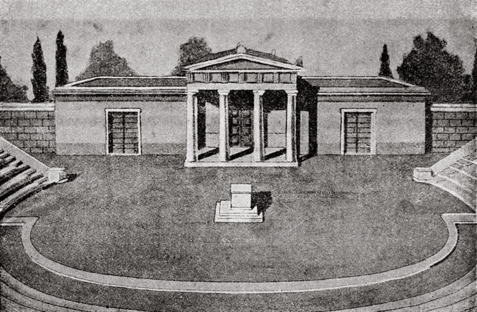
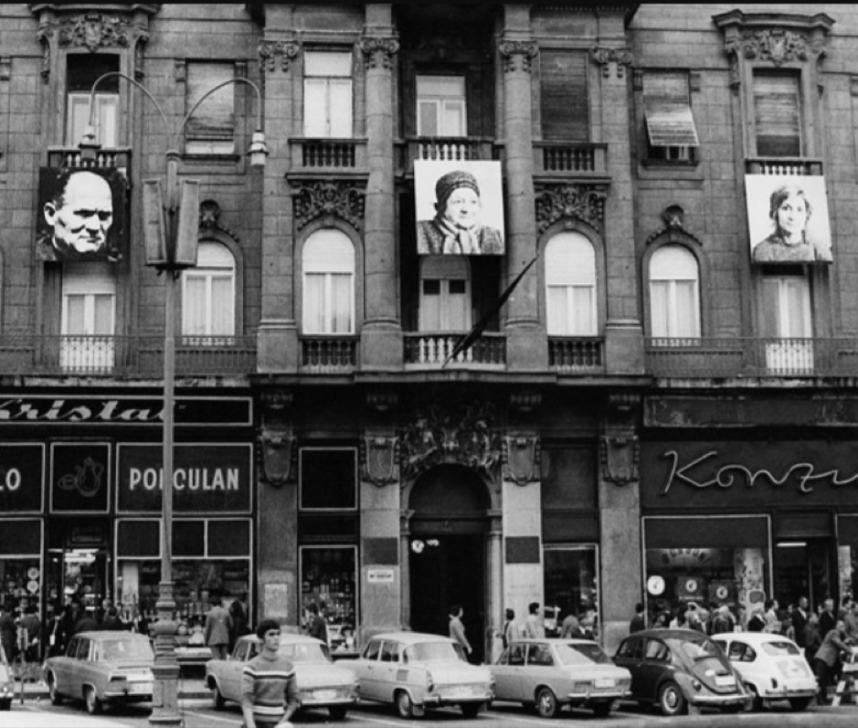
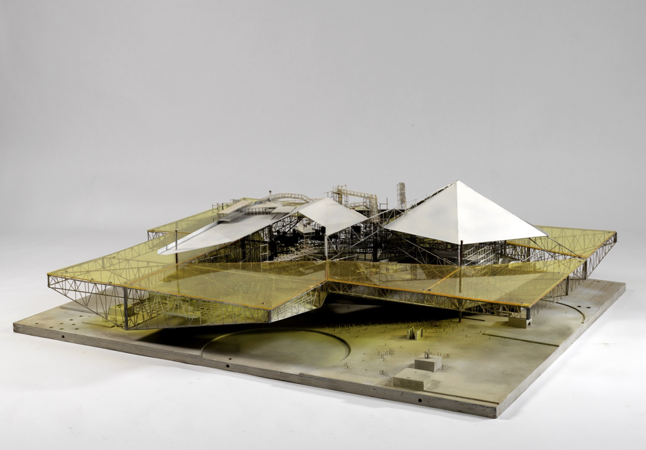

---
Pr-id: MoneyLab
P-id: INC Reader
A-id: 10
Type: article
Book-type: anthology
Anthology item: article
Item-id: unique no.
Article-title: title of the article
Article-status: accepted
Author: name(s) of author(s)
Author-email:   corresponding address
Author-bio:  about the author
Abstract:   short description of the article (100 words)
Keywords:   50 keywords for search and indexing
Rights: CC BY-NC 4.0
...

# 3. Dimensions of Independence: What Is Independent Culture?

*We have to proclaim the end of the end of history, to reclaim the
future, and to start building. Eventually, we end up asking ourselves:
Is there room for utopia after utopia?* – Laura Naum and Petrică
Mogoș[^04_1]­

## 3.1. Independencies and Futurologies

What can we learn about the concept of independence given the previously
conveyed information? In the first place, a strictly situated definition
of independence can be derived from the genealogy. Looking at the
practice of independent cultures in Zagreb and the use of the term
‘independent culture’ by actors in the scene, I distinguish four
different dimensions of independence.

At the basic level, there is formal independence. This can be defined as
economic and governmental independence from any external body or force.
Even if independent cultures have grown to be formally dependent upon
the successive Croatian governments, their identification with the term
‘independence’ denotes the historically specific, often marginal
position of Croatian civil society. Independent culture consists of
those actors that were pushed out of the institutions during the
post-Yugoslav institutional crisis and regrouped in civil society. The
formal dimension of independence in the context of Croatia thus mainly
signifies a systemic position: independent culture is formally opposed
to institutional culture.

Then, there is the political dimension of independence. I once met
someone at a gallery opening who did not work in the cultural field. I
asked her: ‘Are you familiar with the notion of independent culture?’
She laughed at me and said: ‘Of course I am! Everybody in Croatia knows
that’. I realized there and then that the very term independent culture
is a topos of political contestation. It simply goes without saying that
politics are an important aspect of independent cultures. Maja Flajsig
characterized independent culture saying: ‘It’s always against
oppressive systems and it’s always on the left’. With hardly any
exception, these organizations are politically left leaning, socially
engaged, inspired by the traditions of artistic modernisms, the
antifascist struggle, and Yugoslav self-management socialism, and aim to
be critical and politically effective. Moreover, this public image is
enforced by the fact that independent culture is regularly targeted by
conservative politicians. The fact that the authorities pay close
attention to independent cultures, also legitimizes them and provides
them with leverage to address certain issues. Therefore, Maja Flajsig
remarked that ‘independent culture is corrective of society, because it
deals with problematics that are invisible, such as racism, issues of
migration and the way that our current politics are trying to forget the
antifascist movement’.[^04_2]

A third dimension of independence is signified by the fact that
independent cultures in Zagreb represent a semi-open identity – let’s
call this differentiated independence. Tomislav Medak uses the concept
of a ‘fault line’ to describe the constellation of independent culture
‘running from centrist liberalists to anarchist factions’ – even though
independent culture is definitely predominantly left-oriented.[^04_3] This
concept is useful in understanding this semi-open identity within
independent culture. If Booksa is on the liberal side of the spectrum,
BLOK is clearly on the Marxist side. At the same time, MAMA is run by
people representing both. Despite the existence of these differences,
pragmatic collaborations across fault-lines have taken place and created
an important basic sense of trust and collectivity. However, these
fault-lines do in effect demarcate independent culture from everything
else. Independent culture is not, or at least not at this moment,
considered to be a sub-culture. Neither is it propagandistic. It is not
direct politics. It is not veteran clubs, museums, or artists’
associations. As such, these fault lines demarcate both internal and
external differentiation.

A last dimension of independence inherent to the scene independent
cultures in Zagreb is aesthetic independence. Since it is simply
impossible to neatly define the independence of independent cultures in
terms of a uniform political agenda, cultural practice, or identity, it
is clear that independent culture cannot be defined exclusively in terms
of local contextuality, political agenda, identity, or historical
trajectory. Instead, the community of independent cultures is
self-questioning, sometimes more porous, other times less, but never
hermetic, meaning that it constantly re-negotiates itself. It does so
within the scene – a specific common-yet-heterogeneous space of
articulation within and beyond normalized ways of seeing and
understanding the common world.

According to Goran Sergej Pristaš, the term scene is used in independent
culture today exactly to describe and criticize, quite simply, ‘what is
seen (and what is not)’.[^04_4] When, in an interview, Antonija Letinić
differentiated between the apolitical term ‘independent culture’ and the
politicized term ‘independent cultural scene’, she confirmed that the
artistic, cultural and political modes of expression of independent
cultures inscribe a sense of community and a division of parts (an in-
and exclusion), and thereby act upon the ways in which human sensibility
itself is shaped and disciplined.[^04_5] Therefore, by using aesthetic
means, independent cultures in Zagreb work towards independently shaping
and defining a common world.

These four dimensions of independence emerge from the genealogy of
independent culture in Zagreb, the combination of which create a
situated definition of independence. The relevance of independence in
culture is, however, not limited to the Croatian context. Underpinning
the future of independent cultures and their legitimacy in Croatia is
the more general question: what can independent culture be today? What
independence is at stake here, and on which conception of freedom is it
based? And finally, what new perspectives and futurologies can be
formulated with this independence? Therefore, I will now attempt a leap
from the local genealogy to a general theorization of independent
culture. I believe that the first step in adapting a translocal
perspective towards a theory of independent culture is to acknowledge
the gap between the local and the general and to embrace productive
untranslatability.

## 3.2. Untranslatability

In *A Critique of Postcolonial Reason: Towards a History of the
Vanishing Present* (1999)*,* Gayatri Spivak reminded the reader that
‘the great narrative of Development is not dead’ in the post-historical
era.[^04_6] The neo-colonialism that has replaced colonialism in the
decades after 1989 was characterized by the progressive imperialism of
globalization that subsumed international discourses on emancipation of
the subaltern into the flow of capital and the American hotpot.
Especially today, during the decline of American hegemony and the rise
of anti- or alter-globalist sentiments amongst neoconservative elites
throughout Europe and beyond, it seems important to reconsider the
implication of independent cultures in the dominant cultural order and
the flow of capital in terms of capacity of formulation. For what is the
question of a new futurology but the question of capacity to formulate
one’s own (collective) future?

With regards to the genealogy above, there are two issues that can be
elaborated at some length. Firstly, how civil society in Croatia is a
contested area between ‘indigenous NGOs’, local nationalist movements,
and progressive imperialist organizations, and, secondly, how the
experience and political reality of the Non-Aligned Movement is
historically under-represented. On these issues and their interrelation,
Spivak stated:

> The governments of developing nations are, with the disappearance of
> the possibility of nonalignment in the post-Soviet world, heavily
> mortgaged to international development organizations. The relationship
> between the governments and the spectrum of indigenous
> non-governmental organizations is at least as ambiguous and complex as
> the glibly invoked “identity of the nation”. The NGOs that surface at
> the “NGO Forum”s of the UN conferences have been so thoroughly vetted
> by the donor countries, and the content of their so organized by
> categories furnished by the UN, that neither subject nor object bears
> much resemblance to the “real thing,” if you will pardon the
> expression.[^04_7]

In other words, (memories of) radical, decolonial, grass-root positions
are almost impossibly formulated now that cultural dominants in the
globalized field of civil society are (former) Western organizations
such as the UN, the EU, the World Bank, the Soros Foundation, and the
Erste Bank. Even though the money from these sources can, of course, be
used in great ways – most of the independent cultural scene in Zagreb
would not have existed without it – these money flows also represent
neo-imperialist reason.

One crucial characteristic of this neo-imperialist logic is the
imperative of complete, commensurable translatability of language,
experience, economies, and social systems for the good of accumulating
and expanding capital. This is why the post-1989 condition is, as Boris
Buden calls it, *translational*.[^04_8] The simple example of the Big Mac
Index, produced by *The Economist* every year since 1986, is
self-evident.[^04_9] This supposed translatability applies to all aspects
of social and personal life: the free market, the institutions of
liberal democracy, universal human rights, the English language, free
culture and press, and certainly to the arts, too. Mladen Stilinović
once made a banner which said it all in a single sentence: ‘An artist
who cannot not speak English is no artist.’

Within Europe, the translational condition is defined by a simple
dichotomy: the (former) East and the (former) West. The (former) West
functions as the original, always one step ahead, the (former) East as
the translation, always one step behind.[^04_10] Since this book is
situated in between (former) East and (former) West, the question of
translatability is of import here. Over a coffee at the now-endangered
Kino Europa, Boris Buden advised me: ‘You have to put yourself into
question here \[in Zagreb\], because let us be frank about what we
\[interviewees\] are to you. We are Native Informants’.[^04_11] The point
was that, as a researcher educated within the dominant cultural regimes
of (former) Western academia, I am also implicated in this
neo-imperialist discourse. The voice of the activist striving for
emancipation in the (former) East is typically considered to be the
testimony of a Native Informant, that is, a univocal representation of
an entire social group, and as such it can be instrumentalized by the
(former) West as a justification for interventionist politics and
military action.[^04_12] The question becomes, then, how to avoid this
assumption of translatability which would serve primitive accumulation
and further centralization of Europe. To simply acknowledge the effects
of a long history of colonial repression and infantilization would be a
good start, but nowhere near enough. It also requires critiquing my own
subjectivity and the discourse that sustains it.

In *Reconfiguring the Native Informant: Positionality in the Global Age*
(2005), Shahnaz Khan attempted to ‘rethink the relationship between
researcher and informant’ in order ‘to produce an account that is
neither orientalist nor apologetic and to work toward building
transnational feminist \[decolonial\] solidarity’ drawing on experience
of her specific research on Pakistan’s *zina* laws.[^04_13] Khan
distinguishes between at least three types of native informants: the
native informant *over there* (the conventional native informant), the
native informant *over here* (the researcher in the (former) West), and
the reader. What makes interviewee, writer, and reader into native
informants is the contribution their own frames of reference and layers
of meaning, which simultaneously render complete understanding of the
other impossible and create space for creating of new knowledges. This
differentiated understanding of the native informant allows for a
transgression of the ‘imagined monolithic and homogeneous Other’, to
borrow Sharareh Frouzesh’s words.[^04_14] Instead, a gathering of native
informants with different local experiences may constitute a
differentiated (in the most direct sense of the word) translocal
perspective, a ‘moving base’, with a privileged insight in global
regimes of power and how they play out locally.[^04_15] It is with this
understanding of native informing that I hope to, in Sarat Maharaj’s
words, ‘recode the international’ while taking into account ‘the
untranslatability of the term other’.[^04_16]

This is certainly not an easy balancing act. For there should be some
caution with regard to the naïve optimism about alter-globalism that
arguably characterized critical discourses in the 1990’s. During a talk
at Galerija Nova a few days after our coffee, Buden explained how the
global economic crises and ‘migrant crisis’ have impacted the way we
look at societies and their material borders. We no longer live in the
translational condition of incessantly fluid borders. A renewed call for
walls and borders is supposed to soothe the sense of crises initiated by
waves Middle Eastern migrants, floods of cheap low-quality products from
Asian countries, and streams aggressive investors from the U.S.
Therefore, the condition we live in is not a simply globalized and
translatable one (although it’s not de-globalized either). Throughout
Europe, the general discourse regarding moving bodies has radically
altered, and we find ourselves in a *transitional* condition.[^04_17]

Even though the globalization of capital continues as Google offers
readymade meaning carried over by automated translation with incessant
ease and new world powers have risen to challenge the lasting hegemony
of the US in its own language, national languages and identities in the
transitional condition are reinforced by strictly redrawing (time and
again) the borders of nation state territories. In other words, the
demand of translatability of commodities – whether it is the translation
of any good into any currency or the word of any language into its
English equivalent – continues to exist, but the absolute
untranslatablity of identities is continuously set against it – a magic
spell to neutralize the frustrations of globalization. Every country
becomes a tectonic plate of socio-cultural unity: better to stay on the
safe, homogenous middle ground than on the dangerous edges. This
tendency has been going on for a while now and, as a result, the average
European citizen speaks only two languages: the national mother tongue
and English.[^04_18] Therefore, Buden asserts that transition has led to a
change in the general condition of language. The new condition no longer
presumes complete commensurability, but entails what he calls a
*revernacularization*.[^04_19] Hence, once again, national borders are
becoming the explosive areas of direct confrontation with the Other.

Thus, by the simultaneous regimes of globalization and
revernacularization, the dangerous image of the wide and heterogeneous
world is effectively reduced to a single, all-encompassing (global)
market divided into neat little homogenous compartments (countries).
Rather than in an age characterized simply by globalization, we live in
a time of vernacularized globalism. To recode the international would be
to subvert this dual hegemony of, on the one hand, clannish language of
neoconservative nationalism, and the commensurable language of
neo-imperialist reason on the other – in the context of the unspeakable
traumas of war and migration.

### 3.2.1. From Autonomy to Independence

Written from the position of a semi-outsider to the scene, I would also
like to see my research as a contribution to the destabilizing of both
unproblematically commensurable and unquestionably vernacular linguistic
practices. Especially when it comes to locally applied yet
internationally relevant terms such as independent culture, the embrace
of the complex and always problematic possibilities of translation
combined with critical internationalism offers the possibility to break
open entrenched debates and to formulate common futurologies anew.

The discourse of independence in culture is one of those with the
ability to break open entrenched debates. In the process of translation
of the every-day Croatian term ‘nezavisna kultura’ to English by a
Dutch-speaking person, I reconstructed its ‘native’ meaning, which was,
of course, a pre-failed attempt. The translation necessarily lost the
effortless, self-evident nuances inherent to the collective political
and cultural consciousness of the Croatian historical trajectory. But at
the same time, the act of translation reinvented ways of expression to
recapture these nuances – only to end up with new inventions, new
meanings, rather than the forever-lost original. This, then, is the
status of the word in the time of technical translatability: caught in
limbo between absolute commensurability and absolute incommensurability,
ridden of the aura of originality.

But beyond the re-vernacularized mind-set, beyond the totalities of
clannish and commensurable language, beyond the myth of original
meaning, and beyond the fear of the monolithic Other, the realm of the
untranslatable opens up as one of possibilities rather than loss.
Exactly in the very untranslatability of the term independent culture,
in the ways in which the term refuses to uncover its fundamental meaning
to the outsider, the word ‘independence’ becomes a crystal of
significance and a catalyst of meaning-making towards a theory of
independent culture.

One of my biggest limitations is my inability to speak Croatian, which
leaves myself, the interviewees, and the produced book unable to escape
the hegemony of the English language.[^04_20] My use of the word
‘independent cultures’ is therefore something very different yet also
really the same as when used by the native informant *over there*. It
refers to the same material condition but implies different cultural
connotations. In the Netherlands, discussion of the
dependence-independence pair belongs to political theory much more than
to cultural discourse. My peers in Amsterdam (and probably in London,
Paris, and Berlin), still under the spell of Frankfurt school critical
theory or in some cases the Italian autonomists, would much rather speak
of autonomy-engagement. Why do these differences in discourse exist? Are
these simply (former) Western European and (former) Central-Eastern
European versions of the same discussion, or is there something else
going on? It could very well be associated with the general tendency in
the former West to disqualify avant-gardes under socialism for their
lack of autonomy, or with the lasting influence of Soros’s ‘open
society’-discourse and its promotion of independent media and culture,
but this I do not know for sure. In any case, I do insist that the
intervention of the term ‘independence’ into the autonomy-engagement
couple allows for an important re-evaluation of the entrenched debate on
the possibility of critical culture under neoliberalism. In order to
effectively do so, however, a further consideration of independence is
required, this time departing from concepts rather than practice.

## 3.3. The Problem of Formalism

### 3.3.1. Sovereignty

The definition of independence could be pursued as formal
self-determination. In this definition, independence equals the complete
absence of dependence. This is intuitively the most ‘direct’ meaning of
independence, and maybe the most deceptive. It is both passive and
negative: it refers to a systemic position in pre-given material
structures. Designed to function as a demarcation principle, delineating
everything that independence cannot ever be, namely dependence, formal
independence is as exclusive as it is static. It can only describe a
situation of absolute power of self-determination, which is
always-already and completely outside of the realm of dependency.

There is a simple historical reason for this intuitive interpretation.
The application of the formal notion of independence to media is
commonplace. Also, ‘independent culture’ emerged as the cultural
antipode of ‘independent media’ in Croatia’s autonomist circles of the
tactical media scene. So, it could easily be concluded that, like in
media, independence in culture implies: integrity; transparency about
incomes and spending; party-political impartiality; absence of bias and
(self-) censorship; the goal to be an uncompromising and corrective
mirror to society. Even though the values behind this idea are
relatively unproblematic, it is unlikely that this idea of independence
as a pillar of a ‘healthy’ democratic society is as applicable to
culture as it is to media. Yet, theoretically, formal independence
suggests something more than a correlation between independent media and
independent culture. With its references to the function of culture in
democratic and ‘open’ societies, this notion of independence invokes the
discourse of liberal political theory proper and the philosophy of
freedom associated with it.

Now, in Westphalian political theory, of which liberal political theory
is a part, independence is often considered to be the condition
resulting from *sovereignty*. Sovereignty is in turn defined as supreme
(legal) power – the only power which is not derived from a higher power.
This independence-sovereignty pair was an invention of generations of
political experts translating theology into secular concepts, in order
to transfer absolute power from God to the sovereign rule of
nation-states, whether that be monarchies or republics.[^04_21] Within this
secularized theological order, independence has little meaning unless
the proclaimer of sovereignty has the power to force others (in power)
to recognize and believe in it. Moreover, since the secular has come to
equal the marketized in late capitalism, sovereignty exists only as the
equilibrium between two possibly conflictual entities, both choosing to
acknowledge each other’s sovereignty in order to avoid costly conflict
and to promote trade.

The problem of applying this formal concept of independence to culture,
the equating of independence with the exercise of sovereignty is
evident. Some entities, such as the global financial markets or tech
companies, might be sovereign today. But even the sovereignty of
nation-states is crumbling due to incessant globalization – the
panic-stricken reactions to which we witness today throughout Europe:
Brexit, cultural conservatism, the ‘Eastern European crisis’, and rising
autocracy. In this context, independent media are under heavy pressure
and the idea of sovereign culture seems wishful thinking, to say the
least. All cultural production is dependent upon factors determined by
power structures which are external to the realm of cultural production,
and which can never reasonably be expected to become internal: the
presence or absence of private money, the presence or absence of public
money, the possibility or impossibility of contribution of unpaid labor,
etc. In this sense, critical cultural production simply lacks the
position of power to have its claims of sovereignty met with
acknowledgement. So, if independence is the condition resulting from the
exercise of sovereignty, the closest thing to independent culture is
culture that works in line with the dominant ideas of the
still-mostly-sovereign nation-state it functions within. In other words,
if independence follows from sovereignty, critical independent culture
does not exist today.

### 3.3.2. Entrepreneurial Freedom

One might object to the idea of absolute sovereignty, arguing for the
possibility of partial or individual sovereignty of cultural workers. It
is true that artists might work in their free time, independent of the
monetary economy; that digital curation practices can be sustained by
independent crypto-mining; independent publications by crowd-funding
campaigns; community festivals by the sales of coffees and sandwiches;
and social design documentaries by pay-what-you-want donations and
sustainable merchandise. But even though these may be wonderful types of
independence temporarily, defining personal or partial independence
without questioning the framework of sovereignty inherent to the
globalized and neoliberalized condition of today, is a losing battle.
The reason for this is simple: the freedom to build something at one’s
own initiative, power, and risk, independently from any external actor,
depends on the myth of magical volunteerism. It’s American Dreaming.

The idea at the basis of this dream, which is the idea of the absolute
freedom derived from sovereign creation of the self (the self as first
cause), still always sub-ordinated to a divine or moral Cause, is what
Julia Kristeva called *entrepreneurial freedom*. Kristeva explains the
concept in a technically complicated, yet striking way:

> \[…\] in a society more and more dominated by technique, freedom thus
> conceived progressively becomes a capacity to adapt to a “cause”
> always exterior to the “self”. \[…\] Little by little, this
> productivist causality becomes less and less moral, and more and more
> economic, to the point that it reaches its proper saturation, it
> brings the necessity of a support through its symmetrical guarantee
> that is the moral and/or spiritual causality. In this order, freedom
> appears as a freedom to adapt itself to the logic of causes and
> effects: to the logic of production, of science, and of economy,
> itself supported by the interdicts of moral reason. The logic of
> globalization and that of liberalism are the outcome of this freedom,
> in which you are free … enclosing you in the process of causes-effects
> in search of goods, and/or of the supreme Good. The supreme cause
> (God) and the technical cause (Dollar) end up appearing as the two
> variants that sustain the functioning of our freedoms within this
> logic.[^04_22]

As it functions politically today, entrepreneurial freedom is the
ability to try and to fail, to try again and fail better, and, maybe, to
succeed at some point. (*Success*, of course, meaning nothing more or
less than the approval of our divine cause called *Market*.) It is, in
other words, the freedom to compete. This notion of entrepreneurial
freedom is inherent to neoliberal logic and since the idea of
independent cultures is, amongst other things, a product of
neoliberalism, it has been used in independent cultures too.
Entrepreneurially free independent culture is the wet dream of
neoliberal power: individuated, fragmented, precarious, governable,
harmless.

### 3.3.3. The Other Freedom

We know from practice that independent cultural organizations generally
find more freedom in collaboration than in competition, and that,
especially in the age of digital networks, subaltern voices *can* be
heard. We also know that such a thing as criticality in culture still
exists under regimes of suppression and instrumentalization. Examples
are plenty and various.

In 1980s Amsterdam, the housing situation was so poor that youths and
students took to squatting en masse. They established the very vocal and
resistant squatter movement to demand affordable housing, in the process
saving the centuries-old inner city from deterioration and
demolition.[^04_23] During the regime of Ferdinand Marcos in the
Philippines, small independent publishers started spreading critical
newspapers and exposés, establishing the so-called Mosquito Press.
Similarly, in the Soviet Union, grassroots dissident publishing took
place in *Samizdat*, a wide-spread underground network of writers,
readers, publishers, and distributors who spread reading material
amongst each other illegally. As Vladimir Bukovsky put it: ‘Samizdat: I
write it myself, edit it myself, censor it myself, publish it myself,
distribute it myself, and spend jail time for it myself’.[^04_24] Today,
those types of critical cultural expression are often mediated by the
internet. Inspired by memes of ‘Nubian Queen’ Alaa Salah, large crowds
protested against 30 years of militarist rule on the streets of Khartoum
in the spring and summer of 2019. Quite obviously, this freedom of the
speaking subject is a type of freedom unaffected by the repression of
political and market powers. If anything, the desire to be freed and to
speak freely is stirred up by the threat of its own extinction.

‘Nubian Queen’ Alaa Salah orating to a sea of cellphones in Khartoum, 12
April 2019. Source: ‘Soudan: Alaa Salah, le visage de lá revolution,’
*RTL France,* 12 April 2019,
<https://www.rtl.fr/actu/international/soudan-alaa-salah-le-visage-de-la-revolution-7797417372>.

Kristeva’s topology of freedom accommodates for this non-entrepreneurial
freedom. If, to Kristeva, entrepreneurial freedom is ‘the
instrumentalization of the speaking being’, the other type of freedom is
‘the being of the speech that is opened up’: ‘In desiring, \[this
freedom\] gives itself, and in presenting itself thus as other to itself
and to the other, freedom is freed. \[…\] It is a question of inscribing
freedom in the essence of the speech of man as the immanence of infinite
questioning’.[^04_25] This other freedom, beyond entrepreneurship, let’s
call it emancipatory freedom, is closely related to the many faces of
resistance. In a Foucauldian manner, it could be argued that
emancipatory freedom comes into play when an individual states: ‘I
choose not to be subjected *like this.*’ This does not mean that freedom
of infinite questioning is the endless whining about the inevitable
deterioration of everything usually displayed by reactionaries. On the
contrary, the previous examples show that the freedom of opening up
space is resistance against the non-communicability of the impartible
Other. To cite Kristeva once more, resistant and emancipatory freedom is
based on the human endeavor of empathy and ‘the radical experiences of
sharing the unsharable \[*de partage de l’impartageable*\]’.[^04_26]

While on this tour through French critical theory, it is worth making a
quick stop at the work of surrealist novelist-philosopher George
Bataille. While I went to some length to reject the use of the notion
sovereignty, as it is commonly understood, to theorize independence in
culture because of the political theoretical framework implied in that
notion, Bataille’s work offers an understanding of sovereignty which is
more apt to the theorization of emancipatory freedom, therefore more
helpful to a theory of independent culture. To him, sovereignty is ‘to
enjoy the present time without having anything else in view but this
present time’.[^04_27] Thus, strikingly, Bataille thinks of sovereignty as
a phenomenon entirely unconnected to administrative or legal issues and,
more importantly, one entirely distinct from utilitarian or market
reason. This sovereignty exists in the moment of direct act upon desire,
in the moment of unknowing. Think of shamelessly eating that whole bar
of chocolate, or of the sovereign surrealist art of automatic writing.
Also, think of the cases of emancipatory freedom discussed above.
Squatting the Amsterdam canal houses or meming the Nubian queen has not
primarily been an act of utilitarian reason – even though it’s had its
effects. In the first place, it was an act upon desire: the desire for
shelter and feel at home; the desire to shout out and express one’s
opinion; the desire to be the multitude and celebrate freedom in
commonality.

While Bataille’s sovereignty is an individual matter, emancipation goes
a step further: through individual sovereignty, a common claim to
reality is established. By the individual act of speech aimed at sharing
the unshareable, common desires, hopes, fantasies, knowledges and values
are recalibrated. New ways of looking at past, present and future can be
imagined outside of the technical cause (Dollar). So, even if resistance
begins with the individual, emancipatory freedom is a collective matter
that requires common agency. Is it possible to theorize this mediation
of individual sovereignty and collective emancipation in today’s
cultural praxis?

## 3.4. The Aesthetics of Independence

Slavoj Žižek once said that because of Rancière’s ‘passionate advocacy
of the aesthetic dimension as inherent in the political \[…\] His
thought today is more actual than ever: in our time of disorientation of
the Left, his writings offer one of the few consistent
conceptualizations of *how we are to continue to resist*’.[^04_28]
Rancière’s work is diverse, covering topics ranging from ideology to
student protests and from theatre to the crisis of democracy, but it is
always concerned with a ‘cartography of a common world’ created by means
of excavation of the regimes of the distribution of the sensible.[^04_29]
Rancière defined this distribution of the sensible as ‘the system of
self-evident facts of sense perception that simultaneously discloses the
existence of something in common and the delimitations that define the
respective parts and positions within it’.[^04_30] In other words, it is
the aesthetic-political process by which regimes of power make visible
and invisible, audible and inaudible, tangible and intangible, thinkable
and unthinkable. If the question of emancipatory freedom is one of
perception and speech, of what is speakable and what unspeakable, an
important lesson from Rancière would be that it is also a question of
aesthetics.

Here, the possibility to theorize independence in culture beyond
sovereignty and entrepreneurial freedom presents itself. The freedom in
its independence relies on two things: first, independent political
subjectivity; and, second, the aesthetic independence of collective
(re)distribution of the sensible. As long as the cultural dominates the
political, it will remain caught up with the bourgeois myth of autonomy,
while the domination of the cultural by the political leads to the
dead-end street of homogeneity and propaganda. Independent culture can
therefore only exist when art and politics play with one another through
independence.

The common practice of independent cultures, in being aesthetic in
Rancière’s sense, is not necessarily directly political, but always
inherently of political consequence. It speaks about why this or that
photograph is framed as it is, but also raises the question of why I
always run into the same people in the city center of Zagreb, even
though the city has a million inhabitants. Why are most of them
invisible to me? The answer can be: because of gentrification and lack
of mobility, but also: because of an ‘aesthetics of the real’.[^04_31]
Aesthetics, in this sense, is not the discipline of beauty and ugliness.
It talks about the regimes of distribution of the sensible and the
agency of determining them. It talks about dependence and independence
of perception. At stake is a communal independence, rather than an
individual one, for regimes of distribution of the sensible are never
structurally re-determined individually. What is it that brings some
people together in the struggle for perception and articulation, while
not including others?

To further elaborate how this aesthetic independence in culture
functions, I must turn to aesthetics proper and address a question I
have avoided up to now: what is the relation between independence and
art in the Rancièrean notion of aesthetics that I am using?

Rancière has traced three major regimes of distribution of the sensible
in Western history: the ethical, the representative, and the aesthetic
regimes. In the ethical regime, which Rancière traces back to Plato’s
*The Republic,* all images ought to be concerned with the ideal forms in
such a way that they would serve the ethical development of the
community. The representative regime, which became dominant in the 17th
and 18th centuries as the liberal arts were separated from the
mechanical arts, foregrounded the ideals of mimesis and liveliness: the
codification of expressions of thoughts or feelings in art, such that
art was so real that it could give make insightful human nature. The
aesthetic regime, which came into dominance when the representative
regime broke down during the revolutions of the late 18th century, and
the clear distinction and hierarchy between the different arts broke
down too, and instead postulated art as a privileged category of its own
in which pure form and everyday worldliness belong together.

Rancière has spent the better part of two decades tracing different
regimes of distribution and their workings in an endless chain of
essays. In this analysis, he restricts himself to the formal analysis of
art works or media, so as to unveil the ‘major forms’ that ‘bring forth
\[…\] figures of community equal to themselves’.[^04_32] For instance, he
analyzed how the major form of the novel led to novelistic democracy,
how Art Deco, Bauhaus and Constructivism created new forms for a new
life through their handling of ornamentation and purity, and how the
(re-)invention of perspective in Renaissance painting asserted the
ability of painting to capture living speech.[^04_33] In this vein,
Rancière notes that:

> The important thing is that the question of the relationship between
> aesthetics and politics be raised at \[…\] the level of the sensible
> delimitation of what is common to the community, the forms of its
> visibility and of its organization. \[…\] The arts only ever lend to
> projects of domination or emancipation they are able to lend them,
> that is to say, quite simply, what they have in common with them:
> bodily positions and movements, functions of speech, the parceling out
> of the visible and the invisible.[^04_34]

It follows from this statement that the aesthetic politics of art can
never be declarative. On the contrary, the meaning of the work of art is
inherent to the sensible impact of the formal, perceptible qualities of
the artwork on its observer (or on the community of observers it
creates).

Some important theoretical tools to take Rancière’s theory and apply it
to the actual circuits of cultural production and distribution were
created by Boris Groys and Claire Bishop. Even though this debate is
pretty well-known today, it deserves a closer look.

Under the current aesthetic regime, according to []{#_Hlk19523977
.anchor}Rancière, art is conceived of as the collection fo (possibly
ephemeral) objects ought to deliver aesthetic experience to their
observers, or to ostensibly fail delivering such aesthetic experience,
thereby delivering anti-aesthetic experience. In this sense, the
conception of art under the aesthetic regime as described by Rancière is
formalist. In his book *Going Public* (2010), Boris Groys launched an
avid critique against this formalist art concept of the aesthetic
regime. A cultural theoretician subjectivized in the circuits of the
Russian samizdat and Moscow Conceptualists, Groys grew tired of
aesthetic theory’s focus on the consumer or spectator. As Groys says,
this focus has been dominant ever since since it emerged during the
Enlightenment, simply because there are always more spectators than
artists.

Groys reversed this question, and instead of asking why the public
should consume art, he inquires: why does the artist create art? He
rightly remarks that the work of art is not the natural and therefore
inexplicable product of a genius, but a product of technical and
political decisions by the maker. Therefore, he argues, ‘the politics of
art has to do less with its impact on the spectator than with the
decisions that lead to its emergence in the first place’.[^04_35]
Consequently, in order to study the politics of art, one should start
before the art work, which is impossible for aesthetics. So, to replace
aesthetics altogether, Groys argues for a *poetic* view of art, which
focuses on the creation of art as autopoietic practice: the
self-creation of the artist as public persona. ‘In fact,’ Groys states,
‘there is a much longer tradition of understanding art as poiesis or
techné than as aesthetis or in terms of hermeneutics. The shift from a
poetic, technical understanding of art to aesthetic or hermeneutical
analysis was relatively recent, and it is now time to reverse this
change in perspective’.[^04_36] Away with consumption-based analysis of
art, towards production-based logic.

The resonance of Groys’s critique is notable: every self-respecting
critical art institution today prefers *poetics* over *aesthetics* in
the titles of their exhibitions. As Rancière says, the politics of art
are not (always) actively defined by the intention of the artist, to the
extent that it is an object of aesthetic contemplation. But, Groys
counters, neither are the politicity of the artwork or the artist
defined exclusively by the way in which the formal qualities of the work
can impact the spectator. The work was political from its very
commencement, even if it never reached the stage of aesthetic product,
because art also has politicity of active and intentional subjectivation
through praxis – as does every action within the fabric of discourse. It
follows that, in the exploration of the relation of independent culture,
politics and art, the creation of independent culture as much as its
consumption should be considered. The *techné* of independent cultural
praxis is as important as its being-aesthetic.

There is, moreover, a second level to Groys’s critique of aesthetic
discourse. He argues that, since aesthetics subordinate art production
to art consumption, they automatically equal art to real social
relations and thereby subordinate art theory to sociology too. As Groys
rightly points out, artists of the historical avant-gardes acknowledged
the social situatedness of art and sought to exert social effects
through artistic practices. Groys identifies these tendencies as the
roots of exactly those concepts that seek to conceptualize art in a way
that will ultimately undermine it: avant-gardes such as Dada, the
Surrealists, CoBrA, and the Situationist International always strived
for the unity of art and life, and therefore for the end of art. Hence,
the plethora of end-of-art-narratives that surrounded and explained
modern art. But since the end of history happened to precede the end of
art, and the result turned out to be far from utopian, the avant-gardes
and their end-of-art-narratives are believed to have faded.

To Groys, sociology’s theoretical enclosure of art in reality is
problematic for two reasons. First, he argues, ‘art was made before the
emergence of capitalism and the art market, and will be made after they
disappear. Art was also made during the modern era in places that were
not capitalist and had no art market, such as the socialist
countries’.[^04_37] Second, ‘art cannot be completely explained as a
manifestation of “real” cultural and social milieus, because the milieus
in which artworks emerge and circulate are also artificial. They consist
of artistically created public personas – which, accordingly, are
themselves artistic creations’.[^04_38] This second level of Groys’s
critique is less convincing than his critique of consumption-focused
analysis. Even though it is true that art has existed outside of
capitalist regimes, this does not mean that art under capitalism should
not be considered as such. Also, even if art is the product of
artificial milieus, it’s unclear why this artificiality would somehow be
unreal or non-real. The imagination of art, artists, and artist personas
can transgress the status quo of dominant regimes, but there is no need
to presuppose that (the inspiration for) art comes from outside reality.

While Groys traces back the subordination of art to sociology to the
sociological attitudes of Dada and the Surrealists, the debate at hand
here has relatively little to do with the historical avant-gardes. It is
much better contextualized in the distinctly post-avant-garde trend that
entered the art world in the 1990s and stayed there until today: the
participatory art of the *social turn*. In the context of booming
biennales, underpinned by theories like Nicolas Bourriaud’s *Relational
Aesthetics* (1998), the global art world has brought to fore the
practices of artists like Rirkrit Tiravanija, Thomas Hirschhorn, Jeanne
van Heeswijk, and the collectives Ruangrupa and Assemble: participatory,
dialogic, communal, etc. In her seminal *Art Forum* essay ‘The Social
Turn: Collaboration and its Discontents’ (2006), Claire Bishop described
this phenomenon and avidly critiqued its discourse.

Just like Groys, Bishop disapproves of the sociological dominance over
artistic practice. In her view, the discourse of the social turn tries
to prove that the artworks it discusses are socially relevant with such
dogmatism, that it reduces artists to ethical agents and forgets to
acknowledge art *as art.* (On a side note, this conception of art as
social tool which forgets art as art feeds directly into the neoliberal
discourse that aims to instrumentalize culture for gentrification and
other social projects.) However, rather than seeing this sociological
dominance as an inherent result of the aesthetic regime, as Groys does,
Bishop considers it to be a result of lack of aesthetic discourse. She
argues that ‘these practices are less interested in a relational
*aesthetic* than in the creative rewards of collaborative
activity’.[^04_39] Those who really look at art as a social product and
thereby subordinate art to sociology, have lost sight of its aesthetic
potentials. This insight leads Bishop to a major contribution to the
discourse:

> The emergence of criteria by which to judge social practices is not
> assisted by the present-day standoff between the nonbelievers
> (aesthetes who reject this work as marginal, misguided, and lacking
> artistic interest of any kind) and the believers (activists who reject
> aesthetic questions as synonymous with cultural hierarchy and the
> market). The former, at their most extreme, would condemn us to a
> world of irrelevant painting and sculpture, while the latter have a
> tendency to self-marginalize to the point of inadvertently reinforcing
> art’s autonomy, and thereby preventing any productive rapprochement
> between art and life.[^04_40]

The general misconception at the heart of this standoff is, as Bishop
points out, that art’s autonomy or heteronomy are mutually exclusive:
the idea that autonomous production and engaged practice can never exist
in the same work – you have to pick one or the other. Bishop argues
that, yes, autonomy and heteronomy are opposed, but this doesn’t mean
that they are mutually exclusive. On the contrary, they are mutually
dependent. According to Bishop, this is the exact contradiction in which
art exists and which makes it lively. In reference to Rancière, she
remarks that, under the aesthetic regime, we need the ability to think
‘the productive contradiction of art’s relationship to social change,
characterized precisely by that tension between faith in art’s autonomy
and belief in art as inextricably bound to the promise of a better world
to come. \[…\] The aesthetic doesn’t need to be sacrificed at the altar
of the social, as it already inherently contains this ameliorative
promise’.[^04_41] While social impacts cannot be all-encompassing measuring
tools of art, it remains true that, as Rancière remarked: ‘Art does not
exist in itself; it is an outcome of a complex set of relationships
between what one is allowed to say, to perceive, and to understand.
Events and objects only exist within the fabric of discourse, and are
perceived as art, or a revolution in art, only within this fabric’.[^04_42]
Even without the regimes of ethical responsibility, art is
always-already inherently political because of its sensible agency.

As the distinction between art and reality thus fades, and the barrier
between poiesis and the real as well, it appears that a technical-poetic
view of art is not necessarily opposed to the aesthetic one. Rather,
hermeneutic analysis of distribution of the sensible and the
understanding of art as techné complement one another. Hence, the
challenge that follows is this: to stick to the benefits of hermeneutic
analysis offered by aesthetics, to add to that consideration of the
creative process and techné, and to avoid formalism and
consumption-based logic. With this insight, at last, we return to the
relevance of independence in the debate. Analysis of independence in
independent cultures under the aesthetic regime can help to break open
the entrenched debates on autonomy, because independence is a way of
thinking the contradiction between autonomy and engagement.

To go further into this, it’s time to go back to the practices of
independent cultures and look at them more closely. So, where to look?
Where does independent culture take place?

## 3.5. A Theory of the Scene

Distribution of the sensible is manifest in the *arrangements of
partaking,* according to Rancière*.* That is to say, regimes of
distribution of the sensible function through the simultaneous
constitution of parts (based on spaces, times, and forms of activity)
within a common unity. In the case of independent cultures, the scene is
the common unity in which partaking is arranged. If independent cultures
constitute a community engaging in the practice of mapping,
understanding, and transforming the common world, the scene is the lived
context and the discursive fabric in which this community exists. To
cite Rancière once again, the scene is an embedded but independent mode
of sensibility, which we can observe by analyzing the shifting community
of independent cultures that engages actively with the distribution of
the sensible, mapping ‘a common world by determining forms of visibility
of phenomena, forms of intelligibility of situations, and modes of
identification of events and connections between events’ and thereby
‘determin\[ing\] the ways in which subjects occupy this common world, in
terms of coexistence or exclusion, and the capacity of those subjects to
perceive it, understand it and transform it’.[^04_43] To look at and
understand the independence of independent cultures, the scene should
thus be examined.

When he elaborated on his book *Aesthetis: Scenes from the Aesthetic
Regime of Art* in an interview for Verso*,* Rancière explained that he
understands scene as ‘a general mode of intelligibility’ that ‘suspends
the opposition between the narrative of the fact and its
explanation’.[^04_44] Through this suspension, the scene effaces the
distinction between illustration and theory, being both a locus and a
mode of praxis. Even though Rancière’s conception of the scene refers to
theatrical scenes more than to social unities, it is remarkably
applicable to the independent cultural scene. The scene of independent
culture is a general mode of intelligibility which includes and excludes
actors. It shapes the community as an embedded, sensible coexistence. By
shaping itself in the scene and coming into existence through the scene,
independent culture articulates its independence.

The notion of the scene has a wild history before becoming a
classification of choice to the communities of critical practice in
Zagreb in the 1990s. The English word ‘scene’ is derived from ancient
Greek *skènè* (meaning ‘tent’, ‘hut’, or ‘shelter providing shade’),
which initially referred to the theater house in the back of the stage
in Greek theatre and later also to the wooden stage itself. Unlike the
casual entertainment business of today’s theatre, the comedies and
tragedies of Athenian theatre were yearly ritualistic happenings in the
religious festival to honor Bacchus. The skènè was then the décor in the
context of which actors engaged in collective practices based on
systemic functions and roles in the social, political, and religious
life of the City State. Moreover, besides being social, religious, and
entertaining, these roles were also antagonistic, for the ancient Greek
theatre was the space where the ideal of *parrhesia* (free speech) was
publicly displayed and propagated.

For instance, in Euripides’ tragedy *The Phoenician Women* (c.411-409
B.C.), Oedipus’ mother and wife Jocasta tries to convince her two
(grand)sons not to wage war against each other over the inheritance of
the throne. Jocasta asks the younger son Polyneices, who’s been living
in exile for a year: ‘What is an exile’s life? Is it great misery?’
Polyneices replies: ‘The greatest; worse in reality than in report.’
‘Worse in what way,’ Jocasta further enquires, ‘What chiefly galls an
exile’s heart?’ ‘The worst is this: right of free speech does not
exist,’ Polyneices responds, to which Jocasta exclaims: ‘That’s a
slave’s life – to be forbidden to speak one’s mind’.[^04_45]

The speaking of one’s mind which is at stake here, described by the
Greeks as *parrhesia*, is defined by Michel Foucault as ‘a verbal
activity in which a speaker expresses his personal relationship to
truth, and risks his life because he recognizes truth-telling as a duty
to improve or help other people (as well as himself)’.[^04_46] The figure
of Socrates in the writing of Plato might be the best, or at least the
best-known example of the parrhesiastes. Based on nothing but courage,
virtuosity, and sense of duty, the parrhesiastes speaks truth to those
who hold power over her or him, regardless of the harm they come to face
as a consequence.[^04_47] The ethical criterion of ‘good art’ so
prominently present in Plato’s aesthetic theory, according to Rancière
signals the beginning of the ethical regime of art.

In parrhesiastic speech under the ethical regime, the ontological status
of the spoken truth was not determined by some mental evidential
experience. Instead, the truth of parrhesia lies in the very verbal
activity, something that ‘can no longer occur in our modern
epistemological framework’, i.e. something that is hardly thinkable
since positivism has become the common way of establishing truth.[^04_48]
Yet, however hard to understand, judging from Greek theatre and
philosophy, it appears that this always-necessarily *true activity* of
parrhesia was thought to be a fundament of democracy. In the
continuation of the conversation cited above, Polyneices makes it very
clear that any ruler who claims who claims absolute power by denying his
citizens the right to parrhesia, makes his citizens into slaves and
himself into an idiot.

Now, of specific interest here is something Foucault did not pay too
much attention to: the architectural space in which parrhesia took place
as part of theatre’s techné. The theatre constituted a common space for
parrhesia between actors embodying power relationships in front of the
public through the ‘split reality of the theatre’ (that’s Rancière
again).[^04_49] The theatrical space of parrhesia was not a space of direct
politics, but an image-space in which society presented itself to
itself. The aesthetic-political function of the skènè within this
presentation was exactly that of demarcating the split reality: the
reality of the image and the reality of the world. It was simultaneously
an entry point to the stage and a cover from the visibility of the
stage, as well as the division between the spaces of theatre and of
‘normal life’. Therefore, the skènè was the material boundary
determining who was taking which part in the common activity of sensible
presentation of society to itself, and who was not. So, when parrhesia
occurred in theatre, the freedom of the speaking being was *staged*, as
it was both engendered and restricted by the scene.

The skène in an ancient Greek theatre.

Braco Dimitrijević, *Casual Passer-By I Met at 1.15 PM, 4.23 PM, 6.11
PM, Zagreb, 1971,* 1971.

After a long absence from discourse, the notion of the skènè recurred in
16th century French scène, meaning a *specific part of a theatre play*.
Then, in the 20th century, it took on different meanings in a variety of
contexts, yet these had striking similarities on closer examination. The
scene as a *site of crime* was first attested by Agatha Christie in
1923. In 1940s America, the word scene was frequently used by
journalists to describe the *marginal and bohemian environment*
associated with jazz.[^04_50] A decade later, the scene came to denote a
self-defined *setting or milieu for a specific group or activity* in
America’s Beat circles. Since, the word has been especially popular
amongst music communities: in addition to Beat scenes, we’ve seen rock
scenes, punk scenes, metal scenes, goth scenes, and indie scenes.

The consistent relation between the notion of the scene and the
tradition of the performing arts – from Athenian theater to American
underground music – shows a strong convergence of scene with locality. A
cultural activity is staged *on* the scene. An event has to take place
at the right place (country, city, venue, studio) to be the real deal.
But despite this system of street credibility, the 20th-century scene
was not restricted to locality, nor was it necessarily underground or
subcultural. The more successful scenes became so popular, that initial
subcultures boiled over with exportable surplus production. Aspiring
members in other cities started reproducing the scene that they liked,
in order to establish a similar one in their own city. It helped that
local scenes grew to be more translatable as they became more distinct
from the mainstream, providing clearer criteria for the development of
similar scenes elsewhere. Because of this, the scene came to mean a
locality as well as a translocal phenomenon throughout and beyond
America: *the* rock scene, *the* punk scene, *the* art scene, etc.

In this 20th-century meaning, the scene was still a space of freedom.
Yet, since the ethical regime of art under which Greek theatre took
place was replaced – first by the mimetic and later by the aesthetic
regime – it was no longer primarily a space of speaking truth in the
face of power. Rather, it was the space of autonomous and independent
production and aesthetic practice, made possible by a distinctive
position of relative marginality and (trans)local engagement. Scenes
were the spaces where ‘alternative cultures’ could be independent
unities, sometimes diverse and sometimes homogenous, as long as they
retained their opposition to the mainstream industries. The marginal
attitude of these musical scenes sometimes attracted – but, in many
cases, already implied – transgressive attitudes on different levels:
queer sexualities and genders, militant political subjectivities, the
cultivation of ‘low life’. As such, the popular concept of the scene
became a type of semi-open community, a buffer zone between pop- and
subculture, and between hedonism and serious political action. Scenes
became alternative mainstreams.

The phenomenon of the scene, designating (pseudo)transgressive
communities with a strong attachment to locality, was at its height in
the 1970s and 80s, but declined thereafter as quickly as it emerged.
Today, Agatha Christie’s definition of the crime scene still lingers
around while the Beat definition seems hopelessly outdated. Indeed, the
(trans)locally embedded scene is diametrically opposed to the
contemporary cultural dominant of globalized network culture. Cultural
expressions of the latter sort, mediated by platforms, social media, and
other features of the internet, not to mention cheap air travel, are
detached from geographical locality and strict social boundaries (or at
least, that’s the promise). In the 1990s, the internet seemed to create
a possibility to have scenes that extended beyond any fixed locality.
This was when online communities commenced and were recognized as
scenes. Inspired by Hakim Bey’s notion of the Temporary Autonomous Zone
(TAZ), offline communities would sometimes start using digital networks
to emerge in a guerilla space, dissolve before the authorities could
catch up, and re-form elsewhere.

But, in early 2000s, the colonization of the internet by tech companies
and nation-states started. As Jean Baudrillard remarked, ‘the
categorical imperative of communication’ was instated through (digital)
networks, giving rise to the obscene state of over-proximity in which we
all know what our friends had for breakfast thanks to Instagram and in
which porn has overtaken sex.[^04_51] Non-place and ex-timate relationships
grew more and more important, weak links replaced strong links, the
relation between scene and space was loosened, and, as a consequence,
the scene itself largely disintegrated. The *screen* replaced the
*scene*, Baudrillard concluded.[^04_52]

### 3.5.1. After the End of the Local

What is the place to the scene and what is the role of locality now that
culture went global? There is a general division between two camps with
two very different answers.

On one hand, a common reaction on the left (certainly also in the art
worlds) to these growing levels of abstraction and complexity has been a
return to the local, the transparent, the human-sized. After the
dot.com-bubble, the legacy of the TAZ was reduced to lol-fueled flash
mobs and the Burning Man festival. If in the 90s, the internet held the
promise of independence on several levels, the question of independence
has become one of avoiding the web in today’s age of Facebook, Amazon,
and Instagram. There is no refuge in a return to the state either, since
governments are enabling corporations more than culture or individuals.
If not before, the implementation of Article 13 made this very clear:
through this new copyright law, the European governments have enabled
companies to survey and control individuals in ways that they could
never do themselves.[^04_53] Only on the local level, it seems, is it still
possible to pose the localized left as a critical antipode of the
renewed power of the family, the clan, and the Church.

Also, art under neoliberalism is reduced to an instrumental tool. Its
three main functions are to serve as a catalyst for gentrification, to
keep intact the identity of the nation-state, and to be a commensurable
vehicle of capital in the abstract global markets. Autonomous cultural
production is pushed into the corner of community work and localist
autonomism. Not that this pushing is uncomfortable: in individualized
societies and competition-driven art worlds, it feels nice to do
something based on sense of community and solidarity once again. In this
perspective, the return to the scene – and thereby to independence based
on local social embedding – is a sensible reaction to the current
condition.

On the other hand, the preference of locality over globality is
vernacularizing. In the midst of globalizing neoliberalism, centralizing
media, austerity measures, and climate crisis, to simply go back to
perspectives of local independence seems all too easy. What happens in
cases where locality is pursued like this? When does the reduction of
abstract problems to locality lead to overlocalization? The first
problem of overlocalization is that going local is not attainable to
everyone. Not everyone can afford a ‘digital detox’, nor does everyone
have the time or means to practice permaculture or to do community art.
Locality is just one more filter bubble, and what’s worse, it is
mediated by privilege. It requires privilege to avoid social media and
food packed in plastic. A second problem is a reduction of complex
structural problems to individualized ethical-economic issues. ‘Organic’
is a profitable branding asset, selling to the consumer the choice to
buy a better world. The social turn, too, is a prime example of
overlocalization. Artistic production in the social turn is focused so
much on local contextuality, that art itself has been reduced to social
context. In the social turn, the role of locality has been reduced to a
mere reactionary counterforce to globalization.

The book *Inventing the Future: Postcapitalism and a World Without
Work,* by Nick Srnicek and Alex Williams, is an attempt to finally and
definitively put the discussion of localism versus
globalism/universalism to rest. In it, the authors identify phenomena
like overlocalization on the political left as *folk politics.* They
define folk politics as:

> A constellation of ideas and intuitions within the contemporary left
> that informs the common-sense ways of organising, acting, and thinking
> politics. \[…\] At its heart, folk politics is the guiding intuition
> that immediacy is always better and often more authentic, with the
> collar being a deep suspicion of abstraction and mediation.[^04_54]

According to Srnicek and Williams, underneath the desire for immediacy
and resistance of abstraction, lies the human desire for freedom. But,
as the authors claim, the only viable way to uphold any prospect of
liberation is exactly by long-term organization and tactical demands
beyond folk politics. As discussed before while talking about commoning,
micropolitics that fail to leap to macropolitics remains vernacular and
will almost certainly be instrumentalized at some point.[^04_55] This is
why Srnicek and Williams categorically reject folk politics and instead
propose another way to deal with the rising complexities of
neoliberalism and globalization. The left, they argue, should bond and
focus on two simple but universal demands: full automation of work
funded by the state and universal basic income.

However nice as it might sound, the hope of automation as source of
liberation held by Srnicek and Williams is also problematic. While they
validly critique widespread techno-skepticism on the left, they fall
into the trap of unbridled techno-optimism. Just imagine everyone having
loads of free time and being liberated from family relationships as they
exist now. What would happen to the world population? Where would all
the recourses come from to feed all these mouths and to build the
machines that should produce for them? Accelerationism, the school of
thought in which Srnicek and Williams participate, simply brushes over
the fact that full automation will deplete the earth in no-time. Also,
what happens to the values of love and care in this scenario? Apart from
that, accelerationism considers technology to be the neutral material
that will create the condition for human freedom. But in the time of
machine-learning dominated by algorithmic arrogance, there is no denying
the social, cultural, and economical biases of technology. In many
cases, technology is designed to solidify suppression rather than to
lift it. Automated labor is a reality in Amazon distribution centers,
where it combines a return to Fordist alienation with extreme precarity,
and in the robot fields produced by Fanuc.

A Fanuc-automated car factory. There are two humans in this picture. Can
you spot them?

*Inventing the Future* is thus not an economically, ecologically or even
politically coherent manifesto, and its solutionism is probably overly
utilitarian.[^04_56] Still, I think that it is a good book, mainly in being
a strong provocation addressing the lack to collective imagination
caused by the fear of the black box of technology. Publications like
*Inventing the Future* and its successor *The Accelerationist Manifesto*
have brought to the table critiques of localism and techno-skepticism
and increased the popularity of cybernetics and accelerationism.
Thereby, Srnicek and Williams have contributed to the re-emancipation of
a long-standing and theoretically rich tradition of imagination.

The most intriguing art to have dealt with automation and a world
without, and for me the highlight of cybernetics up until today, is
Constant Nieuwenhuys’s *New Babylon* (1956-1969). Like the Russian
Constructivists and the Lettrist International had done before him, the
Dutch artist propagated the ‘unity of the arts’: the synthesis of
painting, sculpture, architecture, poetry, philosophy, and
psychoanalysis into the design of lived urban environment – and,
ultimately, the synthesis of art and life.[^04_57] He went about this grand
idea with surprising pragmatism. With stainless steel, Perspex and
bicycle spokes, Constant constructed scale models for collective living
units without strict borders, which could be realized with materials
available all around the world. He also made built environments and
(détourned) geographical maps, drawings, paintings, tractates, lecture
performances and a *New Babylon* newspaper.

Constant Nieuwenhuys, *Gele sector / Yellow Sector* of *New Babylon.*
Collection Art Museum The Hague, photo by Tom Haartsen.

When combined, the various immersive iterations of *New Babylon* provide
a peek into a post-capitalist world without work.[^04_58] In this world,
all labour is automated and takes place in large underground factories.
Above these factories, the surface of the earth is filled with nature,
monuments of the old world and a vast network of highways. Even higher,
16 metres above the surface, the real, lived space of *New* *Babylon*
arises. A network of connected platforms of 50 to 100 acres called
‘sectors’ spreads all over the globe, creating lines that are
connections rather than borders. As labour is superfluous, and every
product for personal use can be accessed at any time and place, humans
are no longer bound to specific geographical areas. In *New Babylon*’s
superstructure, humankind is liberated from all duty, free to live their
lives playfully, nomadically, and creatively.

Importantly, *New Babylon* never pretended to be a blueprint for the
world to come, nor even a sociological experiment. Rather, it is a
Leitmotiv for humankind at its most playful. In 1970 Constant wrote:

> New Babylon, perhaps, is not so much a picture of the future as a
> Leitmotiv, the conception of an all-comprehensive culture that is hard
> to comprehend because until now it could not exist, a culture that,
> for the first time in history, as a consequence of the automation of
> labor, becomes feasible although we do not yet know what shape it will
> take, and seems mysterious to us. Will man of the future be able to
> play his life?[^04_59]

Humans in *New Babylon* do nothing but play. Constant argues: no freedom
without creativity, and no creativity without playfulness. He dubbed the
inhabitants of New Babylon *homines ludentes,* drawing on Johan
Huizinga’s book *Homo Ludens*.[^04_60] But the play-notion at stake goes
back way further.

To trace the tradition of thought from which Constant’s idea stems, we
have to go back to the very foundations of humanist aesthetics: the
German Romantics. Friedrich Schiller’s *Über die ästhetische Erziehung
des Menschen in einer Reihe von Briefen (A Series of Letters on the
Aesthetic Education of Man)* (1795)*,* written in the aftermath of the
French Revolution, sets out to establish the importance of free,
aesthetic contemplation and Bildung to the functioning of democratic
societies.[^04_61] According to Rancière, the *Aesthetic Letters* are the
foundational theory of the aesthetic regime. Indeed, they are an avid
plea for the ability of the aesthetic faculty to dialectically think the
contradiction between engagement in the world and ethical thought free
from the world.

To Schiller, aesthetics and beauty are the only way to overcome the gap
between two fundamental yet opposing human drives that tear humanity
apart: *Formtrieb* and *Sinnestrieb.* Formtrieb, or form drive, is the
urge to change and to satisfy human lusts. It is the iconoclastic and
revolutionary drive. Sinnestrieb*,* or sensual drive, is the urge to
find universal moral claims. The object of Sinnestrieb is all that is
material, the category of *life*, being-in-time. The object of Formtrieb
is *form*, that is to say, all forms and formal relationships. Morality
is the result of Formtrieb*,* while being-in-the-world and
being-of-nature is the result of Sinnestrieb*.* If a person or system
focuses solely on either drive, they neglect half of their own
being-human and will ultimately lose control over themselves. Hence,
reason must accept the double ontology of humankind, and demand that
both drives must be served equally well in order to be truly humane.
This desired synthesized experience of Sinnestrieb and Formtrieb, which
Schiller calls *living form*, and in which humans are aware of both
their physical being in time and moral being in freedom, can only be
achieved once the domination of both drives is deflected and freedom is
achieved.

The synthesis of Formtrieb and Sinnestrieb dialectically constitutes an
entirely new drive, *Spieltrieb.* In the realm of play, which is to
Schiller entirely aesthetical, these drives are working together and
prevent one another from dominating. Spieltrieb annuls time *within
time* and renders humans free both morally and physically. If humans can
only be fully human by serving both drives, and if this can only be
achieved through independence towards both, and if this, in turn, is
only possible in the realm of free aesthetic play, Schiller’s thesis
follows logically: ‘man \[sic\] only plays when he is in the fullest
sense of the word a human being, and *he is only fully a human being
when he plays*’.[^04_62]

What is interesting when comparing Schiller’s notion of aesthetics to
other foundational aesthetic theories, like those of Immanuel Kant or
Edmund Burke, is that Schiller is not concerned with the human faculty
of disinterested pleasure conceived through the experience of beauty or
the sublime.[^04_63] To Kant and Burke, aesthetics belongs to the realm of
the senses and may simply remain there. Beauty and function are opposed
and mutually exclusive. Those notions of disinterested pleasure led to
the consumeristic notion of art pointed out by Boris Groys, in which
spectators passively sit and wait to receive a dose of pleasant stimuli.
But, in Schiller’s view, aesthetics is a crucial mediator between
ethical judgment and practical urges, exactly because it is a free realm
belonging to the senses. It is never simply disinterested, but always
mediating between disinterest and functionality.

Back to *New Babylon.* The point is not simply that New Babylonians play
all the time (even though that is true), but that the vision of *New
Babylon* allows for aesthetic contemplation and the imagination of life
as play. In the end, *New Babylon* is not about political demands
(although it could be used to formulate them), but about ways to imagine
freedom. It is a humorous yet serious mind-game, always aware of its own
status as a brainchild. The importance of cybernetics to this brainchild
is that the embrace of technology and the promises of overproduction
provide Constant with tools to think up a condition of material
*independence.* Thanks to this hypothetical state of material
independence, imagination is freed to perform aesthetic contemplation
and thinking freedom (meaning here: thinking the contraction between
heteronomy and autonomy). *New Babylon*’s striking quality is not so
much its societal impact, but its aesthetic capacity to create complex
constellations using cybernetics in a non-utilitarian way. Based on
meticulous observations on the material condition of the world, this
blurs the boundaries between fiction and reality, and thereby creates
the possibility of sensing the world differently.

### 3.5.2. Transvaluing the Translocal

Now, what does this tell us about independent culture, such as it takes
place in the scene? Since Beat times, the scene has been a vehicle of
translocality. As the production of local subcultures boiled over,
providing exportable surplus value and the independence of
entrepreneurial freedom, this local cultural surplus production was
marketed and exported to the extent that scenes watered down and almost
ceased existing altogether, except for those places where the cultural
production remained vernacular and/or identitarian. This leaves a bleak
situation: allowing overproduction to be instrumentalized is not great,
but to avoid translocality and remain vernacular isn’t a viable
alternative either. Then again, scenes simply do exist (people in urban
contexts get together and create meaningful encounters, durable
relations, and semi-porous social circuits of cultural production), so
we have to figure out what to do with them. The question then becomes
how to translocalize otherwise, without any overdetermination by the
powers that be. How to transvalue local overproduction to recode the
international?

I am still convinced that avoiding overdetermination requires avoiding
the dominance of sociological categories. The scene, after all, is not
just a locus of praxis prone to commodification. It is also a general
mode of intelligibility that effaces the distinction between
illustration and theory. In a time in which they seemingly should not
exist anymore, scenes seem to constitute some kind of outside category.
I don’t know whether they’re retromorphs, anomalies, or wonders. I just
know that they exist as places of independence between autonomy and
engagement, and that they are important. The scene, I would suggest, is contraband smuggled into the digital age. In the folds and niches of globalized neoliberal power, it creates spaces for playful being otherwise. It is always on the brink of commodification, but never quite there. Just as Constant looked at the
material circumstances of the world around him closely, in order to set
himself free and think the contradiction between autonomy and
engagement, looking closely at today’s world can set us free, so that we
can playfully, independently transvalue the scene.

[^04_1]: Laura Naum and Petrică Mogoș, ‘Dear Reader,’ *Kajet: a journal of
    Eastern European encounters* vol. 1, no. 2 (Autumn 2018), 7.

[^04_2]: Flajsig, interview by author, 12 March 2018.

[^04_3]: Medak, interview by author, 29 March 2018.

[^04_4]: Goran Sergej Pristaš, interview by author, 14 May 2018.

[^04_5]: Letinić, interview by author, 3 April 2018.

[^04_6]: Gayatri Spivak, *A Critique of Post-Colonial Reason: Towards a
    History of the Vanishing Present* (Cambridge, MA and London: Harvard
    UP, 1999), 371.

[^04_7]: Spivak, *A Critique of Post-Colonial Reason,* 372.

[^04_8]: Boris Buden during ‘Rad i jezik nakon prevodivih društava: Kratko
    predavanje Stefana Nowotnyja i razgovor s Borisom Budenom,’ Galerija
    Nova, 25 May 2018,
    <http://www.whw.hr/galerija-nova/radi-i-jezik-nakon-prevodivih-drustava.html>.

[^04_9]: ‘The Big Mac Index,’ *The Economist,*
    <https://www.economist.com/content/big-mac-index>, accessed 24 June
    2018.

[^04_10]: Buden, ‘Rad i jezik nakon prevodivih društava: Kratko predavanje
    Stefana Nowotnyja i razgovor s Borisom Budenom.’

[^04_11]: The Native Informant is the central figure in Gayatri Spivak’s *A
    Critique of Post-Colonial Reason* and as such has been picked up by
    many postcolonial thinkers. Boris Buden and Dejan Kršić, interview
    by author, audio recorded interview, Kino Europa, 5 May 2018.

[^04_12]: This problematic conception of the native informant is unpacked
    in Sharareh Frouzesh, ‘The Politics of Appropriation: Writing,
    Responsibility, and the Specter of the Native Informant,’ *The
    Yearbook of Comparative Literature,* vol. 57 (2011), 252-268.

[^04_13]: Shahnaz Khan, ‘Reconfiguring the Native Informant: Positionality
    in the Global Age,’ *Signs,* vol. 30, no. 4 (Summer 2005),
    2018-2028.

[^04_14]: Sharareh Frousesh, ‘The Politics of Appropriation: Writing,
    Responsibility, and the Specter of the Native Informant,’ *The
    Yearbook of Comparative Literature,* vol. 57 (2011), 253.

[^04_15]: ‘Moving base’ is a term employed by Spivak in *A Critique of
    Postcolonial Reason* to define the positional-methodological space
    for transnational examination of the vanishing present. Spivak, *A
    Critique of Postcolonial Reason,* x.

[^04_16]: Sarat Maharaj, ‘Perfidious Fidelity: The Untranslatability of the
    Other,’ in *Global Visions: Towards a New Internationalism in the
    Arts,* Jean Fisher, ed. (London: Kala Press and the Institute of
    International Visual Arts, 1994), 28.

[^04_17]: Buden, ‘Rad i jezik nakon prevodivih društava,’ 25 May 2018.

[^04_18]: Boris Buden, ‘Translation after History: On Revernacularization
    of National Languages,’ *The Future of the Humanities and
    Anthropological Difference: Beyond the Modern Regime of
    Translation,* Cornell University, 10 July 2016, New York,
    <https://vimeo.com/174556290>.

[^04_19]: Buden, ‘Translation after History.’ Buden borrows this term from
    the German linguist and philologist Jürgen Trabant.

[^04_20]: During the research and writing process, I have started learning
    Croatian, but my proficiency is nowhere close to mastering all seven
    conjugations and a good part of the Slavic vocabulary yet.

[^04_21]: Foundational books on sovereignty in political theory from early
    to late modernity include: Jean Bodin, ‘De la souveraineté,’ in *Les
    six livres de la République* (Paris: Scientia, 1567), Thomas Hobbes,
    *Leviathan* (1651)*,* the works by Jean-Jacques Rousseau, Carl
    Schmitt, *Politische Theologie: Vier Kapitel zur Lehre von der
    Souveränität* (München & Leipzig: 1922).

[^04_22]: Julia Kristeva, ‘A Mediation, a Political Act, an Art of Living,’
    in *Psychoanalysis, Aesthetics, and Politics in the Work of Julia
    Kristeva,* eds. Kelly Oliver and S.K. Keltner (New York: SUNY Press,
    2009), 23-24.

[^04_23]: For a good account of the Dutch squatter movement, see Adilkno,
    *Cracking the Movement: Squatting Beyond the Media*, trans. Laura
    Martz (New York: Autonomedia, 1994).

[^04_24]: Vladimir Bukovsky, *To Build a Castle: My Life as a Dissenter*
    (New York: Viking Press, 1979), 141.

[^04_25]: Kristeva, ‘A Mediation, a Political Act, an Art of Living,’ 24.

[^04_26]: Kristeva, ‘A Mediation, a Political Act, an Art of Living,’ 25.

[^04_27]: George Bataille, ‘Sovereignty,’ *The Accursed Share*, vol 3. (New
    York: Zone Books, 1988 (1949)), 199.

[^04_28]: Slavoj Žižek, ‘The Lesson of Rancière,’ in Jacques Rancière*, The
    Politics of Aesthetics,* Gabriel Rockhill, ed. and trans. (New York:
    Bloomsbury, 2004), 75.

[^04_29]: Jacques Rancière, ‘Time, Narration, Politics,’ in Modern Times:
    Essays on Temporality in Art and Politics (Zagreb: Multimedia
    Institute, 2017), 12.

[^04_30]: Jacques Rancière, *The Politics of Aesthetics: The Distribution
    of the Sensible*, trans. Gabriel Rockhill (New York: Continuum, 2004
    (2000)), 7.

[^04_31]: Nico Dockx and Pascal Gielen ‘Introduction: Ideology & Aesthetics
    of the Real,’ in *Commonism: A New Aesthetics of the Real*
    (Amsterdam: Valiz, 2018), 53-71.

[^04_32]: Rancière, *The Politics of Aesthetics*, 12.

[^04_33]: Rancière, *The Politics of Aesthetics*, 9-10.

[^04_34]: Rancière, *The Politics of Aesthetics*, 13-14.

[^04_35]: Boris Groys, ‘Introduction: Poetics vs. Aesthetics,’ in *Going
    Public* (Berlin and New York: Sternberg Press and e-flux, 2010), 15.

[^04_36]: Groys, ‘Introduction: Poetics vs. Aesthetics,’ 16.

[^04_37]: Groys, ‘Introduction: Poetics vs. Aesthetics,’ 18.

[^04_38]: Groys, ‘Introduction: Poetics vs. Aesthetics,’ 18.

[^04_39]: Claire Bishop, ‘The Social Turn: Collaboration and its
    Discontents,’ *Art Forum,* vol. 44, no. 6 (February 2006), 179.

[^04_40]: Bishop, ‘The Social Turn,’ 180. This insight would later be the
    starting point for Bishop’s seminal book *Artificial Hells* (2011).

[^04_41]: Bishop, ‘The Social Turn,’ 183.

[^04_42]: Duncan Thomas, ‘The Politics of Art: An Interview with Jacques
    Rancière,’ *Verso,* 9 November 2015,
    <https://www.versobooks.com/blogs/2320-the-politics-of-art-an-interview-with-jacques-ranciere>.

[^04_43]: Rancière, ‘Time, Narration, Politics,’ 12.

[^04_44]: Thomas, ‘The Politics of Art.’

[^04_45]: Euripides, *The Phoenician Women,* 411-409 B.C., as cited in
    Michel Foucault, ‘Parrhesia in the Tragedies of Euripides,’ second
    lecture of ‘Discourse and Truth: the Problematization of Parrhesia’,
    delivered between October and November 1983, at the University of
    California, Berkeley. This series of six lectures by Foucault in
    California in 1983 was dedicated entirely to the notion of parrhesia
    and the activity of speaking truth in the face of power, as it
    occurs in Greek tragedy and other texts from the Fifth Century BC to
    the Fifth Century AD.

[^04_46]: Michel Foucault, ‘The Meaning and Evolution of the Word
    “Parrhesia”,’ first lecture of ‘Discourse and Truth: the
    Problematization of Parrhesia’, delivered between October and
    November 1983, at the University of California, Berkeley.

[^04_47]: Michel Foucault, ‘Discourse and Truth: the Problematization of
    Parrhesia’, delivered between October and November 1983, at the
    University of California, Berkeley.

[^04_48]: Michel Foucault, ‘The Meaning and Evolution of the Word
    “Parrhesia”.’

[^04_49]: Rancière, *The Politics of Aesthetics,* 9.

[^04_50]: John Bealle, ‘DIY Music and Scene Theory,’ Revision of paper
    presented at the meetings of  the Midwest Chapter of the Society for
    Ethnomusicology Cincinnati, Ohio, April 13, 2013,
    <https://www.academia.edu/4406896/DIY_Music_and_Scene_Theory>.

[^04_51]: Jean Baudrillard, *The Ecstasy of Communication* (Los Angeles:
    Semiotext(e), 2012), 30.

[^04_52]: With the observation of this replacement, Baudrillard refers to
    his psychoanalytical claim that ‘the schizophrenic can no longer
    produce himself as a mirror \[…\] He is now himself a pure screen
    embedded itself in a “influent” network’. Isabel Millar,
    ‘Baudrillard: From the Self-Driving Car to the Ex-timacy of
    Communication?’ *Everyday Analysis,* 24 February 2019,
    <https://everydayanalysis.org/2019/02/24/baudrillard-from-the-self-driving-car-to-the-ex-timacy-of-communication/>.

[^04_53]: See Evelyn Austin’s explication of Article 13 during the
    conference Urgent Publishing: New Strategies in Post-Truth Times, as
    I blogged about it on the website of the Institute of Network
    Cultures:
    <http://networkcultures.org/makingpublic/2019/05/29/memes-as-means/>.

[^04_54]: Nick Srnicek and Alex Williams, *Inventing the Future:
    Postcapitalism and a World Without Work* (New York & London: Verso,
    2015), 9-10.

[^04_55]: Srnicek and Williams do not discuss commoning whatsoever. In his
    review of *Inventing the Future,* Joseph P. Moore states that
    Srnicek’s and Williams’s argument against wage labor ‘ties in with
    the historical and ongoing popular struggles against the enclosure
    of the commons whose existence has enabled to resist being forced
    into wage labor. Surprisingly, Srnicek and Willams have little to
    say about those defensive battles, perhaps because their often rural
    and agrarian character does not fit so well with Srnicek’s and
    Williams’s high tech and urban-oriented political program and
    imaginary.’ Joseph P. Moore, ‘Nick Srnicek and Alex Williams
    *Inventing the Future: Postcapitalism and a World without Work*:
    Reviewed by Joseph P Moore,’ *Marx and Philosophy,* 13 November
    2016,
    <https://marxandphilosophy.org.uk/reviews/8206_inventing-the-future-review-by-joseph-p-moore/>.

[^04_56]: For instance, Jonny Elling’s review in *The Oxonian Review*
    critiques Srnicek and Williams for overlooking theory of value,
    which allegedly leads to inconsistencies in their argumentation.
    Jonny Elling, ‘Inventing the Future,’ *The Oxonian Review,* 9 May
    2016, <https://www.oxonianreview.org/wp/inventing-the-future/>.

[^04_57]: On the ‘absolute unity of the arts’, see, Constant, ‘From
    Collaboration to Absolute Unity Among the Plastic Arts,’ trans.
    Robyn de Jong-Dalziel, *NOT BORED!*, accessed 27 June, 2019,
    <http://www.notbored.org/absolute-unity.html>. On the relationship
    between the Lettrist International and Russian Constructivism with
    Constant, see Laura Stamps, ‘Constants New Babylon: Pushing the
    Zeitgeist to Its Limits,’ in *Constant New Babylon: Aan ons de
    vrijheid,* eds. Els Brinkman, Sandra Darbé Laura Stamps and Hadewych
    van den Bossche, (Den Haag: Gemeentemuseum Den Haag and Hannibal,
    2016), 12-27.

[^04_58]: Constant, ‘New Babylon,’ *NOT BORED!*, accessed 27 June 2019,
    <http://www.notbored.org/new-babylon.html>.

[^04_59]: Constant, ‘New Babylon: The World of Homo Ludens,’ *NOT BORED!*,
    accessed 28 June 2019, <http://www.notbored.org/homo-ludens.html>.

[^04_60]: Johan Huizinga, *Homo Ludens: A Study of the Play-Element in
    Culture* (London: Routledge, 1944 (1938)).

[^04_61]: Friedrich Schiller, *On the Aesthetic Education of Man* (New
    York: Courier Corporation, 2012 (1795)).

[^04_62]: Schiller, *On the Aesthetic Education of Man*, 58. Original
    italics.

[^04_63]: The major works of aesthetic theories by these philosophers,
    which Schiller critiques, are Edmund Burke’s *A Philosophical
    Enquiry into the Origin of Our Ideas of the Sublime and Beautiful*
    (1757) and Immanuel Kant’s *Kritik der Urteilskraft* (1790).
