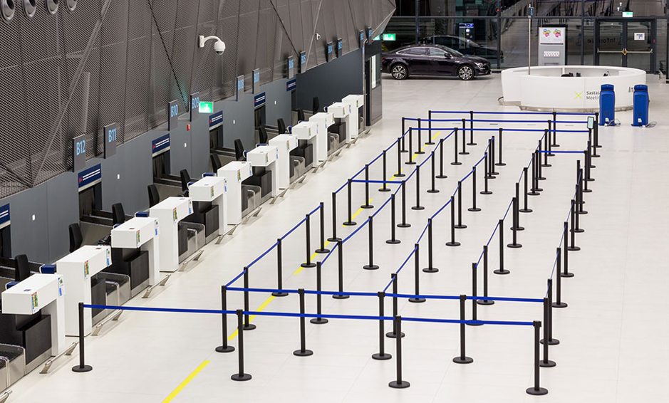

---
Pr-id: MoneyLab
P-id: INC Reader
A-id: 10
Type: article
Book-type: anthology
Anthology item: article
Item-id: unique no.
Article-title: title of the article
Article-status: accepted
Author: name(s) of author(s)
Author-email:   corresponding address
Author-bio:  about the author
Abstract:   short description of the article (100 words)
Keywords:   50 keywords for search and indexing
Rights: CC BY-NC 4.0
...

# Acknowledgments: From Amsterdam to Zagreb, Back, Forth and In-Between

Franjo Tudjman Airport, Zagreb.

I first wrote the text of this book as a thesis for the rMA-program Art
Studies at the University of Amsterdam. My supervisor, Prof. Dr.
Christa-Maria Lerm Hayes, had recognized my interest in critical studies
and practices in the arts years before my graduation and since
encouraged me to look beyond the confinements of the art historical
canon and the (former) West. Amongst the interests I thus developed was
one in the Yugoslav (neo-)avant-gardes like Gorgona, the Group of Six
Artists, and New Tendencies. In the summer of 2017, during a holiday on
the Croatian coast, I decided to spend some days in Zagreb, going to the
various museums and talking to cultural workers about my topics of
interest. Who knows what unopened archival file or oeuvre of a long-dead
artist I would find… It was idle hope, not least because I did not speak
any Croatian. But the visit taught me something much more interesting
and important. It taught me about a discursive notion with a
ground-breaking impact on my theoretical frame of reference, a
theoretical stealth bomb casually dropped by my conversation partner
Mika Buljević: ‘independent culture’. I remember myself, sitting on the
terrace of Program in the heat of the Zagreb summer, rambling: ‘I’m
sorry? Independent culture? I don’t think I understand you. Culture
always depends on money and labor. No one really believes that a thing
like independent culture could ever exist, right?’ I was, of course,
wrong. My notion of ‘independence’ was too narrow to understand what the
term ‘independent culture’ in Croatia meant. It was necessary to somehow
unlearn my understanding of independence so as to be able to formulate a
new one. I was hooked and decided to write my thesis about this one
question: What is independent culture?

In order to find answers to that question, I had to come back to Zagreb.
So, on the first of March 2018, I departed for a three-month stay in the
Croatian capital once more. During that time, I did a research
internship at the Academy of Fine Arts in Zagreb, under the supervision
of Leonida Kovač. This was wonderful for a number of reasons. I remember
the first time we had an appointment, one week into my three months. I
expected to get fifteen minutes of Leonida’s time, some theoretical
remarks, and a tip or two about whom to speak to. Instead, five minutes
into our two-hour meeting, Leonida picked up the phone and started
calling people and handing me the phone to make appointments for
interviews. I didn’t even have time to realize what was going on or to
become shy. Thanks to this head start, I was able to almost twenty
people in and around the scene, including Jens Brandt, Boris Buden, Mika
Buljević, Maja Flajsig, Darko Fritz, Ivana Hanaček, Jasna Jakišić,
Antonija Letinić, Olga Majcen Linn, Tomislav Medak, Petar Milat, Leonida
Kovač, Dejan Kršić, Ana Kutleša, Sunčica Ostoić, Lana Pukanić, Tomislav
Tomašević, Goran Sergej Pristaš, Darko Šimičić, Klaudio Štefančić, Lea
Vene, Dea Vidović, and Janka Vukmir. Needless but necessary to say, I am
very thankful everyone I talked to on tape in Zagreb for sharing their
time and thoughts with me.

Fortunately, my life in Zagreb existed of more than only interviews. I
went to exhibitions, (private) movie screenings, informal and formal
performances, parties, conferences, gallery openings, and dinners. I
have been lucky to meet a bunch of wonderful people at and through the
Academy – especially the new media department – and make some dear
friends: Ana, Gregor, Hrvoje, Ivana, Jasen, Karen, Klaudio, Laura,
Leonida, Maja, Mak, Marko, Nika, Sonja, Tara, Tina, and the crews at
MAMA and Booksa. As a result, even after the brief period of three
months, I felt like I really got some understanding of Zagreb’s
independent cultures. Since, I have returned to Zagreb several times.
During one such trip back, in September 2018, Galerija Miroslav
Kraljević hosted me for the lecture *Dimensions of Independence / How
Are Independent Cultures Born?* This event allowed me to present the
product of my work within the context of the independent cultural scene,
and to revise my initial analysis and recognize theoretical dimensions
of independence that transcended the local urgency.

Back in Amsterdam and after my graduation, I joined the Institute of
Network Cultures as Senior Intern. I continued to work with my friends
from the scene in Zagreb and was provided with the opportunity to
rewrite and expand my thesis – to make it into a book. I thank Geert
Lovink for his pragmatic interventions in the argument and Miriam Rasch
for her thorough editorial work. Without Miriam, this book would be ten
times as boringly academic as it is now, and without Geert, I certainly
would not have been able to write the exploded essay which is the third
part of this book. My dear friends Koen Bartijn and Mari van Stokkum, as
well as my mother Lysbet Haverkamp gave me valuable editorial comments.
Two friends from Zagreb also kept contributing to my writing
substantially: Klaudio Štefančić with his unrelenting thoughts,
comments, and suggested readings, and Marko Gutić Mižimakov by giving me
the chance to publish an excerpt from this book in his magazine, *The*
*Hub Between the Iliac Crest and the Public Bone.* Rosie Underwood, my
predecessor as INC-intern, was the best proofreader I could have hoped
for. I’ve also been extremely lucky to be with Laura Mrkša, who not only
happens to be a supportive partner, but also great designer. She created
the beautiful bubbly cover of this book. It’s an homage to Zagreb,
Little Rome, city of fountains.

A last, big thanks goes out to all the artists and heirs who allowed me
to reproduce their work, not as ornaments, but as visual arguments:
Ilona Szwarc, Marko Gutić Mižimakov, Sarah Gotovac and the Tomislav
Gotovac Institute, Braco and Nena Dimitrijević, Minna Henriksson, Darko
Fritz, Nicole Hewitt, This Town Needs Posters, Jagoda Kaloper and Ana
Tajder, Ana Kuzmanić, Constant Nieuwenhuys, Mladen Stilinović and Branka
Stipančić, and David Maljković.
