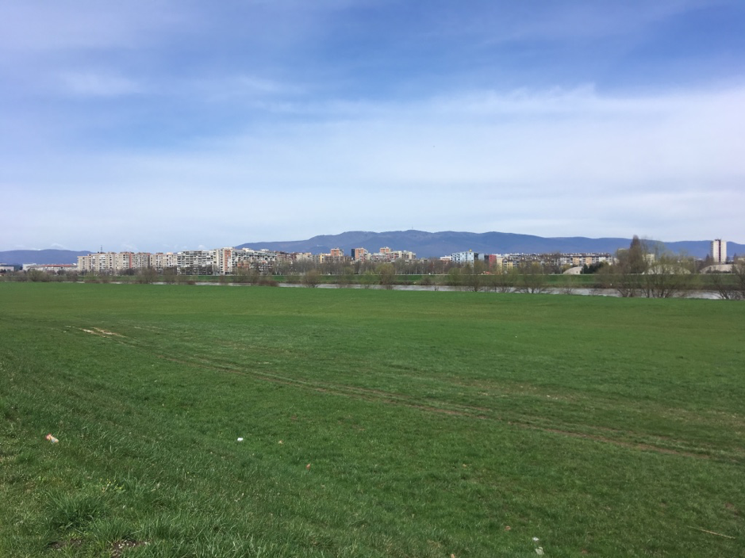
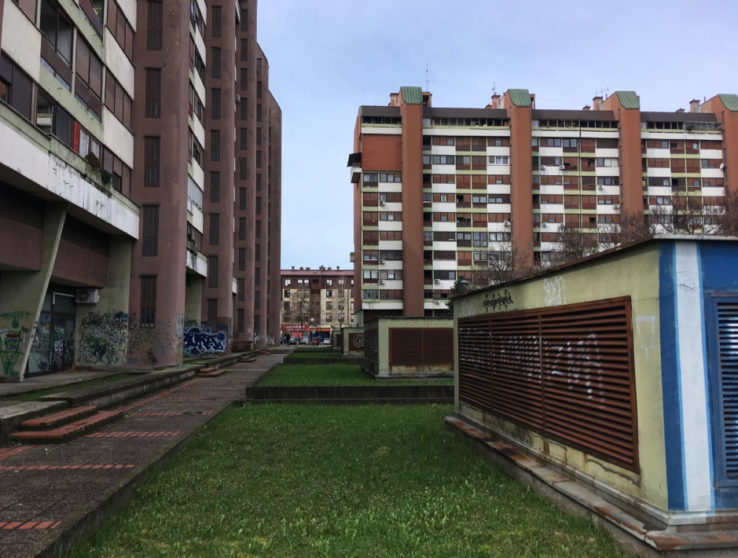
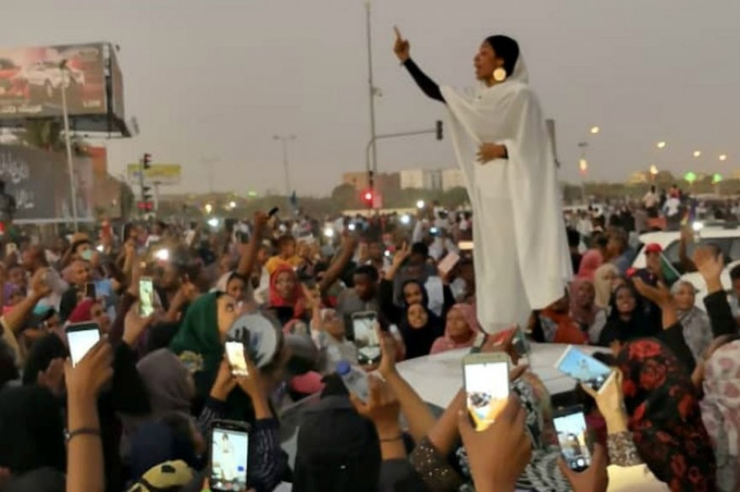

# Scenes of Independence: Cultural Ruptures in Zagreb (1991-2019)
## by Sepp Eckenhaussen

#Colophon

DeepPockets #3
 **Scenes of Independence: Cultural Ruptures in Zagreb (1991-2019)**

Author: Sepp Eckenhaussen
 
 
Preface: Leonida Kovač
 
 Editing: Miriam Rasch and Rosie Underwood
 Cover design: Laura Mrkša
 
 Published by the Institute of Network Cultures, Amsterdam, 2019
 ISBN 978-94-92302-40-3

**Contact**
 Institute of Network Cultures
 Phone: +3120 5951865
 Email: info@networkcultures.org
 Web: http://www.networkcultures.org

This publication is published under the Creative Commons
Attribution-NonCommercial-NoDerrivatives 4.0 International (CC BY-NC-SA
4.0) licence.

This publication may be ordered through various print-on-demand-services
or freely downloaded from http://www.networkcultures.org/publications.

# Contents

<a href="ch004.xhtml">How to Use This Book?</a>

<a href="ch005.xhtml">Preface by Leonida Kovač</a>

<a href="ch006.xhtml">Introduction: A Mapping Exercise</a>

<a href="ch007.xhtml">1\. Genealogy: How Are Independent Cultures Born?</a>

<a href="ch008.xhtml">2\. Today: Whose Independent Cultures Are These?</a>

<a href="ch009.xhtml">3\. Dimensions of Independence: What Is Independent Culture?</a>

<a href="ch0010.xhtml">Bibliography</a>

<a href="ch011.xhtml">Acknowledgments: From Amsterdam to Zagreb, Back, Forth and In-Between</a>

# How to Use This Book?

This book consists of several differently themed parts. It is the
personal story of a journey between Amsterdam and Zagreb, a genealogy of
Zagreb’s independent cultural scene, a mapping of cores of criticality
in Zagreb today, a search for futurologies, a critique of the notion of
independence, and a theory of the scene. This manual is written to
assist you in deciding what to read first or foremost. If you do not
feel like being guided, it is recommended to disregard this manual and
to start and stop reading wherever.

The *Preface* is an excellent synopsis of the book’s argumentation by
one of Croatia’s leading art historians, Leonida Kovač.

The *Introduction* is a mapping exercise which outlines a basic
understanding of independent culture in Zagreb. Closing off this
exercise, I position myself as a researcher and explicate the goal of my
writing.

The main text of the book consists of three parts. If the first two
parts focus mostly on organization, formation, positionality and
politics, the latter part is concerned with formulation and theory.

The first part, *Genealogy,* is a historical account of independent
cultures. Its central question is: how are independent cultures born?
Based on interviews, participatory research, and (archival) literature
research, I trace the birth of independent cultures to the point zero of
1991 and distinguish three subsequent stages after that. The distinction
of these phases are propositions towards a genealogy of praxis, in the
Foucauldian sense, which tries to understand how new social
constellations are born every time the hand of power redistributes the
playing cards of life.

In the following part, *Today,* I discuss – freely, speculatively, and
in solidarity – the current, lived condition of independent cultures
and the struggles around civil society. In some sense, it narrates the
fourth and, so far, last phase of independent cultures, but, at the same
time, it connects the past to the future through the present and
conjures the question: whose independent cultures are these? It could
function as an opening up of the conversation with the scene in Zagreb,
its practitioners, and its historians, and it sets the stage for the
next and more theoretical part of the book*.*

Part three, *Dimensions of Independence,* is the theoretical core of the
book. It addresses the central question: what independence is at stake
in independent cultures? It is a proposition towards an aesthetic theory
of independence as a renewed notion of critical culture, based on the
embrace of untranslatability and the scene as regime in common/s.

# Preface by Leonida Kovač

Would it be a matter of my fundamental misunderstanding if I argue that Sepp Eckenhaussen’s book is an interrogative mode of acting in the same scene which is the subject of his (not only) academic and theoretical research interest? My understanding of the author’s comprehensive inquiry of the syntagm ‘independent culture’, which has circulated in Croatian public discourse during the last three decades, is triggered by his statement (repeated several times in the text) that he has approached the subject from a semi-outsider position. While reading Sepp’s wondering upon the meaning of that highly problematic expression within which numerous obvious contradictions are contained, I was trying to understand what that semi-outsider position signifies. To find the reason for such way of a researcher’s self-determination, it would be inappropriate to merely point out the fact that the Croatian so-called ‘independent cultural scene’ emerged in the early 1990s partly thanks to the support of various organizations and philanthropic foundations which at that time were located in Amsterdam, where he lives today. Equally inappropriate would be to understand his semi-outsiderness as a flight from the standard relation between researcher and so-called ‘native informers’, characteristic of colonial academic disciplines.

In the introductory chapter, Sepp Eckenhaussen clearly states that his intention was not to write a history of that what is locally termed as independent culture but to do genealogical research on those phenomena. When making this statement, he immediately poses the questions: ‘How exactly can a genealogy intervene in the living discourse of the past at present? What does it mean to write a genealogy today?’ His genealogical researches based, on one hand on the interviews with protagonists of the ‘independent scene’, and on the other on the critical reading of the available literature on the origins and manifestations of such cultural formations, led him to distinguish four dimensions of independence within a context of the post-Yugoslav socio-political environment in Croatia. Given that the ‘independent culture consists of those actors that were pushed out of the institutions during the post-Yugoslav institutional crisis and regrouped in civil society, the formal dimension of independence in the context of Croatia thus mainly signifies a systemic position: independent culture is formally opposed to institutional culture’. Accordingly, he concludes that ‘the very term independent culture is a topos of political contestation’. 
After meticulous multidirectional, trans-disciplinary and theoretically well-imbued analysis of the independent scene, he emphasized that independent culture is not and mustn’t be understood as a sub-culture, and concluded that the last dimension of independence inherent to the scene of independent cultures in Zagreb is aesthetic independence. Writing that, Eckenhaussen is completely aware that ‘from the moment of their birth, independent cultures created space for anti-hegemonic and anti-political subjectivities – but also for embracing neoliberalism’. About such a conclusion, I would argue that the main concern of his brilliant book, which began as a case study of something that was locally termed as an independent culture or non-institutional cultural scene, is the reflexion on the possibilities of the critical culture under neoliberalism. And it is exactly that concern that, in this case, makes him simultaneously insider and outsider with regard to the subject of his research.

Reflecting on the independent culture’s resistance to the so-called ‘conservative revolution’ that is currently taking place, seemingly paradoxically (since Croatia recently became a member of the European Union), Eckenhaussen warns the readers of the interrelation between neoliberalism and neoconservatism emphasizing that these phenomena are mutually stimulating rather than mutually exclusive. To his understanding, neoliberalism is essentially anti-modern economic progressivism which:
> abandons any traditional liberal-humanist aspiration of democratic emancipation in the name of the market and individual freedom. Accordingly, the liberal tradition of appreciating critical and emancipatory cultural practices is replaced with nationalistic and neoconservative reactionary cultural identity politics. In this definition, neoconservatism is the nationalist, post-historic, identity-political supplement of neoliberalism: a culture based on market fueled traditionalism devoid of the aspiration to emancipate or evoke a sense of historical justice. Neoliberalism and neoconservatism then appear to be two sides of the same coin.

In the final chapter, where he exposes a kind of (im)possible, futurological theory of independent culture, Sepp Eckenhaussen pays special attention to the notions of (un)translatability, as well as to the etymology of the word scene, pointing to the meaning and to the contexts in which parrhesia (in the sense of free speech) could be performed. That is the point where this book becomes not only the first written genealogy of the Croatian independent cultural scene but a precious, challenging study that makes readers ask themselves what it is for that we need word ‘art’, and what we are doing when we’re concerned with cultural production. 

Zagreb, November 2019.

# Introduction: A Mapping Exercise

Zagreb, Rebecca West says, ‘has the endearing characteristic, noticeable
in many French towns, of remaining a small town when it is in fact quite
large’.[^ch01_1] She wrote these words in the late 1930s, when Zagreb had
just over two hundred thousand inhabitants. By 2019, this number has
almost quadrupled. Yet a similar feeling captures me while roaming the
city today. It seems like Zagreb is a capital and a village at the same
time. It is almost impossible to get lost in the streets, squares and
parks squeezed between Mount Medvenica and the Sava River.

Zagreb – between Sava and Medvenica.

According to West, Zagreb’s village-like character is ‘a lovely
spiritual victory over urbanization’.[^ch01_2] A dubious compliment. Within a
few years after West’s visit, two hundred thousand refugees of World War
II settled in the city, affirming that in Zagreb, too, the force of
urbanization is more than capable of bending the laws of spiritual life.
It could hardly be said that West was naïve, though. Her fist
thick *Black Lamb and Grey Falcon: A Journey Through Yugoslavia *is
widely regarded as one of the greatest – some say the most foreseeing –
books ever written about Yugoslavia. It describes with great finesse and
pointy humor the life of the Balkan peoples during centuries of
hardships and the constant political quarrels amongst Serbs, Croats,
Slovenes, Bosniaks, Albanians, and Macedonians. If anything, West’s
spiritualist interpretation of life in Zagreb hints to the understanding
that this is a city that is not so easily readable.

The Britanski Trg market on an average weekday.

Zagreb is a fragmented city; its many neighborhoods seem to be different
worlds. Even the city center, which is not very vast, is split up into
three parts: one for politics, one for religion, and one for life. The
old city, located on a hill and called Gornji Grad (upper town), is the
seat of the Croatian government. From here, the county’s rulers have a
wide view over the rest of the city and the Pannonian Basin beyond it.
Over the past decades, Gornji Grad’s old age and altitude have also made
it into a well-visited tourist attraction. As a result, a visitor of
Gornji Grad will encounter the strange mix of formal power and touristic
entertainment usually reserved for royal palaces. On the slope of the
hill stands Zagreb’s magnificent cathedral with its towers in eternal
scaffolds, surrounded by the clerical complexes. This is Kaptol.
Together Gornji Grad and Kaptol are the epicenter of Croatian political
and clerical power, which are deeply intertwined.

A view from Gornji Grad.

At the foot of the hill, Donji Grad (lower town) begins. This part of
the city, built in the nineteenth century, is surrounded by Gornji Grad
on the north and the Green Horseshoe on all other sides. The Green
Horseshoe consists of three boulevards modeled after the Ringstraße in
Vienna. Its main elements are leafy parks, botanical gardens, and
neo-renaissance pavilions designed to simultaneously impress and relax
flaneurs and other passers-by. In Donji Grad, one can find the main
shopping street Ilica, restaurants, hotels, a handful of one-room
cinemas, the botanical gardens, the train station, and the main square
Trg Ban Jelačić - usually simply called Trg. It is here that public
everyday life takes place. The fact that Zagreb’s urban life is this
concentrated is quite joyful since hardly a day of Zagreb life passes
without a random encounter with a friend or colleague.

The statue of Ban Jelačić on Zagreb’s central square.

A few kilometres to the East of the city centre one finds the green
pearl of Zagreb: Maksimir Park. The huge park contains five basins full
of turtles, a small zoo, a restaurant pavilion overlooking the tops of
the trees, and enough lush green and small pathways to wander around for
a full day. No wonder young families, dog-walkers, sunbathers and
tourists flock the park whenever the sun comes out. It was built by
Zagreb’s bishops in the late 18th century and was the first large public
park in South-Eastern Europe. A statement of civilization. The famous
Yugoslavian writer Miroslav Krleža, who can be called the archetype of
Croatian authorship, wrote about Maksimir in his 1926 *Journey to
Russia:*

> Where does Europe begin and Asia end? That is far from easy to define:
> while the Zagreb cardinals’ and bishops’ Maksimir Park is definitely a
> piece of Biedermeier Europe, the village of Čulinec below Maksimir
> Park still slumbers in an old Slavic, archaic condition, with wooden
> architecture from ages prehistorical, and Čulinec and Banova Jaruga to
> the southeast are the immediate transition to China and India, snoring
> all the way to Bombay and distant Port Arthur.[^ch01_3]

So, this wonderful place of leisure, so progressive at the time of its
construction, shows the particular of position Zagreb in cultural
discourse; an explosive position on ‘the fault line between
civilizations’.[^ch01_4] This strange place on the brink of East and West has
for centuries played an important role in the identification of Croatian
culture, both from inside and out, and contributed to the Balkan’s
reputation as the ‘Powder Keg of Europe’.[^ch01_5] For is it not inevitable
that, when cultures so different from one another meet in one place,
clashes ensue? Croatia is, in other words, on the frontier of the
Culture Wars.[^ch01_6]

Around the old city of Zagreb, beyond the comfort of the Viennese
boulevards of the lower town and the picturesque alleys of the upper
town, socialist-era architecture arises. Walking through the maze of
streets and courtyards just south of the city center, a visitor might
run into the impressive sight of the Rakete: a complex of three
rocket-shaped towers designed by Centar 51 in 1968, which will soon be
discovered by photographers with a brutalist fetish. And even further
south, cut off from the rest of the city by the river Sava, is Novi
Zagreb (New Zagreb). This part of town was built by the order of Marshal
Tito to accommodate for a new, socialist urban life. Between the typical
socialist high rises, a huge horse racing track was built, a new
national library, and, more recently, the Museum of Contemporary Art.
But despite these grand public works, social life in Novi Zagreb takes
place mainly in the cafés of its malls and on the gigantic flea market
Hrelić.

High rises in Novi Zagreb.

In this fragmented city with its many testimonies of a rich and
turbulent history lives a unique culture. There is the culture embodied
by the stately Viennese-style buildings of the Museum of Modern Art, the
Archaeological Museum, the Art Pavilion, and the National Theatre, which
take up unmistakably symbolic spaces along the promenades of the Green
Horseshoe. But then there is also another, more interesting culture in
Zagreb. This other culture emerged after Yugoslavia disintegrated in
1991 and Croatia became an independent state for the first time since
the Middle Ages. Insiders refer to it as ‘independent’ or
‘non-institutional culture’.

Independent culture is just as present in the city center as the grand
institutions, yet not immediately recognizable to the outsider. A
stone’s throw away from the Archaeological Museum, hidden away in the
arcade of a courtyard there is the small Galerija Nova. Galerija Nova is
the only exhibition space in Zagreb structurally presenting art
exhibitions which carry solidarity with migrants – a highly sensitive
topic in this country on the border of the European Union. One block
further still, in the back of another courtyard, Multimedia Institute
and Hacklab MAMA is located, the base for Croatian media art and digital
culture since the early 2000s. It also happens to be the best library in
the fields of new media and commons in Croatia. A few minutes eastward
by bike, in the poche Martićeva Street, there is a café which at first
glance looks like any other. Once inside, however, it turns out that
Booksa is a hotspot of cultural life, where cultural workers come to
drink coffee, meet, work, and read. A few tram stops from Booksa, in the
fold line between the railroads and The Westin Zagreb, there is an old
pharmaceutical factory. Today, it is a former squat called Medika.
Instead of medicines, it now produces punk concerts and glitch art
exhibitions.

I could go like this on for a while. Because with every visit to one of
these places, one meets people and finds out about other places like it:
the experimental dance company BADco., curatorial collective BLOK, news
outlet Kulturpunkt, youth culture hub Pogon, anarchist bookshop Što
Čitaš?, the old socialist Student Centre, platform organizations
Clubture and Right to the city, and Documenta – Centre for Dealing with
the Past. Like a distributed web, these organizations permeate the urban
tissue of Zagreb. They make up a kind of village-like social system in
which most people know each other personally and have often worked
together at some point. Independent culture is a scene.

Now, if I’m raising the impression independent culture is either a
subculture or a purely local phenomenon, I should correct myself
immediately. Independent culture includes well-known, (internationally)
established organizations. A quick look at MAMA and Galerija Nova is
enough to illustrate this point. MAMA’s programs include many Croatian
contributors, but also Catherine Malabou, Geert Lovink and Pussy Riot.
The institute published the latest book by the French philosopher
Jacques Rancière, one of my personal favorites amongst contemporary
thinkers. WHW, the curatorial collective which directs Galerija Nova,
works with internationally renowned artists like Mladen Stilinović,
Sanja Iveković, and David Maljković. They have, moreover, been appointed
as director of Kunsthalle Wien in the summer of 2019. While certainly
embedded locally, independent culture is thus an internationally
oriented scene.

It is hard to pinpoint exactly what type of culture is created in
independent culture, while the practices of the various organizations in
it differ so much. It includes but is not limited to dance, performance
art, theatre, visual arts, new and old media, experimental cinema,
festivals, education, community work, research, discursive programs,
networking, and advocacy. It is clear that independent culture
transgresses the boundaries of traditional cultural disciplines. The
only general characteristic is that while all of these organizations
work with culture, none work within the strict confinements of the art
world or artistic production – a characteristic so common that it cannot
define a scene. So, what is it that connects the scene, apart from
personal relations, a shared urban environment, and the fact everyone in
it does ‘something with culture’?

If anything, the organizations within independent culture are united by
common political outlook (not to be confused with a political agenda).
Their programming embodies a conglomeration of activist discourses
leaning to the left of the political spectrum. Amongst other things,
they focus on anti-fascism, pacifism, commons activism, feminism and
queer activism, decoloniality, and ecological activism. Some would say
that Yugonostalgia is rather common in independent culture, others would
say that they’re Yugofuturist. In order to be able to have this
political agency in the context of Croatia, which is predominantly ruled
by right-wing and nationalist forces, the scene is organized separately
from the state-funded cultural infrastructure. This shows by
approximation what the independence is that holds together Zagreb’s
independent cultural scene. Being rooted in grassroots activisms rather
than large institutions governed by state and local governments,
independent culture claims to work, indeed, independently from the
dominant power of the state.

But contradictions abound. From the moment of its emergence in the
1990s, the independent cultural infrastructure depended largely on
international philanthropist organizations such as the George Soros
Foundation, the Rosa Luxembourg Foundation, and the European Cultural
Foundation, as well as for-profit organizations such as the Viennese
Erste Bank. Then, since the mid-2000s, international funds have
retreated from Croatia, making independent cultural organizations more
reliant on state funding, effectively incentivizing them to engage in
advocacy, self-institutionalization, and cultural policy-making. It is
questionable, then, how independent or non-institutional the independent
cultural scene really is at this point. Is it a product of local urgency
and grassroots engagement, or neoliberal and neo-imperial phenomena like
globalization and cultural entrepreneurship? Is it possible that it is
both? And if so, what is the interrelation between these forces?

In its analysis of independent cultures, the following text is at times
sharp and critical. The struggles it speaks of are real, and addressing
them can, as I have learned, be sensitive at times. Yet, in the end, my
account is always informed by solidarity. I deeply appreciate the
existence of the organizations gathered under the umbrella of
independent cultures. Sensing the political subjectivity and
collectivity of the scene, however fragile, is a relieving and inspiring
experience, especially when coming from Amsterdam, a place where
neoliberal hegemony is by now so complete that elements of collective
resistance are nearly completely absent from the circuits of cultural
production.

My goal in writing has been to instrumentalize my semi-outside
perspective and to create an analysis that makes sense to and is useful
for the reader in the local context. At the same time, I reckon that the
question of independence (in- and outside of culture) is a globally
relevant one. This book, therefore, discusses two different (although
not separate) questions: What does independent culture in Zagreb look
like to an outsider? And what insights do the struggles in Zagreb’s
independent culture provide into the regimes of global neoliberalisms in
culture and beyond?

[^ch01_1]: Rebecca West, *Black Lamb and Grey Falcon: A Journey Through
    Yugoslavia* (London and Edinburgh: Canongate, 2006(1942)), 47.

[^ch01_2]: West, *Black Lamb and Grey Falcon,* 47.

[^ch01_3]: Miroslav Krleža, *Journey to Russia,* trans. Will Firth (Zagreb:
    Sandorf, 2017), 26.

[^ch01_4]: Georges Castellan, ‘Les Balkans: poudrière du XXe siècle,’
    *Guerres mondiales et conflicts contemporains,* no. 217 (January
    2005), 5-15.

[^ch01_5]: Samuel P. Huntington, ‘The Clash of Civilizations?’ *Foreign
    Affairs,* vol. 72, no. 3 (Summer 1993).

[^ch01_6]: The Balkans have also been the battleground of military power
    struggles between West and East for centuries. The expansion of the
    Ottoman Empire was put to a halt by Western-European forces in the
    Balkans in the 16th and 17th century. In the early 20th century, the
    fall of the Ottoman Empire and the emergence of nation-states
    solidified the border between the liberal, Christian West and the
    Islamic East. Forced mass migrations and assimilations of ethnic and
    religious minorities took place, displacing Ottoman Christians West
    and Balkan-inhabiting Muslims East of the Bosporus. The friction
    caused between the ethnically and religiously diverse populations
    that had inhabited the Balkans for centuries, led to two Balkan Wars
    in 1912 and 1913. In 1914, by firing the mere couple of gun shots
    that killed Archduke Franz-Ferdinand of Austria, the Bosnian Gavrilo
    Princip triggered what was briefly considered the Third Balkan War,
    but is now known as the First World War. This series of events
    gained the Balkans their reputation as the ‘Powder Keg of Europe’, a
    reputation that was reinforced once again in reactions to the
    Yugoslav Wars in the 1990s. Moreover, the idea of the Balkans as a
    ‘Powder Keg’ was deepened by the rise of global identity politics
    heralded by the fall of the Iron Curtain in 1989. In *The Clash of
    Civilizations?* (1993), the American historian Samuel S. Huntington
    argued that after what Francis Fukuyama famously called the ‘end of
    history’, the ‘great divisions among humankind and the dominating
    source of conflicts will be cultural. \[…\] The clash of
    civilizations will dominate global politics. The fault lines between
    civilizations will be battle lines of the future.’ This theory was
    utilized, if not designed, to justify the US in upholding the
    aggressive foreign policy rhetoric it has used throughout the Cold
    War up to the present day. The argument that the Balkans are on the
    fault line of civilizations served in this agenda as a justification
    to keep regarding this area as the place where the West fights off
    the East. Huntington, ‘The Clash of Civilizations?’, 22.

# 1. Genealogy: How Are Independent Cultures Born?

Still from David Maljković, *Afterform* (2013). Courtesy of Annet Gelink
Gallery.

Yugoslavia broke up in 1991, and despite the general consideration that
independent cultures emerged concurrently, this historical narrative
takes off in the Socialist Yugoslav era and re-examines some cultural
legacies it left behind. After 1991, I discern three subsequent phases
in the history of independent culture. These are characterized by
different attitudes, discourses, and material circumstances within and
around the scene. This conclusion is drawn from; my examination of
‘organic’ literature produced within the field of independent culture;
some theoretical interventions from outside-perspectives and critical
theory of a general character; the loosely structured interviews I
conducted with actors from the independent cultural scene – including
curators, theoreticians, professors, students, funders, and artists;
observations made during visits to most of the independent cultural
spaces in Zagreb; and discussions with my friends from the Academy of
Fine Art’s New Media Department and from the performance art community.

Writing an ethnographic account of the peace movements during the
Yugoslav Wars, sociologist and activist Paul Stubbs formulated a
‘nethnographic’ methodology. The netnography ‘usefully draw\[s\] on
ethnographer as informant and embrace\[s\] the reflexive dimension such
that reflexivity is applied not just to the work of individual
ethnographers, but to the methodology as a whole’ and thus achieves a
‘multi-voiced netnography’.[^ch2_1] In line with this approach, I use
extensive quotations from interviews and conversations in the following
text. By incorporating different voices from the field of independent
culture, I engage with various views on socialist histories and cultural
heritage. This has also involved considering different takes on the
character of civil society and the arguments that are formulated from
these perspectives. Most important is the way in which history is
articulated from them, whether that be as a source of inspiration for
contemporary practice and activism or as a factual deduction and
disinterested understanding. I simultaneously discuss institutional
developments in artistic and cultural production, political changes,
artistic tendencies, important developments in discourse, historiography
and theory. The point in doing so is to engage with the interrelation
between these different historical events and the problems that arise
from attempting to comprehend them; thereby to confront how our thinking
of the past influences our attitudes in the present.

As such, the following is a genealogy rather than a history. The
difference, according to Michel Foucault, is that a genealogy ‘opposes
itself to the search for “origins”’ so typical of traditional
histories.[^ch2_2] In a genealogy, history is not considered to be a pure
reality covered by the dust of time, waiting to be uncovered ‘as it
really was’, or the material of grand narratives, but a complicated
tissue of discourse resulting from the interplay of power relationships
and the distribution of capital. The task of the genealogist is to
explore the way beings have been disciplined by power in the past. This
can be done, Foucault suggests, by looking for the ‘Herkunft’
(discursive commencement) rather than the ‘Ursprung’ (historical
essence) of historical events.

The image that appears from this genealogical account of independent
cultures in Zagreb is full of shifts and breaks, caused by wars, changes
of governments, the conception of new ideas, and other factors that
determine how beings are disciplined by power. But I do not suppose
there is progress in the history of independent cultures. Writing
through this bourgeois myth of progress and linear chronology would only
result in a boring *Abendland-*image of emergence, peak and decline. In
fact, as much as there are disruptions, there is a continuity in the
praxis of independent cultures as it peaked repeatedly in the 1970s, the
early 2000s, and, in some sense, today. Independent culture is a living
culture that constantly morphs and transforms. Who knows what shape it
will take tomorrow, when the circumstances are different from today? In
the face of this liveliness, I cannot write anything else than a
situated, effective history of the praxis of independent cultures.[^ch2_3]

## 1.1. What Is a Genealogy Today?

How exactly can a genealogy intervene in the living discourse of the
past at present? What does it mean to write a genealogy today? Foucault
wrote his genealogies in the 1970s, the late days of Fordist labor
relationship dominance. Since then, due to incessant globalization,
automation and the rise of the internet, a shift to post-Fordist labor
took place in the (former) West and created new regimes of disciplining.
Italian autonomist philosopher Franco ‘Bifo’ Berardi has pointed out
that regimes of power like social media and the platform economy no
longer aim to discipline the body of their subjects, as was the case for
the 20th-century ruling class. Rather, they discipline the soul and put
it to work.[^ch2_4]

The type of soul work dominant in independent cultures is ‘abstract
labor’, defined by Bifo as value-producing time with no relation to the
specific and concrete utility that the produced objects might have.[^ch2_5]
Since the rise of digital media and the high-tech industries, abstract
labor has become widespread, including trades like PR, design, web
development, and most of all, the creative industries. But the oldest
and most archetypical type of abstract labor could be said to be the
creation of high art by the autonomous artist genius. The artist genius
attains such a level of specialization that the value of their labor
equals the uniqueness of their abstract skills beyond any reference to
use value. For instance, the rumor goes that Pablo Picasso was once
approached by a stranger in a restaurant and asked to scribble a drawing
on a napkin. Picasso complied and said that ‘this will be 40.000 Francs,
please’. The stranger was astonished and objected: ‘But you did that in
30 seconds!’, to which Picasso replied: ‘You’re wrong. It took me 40
years to become Picasso.’ This example perfectly shows Bifo’s point that
abstract labor ‘manipulates absolute abstract signs, but its recombining
function is more specific the more personalized it gets, therefore ever
less interchangeable’.[^ch2_6]

Every worker of today’s global culture class follows Picasso’s example,
geared up with a silver laptop and an organically decomposable mug of
artisanal coffee to use the manipulation of abstract signs to strive for
uniqueness rather than homogeneity. The paradoxical situation resulting
is that, even though these high-tech workers function like any other
type of homogenous work force most of the time, they identify as unique
creatives. ‘Consequently’, Bifo says, ‘*high tech* workers tend to
consider labor as the most essential part in their lives, the most
specific and personalized’.[^ch2_7]

This new situation requires a different focus for the genealogist too,
because the mental automatisms and types of alienation that characterizes high
tech workers because of their complete identification with their jobs are nothing
like factory workers’ physical alienation in which producing bodies become
interchangeable. Instead of the split between
body and soul caused by Fordism, we encounter an internal split of the
soul in post-Fordist labor relationships. Due to the rise of
neoliberalism and the dismantling of public social systems, the
precarious circumstances in which the soul of high-tech workers is
employed results in the internal split of the soul as creative entity
and the soul as entrepreneurial entity. While the creative soul creates
freely and abstractly, the entrepreneurial soul of the high-tech worker
enters into market competition to compensate for the failing social
systems.

Independent culture in Zagreb is a circuit full of such abstract
high-tech labor. Indeed, the precariousness of mental work is an often
talked-about subject in the scene, felt deeply by its members on a daily
basis. Their condition means that they have to take care of themselves
through the market or funding competition – while being uncertain about
their survival from year to year. What’s more, the instrumentalized use
of precarization by governments is one of the structural threats
independent cultural organizations deal with. For many of these
organizations, a year without government funding can easily mean the
end. Precarity is therefore the red thread in my genealogy of
independent cultures.

To address this state of precarity, I borrowed some important
definitions from Isabell Lorey’s *State of Insecurity: Government of the
Precarious (Futures)* (2012). The four key concepts Lorey expands upon
in this book are: *precarization*, *precariousness*, *precarity*, and
*governmental precarization*. The most general of these terms is
precarization, which refers to the phenomenon of living with the
unpredictable, the contingent.[^ch2_8] It is the umbrella term, under which
the other three are grouped. Precariousness, precarity, and governmental
precarization are three respectively social-ontological, discriminatory,
and historical dimensions of precarization.

Precariousness refers to the socio-ontological state of insecurity: all
human beings are born into society, disposing of nothing but a harmless
and necessarily mortal body. We all know: leave a baby alone and it dies
within days. The fact that any full-grown human is alive is because they
have taken the necessary care to postpone inevitable death. From the
moment we are born, we are dependent upon social structures and the care
of others. Precariousness is, then, not necessarily something we are
born *with,* but necessarily something we are born *into.* Thus,
precariousness is not a natural condition, but at the same time socially
constructed and unavoidable. It is shared by all, yet divides and
individualizes. Judith Butler has put it this way: ‘Although precarious
life is a generalized condition, it is, paradoxically, the condition of
being conditioned’.[^ch2_9] Since precariousness is this unavoidable,
pre-intentional condition shared by all, it exists outside of power
relationships, *before* power relationships.

Precarity, on the other hand, is the moment when the fear of precarious
life turns into power and constitutes a hierarchic categorization of
precariousness and becomes regulatory.[^ch2_10] Instead of facing the
unavoidable danger of precarious life, the fear deflected and projected
onto more controllable entities: the lives and actions of others. (Why
am I feeling so weak and vulnerable in everyday life? Must be the queers
and the immigrants.) Through the discriminatory logic by which some
privileged groups project their fear onto others, a hierarchic
categorization of forms of life is created. Precarity can thus be
understood as a functional effect of political and legal forms of
regulation that should ideally function as protection from
precariousness. Clearly, the exclusive and regulatory effects of
precarity do not only create a sense of safety, but are also closely
linked to racism, anti-Semitism, homophobia, etc.

Importantly, this regulatory dimension of precarity is neither necessary
nor natural, but a contingently-historically constructed phenomenon. The
status quo of power relations in the industrial-capitalist era have from
the start been dependent on the individualized, and therefore
biopolitically governable, labor market. This was justified in the
discourse around individual responsibility and the *sovereign
citizen*.[^ch2_11] Since a sovereign citizen is free to pick their own means
of existence (jobs, health care, insurance, social circles, etc.), they
are also responsible for the upkeep of their existence and to deal with
all the insecurities it comes with. Leap forward in time: with the
emergence of the internet, post-Fordist modes of production, including
both cognitive and creative work, precarious living and working
circumstances have become normalized. What is more, in this context,
normalized means: happily internalized. We, the creative class, all want
the freedom of flexible jobs and the ability to work from our MacBooks
in any coffee bar around the world. Thus, without any struggle,
precarization (and the privilege to be without it) have become an
essential tool of contemporary neoliberal government.

Here, Lorey asserts, we discern the third dimension of precarization:
governmental precarization.[^ch2_12] Governmental precarization, according
to Lorey, not only entails a precarization of wage labor, but also of
existence in general. The emergence of governmental precarization and
neoliberalism (the marketization of (every facet of) life) are related.
Economic deregulations and the abandonment of Fordist labor have created
not only created freedom and flexibility, but also income disparities,
precarity and fear. The more individuated and the more marketized our
European condition has gotten, the more normalized precarious life has
become. But, Lorey emphasizes, the fact that precarious life has
normalized and become a tool of governance under neoliberalism, does not
mean that insecurity itself has normalized, too. On the contrary, as
nation-states proceed to dismantle one social security structure after
another, more and more emphasis is put on national security. These fears
were then (pseudo-)resolved on the nation-state level by militarization
and repression of the Other.

The fear of alien social bodies, terrorism, Islam, racial dilution,
cultural digression and aggression towards asylum seekers have all
increased with the rise of the precarity. This ideologically installed
fear is then eased by rising military budgets, xenophobic refugee
policies, and strongman leaders. Hence, the functional dimension
precarity has been institutionalized and has become the foundational
mechanism of government.

Now, let’s start at point zero: the disintegration of the Socialist
Federal Republic of Yugoslavia.

## 1.2. Point Zero: The Disintegration of Yugoslavia

1991 saw the disintegration of Yugoslavia. After a decade of political
crisis and ‘no future’, the Fukuyaman ideology of the post-historical
condition – the idea that all major ideological struggles had been
played out when the Iron Curtain fell in 1989 and that
liberal-democratic capitalism had come out definitively victorious –
finally and violently caught up with Yugoslavia. Slovenians, Bosniaks,
Croats, Serbs, Serbian Croats, Croatian Bosniaks, Bosnian Serbs, Serbian
Bosniaks, Bosnian Croats, and Croatian Serbs fought each other in
shifting alliances. Historians still debate whether these are four
separate Yugoslav Wars or a single civil war. In any case, as soon as
images of Serbian concentration camps went viral on every possible
Western news outlet, it became clear that ‘something’ had to be done.
The U.N. intervened while Milošević marched. Even though the Dutch
military forces failed to fulfil their duty, the Yugoslav People’s Army
ceased its campaign under the threat of NATO bombing. The borders of a
divided Yugoslav area started to take shape, and the rest is history*.*
A history, moreover, that was later neatly separated from the
post-historical present day by means of legal closure in The Hague. With
some irony, it can be said that the Iron Curtain separating East from
West was replaced by the curtain of justice separating history from the
present.

But the Yugoslav Wars have been the subject of many a historiography and
I will refrain from writing one more here. It is already clear to all
that the war time was a period of such radical social, institutional,
political, ideological, and cultural change and destruction, that it can
be rightfully marked as a point zero. What is of interest to me, and
what is in some sense the core of this book, is the question what
happens *after* point zero. In the aftermath of the Second World War,
Theodor W. Adorno famously stated that ‘to write a poem after Auschwitz
is barbaric’. Auschwitz was an obvious point zero. And continuing the
cultural practices of the ‘civilized’ society that led to the atrocities
of the Holocaust – such as writing an old-fashioned poem – without
questioning the role of cultural production and narratives within that
civilization had become a moral impossibility after this point zero.
Now, if the Yugoslav Wars are the point zero in this case, at stake is
the barbarism of poetry after Srebrenica.

### 1.2.1. Transitology

A quintessential idea in the liberal discourse of post-history was that
of ‘transition’. Directly following the fall of the Iron Curtain in
1989, departments of ‘transformation studies’ or ‘transitology’ were
established throughout universities in Westeren Europe and the United
States as schisms of Area Studies and Soviet and Comparative Communist
Studies. These departments studied and supported the fall of
authoritarian and totalitarian regimes in Eastern Europe and their
transition into the Western democratic model. The foundational
hypothesis of transitology was paraphrased by transitologist James
Hughes, stating that: ‘The basic premise is self-evidently normative and
linear: that the values, structures and political procedures of advanced
Western democracies are the most developed and should be transplanted
\[to the rest of the world\]’.[^ch2_13] The insights generated in these
departments were soon adopted by the policymakers of Western governments
as well as the International Monetary Fund and the World Bank and used
to formulate plans for the establishments of free markets, civil
societies, and democratic institutions in the East. More than a
theoretical enterprise, transitology thus became a practical tool for
the smooth implementation of the Western ideals of democracy, free
market prosperity, and the open society. It is therefore that the notion
of ‘the period of post-socialist transition’ has come to be used as a
synonym to ‘the 1990s’ in Eastern Europe, including the former Yugoslav
area.[^ch2_14]

In hindsight, not everyone is as happy with the impact of transitology.
In his article *Children of Post-Socialism* (2015), the critical
theorist Boris Buden argued that the post-socialist transition was not
just a traumatic lived experience of war or simply a period of time in
between two societal models, but also a discursive tool of neo-imperial
and neoliberal subjugation of the (former) East by the (former) West by
means of ‘repressive infantilization of societies that have recently
liberated themselves from communism’.[^ch2_15] The dominant idea was that,
after the end of history, the only rational way forward for
post-socialist countries was to follow the lead (or the tutelage) of the
already-democratic (former) West by ways of direct imitation. Buden
elaborates on the consequences of this demand to imitate:

> Not only \[were\] the protagonists of the democratic revolutions
> robbed of their victory and turned into losers; at the same time, they
> have been put under tutelage and doomed blindly to imitate their
> guardians in the silly belief that this will educate them for
> autonomy. It is not only the arbitrariness of the new rulers, but
> above all the logic of their rule that reveals itself.[^ch2_16]

What was this new post-socialist and post-historical logic? In their
book *Welcome to the Desert of Post-Socialism* (2015), Igor Štiks and
Srećko Horvat unpack how the post-socialist transition played out
materially and conclude that:

> The dismantling of the remnants of the socialist state was legitimised
> by demands for the rapid reduction of the omnipresent state apparatus.
> This process usually entailed the dismantling of existing social
> protection as well as privatisation \[…\] or the total corruption of
> what remained of the state apparatus. \[…\] When the dust finally
> settled, ordinary citizens found themselves not only in a devastated
> country, but also with empty pockets and without the old social safety
> net.[^ch2_17]

It appears that, as the curtain of history fell, the dominant logic of
rule was not so much ridden of its teleologic progressivism, but rather
of the aspiration of emancipation and Bildung that had always been
present in the grand narratives of modernism.

Jacques Rancière formulated an elegant theory about the workings of this
post-socialist logic of rule. In his essay *Time, Narration, Politics*
(2017), Rancière analyzed how the so-called end of the grand narratives
was in fact a redistribution of the hierarchy of temporalities creating
a new ‘relation between justice and the order of time’.[^ch2_18] The
analysis is quite technical, but nonetheless worth reproducing briefly,
because it shows how a new conception of time helped solidifying the
Western hegemony after 1989 by determining which histories could and
which histories could not be perceived of as historical realities
leading to the reality of the present.

At first, Rancière states that the post-historical era advocated by the
likes of Francis Fukuyama seem to have a temporality where ‘the bare
reality of time, stripped of any inner truth and any promise of justice
and brought back to its ordinary course’. This is why liberal capitalist
democracy could sincerely be perceived as the logical end to history: it
was supposedly the neutral or ordinary course of time, beyond the
distortions of ideology, an *absolute present*. But, Rancière continues,
‘it soon turned out \[…\] that this absolute present had not so easily
gotten rid of the passions engendered by the weight of the past and the
anticipation of the future’.[^ch2_19] As we can tell in hindsight, the
then-deemed ‘outdated’ discourses of protectionism and ethno-nationalist
narratives were revived in both (former) East and (former) West pretty
soon after 1990. Rancière asserts that ‘it thus appears that the
simplistic opposition between the past illusion of history and the solid
realities of the present hides a division inside the “present” itself, a
conflict about what is present and what a present is’.[^ch2_20]

The struggle implied here concerns the ‘orderly’ hierarchical
distribution of temporalities and forms of life. It plays out between
those who can actively shape the time that might arrive – those living
in the time of science – and those who passively receive time – those
living in the time of ignorance. From this understanding of the
so-called grand narratives as animated by the split of knowledge of
necessity and possibility on the one hand and ignorance thereof on the
other, between the know-it-alls and the know-nothings, it was clear that
the powerful had not stopped claiming their monopoly to knowledge of
history. Rancière:

> Neither the plot of historical necessity, nor its inner splitting have
> vanished in the so-called reign of the present. \[…\] While the end of
> the grand Marxist narrative was loudly trumpeted everywhere,
> capitalist and State domination simply took over the principle of
> historical necessity. \[…\] Historical teleology was replaced by a
> simple alternative: either the lone possible produced by good
> management of the existing order or the great collapse.[^ch2_21]

While the division between knowledge and ignorance of history persisted,
the type of knowledge attributed to the know-it-alls changed: in the
place of ‘historical justice’ now came the neoliberal mantra of ‘good
management’.

This hegemonic view of world history after the end of history, divided
by ‘good management’ (the West) and ‘great collapse’ (the rest) has the
perverse characteristic of obscuring the historical material condition
of Yugoslavia. What was actually true is rendered inconceivable by the
simple dichotomy on which the hegemonic narrative hinges: Yugoslavia
never belonged to either East or West.[^ch2_22]

### 1.2.2. Non-Alignment

In September 1961, the first *Conference of Heads of State or Government
of Non-Aligned Countries* was held in Belgrade on the initiative of
Yugoslav president Josip Broz Tito.[^ch2_23] The majority of all countries
around the world that were never colonial powers (both former colonized
countries and non-colonizing countries) united for the first and so far
last time in history. Thereby, they constituted a non-Eastern,
non-Western world power: the Third World. Today, ‘third world’ sounds
like a negative stigma to us in the former West, since we have forgotten
the decolonial potential of the Non-Aligned Movement (NAM). But that is
not to say it never existed. A 1967 report on ‘The Yugoslav Experiment’
by the CIA stated:

> Yugoslavia is a Communist state in name and in theory, but in practice
> it is a fully independent state which has rejected most of the
> “socialist” experience of other Communist states, including the USSR.
> It has deliberately removed a large portion of its economy from direct
> centralized controls, and despite its retention of a one-party
> political system, it has largely freed its people from arbitrary
> authority.[^ch2_24]

There was no space for the memory of this material reality in the
post-historical world history simplistically divided into the exemplary
West and the derivative rest. Three world orders – Non-Aligned, Marxist,
and Capitalist – were reduced to two – West and East.[^ch2_25]

The ideological acrobatics with which conservative historians
appropriated the distribution of temporalities and legitimized the
flattening out of history as well as the abandonment of historical
justice, was illustrated well if somewhat Yugostalgically by Ozren
Pupovac in *Why is the Experience of Yugoslavia Important Today?*
(2013).[^ch2_26] Pupovac describes how, under the influence of conservative
thinkers, a legalization of theorizing about politics has taken place.
This postulates the legal framework of the nation-state as the
foundation of a sovereign people, instead of the other way around. This
legalization of thought denies the sheer possibility that the construct
of the nation-state is contingent and maybe imperfect. Therefore,
Pupovac concludes:

> Political reaction today thrives on obscurity. We can probably find no
> better use for the concept of “dominant ideology” than to describe
> that peculiar subjective operation – present at almost every step in
> our political everydayness – which assures us that every willed
> rupture with the ordinary course of things, every trace of a
> collective idea of emancipation, remains obscure and unreadable.[^ch2_27]

Pupovac echoes Buden’s critique of the discourse of post-socialist
transition and normalization, adds to that an explicit Marxist critique
of ideology, and hints at two aesthetic components of the political
struggle for emancipation: the ‘rupture’ between historical reality and
*sensible experience* that makes emancipation ‘obscure and unreadable’.
I think it is about time for historians like myself to take the history
of the NAM seriously and overcome the dogmas of Westphalian political
theory.

### 1.2.3. Schizophrenic Modernisms and Impossible Avant-Gardes

A similar discussion played out with regard to Yugoslav art within a
construct of art history that maybe, just maybe is imperfect. In the
modernist narratives of art history, Yugoslavia has consequently been
presented as ambivalent at best, and schizophrenic at worst. This is
because they are part of the socialist-communist East, yet flirt with
the capitalist-democratic West.[^ch2_28] For instance, the influential
Yugoslavian art historian Ješa Denegri developed the concept of
‘moderate modernism’ to describe how Socialist Yugoslavia’s cultural
policies and institutional cultural productions leaned simultaneously to
the East and the West and thereby receded in moderateness.[^ch2_29]
Denegri’s account is insightful, and undoubtedly right in pointing out
that state influence neutralized criticality in cultural production to a
large extent. Both artistic communities and the public were indeed
relatively well-aware of and centered on the Western-European art
historical tradition.[^ch2_30] But Denegri lacks criticality towards the
political workings of the concept of modernism and ignores the critical
potentials of the historical context of non-alignment.

Braco Dimitrijević, ‘Diagram of the Formal Evolution of Art’ in
*Tractatus Post Historicus* (1976).

Why modernism, or at least its Western model, is an exclusive regime of
historiography in need of critique was elaborated, again, by Rancière:

> The idea of modernity is a questionable notion that tries to make
> clear-cut distinctions in the complex configuration of the aesthetic
> regime of arts. It tries to retain the forms of rupture, the
> iconoclastic gestures, etc., by separating them from the context that
> allows for their existence: history, interpretation, patrimony, the
> museum, the pervasiveness of reproduction… The idea of modernity would
> like there to be only one meaning and direction in history, whereas
> the temporality specific to the aesthetic regime of the arts is a
> co-presence of heterogeneous temporalities.[^ch2_31]

Exactly in this denial of co-presence of heterogeneous temporalities,
Yugoslavia was always-already disqualified for not being univocally
Western, that is, not running at the supposed fore-front of historical
development.

This is best illustrated by the example of *New Art Practice in
Yugoslavia: 1960-1978,* an exhibition which took place in the Gallery of
Contemporary Art in Zagreb in 1978, the catalogue of which is still one
of the most important literary contributions to the canonical narrative
of experimental or ‘retro-avant-garde’ in Yugoslavia.[^ch2_32] In the
catalogue’s foreword, Marijan Susovski states that ‘art is not formal
evolutionism’ but a social and dialectical process defined by
‘confrontations with out-dated attitudes towards art in the new social
situation’. An example fitting exactly in this logic is the *Tractatus
Post Historicus*, a booklet written by the young and rebellious
Yugoslavian artist Braco Dimitrijević’s in 1976*.* Dimitrijević wrote:

> The idea of art history as consequent and linear evolution is only
> possible if all cases which don’t fit in line with dominating style
> cliché are overlooked and eliminated. (For instance I’m sure that in
> Rococo there was at least one artist applying esthetic principles
> close to minimal art, but he remained unknown because the collective
> taste and sensibility weren’t ready to accept his ideas.) This model
> of art history is only a reflection of general history because it
> reflects the ideas of Western man about his own history as a series of
> changes which through conflicts and struggles nevertheless result in
> so called “progress”.[^ch2_33]

The funny thing is that, if there is no formal evolution in art, exactly
the rejection of formal progress (and the middle-class *Weltanschauung*
on which it is based) becomes the only step forward for the new
generation. Accordingly, the contemporary social evolution of Yugoslav
art was presented in *New Art Practice in Yugoslavia* as a
social-generational break. So, while Susovski rejected formal
evolutionism, he simply replaced it with social evolutionism.

In the catalogue’s next chapter, *Art in the Past Decade,* written by
Denegri, the ‘next step’ in the socially evolving process of art
history is again defined as a generational break of the conceptualists
with the formalist pre-occupations of their predecessors. Since
development can only be seen from the outside, measurement of this
development necessitates some kind of extrinsic measuring unit. The
extrinsic unit used by Denegri to measure the development of Yugoslav
art was what he called the ‘general’ or ‘international context’ which
was in fact the Western context. In qualifying the generational break in
Yugoslav art as one of art historical progress, Denegri repetitively and
exclusively compared it to Western phenomena like Arte Povera in Italy,
*Op Losse Schroeven* in the Stedelijk Museum Amsterdam, *When Attitudes
Become Form* at Kunsthalle Bern, and *The New Art* at the Hayward
Gallery in London.

Why would Yugoslav art historians embrace these narratives? Why was it
important to use the West as a measuring tool? It would be farfetched to
suppose that this imperialist logic of art history was internalized
because of a tremendous intrinsic agreement. It is more sensible to see
this as a self-interested but ineffective attempt to emancipate
Yugoslavia from a ‘peripheral’ to ‘central’ position in world history as
seen through the dominant eye of the West. Just after the Second World
War, Western Europe had successfully adopted the American model of
modernist art, the model of the victorious nation, and thereby gained
itself a central position in terms of common-sense art history. This is
exemplified by Alfred Barr’s depiction of the origins of modern art,
which shows that the American liberal-nationalist favorite movement,
Abstract Expressionism, is a direct successor of the European
avant-gardes. If Western Europe had been able to emancipate itself like
this, why wouldn’t Yugoslavia be able to do the same?

However, the effect of this internalization was not emancipation. On the
contrary, because of the socialist context of Yugoslavia, this reactive
attitude reinforced the image of Yugoslav modernity as an impossible
balancing act between Orientalism and Occidentalism, or, at most, of an
*almost* Western modernity, always just one step behind. What the
catalogue of *New Art Practice in Yugoslavia* shows is, then, the Other
avant-garde, the derivative avant-garde, the impossible avant-garde. The
histories of radical and critical practices in Yugoslavia are rendered
‘impossible histories’ by the fact that narratives like Denegri’s –
which evaluates Yugoslav art history in terms of Westerness – are
dominant.[^ch2_34] Thus, by partly simultaneous, partly post-factual
internalization of (former) Western standards of modernity, the
co-presence of temporalities inherent to the Non-Aligned experience was
denied. Instead a discourse was created in which Yugoslav art history is
necessarily considered always-already failed.[^ch2_35]

Even if the NAM’s import was mainly political and economic, there was a
tendency towards creating a Non-Aligned cultural sphere and even a
Non-Aligned school of thought. Every summer between 1964 and 1974,
renowned thinkers from former East and West, including Herbert Marcuse,
Henri Lefebvre, and Jürgen Habermas, would gather on the Yugoslav island
of Korčula to teach students from all over the world.[^ch2_36] These summer
schools were the work of the Praxis School philosophers*,* based in the
Belgrade Workers’ University and internationally renowned for the
philosophical Marxist journal *Praxis*.[^ch2_37] In their journal, ‘the
Praxis School emphasized the writings of the young Marx while subjecting
dogmatic Marxism to one of its strongest criticisms’.[^ch2_38] This led the
philosophers to develop a humanist strand of Marxism, with a dynamic
view on the human being, a focus on praxis and creativity, and
consideration of aesthetic issues.[^ch2_39] During the 1968 student
uprisings in Belgrade, which were different from the Western examples
because these protestors demanded *more* socialism rather than the end
of capitalism, Praxis School professors did not just join the students,
they led them.[^ch2_40] The story goes that, during one of the Korčula
summer schools, Ernst Bloch looked out over the Mediterranean Sea after
a long day of discussions, a glass of wine in his hand, and remarked
that this must be ‘Dionysian socialism’.[^ch2_41]

Hotel Croatia, designed by Slobodan Miličević, 1973. This luxurious
Hotel Croatia in Cavtat, a few hundred kilometres South-East of Korčula,
was the site of the state-issued Summer School to which the Praxis
Summer School was a critical antipode.

The resistant internationalist attitude that characterized the Praxis
School was also present in Yugoslavia’s cultural life and at times
seeped through to official or ‘first line’ culture. As a non-colonial
country, Yugoslavia’s foreign cultural programs were strongly connected
to former colonies through their common anti-imperialist struggle. The
Slovenian curator Teja Merhar has demonstrated that Yugoslavia
officially collaborated with at least fifteen African, seven
South-American, and eleven Asian countries on cultural projects during
the 1960s and 1970s with concise research in archives throughout the
former Yugoslav area. These collaborations ranged from exchanges of
resources and traveling movies and exhibitions, to conventions on
culture and full-fledged cultural programs.[^ch2_42] Merhar’s research is a
part of *Southern Constellations: The Poetics of the Non-Aligned*
(2019), an exhibition in Ljubljana’s Museum of Modern and Contemporary
Art Metelkova and the very first historical account of the cultural
dimension of the NAM by a major institution.

Next to compiling a lot of unseen data, the exhibition and its catalogue
show a range of striking examples of non-aligned culture and arts in
Yugoslavia. In 1977, the Museum of African Art was established in
Belgrade, claiming to be the ‘only European anticolonial museum’.[^ch2_43]
Architects and urban planners from Yugoslavia and several African
countries collaborating on cross-overs of Yugoslav, ‘tropical’, and
internationalist modernisms.[^ch2_44] A large exhibition of contemporary
Yugoslav prints toured through India in 1976 and 1977. Under the
auspices of the United Nations, several huge pan-Yugoslav exhibitions,
including works from all three worlds, were created at the Art Pavilion
of Slovenj Gradec between 1966 and 1985.[^ch2_45] In Podgorica (then
Titograd) the Gallery of Art of the Non-Aligned Countries ‘Josip Broz
Tito’ was opened in 1984, providing a permanent exhibition space for
works of art from almost 60 countries in Latin America, Asia, Africa and
Europe.[^ch2_46]

One exhibit stands out especially. The proto-conceptualist work of the
Croatian artists’ brotherhood Gorgona is one of the best represented
clusters of art from former Yugoslavia.[^ch2_47] Historians never fail to
observe Gorgona’s kinship to Western art-world stars like Piero Manzoni,
Lucio Fontana, and Yves Klein, nor do they forget that Gorgona was
Croatia’s representation at the 1997 Venice Biennale. Yet, two years
earlier, Gorgona’s work was also shown at the international exhibition
*Contemporary Art of the Non-Aligned Countries* in Jakarta, Indonesia, a
fact that usually escapes the dominant narrative.[^ch2_48] It’s not just
historians who are to blame for this. No documentation of the latter
event ever reached the archive, or all of it was removed from storage at
the organizing institution HDLU. This left no official traces in Croatia
of it ever happening. Fortunately, the political implications of
Gorgona’s exhibition in Jakarta is remembered by the show’s curator Nada
Beroš and described in *Southern Constellations*:

> I saw presenting non-state art at such a highly state exhibition in a
> faraway country in Asia as a small-scale but very important subversion
> of the leaden atmosphere of 1990s Croatia, where the country’s
> official politics, institutions, the media and also the artists
> wholeheartedly endeavored to prove that “we belonged in (Western)
> Europe”.[^ch2_49]

Surely, Yugoslavia’s cultural dominants were flawed. There is no denying
that culture in Yugoslavia was instrumentalized as a tool of foreign
policy and subjected to Tito’s political opportunism, often leaving
little room for a critical, grassroots culture.[^ch2_50] Moreover, while
both publics and artists were preoccupied with the West, Yugoslavia’s
cultural identification as an ‘older brother’ to other non-aligned
countries was imperialist in its own way. However, it is equally true
that a large part of the cultural production in Yugoslavia was
characterized by internationalism, anti-imperialism and the search for
resistant modernisms. All in all, the historical narrative unearthed by
*Southern Constellations* is distinctly different from the common tale
of schizophrenic modernisms and impossible avant-gardes.

After 1991, however, this heritage of the NAM and its critical cultural
implications became somewhat of an inconvenient truth. As Bojana Piškur,
the curator of *Southern Constellations,* put it:

> Today, the Non-Aligned Movement is politically speaking considered
> more or less something of an anachronism. The fate of this unique
> constellation is probably one of the least understood phenomena of our
> times, but it is certain that its disappearance from the world’s
> political stage is directly linked to the rise and triumph of
> neoliberalism, especially after 1989.[^ch2_51]

Indeed, the erasure of the Non-Aligned reality from the dominant account
of Yugoslav history has been rather useful for the post-1991 neoliberal
and nationalist re-valuation of historical Croatian cultural identity.
Its effects on today’s geopolitical situation are clear, and are
personified by strongmen like Hungarian President Orbán, former Croatian
Prime Minister Tomislav Karamarko, and President Duda of Poland. Fed up
with being bossed around, these men reject the tutelage of (former)
Western European powers. In reaction to an EU proposal on so-called
‘migrant quotas’ in 2015, Duda said: ‘I won’t agree to a dictate of the
strong. I won’t back a Europe where the economic advantage of the size
of a population will be a reason to force solutions on other countries
regardless of their national interests’.[^ch2_52] At the same time, coming
from right-wing, conservative, anti-socialist parties, these politicians
deny the alternatives to imperial liberalism presented by the ideals and
histories of socialism and Non-Alignment. In other words, they reject
the dominance of the former West but still accept the liberal
end-of-history narratives created in the former West. It is not
surprising that ethnonationalism is instead presented as the only way to
be emancipated from Western tutelage.

To blame art (history) for the rise of authoritarianism would be an
enormous overstatement. However, it has certainly contributed to the
erasure of non-aligned memory in the dominant narratives of modernity.
With *Southern Constellations*, Ljubljana’s Museum of Contemporary Art
Metelkova is the first major art institution in former Yugoslavia to
criticize this status quo and to show how non-alignment ‘enabled the
powerless to hold a dialogue with the powerful’.[^ch2_53] It would be
interesting critical historiographers, institutions, and cultural
workers to go one step further and ask: what could a non-aligned
contemporaneity be?

The general context of the early ‘90s in Croatia is clear: war, the end
of history, a post-socialist transition, the erasure of the NAM, and the
promises of a real, democratic, capitalist liberalism. [^ch2_54] How exactly
were independent cultures born from this scenario?

*Under City Rave,* 30 November 1993, Grič tunnel, Zagreb.

## 1.3. Independencies of Independence

‘It took place over the weekend in the capital city of Zagreb. The
all-night party of 3000 people took place in former president Tito’s
nuclear fall-out center, under the city of Zagreb. And MTV News were
there to capture some all-too-rare *positive* images of the
country’.[^ch2_55] Thus spoke the anchor woman of the MTV program Pepsi DJ
MAG on the 30th of November 1993. Next thing, an ecstatic raver
identified as Robert shouts into the camera:

> We love music. We want peace. The whole world knows that. \[…\] We
> want peace and we want another life. We hope for a better time; we
> hope for Europe. We want peace in the whole world. Help us. We want
> peace and we want to rave.[^ch2_56]

Through the lens of MTV, we see *Under City Rave*, the first-ever techno
rave in Croatia: a bunker full of under-sized black leather jackets,
flashlights and the beats of London DJs flowing like the waves of an
ocean on acid.

As one British DJ noted: ‘Rave is about unity, and I hope that tonight,
some unity can come towards Croatia, that young people can really
express themselves, through the oldest mode of communication that’s
known to man and that’s called dancing’.[^ch2_57] The rave was a joyfully
lived peace manifesto of moving bodies. Under the war-torn city of
Zagreb, the last generation of Tito’s Pioneers conjured a new social
choreography: energetic, liberating, experimental, peaceful, and
juvenile. But also individualized and tokenized. A singular, primal
celebration of life sponsored by Pepsi Cola and Croatia Airlines.[^ch2_58]

*Under the City Rave* is an illustrative example of independent cultures
between 1991 and 2000, showing exactly what type of independence was
sought. For instance, *Under City Rave* was co-organized by the British
party collective URO and the Museum of Contemporary Art Zagreb. So, it’s
immediately clear that there was not a very strict distinction between
institutional and independent culture. The independence of independence
culture was rather achieved through its modus operandi.

‘We had a kind of ironic distance \[from our material circumstances\]’,
the former editor of independent cultural anti-war magazine *Arkzin,*
Boris Buden, remarked, ‘if someone would have confronted us with the
term “independent culture” we would have probably laughed and said:
“We’re not independent. We’re paid by this dirty money from Soros, from
the Greens.” We were not economically independent, there was no
chance.’[^ch2_59] Dejan Kršić, *Arkzin*’s designer, continued: ‘To be
realistic, this issue of capital and independence from capitalism was
not on the table. There was a war going on. We were concerned with human
rights, Balkanism, nationalism. We only turned towards critique of
capitalism later, around 1997.’[^ch2_60] So, the independence desired by
cultural actors initially was not the Western conception of independence
– independence as financial self-determination. What they sought was
independence from the cultural dominants of post-Yugoslav militarism and
an escape from war.

Mladen Stilinović, *Sav novac je prljav, sav novac je naš / All Money Is
Dirty, All Money Is Ours*, 2006. Collage: acrylic and banknote on
cardboard, 20 x 50 cm. Courtesy of Branka Stipančić.

### 1.3.1. The Institutional Crisis

In Yugoslavia, even under self-management socialism, all (cultural)
institutions had been controlled by the local, national, or federal
governments. As discussed before, the official international policies
resulting from Yugoslavia’s political outlook were mostly
anti-imperialist and non-aligned. In terms of domestic cultural
policies, the institutional situation allowed for a limited cultural
liberalism with important pockets of critical practice on the one hand
and clear limitations on the freedom of cultural expression on the
other.

In 1971, film director Dušan Makavejev premiered his hilarious
masterpiece *W.R.: Mysteries of the Organism*. In this
documentary-pop-collage-philosophical-film-essay three stories
intertwine: the biography of Wilhelm Reich – Freud’s student in sex
therapy and famous critic of fascism and its sexual origins, who died in
a 1950s American prison while his books were ordered to be burned
throughout the country (this story consists of documentary footage shot
by Makavejev in the US while on a Ford Foundation grant); scenes of
gender- and war-critical street performances in New York; and an
allegorical story, set in Belgrade, of two sexually liberated women and
the interrelation between the socialist and the sexual revolutions. In
his critique of the sexually repressive American Dream, Stalin’s
sexually repressive Red Fascism, and his promotion of the eternal
revolution of the workers’ socialist state as an eternal orgasm,
Makavejev crossed the boundaries of Tito’s policies. *Mysteries of the
Organism* was instantly banned from the cinemas and Makavejev was exiled
from Yugoslavia.

Still from Dušan Makavejev, *W.R.: Mysteries of the Organism* (1971).

Ten years after Makavejev’s exile, in November 1981, the experimental
film maker and performance artist Tomislav Gotovac made his work
*Zagreb, I love you!* by running down Ilica Street to Republic Square
(today Ban Jelačić Square) naked and lying down to kiss the pavement.
Questioning the boundaries between public and private spheres, Gotovac
tested the limits of Yugoslavia’s cultural liberalism once again.
According to Darko Šimičić, researcher at the Tomislav Gotovac
Institute, this work was ‘an ice-breaker’ because ‘it was impossible
that any institution would support him’ in making such work.[^ch2_61] That
is to say, none of the larger institutions like the Gallery of
Contemporary Art or the Gallery of Naïve Art could support it. However,
contrarily to Makavejev, Gotovac did not face any severe consequences
from his public interventions and remained a well-known and beloved
figure in the Zagreb art world. A state-funded but less representative
Zagreb student newspaper, *Studentski List,* even published
documentation of the performance and later reported on the court case
filed against Gotovac.

These two examples illustrate a general condition: the boundaries of
cultural freedom were clear and strict, but Yugoslavia’s ‘own path in
socialism’ – policies that were formulated around the time Non-Alignment
was established – also provided important pockets of critical practice
within the repressive institutions: student newspapers, neighborhood
cultural centers, youth centers, artists’ clubs, and film clubs. Next to
*Studentski List*, such critical spaces in Zagreb included *Magazine
Polet*, Galerija Nova, ZKM, Galerija Studentski Centar, and the Extended
Media Gallery (PM Gallery) in HDLU.[^ch2_62] Ivet Ćurlin, a member of the
curatorial collective WHW that now directs Galerija Nova, summarized the
situation as such: ‘There was quite a big state-sponsored culture, that
was quite independent \[from the big cultural institutions\].’[^ch2_63]

 

Tomislav Gotovac, *Zagreb, volim te!* (Zagreb, I love you!) in
*Studentstki List,* no. 37, vol. 792, November 20, 1981. Sarah Gotovac
collection / Courtesy of the Tomislav Gotovac Institute, Zagreb.

This equilibrium of expression and repression was turned upside down in
the institutional crisis that took place during and after the turbulent
period of the Yugoslav Wars – roughly from 1991 to 1995. Tomislav Medak
remembers the moment the post-Yugoslav institutional crisis was
triggered:

> \[The nationalist government of newly established state of Croatia\]
> instrumentalized the cultural system with the mission of trying to put
> as much distance as possible between Croatian and Serbian or Yugoslav
> cultural identity. In that mission, there was little room for various
> segments of the diversified cultural biotope existing before 1991.
> \[Therefore,\] the cultural system was flattened out, reduced to that
> which was purposeful to the politics of national identity. \[…\] Many
> people, particularly those who were doing work in high modernism and
> internationalism, left the cultural institutions because they were
> either highly marginalized within the institutions or simply
> fired.[^ch2_64]

The government headed by Franjo Tudjman used cultural identity-politics
to promote the national identity of the newly born state. The common
Serbo-Croatian language was abandoned using the leap from socialism to
liberalism as an excuse. Almost 3 million books were reportedly burned
in a bookocide (Knjigocid) to purge libraries of books with socialist
approaches or authors from foreign former-Yugoslav countries. The
influence of Yugoslavian popular music was denied and the music was
banned from national broadcast channels. If, before 1991, there was room
in the institutions for the transnational and transgressive work of
movements like Gorgona or New Tendencies, the nationalist agenda of the
young nation-state replaced that with phenomena like Croatian Naïve Art:
a supposedly authentic Croatian school of painting celebrating rural
life in Croatia.

Stjepan Večenaj, *Untitled,* 1990. Večenaj was one of the Croatian Naïve
Artists, whose work increased in popularity immensely after the
disintegration of Yugoslavia.

Unsurprisingly, this war-time institutional crisis did not only affect
the ‘biotope’ of culture, but also that of academia. As Ljiljana
Kolešnik argued in *The Recent History of Art History in Croatia and the
Crisis of Institutions Today* (2013), it became increasingly harder for
art historians and theoreticians to work with experimental methods and
on topical subjects:

> \[The\] Croatian Liberation War, the process of transition and the
> ensuing accelerated class division of the post-socialist Croatian
> society, the outspoken politicization of the traditional institutional
> infrastructure of art world surrounding the very process of
> establishing national scenes of visual arts, the sudden inflow of new
> theoretical paradigms (feminist, post-structuralist, neo-historicist,
> post-colonial), and a series of “turns” within the disciplinary field
> of art history (linguistic, visual, philosophical, global) –
> positively resulted in a new crisis of the profession \[of the art
> historian\] and in its reconfiguration in terms of redistributing the
> roles and blurring the borders between institutional and
> extra-institutional art-historical practices.[^ch2_65]

In the same article, Kolešnik elaborated on the structural character of
the crisis, which in fact continues up to the present day. The cultural
heritages of Bosnia and Herzegovina and Serbia have been rendered
inaccessible. Art and academic institutions in Croatia have seen
sustained cuts to funding and imposition of neoliberal logics. All
Croatian cultural heritage institutions have been instrumentalized by
local (i.e. national, as opposed to Yugoslav) economic and political
elites.[^ch2_66] All in all, ideological as well as material structures have
made it increasingly harder to work and write critically in cultural
institutions throughout former Yugoslavia, especially when invoking the
emancipatory potential of Non-Aligned or Yugoslav experiences.

### 1.3.2. Everything Changed, or Did It?

Different accounts from actors in the field show one remarkable
contradiction when reflecting upon the institutional crisis. Some, like
Tomislav Medak and Boris Buden, argue that the cultural system underwent
a major transformation. Others, like Dea Vidović and Emina Višnić, argue
that the problem of the institutional field was exactly the lack of
innovation and transformation. Although she acknowledges that ‘almost
all alternative spaces, for alternative culture were closed during the
‘90s’, Vidović, director of the Kultura Nova Foundation, argues that
‘the whole cultural system in Croatia continued to work almost in the
same way as in the cultural field under Socialism. Basically, \[this\]
means that it was completely focused on public culture and public
cultural institutions’.[^ch2_67] This post-Yugoslav institutional cultural
sphere was never privatised, unlike other Yugoslav-era public goods,
such as public infrastructure, the national oil company, and real
estate. Therefore, reflecting on the emergence of independent cultures
in 2007, Emina Višnić, who is now the CEO of Rijeka 2020: Cultural
Capital of Europe, went as far as to state that ‘even today,
\[institutional culture\] functions, more or less, in accordance with
out-dated and inadequate principles inherited from a previous era.’[^ch2_68]
In other words: nothing changed between 1991 and 2007.

This apparent contradiction is easily explained. A transition took
place, which did not deliver the anticipated liberalisation and
modernisation, but rather its opposite. The cultural infrastructure was
reformed in a way that reminds some of the negative aspects associated
with Yugoslav Socialism: nationally or locally centralized government of
public institutions, culturally conservative and nationalist agendas,
lack of experiment, political appointment of people in high-ranking
positions within cultural institutions, slow and bureaucratized
decision-making processes, inflexible institutions, nepotism, and
corruption. Boris Buden asserted: ‘It was not that we had an old system
and now market democracy started. We had a modern system: market
socialism. What happened was re-feudalization. Relations of dependency
and political power became more important in launching media and getting
money after 1990 than they were before.’[^ch2_69]

So, whether it was because of a transition or the exact lack thereof, it
seems clear that there was an institutional crisis in post-Yugoslav
culture. As Ana Dević put it, this crisis manifested itself as a
‘systematic lack of institutional engagement in the field of museum
collections, theoretical interpretations, archives, and knowledge about
the history of contemporary art. \[…\] This inadequate functioning of
existing institutions \[…\] encouraged the creation of a “parallel
system” of cultural activity and circulation of art’.[^ch2_70]

This is where the concurrent narratives of disruption and continuation
become a bit more difficult. As actors moved away from the institutions
of socialist-era state-controlled associational life and established
independent culture as an extraterritorial space, they created a
parallel system that was on the one hand new and on the other hand a
continuation of the ‘spirit’ of Yugoslav culture. Ivet Ćurlin remarked
that extra-institutional independent cultural work and historiography
were necessary to save the legacies of Yugoslavia’s critical culture:

> For us \[in WHW\], it was important to establish these generational
> links that were not being established by the institutions. If you
> wanted to find out something about Sanja Iveković, Goran Trbuljak,
> Mladen Stilinović, Vlado Martek, or Tomislav Gotovac, you had to meet
> them and work with them. \[…\] Things were radically different in the
> 1990s and 2000s. Now, \[in 2018,\] it’s kind of accepted that the
> legacy of conceptual art of the ‘60s and ‘70s is something that we
> should look back on. But back then, any kind of practice that was
> clearly connected to the former Yugoslav space, was considered as “not
> properly Croatian”. So, we stepped into the vacuum of the
> institutional crisis and nationalist culture.[^ch2_71]

Identification with the critical legacies of Yugoslav culture thus
became one of the core tenets of independent culture by those who were
pushed out of the institutions. Mika Buljević finds that a continuous
‘trajectory can be seen from the 1960’s onwards, through different
regimes, through different legal frameworks. In the 2000’s, with the
liberalisation of the law, with the freedom of association, and with
some kind of governmental recognition, the \[same\] scene flourished or
exploded.’ In other words, the scene of alternative Yugoslav culture,
which was exiled from the institutions after 1991, transformed into the
scene of independent culture through a process of NGO-ization. This is
the dominant narrative circulated amongst independent cultural workers
today: Yugoslav-era critical culture and the parallel system of
post-Yugoslav independent culture are based on one and the same
scene.[^ch2_72]

### 1.3.3. New Media Between Grassroots Culture and Imperialism

A foundational and catalyzing entity in the parallel system was the
pacifist movement Anti-War Campaign (ARK). ARK was established in Zagreb
in 1991, the first year of the war, and connected a broad range of peace
activists throughout Yugoslavia.[^ch2_73] The founding of ARK marked what
was probably the most important grassroots organization established in
early Croatian civil society, and one of the main starting points of
present-day independent cultures. Also, the history of ARK offers a
prime example of the delightful combination of activist networking,
atomization and liberal proceduralism characterizing Croatia’s *native
NGOs* of the 1990s, to borrow Gayatri Spivak’s term. Independent
cultural worker Tomislav Medak states:

> The various actors – ethnic and sexual minorities, anti-war and
> human-rights activists, journalists and public intellectuals, artists
> and cultural workers, and dissenters in general found themselves in
> opposition to the nationalist politics, and all converged around the
> Anti-War Campaign and several media outlets, most prominently the
> Feral Tribune.[^ch2_74]

Many civil society actors active today in Croatia were involved in or
inspired by the activities of ARK. Some examples of these include
Croatia’s main environmental justice advocate Zelena akcija (Green
Action), the news outlet H-alter, feminist knowledge institution Centar
za ženske studije, Amnesty International Croatia, Multimedia Institute,
Attack!, the collective behind Medika, and Documenta: Centre of Peace
Studies.[^ch2_75] Aspiring to be a ‘network of networks’ and attempting to
circumvent national censorship in the pre-Skype era, in 1992 ARK
established ZaMir*,* a bullet board system communication network to
connect all of these peace activists throughout Serbia, Croatia,
Slovenia, and Bosnia via an e-mail list.[^ch2_76] Thus, making use of
tactical new media, peace activists from all of the former Yugoslav
regions could communicate freely, though not without effort.

The cultural components of ARK’s struggle were important for two
reasons, as WHW-curator and researcher Ana Dević has explained. First,
the peace movement commenced in the shape of artistic street actions,
adopting the visual language of counter-culture, and second, Dević
considers the entire anti-war campaign to be a resistance against the
unmaking of ‘wide-spread, all-Yugoslav, urban, cosmopolitan and
genuinely non-ethnonationalistic cultural identity’.[^ch2_77] The Anti-War
Movement clung on to commonality. However, as Dora Komnenović described,
the initially ‘authentic’, pan-Yugoslav movement quickly turned into a
‘projectized’, nationally active organization with international
financial aids.[^ch2_78] Also, as soon as military activities started and
ethno-nationalist sentiments increased, ARK was framed by political
elites as ‘“yugonostalgic”, pro-Serbian quislings, foreign mercenaries
and multi-coloured devils’.[^ch2_79] In other words, because ARK was
critical of the newly established national order, it was framed as an
enemy of the people.

Strangely enough, the peace movement was also instrumentalized by the
national Croatian government. The Croatian government sought to be
acknowledged as a European nation, they therefore carefully complied
with the rules of liberalism. Prohibit ARK from operating in civil
society would have been a blatant breach of those rules.[^ch2_80] Hence, the
Croatian government simply had to accept ARK’s existence and activities.
In being an example of a necessarily tolerated opposition, ARK was an
example to later civil society organizations. Komnenović therefore
argues that ARK ‘successfully failed’: ‘Even if it failed to stop the
war, the Croatian anti-war movement constituted an important step in the
development (and emergence) of many Croatian civil society
organizations.’[^ch2_81]

Making use of this failsafe strategy, ARK shifted its focus from direct
anti-war activism to more general human rights and civil society work
within the first years of its existence. Thereby, Paul Stubbs argued:

> Crucially, \[ARK\] evolved into a set of more or less defensive
> projects seeking inter alia to protect the human rights of oppressed
> groups and individuals, establish the right to conscientious
> objection, and deal with emerging victims of war including refugees,
> displaced persons, and abused women. At the same time, it was being
> squeezed, more or less willingly, into an emerging shape of the
> non-governmental organization qualifying for grants from international
> donors.’[^ch2_82]

Thus, ARK was of constitutive importance to Croatian civil society and
assumed a tolerated counter-subjective position (‘to resist an
overwhelming nationalist homogenisation’) very similar to those taken
later by independent cultures.[^ch2_83]

There is another perceivable connection between ARK and the birth of
independent cultures. In 1991, the anti-nationalist fanzine *Arkzin* was
established in Zagreb, and in 1993 it was adopted as the ‘official’
fanzine of the Peace Movement.[^ch2_84] It started off as a strictly
political zine and later fortnightly newspaper, aesthetically
characterized by Dejan Kršić’s experimental design and regular features
of de-skilled political cartoons.[^ch2_85] Soon after its establishment,
still during war-time, it started including discussions around new media
and performance art, prostitution, electronic music, and other
socio-cultural matters associated mainly with youth and protest
culture.[^ch2_86]

Full-spread article instructing the production of graffities, *Arkzin:
Magazine of the Croatian Anti-War Campaign,* no. 11, 1994, p. 16-17.
Accessed through
<https://monoskop.org/media/text/arkzin/arkzin_II_11.pdf>.

*Arkzin:* *Political Pop Megazin,* vol. 4, no. 1, August 1997, p. 52.

In 1997 and 1998, *Arkzin* published several issues as a radical pop
culture magazine, expanding even more on issues of radical culture and
theory, such as the relation between the internet, visual art, and soft
porn.[^ch2_87] It included articles by Boris Buden, Slavoj Žižek, and Geert
Lovink, amongst others. Klaudio Štefančić remarked that *Arkzin* was
unique in that it ‘was the only magazine that systematically covered
events on the international scene of new media by their extensive
definition \[…\], which included the culture of DJ’s, VJ’s, electronic
music created and distributed via computers, urban club culture,
etc.’[^ch2_88] In fact, this affinity with the broad field of new media had
always been a central feature of the Peace Movement.

Technically speaking, ARK was not a Croatian NGO. Since the law allowing
NGOs to be established in Croatia would only be passed in 1995, the NGO
behind the Peace Movement was registered in Amsterdam rather than
Zagreb, which leads to an important reflection to the Amsterdam-based
researcher: there is a significant tradition of cultural exchange
between these two cities, which was intensified by the atrocities of the
Yugoslav Wars in the 1990s. During this violent period, many artists and
intellectuals emigrated from Yugoslavia to the area which was in those
years transforming from the actual West into the former West. A small
but important Yugoslav diaspora settled in Amsterdam, including people
such as Darko Fritz, Sandra Sterle, Dubravka Ugrešić and Dan Oki.

Still from Darko Fritz, *Illegal Immigrants Dis.Information,* 2003,
online work*,* screenshot from the video* Migrant Navigator
Tools*,* *2004, <https://vimeo.com/167345081>. Courtesy of the artist.

Media and communication were the main benefits for the grassroots
movement engendered by this Zagreb-Amsterdam-relationship. All media in
former Yugoslavia was strictly controlled by the national governments,
independent anti-nationalist and anti-war communication across the new
borders was extremely hard. ZaMir was in fact set up by new media
artists and activists to facilitate free communication through access to
telephone and internet connections via a laptop in the Netherlands. Even
though it was a Croatian-language periodical published in Zagreb, three
members of *Arkzin*’s advisory and editorial boards were either
Amsterdam-based or moving between the two cities at the time: Dubravka
Ugrešić, Geert Lovink, and Jo van der Spek. During the first Next 5
Minutes tactical media festival in 1993, which took place in De Balie,
Amsterdam, the organization Press Now was set up by journalists and
activists with the sole purpose of stimulating independent journalism in
(former) Yugoslavia. The biggest tactical media experiment of them all
was the establishment of the Independent Media Center (IMC) in 1999, an
international network of collectively run critical media outlets. Not
only did the entire IMC fiercely critique of the imperial politics of
the WTO, but the Dutch IndyMedia was especially focused on the cultural
and political goings-on in former Yugoslavia, where the Kosovo War was
still waging. The newly emerging, grassroots, politicized culture of new
media transcended national cultures and provided opportunities for
transnational, transversal action and solidarity between Amsterdam and
Zagreb.

In 1998, some years after the war in Croatia ended, *Arkzin* stopped
making magazines. Instead, it started publishing books, the first of
which was a Croatian translation of the *Media Archive* by Adilkno
(Agency for the Advancement of Illegal Knowledge), a predominantly Dutch
squatters’ and writers’ collective with close ties to the Anti-War
Movement.[^ch2_89] In the preface for this Croatian edition of the *Media
Archive*, Adilkno wrote the following media-skeptical reflection:

> It is clear to Adilkno that the war in Former Yugoslavia is the
> European antipode of the Gulf War. If, there, history seemed to be
> replaced by video games, here, the age-old human butcher entered the
> stage. The existential approach of the fellow citizen was in direct
> opposition to the American longing for virtuality. The media were
> abused, but the idea of reality just kept nagging away at the
> conscience of the European Kulturmensch.[^ch2_90]

Media culture – identifier of liberalism – might have had its tactical
uses to grassroots organizations, it might have born the promise of
liberation, but by now it had somehow become clear that the atrocities
of the Yugoslav Wars had been gravely mediatized in documentaries,
interviews, and news reports to cater to the (former) Western European
fetishism of the real. There was more to the relation between Amsterdam
and Zagreb and to the proliferation of liberal-critical values than
grassroots solidarity.

### 1.3.4. NGO-ization: Perfect Machines and the Managed Avant-Garde

Even though Croatia’s national cultural policies were informed by
nationalism and neo-conservatism from the start, simultaneous tendencies
of neoliberalization inherent to the adopted model of capitalist liberal
democracy shaped the social, political and cultural arenas. Within this
new state model, there was no possibility of direct oppression of
cultural actors outside of the institutional sphere. So, while critical
voices were ousted from the institutional sphere, many self-organizing
cultural workers started to work in the newly established sphere of
civil society. These newly emerging actors benefited from the neoliberal
aspects of the new Croatian condition, assuming the legal form of the
NGO, receiving funding from Western philanthropic foundations, and to
some extent territorializing on the expanding market of creative
industries. Next to an increase in grassroots engagement, the
disintegration of Yugoslavia caused a large increase of international
philanthropic funding for culture, arts, and civil society which was
‘invested’ in the region. The most important fund was the Soros
Foundation from New York.

The Soros Foundation, established by the American Hungarian stock market
broker George Soros, set out to support the post-socialist transition by
founding over 20 Open Society Foundations (OSF), one for every
post-socialist country except for Hungary, which had two. Thus,
inevitably the Open Society Foundation Croatia was founded in 1993. As
was the case for all Open Society Foundations, one sub-organization of
the OSF Croatia was the Soros Center for Contemporary Art (SSCA). In
most countries, the SSCA was a proponent of the artistic tenet of
transition: the transition from socialist realism to ‘contemporary art’.
The former Yugoslavia, of course, was a different case. Except for the
brief period between 1945 and 1949, when Tito was more Stalinist than
Stalin, Yugoslavia had no official doctrines of artistic production, no
forced socialist realism. So, what did the cultural transition in this
case represent?

The co-founder and former director of the SSCA Chisinau, Octavian Esanu,
wrote a booklet which like no other describes the Soros approach to
contemporary art. To begin with, Esanu remarks that all the
non-conformists and cultural dissidents were suddenly called
contemporary artists by the SCCA.[^ch2_91] The foundation thereby adopted a
discourse which arose in early the 20th-century UK and US and which was
notedly adverse to that of ‘modern art’.[^ch2_92] If, under modernism,
artistic life was dominated by a few highly visible artist personas,
contemporary art is run by an invisible workforce of mediators,
curators, and managers. Rather than by utopian ideas or activism,
contemporary art is determined by the regulating structures of civil
society and the market (gallery, fair, museum): it is free of
ideological or propagandistic constraints and therefore *open.* With the
idea of contemporary art, the SCCA introduced the Western model of the
‘managed avant-garde’. It did so by postulating three very clear goals
for the SCCA Network: ‘1) to promote contemporary art \[…\] 2) to
exchange information among its members 3) to organize an annual festival
or exhibition’.[^ch2_93] The SCCA was a smoothly running PR machine for
contemporary art striving towards an open society.

What did this mean on the ground in Croatia? Soros singlehandedly
financed a boom of a wide range of non-governmental organizations,
amongst which MAMA Multimedia Institute and the Anti-War Campaign. The
Center for Contemporary Art funded international residencies for
Croatian artists, organized topical exhibitions, and built up archives
of documentation on contemporary artistic productions.[^ch2_94] Moreover, it
supported already existing NGOs such as Atelijeri Lazareti in Dubrovnik
and other important organizations – both financially and by facilitating
collaborations.[^ch2_95] This influx of money and expertise created the
space for many new, young, experimental actors in Zagreb’s cultural life
to establish themselves as cultural professionals, and a diversification
of the cultural field took place in the 1990s. According to Emina
Višnić, these new ‘organizations were mostly self-centered, they worked
more or less independently, and the whole field of became
atomized’.[^ch2_96]

So, while the institutional cultural sphere was cleansed of dissidents,
new opportunities for subaltern voices to speak arose outside of it. It
seems that this simultaneous withdrawal from the institutional sphere
and re-politicization of culture in civil society during the
transitional crisis is best characterized as autonomist. In spite of
this, there was not a generally anarchist, tautologically
self-affirmative or anti-social attitude amongst these organizations. On
the contrary, it seems that independent cultural workers often embraced
the promises of the post-socialist transition and the introduction of
liberal democracy. Goran Sergej Pristaš, who was active in the
independent Center for Drama Arts since 1996, characterized this period
as one of ‘proceduralism’: ‘a period in which \[independent cultures\]
leaned on the legacies of democratic decision-making’.[^ch2_97]

Now, the question is why this proceduralism of the cultural transition
towards the ‘open society’ was embraced by artists and activists alike
in Croatia. At least partly, they were motivated by idealistic reasons,
arguing that the idea of open society was aligned with the legacies of
anti-nationalism and anti-fascism they supported. As Geert Lovink put
it, the SSCA was a ‘perfect machine’ for the emancipation of subaltern
voices.[^ch2_98] However, there was also a pragmatic element to embracing an
‘open society’-discourse in former Yugoslavia. Internationally funded
foundations were necessarily a constitutive part of the newly emerging
parallel system in a country ruled by chaos. During the war-torn 1990s,
the SCCA was one of the few – if not the only – institution to
structurally fund contemporary artistic practices.[^ch2_99] Ultimately, it
was clear that hardly anything could be produced in terms of critical
culture without Soros or other international funding bodies.

Operating in civil society and running on private money thus,
independent cultures were part of the rise of the logic of creative
industries and benefited from being a symbol of it.[^ch2_100] What might
have been suspected already from the example of *Under the City Rave*
was thus true. In effect, the independencies of the independent cultures
that emerged from the newly independent state of Croatia embodied an
entirely new type of dependence: dependence upon liberal models of
cultural production, the systemic sphere of civil society, and the money
of (Western, private) philanthropists.

Dejan Kršić and Boris Buden argue that there was a sense of half
critical, half complacent irony in this pragmatic embrace of
NGO-ization, liberal discourse, and cultural industries:

> Of course, we were part of the Human Rights discourse to get the money
> from the Western sources. I remember we had one file on a computer
> full of phrases like “development of civil society” and “free and
> independent media”. We would just cut and paste these to feed them,
> but we knew that it was stupid. We said: “We want freedom and Human
> Rights and civil society development.” But at the same time we were
> laughing about it, because civil society was part of the problem.
> Civil society was the Catholic Church, this fascist institution that
> controls the State. Do we want a stronger civil society? No, we don’t.
> We want a policeman to protect us from the too strong civil
> society![^ch2_101]

All in all, this first phase in the history of independent cultures in
Croatia seems to have been a stage of independencies from independence:
the singular ‘independence’ refers to the cultural dominants of the
newly established independent state of Croatia, while with the plural
‘independencies’ refers to the anti-nationalist logic of independent
cultures. The independence of the new state of Croatia was
post-historical, culturally conservative or revisionist, economically
crony capitalist, and nationalist in every sense. The independencies
characterizing the logic of independent cultures were independent
exactly from this nationalism of the new independent state of Croatia.
But at the same time, independent cultures made use of the same
post-historical and liberal discourses of transitology. Hence, from the
moment of their birth, independent cultures created space for
anti-hegemonic and anti-political subjectivities – but also for
embracing neoliberalism.

The problems inherent to this pragmatism still haunt independent
culture. For instance, the Amsterdam-based European Cultural Foundation
(ECF), a lottery-money funded grant-giving organization, has donated
money to independent culture for decades and continues to provide
project-based funding. This means that independent cultures in Croatia
remain partially dependent upon the Dutch lotteries to this day. But, in
all fairness, this is a very small part of the funding received by
independent cultural organizations. Most money today comes from local
and national governments, because the scene overcame its condition of
atomization and almost complete dependency upon philanthropism in the
early 2000s and started a process of systemic territorialization.

## 1.4. Systemic Territorialization

Pictures of 59 shipping containers scattered across a huge warehouse
show the first image of independent cultures *as a scene*. Peeking into
the containers, they capture an oil painting of a bathing family,
strange devices with EU flags, SM dolls, a lizard-headed toy pilot,
hundreds of people standing between a billboard depicting oral sex and a
band playing on a large red stage, youngsters hanging around on yellow
mattresses, automated graffiti writing vehicles, shady yellow figures on
white backgrounds, and charcoal-black diamond sculptures.[^ch2_102] These
pictures were taken in January 2001, during the 26th Youth Salon of the
Croatian Association of Artists. The organization and curation of the
Salon were the first activities of a new collective that gave itself the
suitable name Kontejner.[^ch2_103]

Installation shot of the 26th Youth Salon in Zagreb Fair’s 5th Pavilion,
organized by Kontejner.

In hindsight, Kontejner-curators Olga Majcen Linn and Sunčica Ostoić
still consider this first activity of the collective as their biggest
one:

> The exhibition took place in Novi Zagreb and was an experiment to
> reflect on the space of art in Zagreb and the position where the new
> Museum of Contemporary Art would be built. We used cargo containers to
> build a city structure, opened it up to the independent cultural scene
> and invited subcultures like skaters and basketball players. \[…\] Art
> was mingled with all these other urban situations and types of
> creativity. \[…\] This empowering and stimulating event, which lasted
> for three weeks, was the first gathering of the Croatian scene in the
> space of 10.000 square meters. Along with international organizations,
> artists and theorists, they generated an enormous amount of energy
> while presenting their art and cultural practice.[^ch2_104]

The energetic and experimental scenery of the industrial pavilion at the
Zagreb Fair provided space for more than containers full of art. One
contained the MAMA library, another hosted a vegetarian community
kitchen by Attack!, and one which Močvara used to organize their program
of concerts. Political commentary, civil society networking, pop
culture, sports and artistic practices flowed into one another with
apparent self-evidence – not only in terms of programming, but also for
the pubic: ‘The city-like structure provoked city-like behavior. While a
concert took place on the Youth Salon city main square, the clubs were
also working. This collaborative process made it into a huge attraction.
It was very well visited; many people were coming in all the
time.’[^ch2_105] So, the scene of independent cultures became visible to the
public.

Installation shots of the 26th Youth Salon in Zagreb Fair’s 5th
Pavilion, organized by Kontejner.

The sense of joint venture, common agendas and public awareness – that
surrounded the independent cultural scene and was so tangible at the
Youth Salon – was typical for the early 2000s. The years of 1999 and
2000 were, according to Petar Milat, ‘a threshold (and not just for the
culture of Croatia)’.[^ch2_106] While the constellations of power in Croatia
where still relatively new and solidifying, a small break occurred. In a
rapid sequence of events, Croatia’s autocrat president Franjo Tudjman
passed away, the conservative-nationalist party lost power, and a
progressive-liberal coalition started governing the country. All of a
sudden, the legitimacy of independent cultures was acknowledged by
national and local authorities and a limited part of the financial
resources dedicated to culture were granted to the independent
scene.[^ch2_107] Within this ‘crack’ provided by the socialist-liberal
government, new possibilities appeared and independent cultures
reconfigured their internal discourses and external tactics. New actors
entered the scene assuming inventive, flexible, project-based
organizational forms like curatorial collectives and festivals.

The new acknowledgement of non-institutional culture and the possibility
for all of these various actors to gather and present themselves as a
scene, resulted in a growing sense of networked communality amongst
different organizations. Even the very term ‘independent culture’ was
coined in this time.[^ch2_108] This sense of normalization, of being an
integral and legitimate part of the cultural system, had a profound
effect on the organization of civil society. According to Teodor
Celakoski, independent cultures started ‘taking real positions within
the cultural system’.[^ch2_109] Different organizations started gathering on
platforms and in tactical networks such as Clubture, Operation:City,
PolicyForum and Zagreb – Cultural Kapital of Europe 3000, thereby
practicing advocacy, diversifying their funding (now also drawing from
municipal and national foundations and funding programs), and
re-engaging in affirmative political action.

At the same time, the Open Society Foundation, previously one of the
sole funders of independent culture, lost much of its relevance to the
scene. Because of the seeming normalization, the Soros Foundation
started, first, to spin off a series of NGOs, including Multimedia
Institute (mi2), Centre for Drama Arts (CDU), the FACTUM film production
company, and the SCCA (later Institute of Contemporary Art), and then
slowly to retreat from the Croatian context. Mission accomplished, or so
it seemed.

Generally, it can be stated that independent cultural organizations were
no longer satisfied upholding a parallel, alternatively funded cultural
system but started claiming space within the hegemonic cultural system.
Looking back, Goran Sergej Pristaš describes this period as a
‘prescriptive phase’ in which independent cultures ‘stepped into a role
of active proposing of policy and organization’.[^ch2_110] Independent
cultures started to really believe in their ability to change the world
around them.

### 1.4.1. A Crack in the System

How exactly did this crack in the political system work? In January
2000, the first social-democrat-liberal coalition (consisting of SDP,
HSLS, and other minor parties) of the independent state of Croatia was
established.[^ch2_111] The new government introduced a system of cultural
councils to manage the allocation of the budget for culture, which
included one Council for Media Culture (later called Council for New
Media Cultures and today named Council for Innovative Cultural and
Artistic Practices). According to Tomislav Medak, this council was of
great strategic importance to the funding of emerging independent
cultures: the council ‘used the notion of (new) media culture, which
used to denote the video art, computer art or, maybe, the conceptual art
practices that have been around since the 1970s but that are still today
not fully considered as part of the visual arts, as an umbrella to
finance a range of new non-institutional cultural practices’.[^ch2_112] In
similar vein, Dea Vidović asserts that the establishment of this council
‘was the first step in our cultural system to change the position of
independent culture, because this specific council opened up finance for
different NGOs which work in different media’.[^ch2_113]

The formation of the National Foundation for the Development of Civil
Society in 2003, which ran on lottery funds, was another important
change in policy. Furthermore, the liberal-socialist coalition relaxed
the Croatian law on establishing NGOs in 2001, making it much easier to
gain NGO status, thereby contributing to the NGO-boom. Whereas they
previously existing only abroad, the infrastructures for collecting
funding for civil society work were thus also established within
Croatia. Vidović argued that ‘it’s definitely a neoliberal model and for
many governments, it was a kind of excuse to cut funding. \[Yet,\] it
was the inspiration and proof that it’s possible to establish a new
institution, to give support to civil society organizations, to support
some of the democratic instruments.’[^ch2_114]

The conservatives of HDZ returned to power once again in 2003. But by
then, independent cultural organizations had already taken advantage of
the temporary crack in the system.

### 1.4.2. The Transcendental Shack

Multimedia Institute was one of the important organizations to benefit
this chain of events. In mid-1999, they were established as a spin-off
of the Open Society Institute – Croatia (OSI), employing mainly software
developers from the Soros Foundation and young Croatian
cultural-theoretical workers. They received funding from the OSI to open
the venue MAMA in the courtyard of Preradovićeva 18 in 2000. Despite the
dot-com venture capitalist takeover of the field of cybernetics in the
second half of the 1990’s, there was a distinct atmosphere of euphoria
around the establishment of this hack lab and net.culture club. It was
the place where people played around and experimented; made and played
electronic music; established a copyleft music label; danced;
choreographed; and organized the experimental music festival
Otokultivator on the island of Vis.[^ch2_115] MAMA was buzzing with activity
and optimism.

According to Petar Milat, the purpose of the space was, ‘to become a
kind of living room for the Zagreb alternative scene’.[^ch2_116] Visitors
today will still find MAMA with its original airport-inspired design:
grey walls, concrete floor, red furniture, red light-box signposts,
screens and cables scattered throughout the space. This interior tells
us that MAMA is a no-space or Temporary Autonomous Zone, and a mother
ship where ‘the most vulnerable, the most fragile minorities, mostly but
not exclusively culture-wise’ are hosted.[^ch2_117] These groups included
theorists, hackers, LGBTQ+ people, feminists, greens, animal rights
activists, etc. By hosting this broad variety of subcommunities, MAMA
created a transversal space for chance encounters. It became a
‘transcendental shack’ for the scene.[^ch2_118]

Screenshot of the website of Otokultivator Festival, organized by
Multimedia Institute, EASA and URK on the island of Vis, 2001-2003,
[www.desk.org:8080/ASU2/mi2mama.pro.otokultivator](http://www.desk.org:8080/ASU2/mi2mama.pro.otokultivator).

### 1.4.3. Tactical Networks

Of course, a mere sentiment of communality in a moment of political
tailwind was not enough to establish independent cultures a scene. A
crucial strategy in the maintenance of these cultural organizations –
beyond the (in hindsight) brief crack in nationalist politics – was to
establish durable and tactical networks, essentially a systemic
territorialization. Antonija Letinić stressed:

> \[Actors in the independent cultural field soon\] recognized that one
> of the main ways \[to maintain themselves was\] to network, to
> exchange, to support each other. They were all dealing with
> institutional critique, contemporary culture, new experimental
> artistic practices, DIY culture, culture of youth, progressive,
> critical, experimental culture: different streams within the arts and
> culture, that would not be included in, for example, “modern
> art”.[^ch2_119]

Thus, it was necessary to create ‘a platform that would encourage
exchange of programs, touring of programs through different cities and
places’, and that would also promote the decentralization of the
Zagreb-centered cultural system.[^ch2_120]

In 2001, Multimedia Institute brought together 15 independent cultural
and youth organizations throughout Croatia. In 2002, the network
proposed a multi-annual partnership with the Open Society Institute –
Croatia and held its first Assembly, which was the foundational moment
of Clubture. Clubture was conceived of as ‘a non-profit, participatory
network of organizations, which aims to strengthen the independent
cultural sector through program networking, raising public awareness,
encouraging organizational development within the sector, as well as
promoting change in the institutional framework’.[^ch2_121] It was designed
as a catalyst for long-term collaborative practices within the
independent cultural scene, while the improvement of resource (space)
allocation for urban cultural and youth organizations was set as its
short-term goal. The first proof of Clubture’s effectiveness was
delivered already in 2003, when they successfully campaigned to preserve
the government funding for Cultural Councils.[^ch2_122] In 2007, the
organization gathered over 80 organizations.[^ch2_123] The projects Clubture
realized were, and still are, initiated by its member organizations
(peer-to-peer), are managed with participatory decision-making
processes, and are evaluated with criteria consisting of socio-cultural
values that indicate ‘the potential to positively influence the
development of a socio-cultural capital’.[^ch2_124]

In 2003, another important tactical network, *Zagreb Cultural Kapital
3000,* was launched by CDU, mi2, Platforma 9.81, and WHW, later to be
joined by Shadow Casters, BLOK, Community Art, and Kontejner. Its
mission statement claims that this network appropriated (in hindsight
successfully) the language of creative industries in order to question
it.[^ch2_125] With the establishment of Clubture and Zagreb Cultural
Kapital, ‘social activism’, tactical networks and the prospect of
systemic transition through institutional territorialization formally
entered independent cultures for the first time.[^ch2_126] The sense of
optimist communality materialized in tactical networks.

### 1.4.4. Bastardization/Hybridization

Now that the political climate was favorable for independent cultures,
the idea arose that an independent cultural organization did not have to
be radically anti-systemic to be important to the scene or society. It
appeared that NGOs could also partake in the cultural system and
territorialize it. Take, for example, Booksa, a book club and
independent bookshop which opened in 2004. According to co-founder Mika
Buljević, their goal was to ‘promote literature and to connect
literature to other art fields, but also to society and living
culture’.[^ch2_127] As a gathering and co-working space, Booksa started
sharing MAMA’s role as the meeting point for the scene, which it retains
up to today.[^ch2_128] This is however not to say that MAMA and Booksa are
the same. Booksa leans much more towards being a café than a transversal
no-space. And, indeed, there is a different logic at play. Booksa is one
of the first independent cultural organizations to self-finance a
significant segment of its income by charging small membership fees and
selling drinks. Additionally, Booksa turns into a market place for
locally grown organic vegetables once a week. In doing so, Booksa both
embraces market logic – even though only at the community level – and
promotes its resilience to funding cuts.

In 2003 WHW took over the post of directing Galrija Nova as an NGO,
rather than as one or more private persons. This is a second example of
the hybridization of independent cultures. Ivet Ćurlin remembers that
‘this was quite revolutionary, or very innovative at the time. There
were no such things as public-private partnerships. \[…\] It was really
important that we continued working and ran the space as a collective,
so we negotiated this contract’.[^ch2_129] Klaudio Štefančić, the curator of
Galerija Galženica just outside of Zagreb, finds that this affirmative
stance towards creative industries had an emancipatory effect for the
entire scene:

> WHW started to play the role of four young successful women, a living
> proof that it was possible to be successful in the cultural market
> (they were and still are free-lancers). \[…\] Reading about the
> international success of WHW in the Croatian media, every young art
> historian and scholar has learned that you don't have to work in some
> dusty museum to call yourself a curator, that curating is not a boring
> job in the cold museum depot, but that it means traveling all over the
> world, working in beautiful architectonic spaces, meeting new people,
> getting new experiences, and so on. Accidentally, and in spite of
> their effort to criticize neoliberal capitalism, WHW became one of the
> Croatian symbols of the creative industries. \[…\] And we needed that
> story of four young women capable of earning money without help from
> the corrupted political elite.[^ch2_130]

Around 2007, the city tried to kick WHW out of Galerija Nova. WHW
resisted and was able to negotiate a new contract using the fact that it
was by then internationally recognized and had curated the Istanbul
Biennial – thereby appeasing Croatia’s insecurities regarding how
Western they are as a nation – as leverage. However, this new contract
has expired too, and WHW has used Galerija Nova without a contract for
the last five years, thus they occupy a legal grey zone, turned from a
hybrid into a bastard.

Through their innovative non-governmental models, Booksa and WHW tried
to find a middle ground between autonomy and institutionalization,
striving to contribute to a ‘hybridization’ or ‘bastardization’ of
institutional culture and independent cultures. By being partly
affirmative of the hegemonic cultural system, they were capable of
providing a public infrastructure for the scene. They created a public
space where social values such as emancipation of the LGBTQ community,
anti-fascism, and protection of urban commons can be articulated and
where civil discourse can emerge. There are more examples of
organizations like this. As Buljević noted, Pogon is another ‘example of
such hybridization of the system, where public-civil partnerships have
been established. Public-civil partnerships, not public-private
partnerships, are a good direction.’[^ch2_131] But, while this type of
systemically moderate practice gained momentum in the early 2000s, other
directions were also opened up.

### 1.4.5. Marx and Suicidal Clothes at Badel

‘Marx and Suicidal Clothes as Part of Program at Badel’, *Jutarnji List*
headlined on the 27th of August 2005. Badel, an abandoned industrial
warehouse in the center of Zagreb, and the neighboring property Gorica,
were occupied by a number of independent cultural organizations on the
initiative of curatorial collective BLOK and Platforma 9.81.[^ch2_132]
During a ten-day festival the scene organized an extensive cultural
program attended by 15,000 people – one of the biggest manifestations of
independent culture so far.[^ch2_133] The program included works by Lara
Mamula, Ana Hušman, and Boris Bakal & Shadow Casters, amongst others,
and probably featured burning garments.[^ch2_134] On the opening day, even
the Mayor of Zagreb, Milan Bandić, showed up to officially open the
festival. Impressed by the number of visitors, Bandić promised that the
site would be turned into a cultural youth center. But the promise
remained unfulfilled, and the Badel and Gorica properties remain unused
up to the present day.

So, the Badel-Gorica festival turned out to be a culturally vibrant,
while politically ineffective exercise. But despite its lack of direct
political effectiveness, or maybe because of it, the Badel festival was
an important catalyzing moment of political subjectivation of the
independent cultural scene. It became clear that, politically, an
energetic gathering of tactical networks in culture in itself was not
enough – that new, better and smarter modes of practice were necessary.

On this issue, Tomislav Medak has argued:

> The events around the Badel-Gorica industrial site made us aware that
> we were dealing with a much broader process of social transformation
> \[beyond culture\], one that started with the process of privatization
> of social property in the 1990’s \[and that\] what we were facing was
> the continuation of that privatization of worker-managed factories and
> the bailed-out banking sector. Privatization of companies is perceived
> as a criminal primitive accumulation. Privatization of space was a
> continuation of that process, a second privatization.[^ch2_135]

In this way, a Marxist perspective on the injustices of the
post-Socialist situation was articulated at Gorica. It was this
experience of economic injustice which later enabled Right to the City
to become a mass movement. What is more, something that was already
notable at the 26th Youth Salon became obvious from the Badel-Gorica
occupation: curatorial collectives make up a foundational part of
independent cultures.

‘Marx i odjeća za suicide, dio programa u Badelu’, *Jutarnji List,* 27
August 2005,
<http://urbanfestival.blok.hr/05/pdf/Jutarnji-list-27-08-05.pdf>.

Since around 2000, one curatorial collective after another was
established in Zagreb, most notably What, How & for Whom?/WHW (1999),
Kontejner (2000), BLOK (2001), and later DeLVe (2009). Initially being
flexible, playful, loose, informal, low-cost, event-focused and nomadic,
these organizations were able to take advantage of the new
socio-political reality. WHW and BLOK were amongst the first independent
cultural organizations to operate almost entirely without Soros funding
but instead with money from the national and municipal
governments.[^ch2_136] This nomadic existence also meant that curatorial
collectives were, from the outset, focused on the local and urban
embedding of artistic production. They examined the impact of art in the
transformation of urban spaces. They brought a microscope to the
exclusionary workings of spatial borders and they highlighted the role
of art in the accumulation of capital.[^ch2_137] It will hardly have
surprised anyone that BLOK brought Marx to Badel.

Since the early 2000s, both WHW and BLOK had started running venues on a
long-term basis, Galerija Nova and BAZA respectively. In that sense,
only Kontejner remained a nomadic curatorial collective. Still, all
three continue to be important actors in the independent cultural field,
as they continue to be concerned with the (problems of) artistic
production and its ‘use value’ in relation to urban space, (art)
history, knowledge, emancipation, and the public.[^ch2_138]

### 1.4.6. Talking to the Public

This concern with ‘the public’ required independent cultures to take on
the new role of creators and distributors of public discourse, a role
that was fitting to the rising optimism and the new ambitions of
systemic territorialization. Independent cultures had to uphold an
effective flow of advocacy in order to reach out to the public and enter
the public discourse This also to solidified their positions as real
actors in the system. Therefore, in 2005, Clubture established the
online portal www.kulturpunkt.hr to cater
to two needs of the scene: a visible medium that would function as a
bridge to the audience, and a space for critical contextual
analysis.[^ch2_139] Then, in 2009, Kulturpunkt was spun off from Clubture,
and Kursiv was established as the NGO behind it. Within the limitations
of the legal framework, Kursiv was set up to be a horizontally governed
organization with equal decision-making power amongst its editors. Since
then it has been running the portal as a steady flow of information on
what is happening in contemporary culture and arts, civil society,
media, and education from a left-leaning perspective. It is therefore
one of the only steady influences of independent cultures on popular
discourse in Croatia and as such of major importance.

Screenshot of Kulturpunkt.hr.

Also, since Kursiv was established, Kulturpunkt started fulfilling
another important role on the interface of independent cultures and
public discourse: being an entry point to the scene for the younger
generation. Kulturpunkt was one of the first organizations to realize
that most independent cultural workers are members of the same
generation and, if independent cultures were really to be a durable
player in the system, something should be done about this. So, since
2009 they have organized the Journalistic School and, since 2011,
*Criticism: Past, Present, Future*, a program that deals with
affirmation of critical discourses in media on contemporary cultural and
artistic practices. The Journalistic School has been especially
important because its freely accessible program has educated about 100
participants. From these roughly 30 have continued working in media,
independent cultures, civil society organizations, or cultural
institutions.[^ch2_140] This means that the education provided by
Kulturpunkt is both a driving force of public discourse and an important
portal where younger generations can become acquainted with the
production of independent cultures.

## 1.5. Prefigurative Practices

An exodus from the city center of Zagreb took place on the night of
December 11, 2009. Masses of people crossed the Sava river southwards
and wandered into the barren lands of Novi Zagreb. On the crossroads of
Većeslava Holjevca and Dubrovnik Avenues, they convened to witness
something never seen before. Over the past seven years, a grand new
municipal Museum of Contemporary Art had been erected there. There was a
coffee bar, a restaurant, a rooftop terrace, a movie theatre, a library,
a lecture room, a kids’ workshop, residence studios, offices, an
underground garage, and thousands of square meters of exhibition space.
From the outside, every wind direction had its own eye candy. The
Western wall of the building was one big neon screen. On the Southern
side, large colorful panels paid homage to four artists represented in
the museum collection and four random passers-by: Kasimir Malevich, Ivan
Rautar, Francis Picabia, Stjepan Śarič, René Magritte, Marko Oršulić,
Marcel Duchamp, and Ana Mešnić.[^ch2_141] On this side, too, the building’s
concrete access platform blended into a small waterfall temple*.*[^ch2_142]
From the opposite North wing, two large slides screwed out of the
building, back in, and out again.[^ch2_143] Only from the East could Igor
Franić’s architectural creation be observed in its purity: an elegant
silver block box on slim white pillars.[^ch2_144] Something much more grand
than the opening of a building was happening here. Born on this night
was not just a new museum, not just a new cultural system, but a new
culture!

The new building of the Museum of Contemporary Art in Novi Zagreb during
its opening night, 11 December 2009. View on the South façade, including
Braco Dimitrijević’s *Posthistorical Dyptich* (2009) and the silhouette
of Mirosław Balka’s *Eyes of Purification* (2009) in the foreground.

Things have changed since 2009. The MSU is still open, but visitors can
easily wander through the enormous museum without seeing a soul. The
museum restaurant is closed. So are the wardrobe, the coffee bar, and
the rooftop terrace. The huge ‘collection in motion’ has remained
largely motionless. The waterfall temple, a work by Mirosław Balka with
the title *Eyes of Purification*, stands empty and graffiti-clad, the
water no longer running through. After my first visit to the MSU in
2018, during which I met exactly three other visitors, I expressed my
wonder to a Croatian friend. ‘Really?’ he replied, ‘I was there
yesterday, and it was completely full. There were at least ten visitors
besides myself.’

But back to the start of the millennium, to the birth of a new culture.
The prestigious project of the new museum building clearly showed the
governmental ambition for Zagreb to be a culturally progressive and
influential city. Independent cultures were doing well at this time, and
the city government’s attitude offered new prospect. By 2006, many
independent cultural organizations had been established and were able to
sustain their practices with sufficient funding from local sources.
‘Independent culture was producing the most important programs here,’
Ivet Ćurlin said, ‘but also the most important discourse, the most
important advocacy, and it was opening up to other, younger, smaller
actors’.[^ch2_145] Successes like that of the Badel-Gorica festival and the
establishment of Clubture showed that independent cultures had
accumulated a critical mass with the ability to mobilize resistance on a
large scale. The issues of impact of artistic production raised before
by What, How & for Whom/WHW and BLOK started to have a broader resonance
within the scene. Unsurprisingly, the ambitions of independent cultures
grew even bigger: to be trendsetters of the new cultural system at
large.

At the same time, independent cultural actors began being more aware of
their responsibilities as social actors with an (admittedly limited)
amount of power. For instance, according to Petar Milat, organizations
started ‘to reflect on \[their\] own role within the process of
gentrification’ because they ‘realized that \[they\] could be misused or
instrumentalized by the city government’.[^ch2_146] Of course, being a ‘real
actor’ in a system that might misuse them was not enough to independent
cultures. Instead, a new type of independence was sought, the
independence of a collective counter-subjectivity to oppose the
reasonably mistrusted dominant system. It was thought by some that the
only way forward from the old-fashioned cultural system co-opted by
nationalist agendas was the way of independent cultures. So, again, a
renewed discourse of self-understanding was formulated by the
independent cultures, in which they presented themselves as the only
logical prefiguration of a new cultural system.

There are two important elements to this new discourse: a majoritarian
focus, and the emergent prefiguration of a post-transitional condition.
Up to this point in around 2007 independent cultures were ‘primarily
interested in minoritarian issues in society…\[the movement was\] not
anti-systemic. \[…\] There was no central place of articulation, no
shared political program, but there were minoritarian forms of
opposition,’ according to Tomislav Medak.[^ch2_147] This changed around 2007
and 2008, when the economic crisis set in and independent cultural
organizations ‘started to look at the majoritarian issues, such as
labor, public ownership, issues that concern the larger part of the
citizenry if not everyone. It relates to how the housing system is being
transformed and transitioned, providing opposition to on top of how
minority-groups in the system are being repressed’.[^ch2_148]

The second element in the prefigurative discourse of independent
cultures was that of emerging culture in the post-socialist condition.
For the most part, independent cultures were, as Dea Vidović describes
in her 2012 PhD, ‘emerging culture’ in this period. Emergent culture is
a dialectical term coined by the Marxist cultural theoretician Raymond
Williams to describe counter-hegemonic culture that, on the one hand,
struggles against cultural and political structures and the
commercialization of culture, while, on the other hand, it aspires to
become dominant itself.[^ch2_149] In the context of Croatian independent
cultures, Vidović – and there seems to be some contradiction with the
Marxist/Williamsian take on emergent subjectivity here – connected
‘emerging cultures to terms such as flexibility, hybridity, networking,
dynamic, interactive etc. as opposed to those terms which can still be
connected to Croatian and Zagreb public cultural institutions, such as
static, homogenous, isolated, passive etc.’.[^ch2_150]

Within this context of prefigurative practices and majoritarian focus,
the discourse of post-socialist transition became relevant once again,
this time as a positive tool for the advocacy of independent cultures.
In this case, the discourse of transition and normalization presumed 1)
an initial dichotomy between rigid, old-fashioned, uncritical, inapt
state institutions (museums, cultural institutions, art academies,
schools and universities, etc.) and critical, flexible, action-oriented,
progressive cultural networks, platforms, and organizations, and 2) a
desired, if not necessary, reform of state policy and institutions,
informed by the practices and actions of new actors – such as the
independent cultural scene – which would lead to a renewed aptitude of
already-existing institutions and stabilize into a ‘normal’ situation of
liberal democratic capitalism. Independent cultures started actively
producing historiography and presenting themselves as a prefiguration of
the general post-transitional cultural system.

Hence, independent cultures moved from a counter-systemic position to an
agonistic or anti-systemic one, while simultaneously embracing the
institution as a space for transformation.

‘Clearance Sale,’ public intervention by Right to the City and Green
Action on the occasion of the dubiously managed redevelopment of a
monumental property in the Lower Town (between Varšavska, Gundulićeva,
Ilica, Preobraženska and Petra Preradovića Square), December 2006,
<http://timeline.pravonagrad.org/#12>.

### 1.5.1. Right to the City

Just as it was during the 26th Youth Salon and the Badel-Gorica
festival, collective transformations of public space remained central to
the subjectivation of independent cultures. In 2006, Pravo na Grad
(Right to the City) was established, with the aim of protecting urban
commons and public space. Pravo na Grad constituted a collective
political subjectivity that was unprecedented. Contrary to Badel-Gorica,
it was an action-based critique of the material regimes of property
distribution in Zagreb rather than an *ad hoc* tactical collaboration.

What exactly where the material regimes against which Right to the City
started acting? In *Taking Stock of Post-Socialist Urban Development*
(2007), Kiril Stalinov observed that ‘the Leitmotiv of post-socialist
urban change’ is privatization.[^ch2_151] Croatia is no exception to this
rule. After the disintegration of Yugoslavia in 1991, the unique
Yugoslav system of proprietorship – known as ‘community ownership’ – was
dismantled. This was done by nationalizing all real estate with
community-ownership status, and immediately after de- nationalizing
.[^ch2_152] The market that this created was hardly regulated. Even though
most citizens cheaply acquired ownership of their own homes because of
the ‘resident’s right’ in the early 1990’s, lack of regulations created
the opportunities for predatory accumulation.[^ch2_153]

In their study of the development of urban planning in Zagreb, Branko
Cavrić and Zorica Nedović-Budić conclude that ‘as a result of the overly
flexible approach to planning and development, a lot of room remains in
the system for land speculation, illegal construction, and environmental
degradation’.[^ch2_154] Tomislav Medak argues that the real estate market
only escalated under the socialist-liberal-democrat coalition
established in 2000, rather than under the previous nationalist
governments:

> In the early 2000’s, as the nationalists were demoted from power and a
> social-democrat led government came into power, some barriers to
> foreign investments suddenly fell down. The Croatian banking system
> was bailed out in the end of the 1990’s, and then it was sold off to
> mostly Italian and Austrian banks. Then, the money started to roll in
> and the building boom started. The building boom was predating on
> spatial recourses left disused after the privatization in the
> 1990’s.[^ch2_155]

Two discussions from independent cultures that informed this rise
emerged around 2010 and 2011, centering around the notions of
‘gentrification’ and ‘commons’. Ana Kutleša from BLOK explained that
gentrification became a frequent buzzword within and beyond independent
cultures:

> We felt the need to reflect on this process. Although in Croatia
> gentrification is very different from that in Western countries,
> because of the legacy of socialism and different distributions of
> property and wealth, \[…\] we also have to be aware that art, as part
> of economic processes, can be misused, especially in the case of
> public space management.[^ch2_156]

Thus, independent cultures were a fundamental contributor to the
anti-gentrification movement. This crystalized in 2006, when the
then-informal platform organization Right to the City was established.

This string of events not only changed the public discourse, but also
altered the make-up of independent cultures. With the co-establishment
of this organization inspired by Henri Lefebvre, ‘the first proper, big
social movement in Croatia to take people to demonstrate on the streets’
was born.[^ch2_157] Independent cultural actors claimed a direct political
voice and agency in a primarily political struggle. No longer a subject
to the rule of the governments, independent cultures became a
counter-subject with emancipatory, utopian, and prefigurative
imaginations.

In order to fight privatization and enclosure, Right to the City used
the narrative of the (urban) commons to connect actors from the
independent cultural scene to environmental activists and youth
organizations.[^ch2_158] Tomislav Tomašević, who works at the Zagreb-based
Institute of Political Ecology, remarked that these different sectors,
now coming together in action, ‘had different methods: Green Action was
focused on civil disobedience and public actions, while independent
culture used performances. In the Right to the City-campaign, we
combined the two’.[^ch2_159] Some of these early actions included the
distribution of billboard advertisements showing abandoned land-mark
properties with the text ‘clearance sale’. This drew attention to many
properties, mostly industrial heritage landmarks, that were left unused
until redevelopment investors stepped in. Over the course of years,
Right to the City grew in size and power. The movement’s humorous
actions mobilized significant civil resistance involving thousands of
people and finally caused the government to succumb in a number of
cases.[^ch2_160]

### 1.5.2. A Bottom-Up Approach to Cultural Policy-Making

The best written example of independent cultures’ prefigurative
aspirations is Clubture’s publication *A Bottom-Up Approach to Cultural
Policy-Making: Independent Culture and New Collaborative Practices in
Croatia* (2007). In this volume, Emina Višnić formulated the first
formal definition of independent culture in English:

> All those organisations that (a) have not been set up by the state or
> by other external organisations but have established themselves; (b)
> that independently decide on their organisational structures, bodies
> and processes of decision-making and management; and (c) that depend
> neither on the state or any other entity for their programme of
> content or finances.[^ch2_161]

It is interesting to note that this formal definition probably did apply
to most independent cultural organizations back in 2007 (this is
something I can’t tell for certain), but by now hardly any cultural
organization is financially independent from the state – let alone of
‘any other entity’. Also note that this sounds a lot like a definition
of entrepreneurship: to make something up on one’s own initiative,
effort, and risk. Maybe, Višnić’s definition is more applicable to
companies than to independent cultural organizations. In any case, its
logic is a prime example of what Julia Kristeva would call
‘entrepreneurial freedom’.[^ch2_162]

It becomes clear why this entrepreneurial attitude in independent
cultures was supposedly of import to the entire cultural system further
on in *A Bottom-Up Approach to Cultural Policy-Making*. Although the
political and social reality in Croatia has been characterized by a
rapid political and economic transition after 1991, as is the case in
most post-socialist countries, Višnić argues that this is not the case
for the institutional cultural system: ‘Even today, it functions, more
or less, in accordance with out-dated and inadequate principles
inherited from a previous era’.[^ch2_163] The basic argument in this text is
that a post-socialist transition is therefore still necessary in
cultural institutions, and that independent culture should be considered
a prefiguration of the post-transitional institutional condition.

In analyzing *A Bottom-Up Approach to Cultural Policy-Making*, some
problems of the prefigurative advocacy discourse become clear. It is
true that the existence of the larger cultural institutions as well as
some important organizational characteristics have remained unchanged
since 1991. For instance, the directors of all major cultural
institutions are directly appointed by political leaders on the national
or municipal level. However, Višnić’s claim is problematic both on
theoretical and historical levels. Theoretically, it uses the
teleological argument of belated modernism that makes transitology so
problematic. One could address the problems of institutional culture –
and even argue for the necessity of institutional transformation –
without assuming that the problems addressed stem from the fact that
institutional culture is part-and-parcel of an old-fashioned system that
was in hindsight defunct from the start. Moreover, it is incorrect that
the Yugoslav cultural system has remained entirely intact. Even though
the larger cultural institutions and their governance structures might
have remained the same or similar, the people appointed within these
institutions and the programmatic characteristics have changed
significantly. Also, fringe or alternative spaces for cultural
production facilitated by the system in Yugoslavia have been largely
defunded and deinstitutionalised.

This is not to say that the prefigurative advocacy of independent
cultures was unsuccessful. In 2011, the Kultura Nova Foundation was
established by the national government of Croatia with the specific aim
to fund independent cultures. According to its director Dea Vidović,
‘Kultura Nova is definitely a result of successful advocacy processes
led by civil society organizations’.[^ch2_164] It promotes participatory
governance and the evaluation of art in terms of ‘positive social
change’.[^ch2_165] Vidović acknowledges that, for pragmatic reasons,
independent cultures embraced these discourses, and in general adopted
neoliberal values.[^ch2_166] However, since the retreat of the Soros
Foundation, Kultura Nova is the only foundation that funds independent
cultural organizations on a structural basis and thereby relieves the
general precarity of the scene to a certain degree.

The ‘plenum’ at the Faculty of Philosophy of the University of Zagreb in
2009, in *The Occupation Cookbook: Or the Model of Occupation of the
Faculty of Humanities and Social Sciences in Zagreb* (New York & London:
Minor Compositions, 2009), 36. Photos by Boris Kovačev. Design by Dejan
Kršić.

### 1.5.3. The Student Occupation of the Faculty of Philosophy

In Croatia, as in virtually every other part of the world, (higher)
education has been incessantly privatized over the past decades, causing
unrest and protests amongst students and teaching staff. This unrest
came to a peak in 2009, when the Ministry of Education announced a plan
to implement tuition fees for University students:

> For thirty-five days in spring and two weeks in autumn more than
> twenty universities all over Croatia were occupied, with students
> practically running them. \[…\] The students set up citizens’ plenary
> assemblies – called ‘’plenums’’. \[…\] The most active plenum at the
> Faculty of Humanities and Social Sciences \[i.e. the Faculty of
> Philosophy\] gathered up to 1,000 individuals each evening to
> deliberate on the course of action.[^ch2_167]

Rather than using traditional forms of protest, such as marches and
petitions, the protestors at the University of Zagreb experimented with
prefigurative practices of direct democracy. As Marc Bousquet has argued
in *The Occupation Cookbook: Or the Model of the Occupation of the
Faculty of Humanities and Social Sciences in Zagreb* (2009):

> The goal of this renovation and reopening \[of the University by its
> inhabitants\] is to inhabit school spaces as fully as possible, to
> make them truly inhabitable – to make the school a place fit for
> living within the broader social context.[^ch2_168]

Discussions fueled by the protests included contestation of the
‘consensus that the introduction of tuition fees in higher education was
principally indisputable’ as well as broader discussions on EU accession
and liberalisation, erosion of social rights, and the meaning of
democracy.[^ch2_169]

Tomislav Medak, Petar Milat and Ana Kutleša all argued separately that
these protests were of major importance in independent cultures’ turn
towards majoritarian issues and, I would add, prefigurative practices.
Kutleša simply stated: ‘It introduced Marxist discourse. \[…\] That says
it all’.[^ch2_170] Medak elaborated:

> By that time Right to the City had emerged as a mass movement,
> alongside student protests and student occupations, which would become
> a big moment of subjectivation for a generation younger than us. Most
> of them have by now entered civil society, working mostly not in
> culture, but as media, research, or worker-support organizations, such
> as Breed.[^ch2_171]

Other such organizations include the critical media outlet Bilten and
Slobodni Filosofski. Milat even sees these student protests as ‘a very
specific break’ that created the most important ‘turn’ in independent
cultures. According to Milat, ‘a new facet of cultural activism arose:
the Marxist or neo-Marxist perspective’, which replaced independent
cultures’ left-liberal ‘broad, umbrella-like agenda of caring about
minoritarian issues from a transversal perspective’.[^ch2_172]

### 1.5.4. Historiographical Turn

Mladen Stilinović, *Footwriting,* 1984, in *Art Always Has Its
Consequences* (Zagreb: What, How, and for Whom/WHW, 2010), 4.

Historicization (mainly self-historicization) is one other aspect that
entered the discourses surrounding independent cultures in the late
2000s. According to Goran Sergej Pristaš, independent cultures started
‘looking back at the 1960s and 1970s, into different collaborative and
individual practices in the arts, into the ways they related to
questions of work and labor, questions of valorization of the arts,
questions of critique, and so on. We somehow rewrote the history of what
we were doing and where we came from to be in line with the 1960s and
1970s (not necessarily 1980s)’.[^ch2_173]

Ana Dević’s article *Politicization of the Cultural Field: Possibilities
of a Critical Practice* (2009) is a perfect example of such historical
re-orientation and its importance within the prefigurative discourse. To
affirm the prefigurative and transformative potential of independent
cultures in the late 2000s, Dević cited the legacy of the critical
artistic practices of the 1960s and 1970s in this text. The aim of
*Politicization of the Cultural Field* was to outline ‘the contours of
various forms of critical practices, their critique of existing
institutions, and the creation of innovative institutional forms and
processes of self-institutionalization from the local perspective,
marked by “problems with the institutions”.’[^ch2_174] The implicit pretense
is that independent cultures prefigured the solution to these problems
with institutions. To make this argument, Dević sketched a continuity
from artistic practices of institutional critique from the 1960s and
1970s in Croatia and independent cultures in 2009, stating that
independent cultures were building directly upon the legacy of
institutional critique, as well as extra-institutional and interspatial
cultural activity. Dević continued to argue that independent cultures
were not, like historical institutional critique, an ‘alternative’
culture, but rather ‘an ever increasing number of informal,
self-organized, networked organizations, the institutionalization of
which is taking place in the precarious and oscillating conditions of
institutional spaces “in between”.’[^ch2_175] This kind of
self-institutionalization, which is at stake in the field of independent
culture, was, to Dević, a viable third way to ‘two equally problematic
models of institutions’: 1) the traditional, non-functional,
state-funded model, and 2) the populist, globalist ‘cultural enterprise’
model. With this emphasis on self-institutionalization, Dević advocated
‘creating a model for politicizing cultural practices and establishing
modes of collaboration that will influence even the field of dominant
cultural ideology’.[^ch2_176]

A typical example of how these aspirations of pro-active collaborative
historicization played out in the practice of cultural production is
*Art Always Has Its Consequences,* a two-year ‘collaborative platform’
of new media center\_kuda.org in Novi Sad, tranzit.hu in Budapest,
Muzeum Sztuki in Lódź, and WHW in Zagreb, in collaboration with the
Subversive Film Festival in Zagreb. ‘Collaborative platform’, in this
case, certainly meant ‘collaborative fund-raising’, for the range of
funders was as broad as that of the collaborators, including Erste
Foundation, the European Commission, the ECF, the National Cultural Fund
of Hungary, the Ministry of Culture of Croatia, the Croatian National
Foundation for the Development of Civil Society and the Zagreb Office
for Culture, Education and Sport. Drawing on regional and often
socialist-era art (history), *Art Always Has Its Consequences* ‘explored
practices through which art reaches it audience and their significance
for broader relations between art and society, focusing on four thematic
strands: the history of exhibitions, artists’ texts, conceptual design,
typography, and institutional archives’.[^ch2_177] Specifically, by
including them into the resulting exhibition the platform aimed to
(re)politicize canonical neo- and retro-avant-gardistic works by artists
like Sanja Iveković, Mangelos, Vlado Martek, and Mladen Stilinović.
Thus, the institutional history of art was invoked to address
majoritarian issues from the perspective of the contemporary cultural
‘collaborative platform’ with all its emancipatory as well as neoliberal
implications.

An important moment in the historiographical turn of independent
cultures was the establishment of the independent cultures’
community-archive. In 2009, Kursiv started the program *InFocus*, which
soon changed its name to *ABC of Independent Culture*. Initially, *ABC
of Independent Culture* consisted of an archive of oral history
including transcripts of interviews with people from the scene.[^ch2_178]
The material was later expanded by others, and, currently, Kursiv
produces approximately five to ten new interviews for *ABC* on an annual
basis.[^ch2_179] In 2011, when Booksa decided to close down its bookshop,
the freed-up space was used to establish an offline part of *ABC,* the
Center for Documentation of Independent Culture, the archive of
independent cultures. The organizations started actively collecting
magazines, fanzines, books, flyers, program booklets, and publications
from other organizations. The Center for Documentation of Independent
Culture was set up as a community archive, which means that its ordering
principle, as formulated by Buljević, is ‘the community decides what
goes in and what stays out’.[^ch2_180] This principle entails two
sub-principles: contributors must be part of the independent cultural
scene and contributors decide which of their materials are relevant to
the collection. Hence, the ordering principle of the archive relies on
the definition of independent culture, which, in this case, is taken
from Kultura Nova’s and Pogon’s definitions, in addition to the social
relations built up during Kursiv’s and Kulturtreger’s work. The archive
is therefore not primarily inquisitive or critical, but rather focused
on functioning as a community-based, open, and affirmative collection,
which preserves valuable and unique documents.

Centar za dokumentiranje nezavisne kulture (Center for Documentation of
Independent culture) in Booksa, Martićeva ulica 14.

[^ch2_1]: Paul Stubbs, ‘The ZaMir (For Peace) Network: From Transnational
    Social Movement to Croatian NGO,’ in *Internet Identities in
    Europe,* <https://bib.irb.hr/datoteka/233303.stubbs.pdf>, 72

[^ch2_2]: Michel Foucault, ‘Nietzsche, Genealogy, History,’ in *Language,
    Counter-Memory, Practice: Selected Essays and Interviews,* D.F.
    Bouchard, ed. (Ithaca: Cornell UP, 1977 (1971)), 140.

[^ch2_3]: I use the notion of praxis in line with that of the school of
    critical theory, ‘in which the performatives of praxis are seen to
    be \[…\] directly associated with the entwined phenomena of
    discourse, communication, and social practices’, to signify that the
    discourses shaping the practices of independent culture as discussed
    below mainly emerged from the field itself in reaction to changing
    social and political realities and shifting regimes of power. Calvin
    O. Schrag, ‘Praxis,’ *Cambridge Dictionary of Philosophy*, Robert
    Audi, ed. (Cambridge, MA: Cambridge UP, 1999), 731, *Gale Virtual
    Reference Library*,
    <http://link.galegroup.com/apps/doc/CX3450001234/GVRL?u=amst&sid=GVRL&xid=f25e1fba>,
    accessed 21 May 2018.

[^ch2_4]: Franco ‘Bifo’ Berardi, *The Soul at Work: From Alienation to
    Autonomy* (Los Angeles, CA: Semiotext(e), 2009), 21-24.

[^ch2_5]: Bifo, *The Soul at Work*, 75.

[^ch2_6]: Bifo, *The Soul at Work*, 75.

[^ch2_7]: Bifo, *The Soul at Work*, 76.

[^ch2_8]: Isabell Lorey, *State of Insecurity: Government of the Precarious
    (Futures),* trans. Aileen Dereeg (New York and London: Verso, 2015
    (2012)), 12.

[^ch2_9]: Judith Butler, ‘Precarious Life, Grievable Life,’ in *Frames of
    War: When Is Life Grievable?* (London: Verso, 2009), 23, as cited in
    Lorey, *State of Insecurity,* 32.

[^ch2_10]: Lorey, *State of Insecurity,* 34.

[^ch2_11]: Lorey, *State of Insecurity,* 25.

[^ch2_12]: Lorey, *State of Insecurity,* 79.

[^ch2_13]: Hugh James, ‘Transition Models and Democratization in Russia’ in
    *Russia After the Cold War,* ed. Mike Bowker and Cameron Ross
    (Harlow, New York: Longman, 2000), 21, as cited by Octavian Esanu,
    *The Transition of the Soros Centers to Contemporary Art: The
    Managed Avant-Garde* (Kiev: CCCK, 2008), 6.

[^ch2_14]: Octavian Esanu, *The Transition of the Soros Centers to
    Contemporary Art: The Managed Avant-Garde* (Kiev: CCCK, 2008), 5-7.

[^ch2_15]: Boris Buden, ‘Children of Post-Communism,’ in *Welcome to the
    Desert of Post-Socialism: Radical Politics after Yugoslavia,* Igor
    Štiks and Srećko Horvat, eds. (New York: Verso, 2015), 125.

[^ch2_16]: Buden, ‘Children of Post-Communism,’ 133.

[^ch2_17]: Igor Štiks and Srećko Horvat, ‘Radical Politics in the Desert of
    Transition,’ in *Welcome to the Desert of Post-Socialism: Radical
    Politics after Yugoslavia,* Igor Štiks and Srećko Horvat, eds. (New
    York: Verso, 2015), 5.

[^ch2_18]: Jacques Rancière, ‘Time, Narration, Politics,’ in *Modern Times*
    (Zagreb: MAMA Multimedia Institute, 2018), 14.

[^ch2_19]: Rancière, ‘Time, Narration, Politics,’ 15.

[^ch2_20]: Rancière, ‘Time, Narration, Politics,’ 16.

[^ch2_21]: Rancière, ‘Time, Narration, Politics,’ 22-23.

[^ch2_22]: Except the period between 1945-1949 when Tito was allied with
    Stalin, and Yugoslavia had typical Eastern Bloc communist policies
    such as, plan economy and socialist realism as the only
    state-approved type of culture.

[^ch2_23]: ‘Non-Aligned Movement,’ *Wikipedia,* 5 April 2019,
    <https://en.wikipedia.org/wiki/Non-Aligned_Movement>.

[^ch2_24]: Central Intelligence Agency, ‘National Intelligence Estimate
    Number 15-67: The Yugoslav Experiment,’ 13 April 1967,
    <https://www.cia.gov/library/readingroom/docs/DOC_0000272967.pdf>.

[^ch2_25]: An influential example of these politics of history, that were
    mainly fueled by the US, is Samuel P. Huntington, ‘’The Clash of
    Civilizations?’’ *Foreign Affairs,* vol. 72, no. 3 (Summer 1993),
    22-49.

[^ch2_26]: Ozren Pupovac, ‘Why is The Experience of Yugoslavia Important
    Today?’ in *Sweet Sixties: Spectres and Spirits of a Parallel
    Avant-garde*, Georg Schöllhammer and Ruben Arevshatyan, eds.
    (Berlin: Sternberg Press, 2013), 481-496.

[^ch2_27]: Pupovac, ‘Why Is the Experience of Yugoslavia Important Today?’
    481.

[^ch2_28]: See, for instance, Tvrtko Jakovina, ‘Historical Success of
    Schizophrenic State: Modernisation in Yugoslavia 1945-1974,’ in
    *Socialism and Modernity: Art, Culture, Politics 1950-1974,* ed.
    Ljiljana Kolešnik (Zagreb: Institute of Art History & Museum of
    Contemporary Art, 2012), 7-44.

[^ch2_29]: Importantly, Denegri distinguished between the institutionally
    supported ‘first line’ in cultural production and the
    extra-institutional ‘second line’. According to Denegri radical and
    avant-garde practices took place during the socialist era. This
    localization of the radical – strictly outside of state-governed
    cultural institutions – is problematic with regard to historical
    reality, as will be elaborated below. Ješa Denegri, ‘Inside or
    Outside “Socialist Modernism?” Radical Views on the Yugoslav Art
    Scene 1950-1970,’ in *Impossible Histories: Historical Avant-gardes,
    Neo-avant-gardes, and Post-avant-gardes in Yugoslavia, 1918-1991,*
    ed. Dubravka Djurić and Misko Suvaković (Cambridge, Mass., London:
    The MIT Press, 2003), 170-208.

[^ch2_30]: This is convincingly shown in Jasna Jaksić’s *Art on Tour: The
    Invention of the Audience* (2015), which elaborates the ‘didactic
    exhibition’ of Western modernist art traveling though Yugoslavia.
    The exbhition was ‘probably the most visited exhibition of
    contemporary art in what was then Yugoslavia’, having been on
    display in Zagreb, Rijeka, Sisak, Belgraja, Skopje, Novi Sad, Bečej,
    Karlovac, Maribor, Sremska Mitrovia, Osijek, Bjelovar, and
    Ljubljana. Jasna Jaksić, ‘Art on Tour: The Invention of the
    Audience,’ in *Didactic Exhibition,* Fokus Grupa and Jasna Jaksić,
    eds. (Zagreb and Rijeka: Museum of Contemporary Art Zagreb and Fokus
    Grupa), 5-11.

[^ch2_31]: Rancière, *Politics of Aesthetics,* 21.

[^ch2_32]: The exhibition included works of many artists who were already or
    would later become internationally recognized, such as Marina
    Abramović, Braco Dimitrijević, Tomislav Gotovac, the Group of Six
    Artists, Sanja Iveković, Jagoda Kaloper, Julije Knifer, Ivan
    Kožarić, Dalibor Martinis, OHO Group, and Goran Trbuljak.

[^ch2_33]: Braco Dimitrijević, *Tractatus Post Historicus,* Aaron Levy (ed),
    Pennsylvania: Pennsylvania UP, 2009 (1976), 28.

[^ch2_34]: Dubravka Djurić and Misko Suvaković, eds. *Impossible Histories:
    Historical Avant-gardes, Neo-avant-gardes, and Post-avant-gardes in
    Yugoslavia, 1918-1991* (Cambridge, Mass., London: The MIT Press,
    2003).

[^ch2_35]: Ješa Denegri, ‘Art in the Past Decade,’ in *The New Art Practice
    in Yugoslavia 1966-1978,* Marijan Susovski, ed. (Zagreb: Gallery of
    Contemporary Art, 1978), 5-12. Marijan Susovski, ed. *The New Art
    Practice in Yugoslavia 1966-1978* (Zagreb: Gallery of Contemporary
    Art, 1978). Marijan Susovski, ‘Foreword,’ in *The New Art Practice
    in Yugoslavia 1966-1978,* Marijan Susovski, ed. (Zagreb: Gallery of
    Contemporary Art, 1978), 3. Braco Dimitrijević, *Tractatus Post
    Historicus* Aaron Levy, ed. (Philadelphia: Slought Books, 2009
    (1976)).

[^ch2_36]: ‘Repertorium: Praxis,’ *Memory of the World,* 28 November 2014,
    <https://www.memoryoftheworld.org/blog/2014/10/28/praxis-digitized/>.

[^ch2_37]: The founders of the Praxis School included Gajo Petrović, Milan
    Kangrga, and Mihailo Marković. The period between 1963 and 1974, in
    which they organised the Korčula Summer School, is regarded as the
    peak of Praxis School activity. All issues of *Praxis* have been
    digitized in Multimedia Institute’s program *Memory of the World*
    and can be found at:
    <https://praxis.memoryoftheworld.org/#property=authors>. For the
    most part, the authorities were not very fond of the school, despite
    the fact that they promoted socialism and critiqued both centralism
    and nationalism. After 1974, the school stopped working in this
    constellation and fell apart in different factions. During the
    1990’s, Zagreb’s members of the Praxis School remained avid
    anti-nationalists and took active part in the anti-war campaigns. In
    Zagreb, Milan Kangrga published regularly in the anti-war newspaper
    Feral Tribune, while Mihailo Marković joined Milošević’s Socialist
    Party in Belgrade. Today, the legacy of the Praxis School is
    cherished within the independent cultural scene. MAMA organized the
    first post-war meeting of various members of the editorial board
    again in Korčula, helped Rosa Luxemburg Stiftung to organize a
    conference on Korčula a few years later, and digitised the archive
    of the Praxis School, thus making it publicly available. In its
    engagement with both aesthetic and social issues, independent
    culture often works on the same anti-nationalist interface of
    Marxism and liberal humanism that the Praxis School sought to
    inquire.

[^ch2_38]: Joseph Bien and Heinz Paetzold, ‘Praxis School,’ *Cambridge
    Dictionary of Philosophy*, Robert Audi, ed. (Cambridge, MA:
    Cambridge UP, 1999), 731-732, *Gale Virtual Reference Library*,
    <http://link.galegroup.com/apps/doc/CX3450001234/GVRL?u=amst&sid=GVRL&xid=f25e1fba>,
    accessed 21 May 2018.

[^ch2_39]: Two important works testifying to this development of ‘socialist
    humanism’ are Gajo Petrović, *Marx in the Mid-Twentieth Century*
    (New York: Anchor Books, 1967 (1965)) and Mihailo Marković *From
    Affluence to Praxis: Philosophy and Social Criticism* (Ann Arbor:
    Michigan UP, 1974).

[^ch2_40]: Hrvoje Klasić, ‘1968: Yugoslavia and Student Protests,’
    *YouTube,* Accessed 26 April 2018,
    <https://www.youtube.com/watch?v=LoSXQUwA2Jw&t=753s>.

[^ch2_41]: Klasić, ‘1968.’ This seaside residence was not so privileged as
    it might sound now. As part of Tito’s internationalist agenda, an
    extensive plan of tourism was implemented and dozens of hotels –
    highlights of Modernist architecture – and highways were built on
    the Adriatic coast to attract foreign tourists as well as to
    accommodate Yugoslav workers and their families with yearly free
    holidays.)

[^ch2_42]: Teja Merhar, ‘International Collaborations in Culture between
    Yugoslavia and the Countries of the Non-Aligned Movement,’ in
    *Southern Constellations: The Poetics of the Non-Aligned*
    (Ljubljana: Museum of Contemporary Art Metelkova, 2019), 43-71.

[^ch2_43]: Merhar, ‘International Collaborations in Culture Between
    Yugoslavia and the Countries of the Non-Aligned Movement,’ 56.

[^ch2_44]: Piškur, ‘Southern Constellations,’ 14.

[^ch2_45]: Andreja Hribernik and Katarina Hergold Germ, ‘Art Pavilion
    Slovenj Gradec: International Exhibitions at the Art Pavilion
    Slovenj Gradec: Collaborations with Third World Countries,’ in
    *Southern Constellations: The Poetics of the Non-Aligned*
    (Ljubljana: Museum of Contemporary Art Metelkova, 2019), 83-87.

[^ch2_46]: ‘The Gallery of Art of the Non-Aligned Countries ‘’Josip Broz
    Tito’’,’ in *Southern Constellations: The Poetics of the
    Non-Aligned* (Ljubljana: Museum of Contemporary Art Metelkova,
    2019), 113-115.

[^ch2_47]: Nena Dimitrijević curated an important exhibition and wrote a
    monograph on Gorgona, *Gorgona: umjetnost kao nacin postojanja*,
    exhibition catalogue (Zagreb: Gallery of Contemporary Art, 1977).
    Since, the work of Gorgona has been collected by institutions like
    the MoMA and slowly entered into the Western canon.

[^ch2_48]: Nada Beroš, ‘Gorgona in Jakarta: On the Cutting Edge of the
    Edge?’ in *Southern Constellations: The Poetics of the Non-Aligned*
    (Ljubljana: Museum of Contemporary Art Metelkova, 2019), 118. To my
    knowledge, only one previous exhibition contextualized Gorgona
    primarily in the NAM. This was an exhibition with the descriptive
    title ‘Non-Aligned Modernity: Eastern-European Art and Archives from
    the Marinko Sudac Collection’, held in Milan in the Fall of 2016.
    ‘Non-Aligned Modernity,’ *Unblock Magazine,*
    <http://www.unblockmagazine.com/art-culture/2016/on-aligned-modernity>,
    accessed 8 May 2019.

[^ch2_49]: Beroš, ‘Gorgona in Jakarta,’ 118. Italics in original.

[^ch2_50]: A great account of the politics behind Tito’s capricious cultural
    policies can be found in Armin Medosch, *Automation, Cybernation and
    the Art of New Tendencies (1961-1973),* Artistic Doctoral thesis
    (London: Goldsmiths University of London, 2012).

[^ch2_51]: Piškur, ‘Southern Constellations,’ 20.

[^ch2_52]: Wojciech Moskwa and Piotr Skolimowski, ‘Poland’s Duda Blasts EU
    ‘Dictate of the Strong’ on Migrants,’ *Bloomberg,* 8 September 2015,
    <https://www.bloomberg.com/news/articles/2015-09-08/polish-president-blasts-eu-dictate-of-the-strong-on-migrants>.

[^ch2_53]: Vijay Prashad, *The Darker Nations: A People’s History of the
    Third World* (New York: The New Press, 2007), xviii, as cited in
    Piškur, ‘Southern Constellations,’ 15.

[^ch2_54]: Some helpful texts, ranging from traditional academic
    publications to radical/activist perspectives;

    Jason Robertson, ‘The Life and Death of Yugoslav Socialism,’
    *Jacobin Magazine Online,* 17 July 2017,
    <https://jacobinmag.com/2017/07/yugoslav-socialism-tito-self-management-serbia-balkans>;
    Ana Dević, ‘Ethnonationalism, Politics, and the Intellectuals: The
    Case of Yugoslavia,’ part of ‘I: Disintegrating Multiethnic States
    and Reintegrating Nations: Two Essays on National and Business
    Cultures,’ *International Journal of Politics, Culture and Society*,
    vol. 11, no. 3 (1998), 375-409; Mark Mazower, *The Balkans* (London:
    Weidenfeld & Nicolson, 2000); Dejan Jović, *Yugoslavia: A State that
    Withered Away* (West Lafayette, Indiana: Purdue UP, 2009); Juraj
    Katalenać, ‘Yugoslav Self-Management: Capitalism Under the Red
    Banner,’ *Insurgent Notes: Journal of Communist Theory and
    Practice,* 5 October 2013,
    <http://insurgentnotes.com/2013/10/yugoslav-self-management-capitalism-under-the-red-banner/>;
    Stevo Djurasković, *The Politics of History in Croatia and Slovakia
    in the 1990s* (Zagreb: Srednja Europa, 2016).

[^ch2_55]: ‘Under City Rave – Tunel Grič, 30.10.1993, Zagreb (Pt.1),’
    *YouTube,* https://www.youtube.com/watch?v=Yt4Px59VkrM, accessed 18
    January 2019, emphasis in original. The bunker was neither built by
    Tito, nor as a shelter from nuclear warfare. Instead, it is a
    regular bomb shelter built in the Second World War by the Ustaše
    government. It has been open to the public as a tourist attraction
    since 2016. ‘Grič Tunnel (Zagreb),’ *Wikipedia*,
    https://en.wikipedia.org/wiki/Grič\_Tunnel\_(Zagreb)*,* accessed 13
    March 2019.

[^ch2_56]: ‘Under City Rave.’

[^ch2_57]: ‘Under City Rave – Tunel Grič, 30.10.1993, Zagreb (Pt.2),’
    *YouTube,* https://www.youtube.com/watch?v=HIh25h3Wrug*,* accessed
    18 January 2019.

[^ch2_58]: *Under City Rave* was co-organized by the British collective URO
    and the Museum of Contemporary Art Zagreb. The sponsors of the event
    included, amongst others, Pepsi, Diesel, Croatia Airlines, Tuna Film
    and Pizzeria Bambi. Lucia Brajlo, ‘Jedan, jedini, nepovljivi: ‘Under
    City Rave 93’,’ *MixMag*,
    https://mixmagadria.com/feature/jedan-jedini-neponovljivi-under-city-rave-93/,
    15 June 2015. The notion of the ‘social choreography’ was coined by
    the Yugofuturist collective TkH \[Walking Theory\], to describe
    collective and physical experience of ideology while avoiding the
    use of ‘mass’, ‘crowd’, or ‘multitude’. See TkH’s artistic
    documentary *Yugoslavia: How Ideology Moved Our Collective Body*
    (2013), https://vimeo.com/ondemand/yugoslavia.

[^ch2_59]: Boris Buden, interview by author, audio-recorded interview, Kino
    Europa, 5 May 2018.

[^ch2_60]: Dejan Kršić, interview by author, audio-recorded interview, Kino
    Europa, 5 May 2018.

[^ch2_61]: Darko Šimičić, interview by author, audio recorded conversation,
    Tomislav Gotovac Institute, 12 March 2018.

[^ch2_62]: Magazine Polet was a weekly publication by the Socialist Youth of
    Croatia, which wrote on rock music, photography, sub-culture and
    comics. Gotovac sold copies of Polet during several of his street
    performances. Galerija Nova was then a property of the socialist
    youth. Studentski Centar Gallery still exists today but has become
    less relevant. Extended Media Gallery (PM Gallery) was established
    within the Croatian Association of Visual Artists (HDLU) by members
    of the PODROOM group. Even though it is hardly important to
    independent cultures today, PM Gallery fulfilled an important role
    for many years. In terms of material structures, especially remnants
    of student culture and new media from the Yugoslav era, are still
    present in the contemporary urban and property management of Zagreb.
    For instance, the cultural center of the socialist youth prior to
    1991was in the property complex on Ulica Nikola Tesla that now
    houses ZKM theatre, Galerija Nova, and Radio 101. An even more
    direct continuity from the socialist era is the Studentski Centar
    (SC), a large terrain housing multiple student-run organizations,
    including the SC Gallery and &TD Theatre. Although SC is no longer
    as important as it was in Yugoslavia, it is still a significant
    actor in independent culture. Furthermore, youth culture is an
    important concern to several newly established independent cultural
    organizations, such as Pogon, Močvara, and MAMA. Buljević, interview
    by author, 15 March 2018. Medak, interview by author, 29 March 2018.
    Šimičić, interview by author, 12 March 2018. Šimičić, interview by
    author, 12 March 2018. Buden and Kršić, interview by author, 5 May
    2018.

[^ch2_63]: Ivet Ćurlin, interview by author, audio-recorded interview,
    Galerija Nova, 25 May 2018.

[^ch2_64]: Medak, interview by author, 29 March 2018.

[^ch2_65]: Ljiljana Kolešnik, ‘The Recent History of Art History in Croatia
    and the Crisis of Institutions Today,’ *Život Umjetnosti,* no. 93
    (2013), 12.

[^ch2_66]: Kolešnik, ‘The Recent History of Art History in Croatia and the
    Crisis of Institutions Today,’ 14-16.

[^ch2_67]: Vidović, interview by author, 9 April 2018.

[^ch2_68]: Emina Višnić, *A Bottom-Up Approach to Cultural Policy-Making:
    Independent Culture and New Collaborative Practices in Croatia*
    (Amsterdam & Bucharest: Policies for Culture, 2007), 9.

[^ch2_69]: Buden, interview by author, 5 May 2018.

[^ch2_70]: Ana Dević, ‘Politicization of the Cultural Field: Possibilities
    of a Critical Practice,’ *Život Umjetnosti* 85 (2009), 20.

[^ch2_71]: Ćurlin, interview by author, 25 May 2018.

[^ch2_72]: It is true that there are some striking artistic resonances
    between these two phenomena. In 2001, twenty years after his
    benchmark performance of nudity, Tomislav Gotovac participated in
    the first UrbanFestival with a performance of cleaning graffiti-clad
    facades. Two other performances in that year’s festival were Vlasta
    Delimar’s *Lady Godiva* and *Appartment* by Alexandra Schuller,
    Gregor Kamnikar, and Slavo Vajt, both using nudity and questioning
    the delimitations between the public and private spheres. See:

    <http://urbanfestival.blok.hr/urbanfestival.blok.hr/01/pdf/Jutarnji%20list%2c%2027.%20srpnja%202001.pdf>.

[^ch2_73]: Documenta – Center for dealing with the past, one of the
    ‘successors’ of the Anti-War Campaign, is still an active NGO
    holding, preserving, and distributing documentation of its prior
    existence. Dora Komnenović, ‘(Out)living the War: Anti-War Activism
    in Croatia in the Early 1990s and Beyond,’ *Journal on Ethnopolitics
    and Minority Issues in Europe,* vol. 13, no. 4 (2014), 111-128.

[^ch2_74]: Dietachmair, ‘From Independent Cultural Work to Political
    Subjectivity,’ 210-211. The point is illustrated, too, by the
    accounts of Croatian war-activists involved in ZaMir*,* as quoted by
    Stubbs: ‘We were different from each other before the war. Our
    opposition to the war brought us together. After the war, we were
    able to be different again.’ Stubbs, ‘The ZaMir (For Peace)
    Network*,’* 70. Slightly differently, Medak elaborated: ‘The
    closeness of these various factions, running from centrist
    liberalists to anarchist factions, has to do with the fact that
    there was an external repression, or an enemy, a negative factor,
    that made it come together. \[…\] Franjo Tudjman and his nationalist
    politics provided cohesion for the opposition, as long as he was in
    power.’ Medak, interview by author, 29 March 2018.

[^ch2_75]: *Antiratna kampanja 1991.-2011.: Neispričana povijest,* Vesna
    Janković and Nikola Mokrović, eds. (Zagreb: Documenta – Centar za
    suočavanje s prošlošću, 2011), 132-133.

[^ch2_76]: ‘Originally *ZaMir* in Zagreb was run from a Dutch activist’s
    laptop until a grant from the Government of Switzerland allowed for
    the purchase of the first ‘server’, a 386 40 MHz computer with a
    ‘massive’ 400 MB hard-disk. For many years it was a bulletin board
    system (BBS), using Cross-Point software as an off-line reader, a
    program running on DOS, and only available in the German language.’
    Stubbs, *‘The ZaMir (For Peace) Network,’* 73. In the establishment
    of this BBS, the tacit knowledge of new media artists, a field
    always closely related to artistic research and social practices,
    was extremely valuable. ZaMir continued to exist throughout and
    after the war, providing a communication infrastructure of activist
    advocacy campaigns and starting a unique non-profit Internet Content
    Provider. ‘Zamir,’ *Monoskop,* <https://monoskop.org/Zamir>,
    accessed 1 July 2018.

[^ch2_77]: Ana Dević, ‘Anti-War Initiatives and the Un-Making of Civic
    Identities in the Former Yugoslav Republics,’ *Journal of Historical
    Sociology,* vol. 10, no. 2 (June 1997), 127. This statement may have
    a Yugostalgic ring to it, but it should be acknowledged that the new
    national governments indeed promoted national identities through
    cultural identity-politics. On the level of popular culture, the
    abandonment of the common Serbo-Croatian language, the purging of
    libraries of books with socialist approaches or authors from foreign
    former-Yugoslav countries, and the discrediting of Yugoslav-wide
    popular musical legacies are good examples. This emphasis on
    national identities will be elaborated below, in discussion of the
    institutional crisis.

[^ch2_78]: Dević, ‘Anti-War Initiatives and the Un-Making of Civic
    Identities in the Former Yugoslav Republics,’ 113.

[^ch2_79]: Komnenović, ‘(Out)living the War,’ 115. Dević has argued that
    this ‘ethno-nationalist mobilization was orchestrated from above,
    while the only grassroots, civic resistance to the war-mongering
    agendas had an anti-ethnonationalist character’. Dević, ‘Anti-War
    Initiatives and the Un-Making of Civic Identities in the Former
    Yugoslav Republics,’ 128.

[^ch2_80]: Komnenović, ‘(Out)living the War,’ 116.

[^ch2_81]: Komnenović, ‘(Out)living the War,’ 122.

[^ch2_82]: Stubbs, ‘Networks, Organisations, Movements,’ 15.

[^ch2_83]: Stubbs, ‘Networks, Organisations, Movements,’ 17.

[^ch2_84]: Vesna Janković and Nikola Mokrović, ‘Arkzine Fact Sheet: Stages,
    Publicers, Formats, Supplements,’ in *Prospects of Arkzin,* Tomislav
    Medak and Petar Milat, eds. (Zagreb: Arkzin & Multimedia Institute,
    2013), 14-15. As Komnenović elaborated, Arkzin was one of the
    Anti-War Campaign’s four main activities, next to peace-building,
    documentation, and human-rights activism. Kmnenović, ‘(Out)living
    the war,’ 114.

[^ch2_85]: For an impression of Kršić’s work, see Marko Golub and Dejan
    Kršić, *Art is Not a Mirror, It Is a Hammer* (Zagreb: What, How &
    for Whom and Croatian Designers Association, 2016).

[^ch2_86]: See, for instance, the full-spread article giving instructions on
    how to produce graffities on Image 2.

[^ch2_87]: See Image 3.

[^ch2_88]: Klaudio Štefančić, ‘New Media, New Networks,’ *Monoskop,* 2017
    (2008),
    [https://monoskop.org/images/c/c0/Stefancic\_Klaudio\_2008\_2017\_New\_Media\_New\_Networks.pdf](https://monoskop.org/images/c/c0/Stefancic_Klaudio_2008_2017).

[^ch2_89]: See Arkzin’s official website: <http://arkzin.net/index.php>.
    Dejan Kršić, designer and one of the central figures in Arkzin,
    joined the curatorial collective WHW in the early 2000’s. To keep
    the name and legacy alive, he has used the brand name Arkzin every
    now and then for publications by WHW/Kršić. In 2013, the archive of
    Arkzin was digitised by Multimedia Institute and made available on
    Monoskop, the book *Prospects of Arkzin* was published, and a major
    exhibition on the history of Arkzin took place in WHW’s Galerija
    Nova. The digital archive of Arkzin can be found on
    <https://monoskop.org/Arkzin>. Tomislav Medak and Petar Milat, eds.
    *Prospects of Arkzin* (Zagreb: Arkzin & Multimedia Institute, 2013).

[^ch2_90]: Adilkno/Bilwet, ‘Inleiding bij de Kroatische editie van het
    Media-Archief,’ <https://thing.desk.nl/bilwet/bilwet/CROABILW.txt>,
    accessed 18 January 2019. Translation by author.

[^ch2_91]: Esanu, *The Transition of the Soros Centers to Contemporary Art,*
    4.

[^ch2_92]: Esanu traces back this discourse to the establishments of the
    Institutes of Contemporary Art \#

[^ch2_93]: Esanu, *The Transition of the Soros Centers to Contemporary Art,*
    15-16.

[^ch2_94]: The first artist to receive funding from SSCA Croatia for a
    residency in New York was Tomislav Gotovac. In 1993, the SSCA
    curated a large exhibition on the relation between artistic
    production and the experience of the war. The SSCA archive, now
    housed in the ICA, is still a unique collection of documentation
    from the 1990s. Some impression can be gained from the outdated
    website of the SCCA: <http://www.scca.hr/eng/about_us.html>. Vukmir,
    interview by author, 9 March 2018.

[^ch2_95]: See: <http://www.arl.hr/hr#naslovnica>. In the 1990s and early
    2000s, Art Workshop Lazereti was directed by artist and curator
    Slaven Tolj, currently director of the Museum of Modern and
    Contemporary Art in Rijeka and one of the most influential figures
    in independent cultures.

[^ch2_96]: Višnić, *A Bottom-Up Approach to Cultural Policy-Making,* 12.

[^ch2_97]: Pristaš, interview by author, 14 May 2018.

[^ch2_98]: Aaron Moulton and Geert Lovink, ‘The Soros Center Was a Perfect
    Machine’, *ArtMargins,* 15 July 2019,
    https://artmargins.com/the-soros-center-was-a-perfect-machine-a-dialogue-between-aaron-moulton-and-geert-lovink/.

[^ch2_99]: Other smaller but important funds for early Croatian cultural
    production in civil society included the Rosa Luxembourg Stiftung
    and the Dutch national funds for ‘ontwikkelingssamenwerking’
    (development-collaboration).

[^ch2_100]: It should be noted that the parallel system established in the
    1990’s was not the exclusive terrain of independent cultures but was
    situated within the general context of the ‘creative industries’.
    Some art market existed in Yugoslavia already since the 1960’s. Yet,
    there were never creative industries like those in Western Europe
    and the US.

[^ch2_101]: Buden and Kršić, interview by author, 5 May 2018.

[^ch2_102]: For this picture gallery, see: ‘21^ch2_st^ch2_ Youth Salon,’
    *Kontejner,* <https://www.kontejner.org/en/projekti/salon-mladih>,
    accessed 17 January 2019.

[^ch2_103]: Kontejner, which was at that point a collective of art history
    students, collaborated with four curators for the exhibition: Slaven
    Tolj of Art radionica Lazareti in Dubrovnik, Michal Koleček from the
    Czech Republic, and Jurij Krpan and Vuk Ćosić both from Slovenia.
    The Croatian army helped moving the containers, which were leant for
    free by their owner.

[^ch2_104]: Olga Majcen Linn and Sunčica Ostoić, interview by author,
    audio-recorded Skype call, 12 June 2019.

[^ch2_105]: Majcen Linn and Ostoić, interview by author, 12 June 2019.

[^ch2_106]: Milat, interview by author, 8 March 2018.

[^ch2_107]: Višnić, *A Bottom-Up Approach to Cultural Policy Making*, 43-44.

[^ch2_108]: Buljević, interview by author, 15 March 2018.

[^ch2_109]: Celakoski, ‘Tactical Media and Right to the City.’

[^ch2_110]: Pristaš, interview by author, 14 May 2018.

[^ch2_111]: For general facts and analysis of the fragmented parliamentary
    political situation of Croatia in the early 2000’s, see Mirjana
    Kasapoović, ‘Coalition Governments in Croatia: First Experience
    2000-2003,’ *Politička misao: časopis za politologiju*, vol. 40, no.
    5 (Spring 2004), 52-67.

[^ch2_112]: Medak, interview by author, 29 March 2018.

[^ch2_113]: Vidović, interview by author, 9 April 2018.

[^ch2_114]: Vidović, interview by author, 9 April 2018.

[^ch2_115]: Multimedia Institute quite literally created the spaces for many
    of the actors in the independent cultures to start working by being
    based in MAMA and extending their practices far beyond it. Mi2 did
    groundbreaking work, especially in its early years, by, for
    instance, organizing the culture and tech festival Otokultivator on
    the island Vis, running a copyleft electronic music production
    company, and providing space for the first independent contemporary
    dance platform Eks-Scena. Over the following two decades, Multimedia
    Institute went on to produce the Human Rights Festival, an extensive
    editing and publishing program, lectures by internationally renowned
    theoreticians and activists, and several digital archives, while the
    practices of advocacy and political activism were taken over by
    other organizations (sometimes including the same people). By now,
    Multimedia Institute has published nearly 40 books, all of which are
    available on Monoskop: <https://monoskop.org/MaMa>. These books
    include everything from translations of Italian autonomists and a
    catalogue of Arkzin to Jacques Rancière’s latest book *Modern Times*
    (2018)*.* The major importance of Multimedia Institute thereby
    shifted from the pragmatic level to the discursive level. What
    nonetheless remained constant is mi2’s influential, even iconic,
    role as one of the largest and most durable actors in the scene.

[^ch2_116]: Milat, interview by author, 8 March 2018. Because of his love
    for the Italian autonomists, Milat prefers the terms ‘alternative
    culture’ or ‘autonomous culture’ over ‘independent culture’ but
    refers to the same scene.

[^ch2_117]: Milat, interview by author, 8 March 2018. For an elaboration of
    Hakim Beys term TAZ/Temporary Autonomous Zone, see ‘Temporary
    Autonomous Zone,’ *Wikipedia,*
    <https://en.wikipedia.org/wiki/Temporary_Autonomous_Zone>.

[^ch2_118]: Milat, interview by author, 8 March 2018.

[^ch2_119]: Antonija Letinić, interview by author, audio-recorded interview,
    Kursiv office, 3 April 2018.

[^ch2_120]: Letinić, interview by author, 3 april 2018.

[^ch2_121]: Višnić, *A Bottom-Up Approach to Cultural Policy-Making,* 19.

[^ch2_122]: Medak, interview by author, 29 March 2018.

[^ch2_123]: Višnić, *A Bottom-Up Approach to Cultural Policy-Making,* 18.

[^ch2_124]: Višnić, *A Bottom-Up Approach to Cultural Policy-Making,* 18.

[^ch2_125]: ‘Zagreb – European Capital of Culture 3000,’ *mi2.hr,*
    <http://m.mi2.hr/en/suradnje/zagreb-kulturni-kapital-evrope-3000/>,
    accessed 29 June 2018.

[^ch2_126]: ‘Zagreb – European Capital of Culture 3000.’

[^ch2_127]: Buljević, interview by author, 14 March 2018.

[^ch2_128]: The NGO Kulturtreger was established to run the venue Booksa,
    but it later also developed three more ‘flagship programs’: the web
    portal Booksa.hr, the Centre for Documenting Independent Culture,
    and an educational program. Buljević, interview by author, 14 March
    2018.

[^ch2_129]: Ćurlin, interview by author, 25 May 2018.

[^ch2_130]: Klaudio Štefančić, correspondence with author. WHW did get some
    funding from the government during their first four years in the
    gallery, consisting of one salary to be divided over four curators,
    payment for guards, and some investment in furniture (including the
    purchase of a few dozen Vitra Panton chairs).

[^ch2_131]: Buljević, interview by author, 14 March 2018.

[^ch2_132]: This event was officially BLOK’s fifth Urban Festival, which
    took place within the context of the
    platform-collaborations/projects Zagreb Cultural Kapital 3000 and
    Operation:City.

[^ch2_133]: BLOK, ‘Urban Festival 2005 Editorial,’ *Urban Festival,*
    <http://urbanfestival.blok.hr/05/eng/editorial.html>, accessed 29
    June 2018.

[^ch2_134]: For the program, see ‘Urban Festival Zagreb 9-17 September
    2005,’ *Urban Festival,*
    <http://urbanfestival.blok.hr/05/eng/programme.html>, accessed 22
    May 2018.

[^ch2_135]: Dietachmair, ‘From Independent Cultural Work to Political
    Subjectivity,’ 216-217.

[^ch2_136]: According to Ana Kutleša, the playful nature and flexible format
    in the early days of BLOK and its main activity, the Urban Festival,
    enabled this mode of practice. Kutleša stressed that BLOK started
    professionalising around 2005 or 2006 (official employment by BLOK,
    differentiation of programs, structural funding from the National
    Fund of Civil Society Development) and received its and only first
    Soros funding in 2011. Ana Kutleša, interview by author, audio
    recorded interview, BAZA, 11 May 2018.

[^ch2_137]: Illustratively for independent cultures in general, these
    curatorial collectives entered the scene from different backgrounds
    and perspectives. WHW includes mainly art historians and has focused
    on the intersections of social practices and visual arts from the
    outset. BLOK, on the other hand, was established by a heterogeneous
    group of students from throughout the faculties and initially
    focused on international theatre studies, contemporary performance,
    everyday life and urban interventions. In this approach, it was
    mainly inspired by theoretical perspectives derived from Debordian
    situationism and psychogeography. Kutleša, interview by author, 11
    May 2018.

[^ch2_138]: This is certainly not to say that these organizations still
    exactly what they did around 2000. BLOK has recently become
    concerned with issues of social and community art with a direct,
    grassroots interventionist focus, organizing programs such as
    Artists for Neighborhood and Micropolitics. See:
    <http://www.blok.hr/en>. WHW often takes approaches that are
    theoretical and international rather than focused on direct, local
    interventions in public space. Next to running an extensive
    exhibition program in Galerija Nova, WHW has curated the 11^ch2_th^ch2_
    Istanbul Biennial in 2009 and contributed extensively to Tania
    Bruguera’s *Arte Útil* program, amongst other things. ‘11^ch2_th^ch2_
    Istanbul Biennial,’ *Frieze,* 1 November 2009,
    <https://frieze.com/article/11th-istanbul-biennial>. ‘Really Útil
    Confessions: A Conversation between Nick Aikens, Annie Fletcher,
    Alistair Hudson, Steven ten Thije, and What, How & for Whom/WHW,’ in
    *What’s the Use? Constellations of Art, History, and Knowledge: A
    Critical Reader,* Nick Aikens, Thomas Lange, Jorinde Seijdel, and
    Steven ten Thije, eds. (Amsterdam: Valiz, 2016), 448-465. According
    to Ivet Ćurlin, this international focus causes WHW to be ‘more
    present on the local scene at times, and less present at other’.
    Ćurlin, interview by author, 25 May 2018. Yet, all three have been
    of constitutive importance to the independent cultural scene. They
    have an extensive publishing record and a concern for the education
    of a younger generation of artists in common. Since 2016, BLOK has
    been organizing the Political School for Artists and from next year
    onwards WHW will run the WHW Academy*.*

[^ch2_139]: Kulturpunkt was the second ever independent medium to be
    established in Croatia (after H-Alter, which dealt with civil
    society and ecology). Letinić, interview by author, 3 April 2018.

[^ch2_140]: Letinić, interview by author, 3 April 2018.

[^ch2_141]: These panels are a work by Braco Dimitrijević, *Posthistorical
    Dyptich* (2009).

[^ch2_142]: This is Mirosław Balka’s *Eyes of Purification* (2009).

[^ch2_143]: This is Carsten Höller, *Double Slide* (2009).

[^ch2_144]: The Croatian architect Igor Franić designed the new building of
    the MSU after winning an international competition. It is unclear
    whether Franić’s Croatian nationality was of import in the selection
    process.

[^ch2_145]: Ćurlin, interview by author, 25 May 2018.

[^ch2_146]: Milat, interview by author, 8 March 2018.

[^ch2_147]: Medak, interview by author, 29 March 2018.

[^ch2_148]: Medak, interview by author, 29 March 2018.

[^ch2_149]: In her 2012 PhD, Dea Vidović wrote about the non-institutional
    or independent cultural field in Zagreb between 1990 and 2010 from a
    Cultural Studies perspective – as practiced in Zagreb by academics
    such as Andrea Zlatar. Vidović found the term ‘independent culture’
    of very limited use value for critical analysis: ‘If you use this
    kind of term, basically, you cover the whole area: private and civil
    sector, profit as well as non-profit’, including, for instance
    ‘for-profit, private companies, in the audio-visual sector.’
    Instead, Vidović used the term ‘emerging cultures’, as developed by
    Raymond Williams in *Marxism and Literature* (1977), which
    differentiates between dominant, emerging, and residual cultures.
    Thus, like ‘non-institutional’, ‘independent’, and ‘alternative’,
    the definition of ‘emergent cultures’ hinges on a dichotomy that
    demarcates it from the mainstream culture. Yet, emerging culture is
    a more strictly demarcated notion than independent culture. ‘I was
    interested only in the part of the independent cultural scene which
    started with the advocacy process, fighting for changing their
    position in the whole cultural system. I found the term of emerging
    culture very useful to explain my basic interest.’ Vidović,
    interview by author, 9 April 2018. Dea Vidović, ‘Summary: The
    Development of Emerging Cultures in the City of Zagreb (1990-2010),’
    unpublished PhD-Thesis.

[^ch2_150]: Dea Vidović, ‘Summary.’

[^ch2_151]: Kiril Stalinov, ‘Taking Stock of Post-Socialist Urban
    Development: A Recapitulation,’ in *The Post-Socialist City,* Kiril
    Stalinov, ed. (Dordrecht: Springer, 2007), 7.

[^ch2_152]: ‘The Right to the City: Zagreb’s Spatial Politics, recorded with
    Iva Marčetić in Zagreb,’ *The Funambulist Podcast,* 1 October 2015,
    <https://thefunambulist.net/podcast/iva-marcetic-the-right-to-the-city-zagrebs-spatial-politics>. 

[^ch2_153]: ‘The Right to the City.’

[^ch2_154]: Branko Cavrić and Zorica Nedović-Budić, ‘Urban Development,
    Legislation, and Planning in Post-Socialist Zagreb,’ in *The
    Post-Socialist City,* Kiril Stalinov, ed. (Dordrecht: Springer,
    2007), 391.

[^ch2_155]: Medak, interview by author, 29 March 2018.

[^ch2_156]: Kutleša and Hanaček, interview by author, 11 May 2018.

[^ch2_157]: Milat, interview by author, 8 March 2018

[^ch2_158]: Petar Milat explained that the people around MAMA, who had
    started the activist discussion on the commons in the early 2000’s
    in the context of philosophy, digital media and publishing, started
    recognizing urban development as a topic to be considered within the
    commons discourse. Milat, interview by author, 8 March 2018.

[^ch2_159]: Tomislav Tomašević, interview by author, audio-recorded
    interview, Institute of Political Ecology, 9 May 2018.

[^ch2_160]: One of the major achievements of Right to the City was the
    implementation of a citizen’s petition for a referendum aimed at
    preventing the long-term private concession of the national highway
    network in Croatia. For a chronological overview of Right to the
    City’s activities, see ‘Pravo na grad: arhiva,’
    <http://timeline.pravonagrad.org/>, accessed 25 June 2018, or
    Danijela Dolenec, Karin Doolan, Tomislav Tomašević, ‘Contesting
    Neoliberal Urbanism on the European Semi-periphery: The Right to the
    City Movement in Croatia, *Europe-Asia Studies,* vol. 69, no. 9
    (November 2017), 1401-1429.

[^ch2_161]: Višnić, *A Bottom-Up Approach to Cultural Policy-Making*, 10.

[^ch2_162]: Julia Kristiva unpacks the concept of entrepreneurial freedom
    and its Kantian roots in Julia Kristeva, *Hatred and Forgiveness,*
    Jeanine Herman, trans. (New York: Columbia UP, 2010).

[^ch2_163]: Višnić, *A Bottom-Up Approach to Cultural Policy-Making*, 9.

[^ch2_164]: Vidović, interview by author, 9 April 2018.

[^ch2_165]: One of Kultura Nova’s mission statements is that it promotes
    ‘positive social change’, which was defined by Dea Vidović as
    follows: ‘Positive social change could be different things in
    different times, in different political systems, different
    geographical areas, different countries, and so on. But, basically,
    it should be inclusive, open, equal, this kind of values. They make
    positive changes.’ This concept is, to Vidović, connected to
    contemporary culture, which is defined by Kultura Nova as
    ‘everything that is happening right now, and which is actual.’ In
    Kultura Nova’s definition, this ‘contemporary culture’ produces
    ‘positive social change’ mainly in two ways: ‘Firstly, it is very
    experimental, the direction of artistic practices, testing new
    ideas, models, orientations. It could be very progressive, in the
    sense of experimentation and innovation. \[…\] And the second one is
    social engagement.’ Importantly, one should ‘be aware that what is
    innovative in Knin, definitely is not innovative in Zagreb.’ Thus,
    the discourse of social impact has entered the field of cultural
    policy in Croatia and was more or less equaled with living culture.
    Participatory governance is one of the main focuses of the advocacy
    in and for the independent cultures, represented by organizations
    such as Clubture and Kultura Nova. In 2007, Emina Višnić wrote about
    the scene, that ‘its players can be recognized as the key (and maybe
    only) force to continuously press for participatory cultural
    policies – policies that include as many stakeholders as possible in
    the decision-making processes and in the monitoring of their
    implementation.’ Višnić, *A Bottom-Up Approach to Cultural
    Policy-Making,* 6. For Kultura Nova’s promotion of participatory
    governance, see the Participatory Governance in Culture project:
    <http://participatory-governance-in-culture.net>.

[^ch2_166]: Vidović, interview by author, 9 April 2018.

[^ch2_167]: Štiks and Horvat, ‘Radical Politics in the Desert of
    Transition,’ 13-14.

[^ch2_168]: Marc Bousquet, ‘Introduction’ in *The Occupation Cookbook: Or
    the Model of Occupation of the Faculty of Humanities and Social
    Sciences in Zagreb,* translated by Drago Markiša (London & New York:
    Minor Compositions, 2009), 7.

[^ch2_169]: *The Occupation Cookbook: Or the Model of Occupation of the
    Faculty of Humanities and Social Sciences in Zagreb,* translated by
    Drago Markiša (London & New York: Minor Compositions, 2009), 76-78.

[^ch2_170]: For BLOK, the introduction of Marxist discourse meant a shift
    away from the discussion around public space characterized by
    authors such as Chantal Mouffe. The conversation moved towards a
    majoritarian-Marxist perspective critiquing privatization and
    liberalization. It also coincided with the introduction of young,
    recently graduated curators Kutleša and Hanaček into the collective.
    Ana Kutleša, interview by author, audio recorded interview, BAZA, 11
    May 2018.

[^ch2_171]: Medak, interview by author, 29 March 2018.

[^ch2_172]: Milat, interview by author, 8 March 2018.

[^ch2_173]: Pristaš, interview by author, 14 May 2018.

[^ch2_174]: Dević, ‘Politicization of the Cultural Field,’ 18.

[^ch2_175]: Dević, ‘Politicization of the Cultural Field,’ 20-21.

[^ch2_176]: Dević, ‘Politicization of the Cultural Field,’ 32.

[^ch2_177]: ‘Introduction,’ in *Art Always Has Its Consequences* (Zagreb:
    What, How & for Whom/WHW, 2010), 5.

[^ch2_178]: Vidović, interview by author, 9 April 2018.

[^ch2_179]: Letinić, interview by author, 3 April 2018. All texts and videos
    can be found on Kulturpunkt:
    <http://www.kulturpunkt.hr/category/rubrikaprojekt/projekti/abeceda-nezavisne-kulture>.
    This material has been used to create exhibitions on several
    occasions.

[^ch2_180]: Buljević, interview by author, 15 March 2018.

# 2. Today: Whose Independent Cultures Are These?

> *She asked herself, whether it was of historical significance that her
> life had split in fragments. Did fragmentation have different
> categories, depending on the intentions of the fragmentee? If the
> fragment were truly a symbol of modernity, then she was indeed truly
> modern. Does a fragmented city become a radically critical city, due
> to its formal qualities? Neither theoretically, nor disarticulatedly,
> nor sublimely. Subliminally, she thought. Subli*mi*nimally, she
> thought.*

Still (image and citation) from Nicole Hewitt, *This Woman is Called
Jasna, Episode 3: Ruins,* 2015-2017, as performed at Sonic Acts Festival
2018, Amsterdam.

Despite adverse conditions, independent cultures have managed to sustain
themselves for several decades. They have become an alter-establishment
through years and years of struggling, proliferating, territorializing,
politicizing, and theorizing. At the same time, the limits of
independent cultures have been tested over the past few years. Croatia’s
ascendance to the European Union in 2013 was followed almost immediately
by a neoconservative and nationalist back-lash. Large budget cuts have
struck the cultural field. New actors with less subversive or critical
political agendas and more hierarchic internal governance structures
have emerged and appropriated the spaces of civil society. The resulting
precarization of independent cultures was met with varying responses
from the scene. While some independent cultural organizations have
become more institutionalized, others have ceased to exist. Yet others
have adapted themselves to work in other fields such as the political
sphere or the squatting. An important question has become how
non-institutional this non-institutional cultural scene still actually
is. In this difficult time, which could even be called a crisis, the two
most important questions appear to be: to which social groups do
independent cultures – and the spaces they have created over the past
twenty-five years – belong? And, what are viable forms for independent
cultures to remain vocally critical yet safe today?

## 2.1. The Backlash

### 2.1.1. Inside the European Union

On the 1st of July 2013, Croatia became a member state of the European
Union after nine years of candidacy. This is arguably the moment that
Croatia’s epic journey through the ‘desert of post-socialist transition’
came to a definite end. According to Tomislav Medak:

> Now that we reached our promised political eschaton of being a member
> of the NATO and the EU, we find ourselves in the EU that is ridden by
> a similar type of polarization as pre-war Yugoslavia was. The
> hegemonic narrative is collapsing. There is no developmental promise.
> \[…\] Something else is happening, which follows a similar trajectory
> as the processes of the political swing to the right elsewhere in
> Europe.

Something else, in this case, is the rise of anti-European,
neo-conservative politics throughout and beyond Europe. Goran Sergej
Pristaš argues that ‘the situation we are in now, on a European scale,
reminds me of Yugoslavia in the 1980s: it’s a situation of institutional
collapse, of the re-introduction of problems of disbalances between
countries. The discourse on the right to capital is coming back in a
much larger scale.’[^03_1] With some cynicism, one can argue that the final
steps in Croatia’s ‘translation’ to the (former) West coincided with the
start of the end of the global regimes of the translational condition.
Unsurprisingly, Croatia’s long-awaited entry into the EU was soon met
with a neo-conservative backlash.

Joseph Daul, Chairman of the EPP Group in the European Parliament, and
Tomislav Karamarko, former leader of HDZ, 2016.

In February 2016, a heavily right-wing coalition came into power. This
was led by HDZ’s controversial President Tomislav Karamarko. Karamarko’s
Minister of Culture, Zlatko Hasanbegović – if possible even more
controversial than Karamarko himself – ‘immediately mounted an attack on
independent media and progressivist culture across both institutional
and non-institutional domains’.[^03_2] For instance, the Board of Directors
was removed from Kultura Nova and eventually the Director was withdrawn
for some months too, all because Hasanbegović postponed assigning new
members and renewing employee contracts.[^03_3] Some organizations had to
fold, such as the critical cultural magazine *ZAREZ* – the direct
offspring of the ‘90s Peace Network discussed before*.* The Karamarko
coalition collapsed in June 2016, but HDZ was voted back into power and
continues to govern with a different president up to today.

The consecutive right-wing governments in Croatia implemented many
policies which resulted in major cuts to the structural funding of
culture. The national budget for culture was reduced from 1.2% in the
early 2000s to 0.48% in 2018.[^03_4] According to Jasna Jaksić, curator at
the Museum of Contemporary Art, this trend has made it increasingly
difficult to realize anti- or non-hegemonic programs within the
institutional sphere as well as outside of it.[^03_5] It is even harder for
new initiatives to find the necessary funding to get going. Dea Vidović
understands the situation as a structural lack of appreciation of
‘living culture’.[^03_6] These policies are part of a tendency of shrinking
public spaces and contribute to a general precarization of cultural
workers in both institutions and in independent cultures.

Interestingly, independent cultures have, according to Goran Sergej
Pristaš, reacted to the privatization, defunding, and dissolution of the
institutional sphere with ‘a bit of left-wing conservatism’. According
to him, independent cultures started promoting ‘a protectionism of the
institutions that comes from the insight that only back-up for cultural
production and development of discourses in culture are related to the
existence of the institutions. \[…\] From our experience,
destabilization of the institutional sphere leads to destabilization of
the entire field.’[^03_7] What this insight shows, is that the so-called
neo-conservative backlash is destructively reactionary rather than
conservative. A sense of duty towards institutional culture is awakened
in the independent cultural scene once again. For instance, Ivet Ćurlin
of WHW remarked that, ‘looking back, I doubt whether it was a good
decision to abandon the institutions at such early stage’ in the
1990s.[^03_8]

### 

### 2.1.2. A Body with Two Right Hands

The past five years have shown that there is a remarkable interrelation
between neoliberalism and neoconservatism in the case of Croatia, in the
sense that these phenomena are mutually stimulating rather than mutually
exclusive. To my understanding, neoliberalism is essentially an
anti-modern economic progressivism. It is, in Wendy Brown’s words, the
‘stealth revolution’ of the progressive marketisation and
commodification of all facets of life – including health care,
education, public transport, and housing. It abandons any traditional
liberal-humanist aspiration of democratic emancipation in the name of
the market and individual freedom. Accordingly, the liberal tradition of
appreciating critical and emancipatory cultural practices is replaced
with nationalistic and neoconservative reactionary cultural identity
politics. In this definition, neoconservatism is the nationalist,
post-historic, identity-political supplement of neoliberalism: a culture
based on market fueled traditionalism devoid of the aspiration to
emancipate or evoke a sense of historical justice. Neoliberalism and
neoconservatism then appear to be two sides of the same coin.

The dynamic between neoliberalism and neoconservatism in Croatia is
exemplified by the dismantling of social security and community
ownership. Since the 1960s the free market has slowly taken over in
Yugoslavia and has dramatically increased in the last three decades.
This has led to sky-rocketing property prices and incessant
gentrification in urban centers.[^03_9] Simultaneously, the system of
social security from the socialist-Yugoslav era has been almost entirely
dismantled. This privatization and insecurity have been compensated for
by the national security politics of a militarized state, keen on
fending off ‘alien bodies’.[^03_10] Typical neoliberal tendencies are fixed
by typical social conservative ones. The discriminatory logic that is
the basis of these policies is informed by Catholic-oriented
identitarianism and authoritarian nationalism.

It is sometimes thought that the current decline of the hegemony of
Fordist labor relations, which was based on the independence of the man
and the domestication of the woman, leads to the emancipation of women
as workers. In Croatia, however, the opposite can be observed: while the
Yugoslavian constitution included a right to work for women and men
alike, women today seem to become more domesticated in Croatia. In close
resemblance of the case of America, as analyzed by Melinda Cooper, the
evaporating system of social security in Croatia were replaced with
‘family values’ and ‘responsible paternity’.[^03_11] Tomislav Medak
considers the 2008 financial crisis to be a historical turning point in
the resurgence of Croatian conservatism:

> This \[global financial crisis\] showed how the hegemony of liberal
> democracies can no longer be sustained. It seems clear that
> globalization, free markets, internationalization of capital has put
> limits on democratic process to have a say in what is most fundamental
> to the people -- how they work and how they can reproduce themselves.
> \[…\] In Croatia, this has a lot to do with the plight of rural areas
> after the collapse of Socialist (semi-) planned economy, which set up
> factories in smaller places across this rural territory, creating
> along institutions of welfare, healthcare, education, culture. After
> 1991 those factories collapsed. In those areas, the expanded family is
> now the dominant institution of welfare, and the church the dominant
> institution of culture. So, the principle concerns of neoconservatism
> these days (“gender ideology”, minority rights, multiculturalism) echo
> the actual reality of these people.[^03_12]

Therefore, the clerically promoted, family-based model of production is
more thoroughly established in Croatia now than it was under Yugoslav
socialism. At the same time, present-day neoconservatism can be
considered exactly a solidifying counter-reaction which allows global
neoliberalism to find its way into the local tissues of Croatian
society.[^03_13] Neoliberalism and neoconservatism in the Croatian context
cannot be understood as opposing tendencies, but as different aspects of
the same self-contradictory condition. Croatia is a prime example of
‘repressive liberalism’.[^03_14]

For independent cultures, this understanding presents some important
questions. If the precondition for the existence of independent cultures
is the result of neoliberalization while independent cultural actors
have also struggled against the neoconservatism for decades, the
following paradoxical situation ensues: the common ground that civil
society and independent cultures created in their struggle might have
served the enemy that was the very reason of the commonality of their
struggle.

The 2019 rally of U ime obitelji (In the name of the family). ‘Ovo je
izbor’ translates to ‘This is a choice’.

## 2.2. The State of Civil Society

The ultimate question in this discussion is: to whom does the civil
sphere belong? Whose words have the most influence there? What makes
this question so tricky is that the openness of the civil sphere and of
public spaces is sometimes self-undermining. In being common, spaces of
civil action are always constantly re-negotiated and vulnerable to
appropriation.

Independent cultures in Croatia today are harshly confronted with these
ideological contradictions. Organizations like Right to the City,
Clubture, and Zagreb je NAŠ!, that are in fact institutionalized NGOs,
have continued to use grassroots strategies. But in the early 2010s, a
new right-wing and conservative movement emerged, which used the same
trick: In the Name of the Family. Rather than a real grassroots
organization, this movement was coordinated by the politician Zeljka
Markić, promoting pro-life and anti-queer sentiments ‘in the name of the
family’.[^03_15] This movement has dominated the forum of public space over
the past years, in pro-life marches and a petition against the Istanbul
Convention (a treaty to fight domestic violence).[^03_16] Ivet Ćurlin said
that ‘the emergence of In the Name of the Family was a turning point and
wake-up call for all of us as to what civil society is and how they
caught up with us and appropriated it’.[^03_17]

At the same time, progressive spaces are being cut, reformed, or closed.
In 2017, while In the Name of the Family received the government funding
it applied for, WHW, Documenta – Centre for Dealing with the Past,
DrugoMore, and Močvara did not. Studentski Centar, which has been
running independent programs in theatre, film, and art since the 1960s,
is slowly but structurally choked – the last in a series of incidents
being the eviction of Klubvizija, an amateur film club, from their film
lab. One more example is the NGO behind Kino Europa, who have
successfully run their venue for a decade with generally high-quality
screenings and, for instance, hosting the Subversive Festival. Milan
Bandić, the mayor of Zagreb, served them notice of eviction, meaning
that the organization would have to vacate their premises within months.
He cited ‘renovations’ as the cause for such disruption. Spontaneous
crowds, mobilized through social media, amassed in protests of the
eviction, but to no apparent effect.

If it wasn’t obvious before, these occurrences made it very clear that
civil society is not per definition critical or progressive, nor the
exclusive terrain of independent cultures. It is a space that is
extremely vulnerable to corruption and can be appropriated by
anti-European, nationalistic movements, as well as clerical
organizations and anti-egalitarian campaigns.

The growing understanding of these developments has caused actors within
the independent cultural scene to question their position within the
social and cultural system – as a result they have become less
optimistic and more critical.[^03_18] They had already realized by the
mid-2000s that they could be instrumentalized, being products, to some
extent, of neoliberal mechanisms. However, now, as neoliberalism and
neoconservatism are more and more clearly revealed as two sides of the
same coin, the question rises if it will not be the independent cultural
organizations that will be instrumentalized, but the systemic space they
created. Tomislav Tomašević noted:

> We can see the limits of liberal discourse of human rights. As if
> these rights only entail the already existing legal procedure, the
> conservatives say: “You cannot change the constitution.” “Why not?”
> “Because the constitution is democratic.” We say: “We are for
> democracy, but not that kind of democracy.” And so, you enter this
> level of abstraction. It’s this liberal trap you fall into, really.
> \[…\] So, there are limits to the discourse and concepts of civil
> society, and people are quite aware of it since the referendum against
> gay marriage. Now, some are even saying that there are two civil
> societies in Croatia, even though it doesn’t make sense
> conceptually.[^03_19]

What to make of this schizophrenic condition of civil society? How to
deal with these new insights?

### 2.2.1. The Limits of Discourse

This pressing topic on the status of civil society has been
much-discussed on the scene. For instance, a panel discussion with
Ekaterina Degot, Lidija Krienzer Radojević, Goran Sergej Pristaš, and
Branislav Dimitrijević took place at WHW’s Galerija Nova on the 7th of
May 2018.[^03_20] It addressed the theoretical problematics around the
concept of civil society, its historical developments, and its relation
to critical cultural production. The question raised was whether civil
society is to be understood as a Gramscian-Marxist concept or as an
essentially (neo)liberal model.

The most interesting position was developed by Ekaterina Degot who
addressed the relationship between civil society and civil disobedience,
as present in two different traditions of thought: the former Western
and the former Eastern traditions. Degot remarked that there were
certain romantic ideas in Eastern Europe during the post-WWII era which
led to the establishment of the Leninist parallel infrastructure of
workers’ and other clubs – an infrastructure which functioned were
independent from the state.[^03_21] It was this romantic idea, Degot
argues, which was the foundation of the present-day concept of ‘civil
society’. Important to note is that this independent infrastructure was
basically conceived of and used as a structure for civil disobedience.
According to Degot, it was this very same romanticism of independence
and disobedience – still present in today’s former-Eastern notion of
civil society – that made critical voices naïvely tolerant of the market
after 1989.

However, in the former West, civil society was always anti-market, yet
it had its own forms of naivety. These (former) Western civil society
organizations tended to regard the state as a system that has social
obligations and therefore assumed it to be a reliable partner for
collaboration. Yet, the core characteristic of neoliberal government is
its unreliability, or disinterest, in the field of general welfare and
social goods. While the state retreats, it appropriates the rhetoric of
the traditionally left-leaning civil society (social impact, resilience,
participation, etc.) to realize its liberal agenda of transferring
social responsibility to civil society and especially to culture. Degot
concluded with the remark that civil society today could learn something
from the former Eastern, romantic tradition of state-critical civil
disobedience.

We find a similar critique of civil society’s liberal naivety in Sezgin
Boynik’s somewhat controversial article *New Collectives: Art Networks
and Cultural Policies in Post-Yugoslav Spaces* (2012).[^03_22] Other than
the title suggests, this article speaks exclusively about the
independent cultural scene in Zagreb. Boynik described the emergence of
independent cultures in the 1990s as a ‘shift from a state-centered
socialist planning strategy to de-centralized and neo-liberal
open-market networking’ in the field of cultural production.[^03_23] He
argues that independent cultures (called ‘new collectives’ by Boynik)
invoke a flattened-out understanding of the heritage of socialist
self-management in order to managerialize and instrumentalize artistic
and cultural production. Thereby, independent cultures reduce art and
culture ‘to a pillar for the unobstructed flow of the capital’.[^03_24]

Boynik is right in pointing out that exactly through the pragmatism of
resistant, critical, anti-nationalist, pacifist, queer, and Marxist
cultural practices, neoliberal values and models were (accidentally)
adopted too, ultimately leading to the instrumentalization of the
cultures at hand or the systemic territory they created.[^03_25] In similar
vein, the Slovenian philosopher Slavoj Žižek formulated a profound
suspicion of civil society’s identity-politics in his typical ruthless
style as early as 1999:

> The domain of global capitalist market relations is the Other scene of
> the so-called repoliticization of civil society advocated by the
> partisans of “identity politics” and other postmodern forms of
> politicization: all the talk about new forms of politics bursting out
> all over \[…\] ultimately resembles the obsessional neurotic who talks
> all the time and is otherwise frantically active precisely in order to
> ensure that something – what really matters – will not be disturbed,
> that it will remain immobilized.[^03_26]

The tone and style of Žižek’s words simultaneously uncover the positives
and negatives of generalizing critique of civil society such as Boynik’s
and his own. Boynik’s and Žižek’s highly theoretical and univocal
analyses of civil society are on one hand productive and necessary
provocations. On the other these critiques should be critiqued for they
reduce civil to the monolithic Other – the exact strategy employed by
the nationalists and conservatives.

For instance, the division between Yugoslav era ‘first collectives’ and
present-day ‘second collectives’ which Boynik needs in order to uphold
his critique as valid, is too simple or monolithic when confronted with
the ‘evidence’ – the track record of independent cultures. Tomašević
remarked truthfully:

> Traveling around Europe, I often encounter this paradigm on civil
> society as a (neo)liberal instrument within leftist movements. But in
> Croatia, a good part of the NGOs have been fighting these tendencies
> and undermining the neoliberal project, while using money from the EU,
> etc. The simplified narrative of civil society does not completely fit
> the reality of the NGOs established in Croatia over the past 20
> years.[^03_27]

Besides, there is no art market in Croatia, and there never was. It is
therefore nonsensical to say that independent culture marketized
cultural production in Croatia. And even if culture was reduced to a
mere instrument of capital by anyone in post-1991 Croatia, it was in the
circles of nationalist-conservative politicians and policy-makers. To
disqualify independent cultures as a pillar of the unobstructed flow of
capital or as the frenzy of a neurotic is simply cynical.

The rejection of this type of cynical critiques would then lead to a
liberal-leaning interpretation of the state of civil society: that the
current model *does* work. Yet, the current problems can’t really be
denied either. What happens when civil society is theorized based on
supportive solidarity rather than cynicism? A good example is Pascal
Gielen and Philipp Dietachmair’s introduction to their book *The Art of
Civil Action* (2017). Gielen and Dietachmair produced three concepts to
make sense of the construct of civil society: ‘civil space’, ‘civic
space’, and ‘public space’.[^03_28] They define civil space as ‘a space
that remains fluid, a place where positions still have to be taken up or
created’.[^03_29] It is not yet a regulated space, at the doorstep of
legality, inherently risky to enter. Civil space is the space inhabited
by grassroots movements. As such, civil space is contrasted to civic
space, which is defined as ‘the place that is established or has taken
roots in policies, education programs, regulations or laws’.[^03_30] It
follows from this opposition between civil and civic spaces that there
is a possibility to insurrect the fluidity of civil space – to question,
criticize, and alter the dominantly ossified civic space. Gielen and
Dietachmair convincingly interpret the recent wave of civil protest in
Europe (Zapatistas, Theatro Valle, Recetas Urbanas, Maagdenhuis,
Refugees Welcome, etc.) as such contra-civic civil resistance.[^03_31]

Then there is a third space defined by Gielen and Dietachmair: public
space. Public space is ‘the space we can enter freely, that is or should
be accessible to anyone’.[^03_32] It is differentiated from civil space, in
the sense that the former is a passive, faciliatory space of free
exchange, whereas the latter is a space of active organization and
formation. Civil space thus needs public space, but public space also
needs civil space for it to be claimed as public. ‘The interaction
between both constitutes the famous *praxis,* where the action is suited
to the word but also where actions can and may be put in words’.[^03_33]

Gielen and Dietachmair ingeniously borrow conceptual tools from both
Marxist and liberal-democratic discourse to differentiate between civil
and civic space and therefore to avoid essentialism or cynicism. As a
result, it becomes impossible to claim that all civil society is simply
an instrument to power, while it accounts for the threat that
instrumentalization might always happen. Yet, this theory of ‘civil’,
‘civic’, and ‘public’ spaces falls short because it upholds an
unproblematized acceptance of Habermasian liberal-democratic values
(‘human rights’, the ‘sovereign public’, ‘civil rights’) and the
teleology implied in liberal-democratic discourse (every society strives
for openness and democracy). The examples it discusses are selected
through progressive cherry-picking, leaving out examples like In the
Name of the Family. It fails to account for the fact that civil society
and grassroots organizations throughout Europe, especially in the former
East, are increasingly advocating nationalism, ethno-centrism,
protectionism, religious dogmatism, and other values that are in direct
contradiction to the classical concepts of democracy and human rights.
The existence of these organizations highlights the inherent
contradictions within the model of liberal-democratic capitalism.[^03_34]
And so, the discussion loops back on itself. Neither the liberal model
nor the Marxist critique can account for the actual phenomena as they
played out historically. Neither a cynical, nor a defensive take on the
potentials of civil society leads anywhere.

The trick is to be realistic and see the truth in both. The urban
sociologist Kerstin Jacobsson spent many years researching civil society
and grassroots movements in former Eastern Europe, often asking the same
question: is civil society resistant and independent, or instrumental to
the neoliberal system? In *The Development of Urban Movements in Central
and Eastern Europe* (2016), she concluded that ‘an “either-or view” of
social movements – either they are engaged in contentious action or they
become service organizations or self-help groups – is not helpful to
understand collective action in this social context \[of post-socialist
countries\]’.[^03_35] True enough, there is something to say for both
Marxist and liberal interpretations of civil society, as resistant and
as affirmative, even though the cultural dominants at present are most
certainly neoliberal. But for a definite answer, this question is much
too generalizing.

It is most helpful to acknowledge the internalized neoliberal values and
strategies in independent cultures in order to decode those strands of
their subjectivities and retain a critical moving base. In other words,
the situation calls for what Irit Rogoff called ‘criticality’ rather
than dismissive self-critique:

> That double occupation in which we are both fully armed with the
> knowledges of critique, able to analyse and unveil while at the same
> time sharing and living out the very conditions which we are able to
> see through. As such we live out a duality that requires at the same
> time both an analytical mode and a demand to produce new
> subjectivities that acknowledge that we are what Hannah Arendt has
> termed “fellow sufferers” of the very conditions we are critically
> examining.[^03_36]

Criticality, in the current situation, calls for a questioning of
independent cultures’ fundamental common subjectivities. For if
post-Foucauldian scholars like Judith Butler, Isabell Lorey, and Wendy
Brown have taught us anything, it is that neoliberalism is not a system
outside of the subject, but an internalized governance of living
bodies.[^03_37]

### 2.2.2. Resistant or Complaisant Precarization?

To go one step further into this discussion, let’s return to the
intricacies of precarious life once again. The issues of the
neo-conservative backlash, precarization of the cultural sphere, and
right-wing appropriation of civil society call for a re-evaluation of
precarious labor and a differentiated understanding of precarity. It is
clear by now that precarious life is one of the most prominent and
arguably defining characteristics of independent cultures. But what is
independent culture’s relation to governmental precarization?[^03_38] Is it
complaisant or resistant?

The shrinking system of social security and the closed off nature of
Croatia’s institutional cultural system necessitated independent
cultures to establish and professionalize *outside* of any social
security.[^03_39] Tomislav Medak remarked:

> It’s basically self-exploitation all the way. I’m active in BADco.,
> which is the most established and institutionalized dance company and
> theatre collective in the independent culture in Zagreb. Our funding
> is such that we, a group of six, cannot live off of that. The level of
> precarity is huge.[^03_40]

According to Dea Vidović, this precarious position of post-Fordist labor
was adopted readily by many actors within the field, including herself:

> When we started to operate, we were completely obsessed with what we
> did. We said that we worked 24/7, all the time, during the weekend. We
> worked as if we were working for some multilateral company. \[…\] We
> contributed to the creation of this precarious condition for
> ourselves. We interpreted not having long-term contracts as being
> mobile’.[^03_41]

This individualized promise of autonomy in precarious life reflects a
*double ambivalence of self-governance* observed by Isabell Lorey. The
pastoral power system of Western governmentality exists exactly by the
grace of such individualization. Moreover, since the 18th century, the
laws on which this pastoral power system is based were no longer on the
authorities of the king or the church, but that of the sovereign
citizens.[^03_42] This means that the self-determination of individual
sovereign citizens cannot be dissociated with a voluntary acceptance of
the historical reality of collective sovereignty. The double ambivalence
observed is, therefore, this: the ambivalence of self-government and
being governed, and the ambivalence within self-governance, of a
voluntarily making oneself complaisant and refusing to do exactly
that.[^03_43]

The question whether independent cultures hold a complaisant or
resistant attitude towards neoliberal governance and the resulting
precarization is most convincingly answered by: both.

Precarization in independent cultures is both a strength and a weakness,
a basis of struggle against and vulnerability to neoliberal governance.
Independent cultural workers have dealt with this in several ways over
the past few years. This ambivalence between resistant and complaisant
precarization brings up the question whether the civil society can be
territorialized as a commons.

### 2.2.3. Common/s

Seeing as independent cultures adapt and morph continuously, the
practice of the commons presents one of the different shapes they might
take. In fact, if there is any common political agenda to the actors on
the independent cultural scene today, it is probably the collective
struggle for the commons. As such, commons discourse provides a
framework for resistant precarization.

For at least twenty-five years, Zagreb has seen a tendency of incessant
enclosure of commons: loss of socialist-era civil rights, sand streaming
of institutional culture, destruction of monuments, privatization of
public spaces, and the impoverishment of the (higher) educational
system. I would even go as far as to say that the recent right-wing
appropriation of the sphere of civil society, in being an
instrumentalization of open space for repressive ends, is an enclosure
of the commons – an enclosure, moreover, against which proponents of a
functional, open, liberal civil society were not and could not have been
harnessed.

As almost always, protests against these enclosures seem to have had
little effect and are mostly perceived as one-off actions. Still,
appreciation for the commons, and anger against their often-corrupt
enclosures, are broadly shared sentiments and a basis of struggle. The
logic of liberal democracy, which divides everything into private and
public, fails to accommodate for commonality. But also, the traditional
materialist conceptions of the commons held by both traditional social
scientists and Marxists fall short here. A struggle for the commons can
never be a one-off action to (re-)appropriate material resources or
means of production from the possession of dominant regimes. The
territorialization of civil society as a commons instead requires a
continuous process of *commoning*, which includes care,
community-building, and the cultivation of common subjectivities.

Silvia Federici has studied commons around the world for years from a
feminist perspective. Two ‘lessons’ from Federici’s *Feminism and the
Politics of the Commons* give insight in what this continuous process of
commoning is:

> The first lesson we can gain from the \[global historical\] struggles
> is that the “commoning” of the material means of reproduction is the
> primary mechanism by which a collective interest and mutual bonds are
> created. It is also the first line of resistance to a life of
> enslavement and the condition for the construction of autonomous
> spaces undermining from within the hold that capitalism has on our
> lives.[^03_44]

This means that commoning has a profound function, not only in the
distribution of resources, but also in the autonomous, or independent,
production of social values. The ‘impact’ of commoning is therefore
never just the material result of particular actions or protests. It
also contributes to the creation of a counter-subjectivity, which works
towards a common world. The second lesson follows from this social and
ethical position of commoning:

> No common is possible unless we refuse to base our life and our
> reproduction on the suffering of others, unless we refuse to see
> ourselves as separate from them. Indeed, if commoning has any meaning,
> it must be the production of ourselves as a common subject. This is
> how we must understand the slogan “no commons without community.” But
> “community” has to be intended not as a gated reality, a grouping of
> people joined by exclusive interests separating them from others, as
> with communities formed on the basis of religion or ethnicity, but
> rather as a quality of relations, a principle of cooperation and of
> responsibility to each other and to the earth, the forests, the seas,
> the animals. [^03_45]

Federici’s lessons uncover the necessity of a glocal approach to
commoning. It needs both a micropolitics based on empathetic
subjectivities that are generated by inclusive local communities, in
addition to a macropolitics that is informed by an awareness of the
globally shared condition – one where we all have to live with limited
resources.

Some powerful examples of micropolitical commoning are found in Zagreb’s
independent cultural and civil society scenes. For decades, both MAMA’s
transcendental shack and Booksa have been functioning as common rooms
for various communities. Most of BLOK’s programs, such as ‘artists for
neighborhood’, the ‘political school for artists’, and ‘micropolitics’,
explicitly address the commons. In 2015, the Institute of Political
Ecology (IPE) was established, a small research institute which
proactively aims to forge connections between grassroots organizations
and academia (similarly to what the Centre for Women’s Studies has been
doing since 1995). Mainly, it publishes books such as *Commons in South
East Europe: Case of Croatia, Bosnia & Herzegovina and Macedonia* (2018)
and practices Dionysian commonism by organizing the Green Academy summer
school on the Adriatic coast. Thereby, IPE underpins the discourse on
topics like climate justice, commons, green economies, commons, and
degrowth with academic credibility in Croatia.

*‘Voltino is a workers’ block. That’s how things were built under
socialism, so you had everything you needed in one place. The people who
lived there used to be the priority, and today it’s investors.’*

Ana Kuzmanić, installation shot of *A Change from the Bench* (2017),
Voltino neighborhood park, Zagreb. Commissioned by BLOK. Winner of the
Radoslav Putar Award. Courtesy of the artists.

But, as said, these micropolitical practices are just one half of
commoning. A macropolitical practice-discourse of commoning is necessary
to complement the micropolitical, because commons are often
instrumentalized by dominant regimes. Federici warns: ‘We must be very
careful not to craft the discourse on the commons in such a way as to
allow a crisis-ridden capitalist class to revive itself, posturing, for
instance, as the environmental guardian of the planet’.[^03_46] Michael
Hardt goes as far as to claim that capitalist hegemony (which he calls
*Empire*) already exists today, by the expropriation of the common.[^03_47]
A new futurology is needed to connect commoners around the globe. This
would require to reconceptualize the international, while preventing the
rebirth of capitalism, or being a folk political blip.

If I sound messianic, that’s not a problem! It’s popular amongst
commons-thinkers (maybe amongst the global left in general) to be
messianic. Michael Hardt and Antonio Negri, for instance, don’t shy away
from the pulpit. At the end of their preface to *Commonwealth* (2009)*,*
a passionate autonomist tractate in defense of the common, Hardt and
Negri proclaim: ‘We want not only to define an event but also to grasp
the spark that will set the prairie ablaze’.[^03_48] They were joined in
the messianic movement by Nico Dockx and Pascal Gielen, who, as editors
of *Commonism: A New Aesthetics of the Real* (2018), proudly present
themselves as *ideologists of commonism* and prophesize that ‘the era of
the “disclosure of the commons” is now dawning’.[^03_49]

Jokes aside, despite the occasional moralism displayed by various
ideologists, commoners around the world show that commoning is one of
the few credible ways to put forward tangible alternatives under today’s
regimes of global neoliberalism and in the climate crisis. It also shows
that it is difficult to combine commoning values – such as care,
horizontal reciprocity, and durability – with the upscaling and
political organization necessary not to be instrumentalized by the
powers that be. Nonetheless, the commons discourse has clearly been
proliferating in Zagreb in terms of culture and ecology and has become
much more widely adopted into political discourse. It has even informed
a shift in the party-political landscape on the left.

Zagreb je NAŠ, *Statue of Milan Bandić*
(2017),
<https://www.index.hr/vijesti/clanak/nakon-16-godina-rada-bandic-dobio-spomenik-u-gradu-zagrebu/953422.aspx>.

## 2.3. Whose Zagreb?

Zagreb has been ruled for a spectacular two decades its Mayor Milan
Bandić – a previous communist official, who joined the socialist party
after the disintegration of Yugoslavia and ran over to the conservative
party while remaining in office continuously (except for a brief period
spent in jail for corruption charges). When it comes to cultural policy,
Bandić focuses exclusively on constructing fountains in order to realize
his dream and make Zagreb into ‘little Rome’.[^03_50] Balkan Insight cited
him in 2018, stating that ‘Rome has 224 fountains; when will we catch up
with Rome? We are four times smaller than Rome, so we should have 50
fountains. Now, when we add them up, we have ten, so we need to build
another 40’.[^03_51]

On the morning of the 28th of February 2017, a group of activists
revealed a statue of Milan Bandić. The bronze bust was located on a
white pedestal in front of Paromlin, a site just behind Zagreb’s central
station and one of the five last industrial architectural complexes in
Zagreb. Despite its status as a monument, Bandić has left Paromlin
abandoned and decaying and even had the site illegally ‘cleaned up’
(i.e. demolished) after a storm ruined the property in 2014.[^03_52] In the
inaugural speech of the monument, Tomislav Tomašević declared: ‘SDP,
HDZ, HNS and HSLS have been acting as the opposition for years, but are
actually in agreement with Bandić, and they are all equally responsible
for the current situation. Zagreb belongs to us, not to Bandić and the
parties that keep him in power’.[^03_53]

This moment marks the establishment of the local political platform
party Zagreb je NAŠ! (Zagreb is OURS!). According to their website,
Zagreb je NAŠ gathers ‘citizens from all walks of life (activists,
cultural workers, trade unionists, social entrepreneurs etc., many of
whom have been previously active for years in social movements in
Zagreb)’. It should be noted that the small group of initiators was
probably more educated than the entire government of Zagreb.[^03_54] As
Tomislav Medak, also active in Zagreb je NAŠ!, has elaborated, the group
started addressing ‘neighbourhood initiatives, social justice, labour
activism, environmentalism, student occupations, independent media,
cultural activism, LGBTIQ activism, education, \[and\] refugee
relief’.[^03_55] They tried to intervene in the ossified structures of the
political system, which could not ‘even detect this space of agency as a
space of transformation \[because politicians feared\] the demos’ so
much.[^03_56] And, of course, they have attempted to actually oust
Bandić.[^03_57] Getting 7.4% of the votes during the last local elections,
Zagreb je NAŠ! has been reasonably successful so far.

Many of those running Zagreb je NAŠ have been previously active in Right
to the City, Operation:City, Clubture, Kursiv, MAMA, BADco., as well as
younger para-political organizations like Breed. So, through Zagreb je
NAŠ, independent cultures entered into politics. What does that mean?
Was this an anti-systemic and anti-establishment move, or an attempt to
re-establish a fluid, mutually informative relation between public
(institutional) space and civil action?

A clear explanation of how the self-defining discourse was recalibrated
by the establishment of Zagreb je NAŠ! is found in *From Independent
Cultural Work to Political Subjectivity* (2017). This text is a
published version of an interview between Medak and Philipp Dietachmair,
in which Medak identifies a direct relationship between the practices of
independent cultural spaces and the production of political agency in
new forms of experimental democracy.[^03_58] Medak hypothesized that the
establishment of Zagreb je NAŠ! signified a leap from cultural work to
representative political action, something he deemed a logical step in
the historical trajectory of independent cultures. Medak states that
politics and culture share the ‘need to find new forms of democratic
political agency that would allow disenfranchised citizens to make their
claims, as well as a need to produce a new vision of society that starts
from a realistic assessment of where they stand and what they can
collectively produce’.[^03_59] The platform-structures previously used by
organizations such as Clubture and Right to the City proved to be useful
outside the cultural sphere too. By doing so, the networking and
platforming experiments of independent cultures inspired a large group
of people from the scene to be a part of a larger mobilization to create
a new political platform-party.[^03_60]

Campaign image of Zagreb je NAŠ! (Zagreb is OURS),
<https://www.facebook.com/ZagrebJeNAS/photos/a.390842304627264/414337625611065/?type=1&theater>.

From the way that it presents itself, it is clear that Zagreb je NAŠ is
inspired by the history of visual culture. The Bandić bust brings to
mind the public interventions of the young Braco Dimitirijević’s *Random
Passer-by* series, the party’s campaign and Facebook image is an obvious
reference to Joe Rosenthal’s *Raising the Flag on Iwo Jima* (1945). Yet,
I would argue that the establishment of Zagreb je NAŠ presents the most
definitive break with the post-Peace Movement praxis of independent
cultures up to today, despite the fact that there are clear continuities
between independent cultural work and representative political work. By
moving into the terrain of representative politics, cultural workers
have partly abandoned counter-political politics in the field of the
social and returned to the field of the party and the state. In doing
so, they answer the systemic question of the nature of civil society and
the organizational question of the left today.

It must be noted here that the questions at hand are neither new nor
specific to the Croatian context. In her 2016 book, *Crowds and Party*,
Jodi Dean uses Marxist-psychoanalytical theory to re-examine the party
within the context of several recent international uprisings.[^03_61] She
notes that most of these uprisings, from Arab Spring, the Tahrir Square
protests, Occupy (Wallstreet), protests Turkey and Greece, in Madrid and
Moscow, in Women’s Marches and at Standing Rock, lack lasting political
effectiveness. In order to establish the lasting import of the party for
the global left, she argues that civil society action in itself is
simply not enough:

> Newness and experimentation, not to mention preoccupations with
> changes at the level of the individual and actions focused on media
> and culture, take the place of a politics targeting capitalism and the
> state, ensuring that they continue doing what they do. At some point,
> however, an encounter with the state or the economy becomes
> unavoidable as one or the other becomes a barrier to movement
> ideals.[^03_62]

After decades in which subjectivity arose with every individual movement
– the Peace Movement and Right to the City being prime examples – and
sank back into the gap between individual agency and the collective
subject of politics, today the simultaneous tendencies in independent
culture of incessant precarization and institutionalization are likely
to be such a barrier. Following Dean’s logic, the role of the party in
this situation is that of being a *site of transferential relations*:
‘The party is a form that accesses the discharge that has ended, the
crowd that has gone home, the people who are not there but exert a force
nonetheless.’[^03_63] It is an answer to the question: what happens when
nothing happens? For this reason, I am inclined to view the abandonment
of the cultural as a reformation of the subjectivities found in
independent cultures informed by criticality, rather than an adoption of
the system of cultural dominants. By creating a durable, stable and
dependable framework to address structural problems such as
precarization, impact-driven financing of social institutions,
gentrification, and urbicide, Zagreb je NAŠ! might prove a valuable tool
not only in realizing political and social effectiveness, but also in
decoding the global and neo-imperial regimes of neoliberalism and
independent cultures’ own implication in them. But did this renewed
focus on the organizational, political and systemic questions come in
time? And where does it leave culture?

The Vratite Magnoliju! campaign against demolition of the (magnolia)
trees around the Meštrović Pavillion as part of a clean-swiping urban
development program,
<https://faktograf.hr/2018/04/26/grad-nema-niti-planira-pribaviti-dozvole-za-drmanje-po-mestrovicevom-paviljonu/>.

## 2.4. Clash of Generations

### 2.4.1. Structural Difficulties of Rejuvenation

Galerija Miroslav Kraljević invited the Danish artist Minna Henriksson
for a residency in 2006. During her two-month stay in Zagreb, Henriksson
researched the local scene and used this as the basis for her project.
This resulted in two works, one of which is *Zagreb Notes*: a wall
drawing that maps Henriksson’s encounters in the Zagreb art world.
*Zagreb Notes* constitutes the only substantial, although not
exhaustive, visual mapping of Zagreb’s cultural infrastructure up till
now. The image includes Henriksson’s general observations about the
Zagreb art world and is therefore also a time-stamped evaluation of the
scene. This in itself makes her work an interesting snapshot. Notably,
the first remark highlights the downside of independent cultures’ focus
on advocacy and prefiguration: ‘NGOs have gone too deep into cultural
policy and lobbying. They are not organizing so many events
anymore’.[^03_64] In 2006, Henriksson had already noticed a problematic
generational issue within independent cultures:

> The 70’s conceptual artists are still regarded as the only
> contemporary artists. Younger generations get hardly shown. \[…\]
> There are no theoreticians in Croatia writing about young artists.
> \[…\] NGOs are run by people who are 30-something. There are no new
> younger people who want to get involved. \[…\] Young artists nowadays
> don’t organize themselves & form groups/collectives to demand what
> they need & want. They are \[…\] spoilt and not interested in the
> scene.[^03_65]

Minna Henriksson, *Zagreb Notes* (2006)*.* Wall drawing reproduced on
paper 70 x 100 cm,
<http://minnahenriksson.com/wp-content/uploads/2012/05/zagreb-notes-original.jpg>.
Courtesy of the artist.

Independent cultures still struggle with the same issues more than a
decade on. The average age of core staff of most independent cultural
organizations is higher than in the 1990s. Independent cultures are
hardly non-institutional anymore. At the same time, independent cultural
work has not become any less precarious.

All of the 40- or 50-something year old cultural workers running the
important organizations are remarkably open about and aware of their
precarious privilege. Mika Buljević points out that independent cultures
are ‘still very much dependent on \[her\] generation – middle-aged
people. That’s why I think this hybridization or
semi-institutionalization, as well as institutional reform, is really
urgent. I’m afraid of what will be there in 20 years, what the picture
will be’.[^03_66] Milat reflects: ‘We ask ourselves what our future is
here, in Zagreb and Croatia. If there is someone who’s almost 20 years
younger than we are, and we want someone like that to make MAMA 2.0 or
3.0, to get them into the organization to do programming and other
things with us, it was very hard to tell them: “Although we now have
some very big problems, you can count on us going on.”’[^03_67] Medak even
argues that ‘in the long run, the success-story of independent culture
in Croatia might turn out just to be a blip in the continuity and
stability in this older cultural system’.[^03_68]

During the 1990s and 2000s, the then-younger generation sought to
overcome the generation divide between them and their elders. Now,
thirty years later, the responsibility to bridge a gap rests on their
shoulders once again, this time with the generation below. Time for the
spoiled younger generation to take some responsibility and act, it
seems. Unfortunately, the issues that make it so hard to bridge the gap
are of a deeper and less individual character than acknowledged by the
anonymous critique cited by Henriksson. First of all, since the
independent cultural scene inherited its legacy from Yugoslav-era
alternative culture, it is hard for people who never personally
experienced that cultural system to take ownership of that legacy. This
has resulted in younger generations choosing what Tomislav Medak calls
‘another path of subjectivation’ during, for instance, the 2009 student
protests: ‘The new generation just had a different trajectory in
understanding how culture and politics are operating’.[^03_69]

Moreover, the argument that independent cultures are a seemingly
generational phenomenon has led to critique from younger generations.
They claim that it is the older generation who are privileged. By
professionalizing and institutionalizing, yet maintaining their fringe
position, older actors in independent cultures are thought to leave no
space for new culture. Ivet Ćurlin of WHW is aware of this problem and
said that they: ‘would like to open Galerija Nova more to younger
artists and curators, but it’s hard to raise funds for this \[…\] We’re
also afraid that our withdrawal from the gallery might result in closing
or changing it, like it happened to Galerija Karas’.[^03_70] Therefore,
instead of leaving their organizations in the hands of younger people,
older independent cultural actors use methods such as schools and
educational programs, including the Kurziv Journalistic School, BLOK’s
Political School for Artists, the WHW Academy and IPE’s Green Academy,
as novel ways to bridge the generational gap.

These alternative educational programs are all the more urgent since the
official educational system does not encourage critical thinking about
arts and culture. Art history student Maja Flajsig remarked that the
set-up of the program at the University of Zagreb is ‘pretty much
traditional’. She described how some professors simply forbid their
students to write about ‘progressive topics’ such as the depiction of
Roma people in Croatian Naïve Art or the genealogy of images of genitals
in Croatian school books.[^03_71] As a result, Flajsig argues, ‘people
don’t have the knowledge to understand what independent culture looks
like or the topics it talks about, like migration, racism, and the
history of antifascism’.[^03_72] It’s unsurprising, then, that the practice
of independent culture starts to seem abstract, less relatable and more
elitist to the broader public—despite attempts from the scene to make it
more accessible.

A last problem that Ivet Ćurlin pointed out is that it’s very hard to be
a young artist in Zagreb today – even harder than it is to be a cultural
worker. Not only is there no art market and very little institutional
support, the level of interest former Eastern art in the West is also
very low compared to the situation in the 1990s and 2000s. Ćurlin:
‘Eastern art is not fashionable.’[^03_73] Since Croatia entered the EU,
young artists leave for the West, rather than Western curators searching
for artists in. Since those remaining often have little money to travel,
Ćurlin perceives that Zagreb has ‘become a kind of closed circuit’.[^03_74]

The current situation shows that independent culture might indeed be a
short-lived, generation-specific phenomenon. Altogether, making a
generational leap seems to be a highly urgent issue within independent
cultures today. But it is clear that there is more at hand than the
practical or economic obstacles when it comes to rejuvenation. At stake
is the very desire of creative criticality at the heart of independent
cultures. Do younger generations still have this desire for creative
critique? Is independent culture still critical? What is its present-day
legitimacy? Is the ‘path’ of independent cultures still promising, or
dead-ended? At least, it’s fair to say that new generations have so far
not been able to the synergy that makes the older one so effective in
independent culture.

### 2.4.2. Current Initiatives

Despite all the difficulties of establishing new cultural organizations,
financial or otherwise, new initiatives do spark up. Not all independent
cultural organizations find it as hard to cope with the generational
issue. Kontejner is currently working with its third generation of
curators.[^03_75] So is GMK. In Booksa, there are always new young people
at work. Why is it seemingly easier to rejuvenate for these
organizations? I would say because Kontejner, GMK, and Booksa don’t try
so much to educate their younger collaborators by standards of the
elder. Their mission is not to conserve. They instead embrace the energy
and motivation inherent to youth and allow it to reinvent the existing
organizational structures. Without wanting to get too promotional, I
want to acknowledge the existence of young initiatives and to mention
some of these energetic, inspiring, exciting, hopeful examples.

On Ilica, the small Galerija Greta hosts new exhibitions every
week.[^03_76] At this gallery, the speed with which exhibitions rotate
means that the programming is very broad. They feature mostly Croatian
artists but occasionally artists from elsewhere too, some of them
established, many of whom are still young and unknown. It is no
exception if these exhibitions are announced less than a week in
advance, if at all. Because of this refreshing exhibition strategy, it
is always a surprise to visit Greta on a Monday night. One week, I ran
into the dry, minimal, conceptual work of independent culture veteran
Slaven Tolj: two pictures on one wall, rest of the space empty, beers
being sold in the back, crowd on the sidewalk in front.[^03_77] Some months
later, the space was filled with the eerie clones and durational
movements of the rising inter-Balkan art world star Marko Gutić
Mižimakov.

Marko Gutić Mižimakov, \#

Another gallery bridging the generational gap is Galerija Miroslav
Kraljević (GMK), a little paradise floating on oil.[^03_78] It’s a hip
exhibition space attracting those who search Zagreb to find Berlin and
those who merely look for free gemišt – however it is not simply a white
cube space. The gallery was established as one of the workers’ clubs of
the Yugoslav state oil company INA. In the early 1990s, it was
transformed into a professional gallery for contemporary art. After the
disintegration of Yugoslavia, INA was privatised but continued to fund
GMK.[^03_79] The gallery has therefore remained in its space up until
today, in the basement of the disused INA headquarters, next to the INA
senior citizens club and the INA choir.[^03_80] Strangely enough, GMK has
become one of the spaces that are most independent from the independent
cultural scene. This is largely due to the mission, expressed by one of
GMK’s curators Lea Vene, that ‘young people, even straight out of the
Art Academy, should feel like this an inclusive space, their
space’.[^03_81] GMK strives to realize this ideal by working with multiple
generations at the same time, and constantly trying to bridge
generations within its program. Its exhibition program balances (mostly
young) artists from the local context with foreign artists who intervene
in the local scene. It hosts community projects with the Roma population
in Zagreb, courses for high school students as well as senior citizens,
it formulates institutional self-reflections, holds residencies,
lectures and other public programs. They have also recently programed
open studio events.

More than interesting galleries, nomadic organizations and festivals
like Otokultivator, Urban Festival, QUEER Zagreb, Kontejner, Subversive
Festival, and the Human Rights Film Festival have been an important
component of the independent cultural scene. The format of the festival
has its problems: it tends to be spectacularized, commodified,
ephemeral, gentrifying, and so on. But still, wonderful things can
happen at festivals, of which one example stands out to me today. The
small collective Organ Vida organized its tenth annual international
photography festival in September 2018, *Engaged, Active, Aware: Women’s
Perspectives Now*, in the MSU and various smaller spaces throughout the
city.[^03_82] Despite the festival’s large scale and small organizational
team, the quality of the exhibitions, programs, talks, screenings and
lectures Organ Vida presented was impressive, thoroughly setting the
feminist agenda of the scene.

Ilona Szwarc, *She Herself Is a Cave Full
of Echoes,* from the series *Indeed a New Woman.* Courtesy of the
artist. This work was exhibited at Organ Vida’s tenth International
Photography Festival in 2018.

Then, there are the so-called unorthodox practices. If a return to the
party is one of the responses to the rising precarization and
ossification of cultural infrastructures in independent culture, a
second one, closer to the practice of young cultural workers, is the
reconsideration of squatting. After a long and slow process of
transformation, the established cultural free haven Medika is at this
point dysfunctional as an experimental space.[^03_83] Looking to
accommodate the need for open and experimental spaces, independent
cultural workers and activists have taken to squat new properties.
Working outside of existing (funding) structures, this tendency also
allows for the participation of younger generations.

In Zagreb like anywhere, a crucial characteristic of a functional squat
is that it must show a counterexample, an embodiment of something better
than what existed before. An upside in this respect is that the
gentrification of Zagreb does not follow the same trajectory as that of
cities like New York, London, Paris, and Amsterdam. There, it is usual
for both governments and companies (often joint collaborations of both)
to cheaply rent out abandoned (industrial) properties with poor
facilities to creatives for a small number of years, knowing that this
will improve the attraction of the neighborhood, the price of the
property and the profitability of development. The government of Zagreb
takes another approach: it lets the (monumental) property rot away
emptily until it is so deteriorated that it must be demolished, and the
site can be redeveloped. It’s hard for squatters to create a positive
counterexample to gentrifying cultural workers in flourishing ‘cultural
hubs’. It’s easier to create counterexamples in beloved buildings
literally crumbling due to corruption – this is exemplified by the fate
of properties such as Badel, Gorica, and Paromlin.

Several squats emerged in Zagreb over the past years, all occupying
abandoned spaces in order to create something better*,* thus proving
that experimental open spaces can be created in and by communities.
These counterexamples challenge both corrupt government property
management and de-squatted spaces like Medika. For example, during some
months in the summer of 2018, the Croatian Dancers’ Association first
rented, then semi-squatted, a property on Ilica 69 which they called
FuturDrugi.[^03_84] It was a promising space where the community worked on
self-historicizing by means of a collaborative time-line exhibition and
a dance/performance festival initiated by Tala Dance Centre. There were
dance workshops, communal meals, yoga classes, massage sessions, and
karaoke evenings. Denying FuturDrugi’s social function, the city
government started asking the informal organization to pay an absurd
rental price and threatened them with eviction. It was then decided to
abandon the space. Unsurprisingly, the property has remained disused
ever since.

Facebook profile picture of the short-lived independent dance space
FuturDrugi on Ilica 69, <https://www.facebook.com/futurII/>.

Around the time FuturDrugi came into being, the former school for blind
children Vinko Bek—another abandoned building—was squatted by the local
Food not Bombs-group. This turned into Drustveni Centar Bek (Social
Center Bek).[^03_85] Not unlike FuturDrugi*,* Bek hosts an open and
collaborative program of community meals, yoga sessions, concerts,
exhibitions, and more.[^03_86]

Aljazeera Balkans news images shot inside of Social Center Bek, 10
November 2018,
<http://balkans.aljazeera.net/video/vlasti-traze-da-se-skvoteri-isele-iz-napustene-zgrade-u-zagrebu>.

In a similar vein to the renewed squatter movement, the oscillation
between mainstream and subculture in independent cultures can be
observed. There are some new actors, like This Town Needs Posters and
Zgerila, who’ve been spreading posters, tags, stickers, and graffiti
throughout Zagreb.[^03_87] Then, there are the organizations that have
simply continued subcultural activities for decades, without ever going
mainstream. This is, for instance, what the anarchist bookshop and
publisher Što Čitaš? has been doing since 1999 and underground comic
publishing platform Komikaze since 2003.[^03_88] In fact, these latter two
organizations are doing very well: the racks in front of Što Čitaš? are
always full with free-to-take zines and booklets, temporary works of
public art put there by both the shop and its community, and Komikaze
has compiled a library of 44 mind-blowing publications. Does punk really
never die?

Antonio Negri has said: ‘They say that, when the Nazis had Tito
surrounded, he saved himself by hiding in a cave. This is how it is in
the Balkans: the resistance is often forced to conceal itself in caves
and forests. But it never goes away’.[^03_89] This is a poignant remark,
because it holds true for resistance in every part of the world – but,
yes, also in the Balkans. Even if most independent cultural
organizations are not – or are no longer – subcultural, the existence of
these zines and posters show that there will always be subculture to
take over.

This Town Needs Posters, Poster for the concert of the Swans in Rijeka,
27 March 2017.

## 2.5. Towards a Feminist History of (Post-)Yugoslav Art

The histories of independent culture and feminist activism in Croatia
are intertwined. Feminism was one of the important perspectives in the
Anti-War Movement, and the Center for Women Studies was established from
it.[^03_90] Lana Pukanić, worker at the Institute of Political Ecology and
founder of feminist portal MUF, stressed the importance of this
connection:

> \[Zagreb in the 1990s and early 2000s had\] no feminist education
> except for two venues: Center for Women’s Studies, which publishes the
> magazine Treča, and Ženska Infoteka, which is closed now but published
> a magazine called Bread and Roses \[Kruh i ruže\].[^03_91] \[…\] If you
> look at their contributors and editorial board, you see these names
> that you can see throughout civil society and independent culture.
> Since there was no official feminist education of any kind, these
> artists got together, and informally shared their knowledge through
> these magazines.[^03_92]

From the mid-2000s onwards, several NGO’s were set up in order to serve
as information desks for feminist issues, informational feminist
portals, such as Vox Feminae and Libela. These provided a platform for
the voices of famous Croatian women and worked on Croatian translations
of content from English-speaking websites.[^03_93] Yet newer feminist
portals, such as MUF and Krilo, took this a step further. They created
spaces to have fun with essays and long-reads which went beyond basic
feminist concepts and attempted to queer the heavily gendered Croatian
language.[^03_94]

Yet, even though feminist activism and independent cultures have been
intertwined in several ways, the dominant art historical narrative of
Yugoslavia shows a lack of feminist art history. In the Croatian case,
this resulted in a male-dominated narrative running from Exat ’51, via
Gorgona, Tomislav Gotovac and New Tendencies, to the Group of Six
Artists and Braco Dimitrijević.[^03_95] Sanja Iveković’s work is an
important but tokenized exception to this rule. No study has addressed
that the famous artists, Tomislav Gotovac, Mladen Stilinović, and Braco
Dimitrijević, all were, and still are, largely dependent upon their
wives’ less visible labor to sustain their practice.[^03_96] This is not to
say that the individual works of these artists lacks quality, but that
the general framework of history that they are represented in is flawed.

I would not dare to say that there is a general lack of feminism in
independent cultures. In fact, a lot of feminist theoretical and
artistic work has been done over the past decades to intervene in the
general view of history. Just some examples: In April 1998, works of
Sanja Iveković, Vlasta Delimar, Jelena Perić, Ksenija Turčić, Ivana
Kesser, and Magdalena Pederin, were presented as the Croatian iteration
of Women Beyond Borders, curated in Melong Space by Nada Beroš, then
head curator of the MSU.[^03_97] By writing about the politicizing artworks
of female artists like Jagoda Kaloper and Edita Schubert, scholars suchs
as Leonida Kovač have made feminist issues visible, readable and
speakable, thus raising the profile of feminist perspectives on art and
art history in the former Yugoslav area.[^03_98] Further important
interventions have been produced on the intersection of art and theory,
such as *Feminist Takes on Yugoslav Black Wave Film* at the Academy of
Drama Arts by DelVe in 2015, *Zagreb’s Squares Do Not Remember Women* by
BLOK, Sanja Horvatinčić and Mario Kikaš during the 13th
UrbanFestival.[^03_99]

Despite this presence of feminism in independent cultures, a
comprehensive feminist (critique of) Yugoslavian art history is yet to
be formulated. Still, the import of such a general historiography is
fairly clear. For instance, its absence results in the contradictory
fact that many actors in the scene, such as WHW, BLOK, and DelVe, draw
inspiration from Marxist-informed feminist theory but at the same time
invoke the dominant narrative of artistic modernisms as a source of
inspiration.[^03_100] Exactly what type of historical justice is
resurrected in the present and extrapolated into future justice?

The question of feminist art or cultural history is also relevant on a
more pragmatic level. Even though most organizations in today’s
independent cultural scene are more balanced and self-conscious in terms
of gender than their Yugoslav equivalents were, say, 50 years ago,
disbalances and lack of diversity still exist within the various
organizations.[^03_101] Especially in times of rising neoconservatism,
while the feminist outlets are being suffocated by the Croatian
government, a proper feminist evaluation of the history of new media,
the Soros scene, and the broader cultural history of (post-) Yugoslavia
could shed valuable light on the present situation of one of independent
cultures’ most central actors. At the same time, seeing as the Faculty
of Philosophy of the University of Zagreb is finally about to inaugurate
a department of gender studies, changes arise to forge the connections
and solve this lack of feminist art history.

Still from Jagoda Kaloper, *Behind the Looking Glass,* 1965-2016.

[^03_1]: Pristaš, interview by author, 14 May 2018.

[^03_2]: Dietachmair, ‘From Independent Cultural Work to Political
    Subjectivity,’ 221. Hasanbegović’s appointment was immediately
    criticized by the Croatian Journalists’ Association and NGO-platform
    Platform 112. Several foreign denunciations followed after
    Hasanbegović rejected the value of Croatian anti-fascism and denied
    the relevance of funding for NGOs. Also see: ‘Minister Says No Need
    for Nonprofit Media Commisison,’ *EBL News,* 5 February 2016,
    <https://eblnews.com/news/croatia/minister-says-no-need-nonprofit-media-commisison-9156>.

[^03_3]: Vidović, interview by author, 9 April 2018.

[^03_4]: Jaksić, interview by author, 13 March 2018.

[^03_5]: Jaksić, interview by author, 13 March 2018.

[^03_6]: Vidović, interview by author, 9 April 2018.

[^03_7]: Vidović, interview by author, 9 April 2018.

[^03_8]: Ivet Ćurlin, interview by author, audio recorded interview,
    Galerija Nova, 25 May 2018.

[^03_9]: The process of gentrification in Zagreb is different from that in
    cities like New York, London, Paris or Amsterdam. According to
    urbanist Jens Brandt, this is largely due to the fact that there are
    no tax disadvantages connected to holding multiple mortgages.
    Therefore, with rising property prices, it is advantageous to retain
    ownership of multiple properties, even when not actively using them
    or doing maintenance. Jens Brandt, interview by author, 20 March
    2019, Zagreb.

[^03_10]: Lorey, *State of Insecurity,* 80-81.

[^03_11]: For an analysis of the American case, see Melinda Cooper, *Family
    Values: Between Neoliberalism and the New Social Conservatism* (New
    York: Zone Books, 2017). Wendy Brown wrote about de-democratizing
    entanglement of neoliberalism and neoconservatism in America in her
    2006 article, ‘American Nightmare: Neoliberalism, Neoconservatism,
    and De-Democratization,’ *Political Theory,* vol. 34, no. 6
    (December 2006), 690-714.

[^03_12]: Tomislav Medak, correspondence with the author, 25 March 2018.

[^03_13]: On the different trajectories through which neoliberalism plays
    out in the context of different nation-states, see Cornel Ban,
    *Ruling Ideas: How Global Neoliberalism Goes Local* (Oxford: Oxford
    UP, 2016).

[^03_14]: Pascal Gielen, *Repressief liberalisme: opstellen over creatieve
    arbeid, politiek en kunst* (Amsterdam: Valiz, 2013)*.*

[^03_15]: See, for instance, pro-life organization Hodza Život:
    <https://www.hodzazivot.hr>.

[^03_16]: ‘March for Life Starts in Zagreb,’ *N1,* 19 May 2018,
    <http://hr.n1info.com/a303506/English/NEWS/March-for-Life-starts-in-Zagreb.html>.
    The Istanbul Convention is a Council of Europe Convention ‘on
    preventing and combating violence against women and domestic
    violence’ formulated in 2011. For the full text of the treaty, see:
    <https://www.coe.int/fr/web/conventions/full-list/-/conventions/rms/090000168008482e>.

[^03_17]: Ćurlin, interview by author, 25 May 2018.

[^03_18]: The panel discussion on the definition of civil society at
    Galerija Nova that is debated in the introduction of this text is a
    good example of this increasingly critical self-reflection in
    systemic terms.

[^03_19]: Tomašević, interview by author, 9 May 2018.

[^03_20]: For details about the event, see:
    <http://www.whw.hr/galerija-nova/then-and-now.html>.

[^03_21]: In this respect, the situation in Yugoslavia was like that in the
    Eastern Bloc.

[^03_22]: Boynik, ‘New Collectives,’ 81-105.

[^03_23]: Boynik, ‘New Collectives,’ 81.

[^03_24]: Boynik, ‘New Collectives,’ 103.

[^03_25]: This sort of critique should be formulated with apt caution of
    fatalism, as was illustrated extremely well by Jacques Rancière in
    his analysis of Boltanski, Chiapello, Sloterdijk, and Bauman.
    Jacques Rancière, ‘The Misadventures of Critical Thought,’ in *The
    Emancipated Spectator* (New York: Verso, 2009), 37-70.

[^03_26]: Slavoj Žižek, *The Ticklish Subject* (London and New York: Verso,
    1999), 353-354.

[^03_27]: Tomašević, interview by author, 9 May 2018.

[^03_28]: Philipp Dietachmair and Pascal Gielen, ‘Introduction: Public,
    Civil and Civic Spaces,’ in *The Art of Civil Action: Political
    Space and Cultural Dissent,* Philipp Dietachmair and Pascal Gielen,
    eds. (Amsterdam: Valiz, 2017), 11-33.

[^03_29]: Dietachmair and Gielen, ‘Introduction,’ 15.

[^03_30]: Dietachmair and Gielen, ‘Introduction,’ 15.

[^03_31]: Drawing on a broad variety of examples, ranging from the
    Zapatistas (Latin America), Pussy Riot (Russia), Recetas Urbanas
    (Spain), the Umbrella Movement (Japan), the Maagdenhuis
    appropriation (The Netherlands), Teatro Valle (Italy),
    Culture2Commons (Croatia), Hart boven Hard (Belgium), and Refugees
    Welcome initiatives (Europe), Gielen and Dietachmair state that ‘all
    over Europe, discourses in civil society have started to question,
    criticize, and attack the traditional role of the state in culture
    and its established civic institutions’. Because these various
    ‘discourses in civil society’ are very situated and different, it is
    problematic to consider them to be manifestations of a single
    development. Gielen and Dietachmair aim, perhaps, to be
    inspirational and activating rather than analytical. Dietachmair and
    Gielen, ‘Introduction,’ 16.

[^03_32]: Dietachmair and Gielen, ‘Introduction,’ 17.

[^03_33]: Dietachmair and Gielen, ‘Introduction,’ 18.

[^03_34]: This is especially surprising since Gielen has proven before to
    be very conscious of these problems. See, for example, Pascal
    Gielen, *Repressief Liberalisme: Opstellen over creatieve arbeid,
    politiek en kunst* (Amsterdam: Valiz, 2013).

[^03_35]: Kerstin Jacobsson, ‘The Development of Urban Movements in Central
    and Eastern Europe,’ in *Urban Grassroots Movements in Central and
    Eastern Europe,* Kerstin Jacobsson, ed. (New York: Routledge, 2016),
    4.

[^03_36]: Irit Rogoff, ‘From Criticism to Critique to Criticality,’
    *European Institute for Progressive Cultural Policies,* January
    2003, <http://eipcp.net/transversal/0806/rogoff1/en>.

[^03_37]: See, for instance, Wendy Brown, *Undoing the Demos:
    Neoliberalism’s Stealth Revolution* (London and New York: The MIT
    Press, 2015).

[^03_38]: See ‘Precarization’ in the introduction of this book for my
    elaboration of ‘governmental precarization’ as well as the other
    three dimensions of precarity as distinguished by Lorey.

[^03_39]: Institutional culture in Croatia is highly precarious in its own
    right, but that’s off-topic for now.

[^03_40]: Medak, interview by author, 29 March 2018.

[^03_41]: Vidović, interview by author, 9 April 2018.

[^03_42]: This Foucauldian genealogy of Westphalian power does not apply to
    Croatia to an exact degree, since Croatia was never a colonial
    power. Enlightenment ideals and the idea of a sovereign citizenry
    collected in a nation-state were imported to Balkan countries by
    local elites educated in Western Europe in the late 18^03_th^03_ and early
    19^03_th^03_ centuries. Nonetheless, the contemporary consequences of the
    history of pastoral Westphalian power are, I believe, very similar
    in Croatia. For a detailed account on the rise of Enlightenment
    ideals in the Central-Eastern European region, see: Mark Mazower,
    *The Balkans: A Short History* (New York: The Modern Library, 2000).

[^03_43]: Lorey, *State of Insecurity,* 14-16.

[^03_44]: Silvia Federici, ‘Feminism and the Politics of the Commons,’ *The
    Commoner,*
    <http://www.commoner.org.uk/wp-content/uploads/2011/01/federici-feminism-and-the-politics-of-commons.pdf>,
    accessed 11 Mach 2019.

[^03_45]: Federici, ‘Feminism and the Politics of the Commons.’

[^03_46]: Federici, ‘Feminism and the Politics of the Commons.’

[^03_47]: Michael Hardt, ‘The Common in Communism,’ *Rethinking Marxism,*
    vol. 22, no. 3 (August 2010), 346-356.

[^03_48]: Michael Hardt and Antonio Negri, *Commonwealth,* (Harvard:
    Harvard UP, 2009), xiv.

[^03_49]: Dockx and Gielen, ‘Introduction: Ideology & Aesthetics of the
    Real,’ 55.

[^03_50]: To this end, he reportedly undertook 62 inspirational trips to
    Rome between 2011 and 2017. Sven Mikelic, ‘The Zagreb Mayor’s Roman
    Romance Has Me Worried,’ *Balkan Insight,* 21 May 2018,
    https://balkaninsight.com/2018/05/22/the-zagreb-mayor-s-roman-romance-has-me-worried-05-21-2018/.

[^03_51]: Mikelic, ‘The Zagreb Mayor’s Roman Romance Has Me Worried.’

[^03_52]: ‘Zagrebački Paromlin,’ *Wikipedia,*
    [https://hr.wikipedia.org/wiki/Zagrebački\_Paromlin](https://hr.wikipedia.org/wiki/Zagrebački_Paromlin),
    accessed 8 March 2019.

[^03_53]: ‘Nakon 16 Godina Rada Bandić Dobio Spomenik u Zagrebu,’
    *IndexHR,* 28 February 2017,
    <https://www.index.hr/vijesti/clanak/nakon-16-godina-rada-bandic-dobio-spomenik-u-gradu-zagrebu/953422.aspx>.

[^03_54]: ‘Zagreb is OURS!’, *Zagreb je NAŠ! website,*
    <http://www.zagrebjenas.hr/zagreb-is-ours/>, accessed 4 June 2018.
    For a list of the people involved here and their respective
    (educational) backgrounds, see ‘Nakon 16 Godina Rada Bandić Dobio
    Spomenik u Zagrebu.’

[^03_55]: Dietachmair, ‘From Independent Cultural Work to Political
    Subjectivity,’ 224.

[^03_56]: Dietachmair, ‘From Independent Cultural Work to Political
    Subjectivity,’ 222.

[^03_57]: ‘Croatian Intellectuals Unite to Oust Bandic From Zagreb,’
    *Balkan Insight,* 6 March 2017,
    <http://www.balkaninsight.com/en/article/political-platform-fights-for-zagreb-s-depersonalisation-of-power-03-03-2017>.

[^03_58]: Dietachmair, ‘From Independent Cultural Work to Political
    Subjectivity,’ 207-230.

[^03_59]: Dietachmair, ‘From Independent Cultural Work to Political
    Subjectivity,’ 222.

[^03_60]: Medak elaborated that the model was adopted ‘following the
    municipalist methods that we have seen being successfully developed
    and put in practice in Spain’. Dietachmair, ‘From Independent
    Cultural Work to Political Subjectivity,’ 223.

[^03_61]: Jodi Dean, *Crowds and Party* (London and New York: Verso, 2016).
    I find Dean’s well-formulated theorizations about the state of
    today’s left and its political ineffectiveness helpful. However, I
    do *not* subscribe to Dean’s view that the only viable and right
    solution to the question is a global, exclusive, monopoly-holding
    Communist Party which uses propaganda and ideological suppression to
    stigmatize, divide, and disempower political opponents.

[^03_62]: Dean, *Crowds and Party,* 255-256.

[^03_63]: Dean, *Crowds and Party,* 282-283.

[^03_64]: Minna Henriksson, *Zagreb Notes* (2006)*,* drawing on wall,
    reproduced on paper 70 x 100 cm,
    <http://minnahenriksson.com/wp-content/uploads/2012/05/zagreb-notes-original.jpg>.

[^03_65]: Henriksson, *Zagreb Notes.*

[^03_66]: Buljević, interview by author, 15 March 2018.

[^03_67]: Milat, interview by author, 8 March 2018

[^03_68]: Medak, interview by author, 29 March 2018.

[^03_69]: Medak, interview by author, 29 March 2018.

[^03_70]: Ćurlin, interview by author, 25 May 2018.

[^03_71]: The places most welcoming to progressive or alternative research
    are student art history magazines and the student conferences held
    yearly in Zagreb, Split, Rijeka, and Belgrade, amongst other places.
    It’s almost like under Yugoslav socialism, even though the dominant
    taste has changed from modernism to traditionalism. Maja Flajsig,
    interview by author, audio-recorded interview, Kino Europa, 12 March
    2018.

[^03_72]: Flajsig, interview by author, 12 March 2018.

[^03_73]: Ćulrin, interview by author, 25 May 2018.

[^03_74]: Ćulrin, interview by author, 25 May 2018.

[^03_75]: Sunčica Ostoić, interview by author, 12 June 2019.

[^03_76]: For Greta’s official website and program, see:
    http://greta.hr/en/.

[^03_77]: Conceptual artist and curator Slaven Tolj was the director of
    Atelijeri Lazareti in Dubrovnik throughout the 1990s and now heads
    the Museum of Modern and Contemporary Art in Rijeka.

[^03_78]: GMK was established as one of the workers’ clubs of Yugoslavia’s
    national oil company INA. It has since developed into a contemporary
    art gallery central to the independent scene. See:
    <http://www.g-mk.hr/hr/home/>.

[^03_79]: INA is now part of the Hungarian MOL Group.

[^03_80]: Lea Vene, interview by author, audio recorded interview, Galerija
    Miroslav Kraljević, 26 April 2018.

[^03_81]: Vene, interview by author, 26 April 2018.

[^03_82]: For the website of the Organ Vida Festival, see
    <https://ovfestival.org>, and for an overview of past editions, see
    <https://organvida.com/festival/>.

[^03_83]: Squats often tend to slowly shift from being subversive entities
    on the brink of legality to cheap private property, which is the
    case here too. Since it has been legalized, Medika has structurally
    received government funding, which is ambiguously spent and of which
    the benefits hardly—if at all—reach the community beyond the old
    factory’s walls. Medika has effectively become a complex of cheap
    studios for privileged artists and a nice place to party, where some
    extra money is made by selling beers under the counter.

[^03_84]: See: <https://www.facebook.com/futurII/>. ‘Futur drugi’
    translates to ‘second future’, ‘other future’ and ‘future perfect’.

[^03_85]: ‘Vlasti traže da se skvoteri isele iz napuštene zgrade u
    Zagrebu,’ *Aljazeera Balkans,* 10 November 2018,
    <http://balkans.aljazeera.net/video/vlasti-traze-da-se-skvoteri-isele-iz-napustene-zgrade-u-zagrebu>.

[^03_86]: For an overview of their programs, activities and mission, see:
    <https://bekkolektiv.com> and
    <https://coopfunding.net/en/campaigns/bek-autonomous-space-for-free-social-and-cultural-activities/?fbclid=IwAR3j5bbRBKbWL5ubq4QgmxpVL00GnUQC0qMnZHfrlo3A3--5j-nwIz52H2w>.

[^03_87]: See an interview with Zgerila at Saša Šimpraga, ‘Grafit može
    spasiti život,’ *Vizkultura,*
    <https://vizkultura.hr/grafit-moze-spasiti-zivot/>, 12 March 2019,
    and \#zgerila on Instagram,
    <https://www.instagram.com/explore/tags/zgerila/?hl=en>.

[^03_88]: For Što čitaš, see <https://www.stocitas.org/o%20sto%20citas.htm>
    and for Komikaze, see <https://komikaze.hr>.

[^03_89]: Antonio Negri, *Welcome to the Desert of Post-Socialism,* eds.
    Horvat and Štiks, back cover.

[^03_90]: For the official website of the Center for Women’s Studies, see
    <https://zenstud.hr>.

[^03_91]: The Women’s Infoteque was a feminist library and knowledge center
    and, like the Center for Women’s Studies, it was established by the
    ZaMir (the For-Peace Movement) network. It published *Kruh i ruže*
    from 1993 into the 2000s.

[^03_92]: Lana Pukanić, interview by author, audio-recorded interview,
    Institute of Political Ecology, 9 May 2018.

[^03_93]: For the websites of these organizations see: Vox Feminae,
    <https://voxfeminae.net>; Libela, <https://www.libela.org>.

[^03_94]: For the MUF website, see <http://muf.com.hr>.

[^03_95]: Good examples of thorough and influential art or cultural
    historical accounts that nonetheless reinforce the dominant
    narrative, while failing to address the gender issue, are Medosch,
    *Automation, Cybernation and the Art of New Tendencies (1961-1973),*
    and Ješa Denegri, ‘’Inside or Outside ‘’Socialist Modernism?’’
    Radical Views on the Yugoslav Art Scene 1950-1970,’’ *Impossible
    Histories: Historical Avant-gardes, Neo-avant-gardes, and
    Post-avant-gardes in Yugoslavia, 1918-1991,* ed. Dubravka Djurić and
    Misko Suvaković (Cambridge, Mass., London: The MIT Press, 2003),
    170-208.

[^03_96]: For a good part of his artist career, Tomislav Gotovac was
    financially dependent upon his wife. Darko Šimičić, interview by
    author, 12 March 2018. Stilinovoć’s and Dimitrijević’s respective
    partners, Branka Stipančić and Nena Dimitrijević, are both art
    historians and made significant discursive contributions to their
    husbands’ work.

[^03_97]: ‘Croatia,’ *Women Beyond Borders,*
    <https://womenbeyondborders.org/croatia/>, accessed 24 April 2019.

[^03_98]: Leonida Kovač, *Jagoda Kaloper: In the Mirror of the Cultural
    Screen* (Zagreb: Croatian Film Association, 2013). Another book by
    the same author, only published in Croatian under the title
    *Anonimalia: Normative Discourses and Self-representation by 20th
    Century Women Artists* (2010)*,* comes close to such account.
    Leonida Kovač, *Anonimalia: Normativni diskurzi i samoreprezentacija
    umjetnica 20.stoljeća* (Zagreb: Izdanja Antibarbarus, 2010). A last
    important contribution was made by Ljiljana Kolešnik: *Feminist Art
    Criticism and Feminist Theory of Art,* a collection of translated
    canonical feminist art theoretical texts published by the Centre for
    Women’s Studies. Ljiljana Kolešnik, *Feminist Art Criticism and
    Feminist Theory of Art* (Zagreb: Centre for Women’s Studies, 2000).

[^03_99]: For *Zagreb’s Squares Do Not Remember Women,* see
    <http://urbanfestival.blok.hr/13/en/zagrebs-squares-do-not-remember-women/index.html>.

[^03_100]: See, for instance, Ana Dević’s argument in Ana Dević,
    ‘Politicization of the Cultural Field: Possibilities of a Critical
    Practice,’ *Život Umjetnosti,* 85 (2009), 17-33.

[^03_101]: Two examples would be the Institute of Contemporary Art and the
    Multimedia Institute. The Radoslav Putar Award, which has been
    awarded by the Institute for Contemporary Art for seventeen years
    and is the most important at prize in Croatia, has been awarded to a
    female artist merely five times. There are no significant external
    structural reasons for this disbalance, which testifies to the
    absence of sufficiently critical historical consciousness. Every
    year’s nominees and winners of the Radoslav Putar Award can be found
    here: <http://nagradaputar.scca.hr/en/home.html>. A fairly
    different, but also important example is MAMA, which has operated in
    the historically gendered fields of new media, tech, film,
    electronic music, and philosophy. In this case, gender is an issue
    consciously and actively dealt with for a long time. From the start,
    it has been a major point of micropolitcs to actively involve women
    in the organization. Moreover, engaging with Zagreb Pride and other
    queer community activities, MAMA has contributed to general
    deconstruction of gender norms and models. Yet, gender-disbalance,
    both in terms of members and audiences, remains an issue that
    presents problematic situations for the organization that are not
    easily overcome. Milat, interview by author, 8 March 2018. Medak,
    interview by, 21 May 2018.

# 3. Dimensions of Independence: What Is Independent Culture?

*We have to proclaim the end of the end of history, to reclaim the
future, and to start building. Eventually, we end up asking ourselves:
Is there room for utopia after utopia?* – Laura Naum and Petrică
Mogoș[^04_1]­

## 3.1. Independencies and Futurologies

What can we learn about the concept of independence given the previously
conveyed information? In the first place, a strictly situated definition
of independence can be derived from the genealogy. Looking at the
practice of independent cultures in Zagreb and the use of the term
‘independent culture’ by actors in the scene, I distinguish four
different dimensions of independence.

At the basic level, there is formal independence. This can be defined as
economic and governmental independence from any external body or force.
Even if independent cultures have grown to be formally dependent upon
the successive Croatian governments, their identification with the term
‘independence’ denotes the historically specific, often marginal
position of Croatian civil society. Independent culture consists of
those actors that were pushed out of the institutions during the
post-Yugoslav institutional crisis and regrouped in civil society. The
formal dimension of independence in the context of Croatia thus mainly
signifies a systemic position: independent culture is formally opposed
to institutional culture.

Then, there is the political dimension of independence. I once met
someone at a gallery opening who did not work in the cultural field. I
asked her: ‘Are you familiar with the notion of independent culture?’
She laughed at me and said: ‘Of course I am! Everybody in Croatia knows
that’. I realized there and then that the very term independent culture
is a topos of political contestation. It simply goes without saying that
politics are an important aspect of independent cultures. Maja Flajsig
characterized independent culture saying: ‘It’s always against
oppressive systems and it’s always on the left’. With hardly any
exception, these organizations are politically left leaning, socially
engaged, inspired by the traditions of artistic modernisms, the
antifascist struggle, and Yugoslav self-management socialism, and aim to
be critical and politically effective. Moreover, this public image is
enforced by the fact that independent culture is regularly targeted by
conservative politicians. The fact that the authorities pay close
attention to independent cultures, also legitimizes them and provides
them with leverage to address certain issues. Therefore, Maja Flajsig
remarked that ‘independent culture is corrective of society, because it
deals with problematics that are invisible, such as racism, issues of
migration and the way that our current politics are trying to forget the
antifascist movement’.[^04_2]

A third dimension of independence is signified by the fact that
independent cultures in Zagreb represent a semi-open identity – let’s
call this differentiated independence. Tomislav Medak uses the concept
of a ‘fault line’ to describe the constellation of independent culture
‘running from centrist liberalists to anarchist factions’ – even though
independent culture is definitely predominantly left-oriented.[^04_3] This
concept is useful in understanding this semi-open identity within
independent culture. If Booksa is on the liberal side of the spectrum,
BLOK is clearly on the Marxist side. At the same time, MAMA is run by
people representing both. Despite the existence of these differences,
pragmatic collaborations across fault-lines have taken place and created
an important basic sense of trust and collectivity. However, these
fault-lines do in effect demarcate independent culture from everything
else. Independent culture is not, or at least not at this moment,
considered to be a sub-culture. Neither is it propagandistic. It is not
direct politics. It is not veteran clubs, museums, or artists’
associations. As such, these fault lines demarcate both internal and
external differentiation.

A last dimension of independence inherent to the scene independent
cultures in Zagreb is aesthetic independence. Since it is simply
impossible to neatly define the independence of independent cultures in
terms of a uniform political agenda, cultural practice, or identity, it
is clear that independent culture cannot be defined exclusively in terms
of local contextuality, political agenda, identity, or historical
trajectory. Instead, the community of independent cultures is
self-questioning, sometimes more porous, other times less, but never
hermetic, meaning that it constantly re-negotiates itself. It does so
within the scene – a specific common-yet-heterogeneous space of
articulation within and beyond normalized ways of seeing and
understanding the common world.

According to Goran Sergej Pristaš, the term scene is used in independent
culture today exactly to describe and criticize, quite simply, ‘what is
seen (and what is not)’.[^04_4] When, in an interview, Antonija Letinić
differentiated between the apolitical term ‘independent culture’ and the
politicized term ‘independent cultural scene’, she confirmed that the
artistic, cultural and political modes of expression of independent
cultures inscribe a sense of community and a division of parts (an in-
and exclusion), and thereby act upon the ways in which human sensibility
itself is shaped and disciplined.[^04_5] Therefore, by using aesthetic
means, independent cultures in Zagreb work towards independently shaping
and defining a common world.

These four dimensions of independence emerge from the genealogy of
independent culture in Zagreb, the combination of which create a
situated definition of independence. The relevance of independence in
culture is, however, not limited to the Croatian context. Underpinning
the future of independent cultures and their legitimacy in Croatia is
the more general question: what can independent culture be today? What
independence is at stake here, and on which conception of freedom is it
based? And finally, what new perspectives and futurologies can be
formulated with this independence? Therefore, I will now attempt a leap
from the local genealogy to a general theorization of independent
culture. I believe that the first step in adapting a translocal
perspective towards a theory of independent culture is to acknowledge
the gap between the local and the general and to embrace productive
untranslatability.

## 3.2. Untranslatability

In *A Critique of Postcolonial Reason: Towards a History of the
Vanishing Present* (1999)*,* Gayatri Spivak reminded the reader that
‘the great narrative of Development is not dead’ in the post-historical
era.[^04_6] The neo-colonialism that has replaced colonialism in the
decades after 1989 was characterized by the progressive imperialism of
globalization that subsumed international discourses on emancipation of
the subaltern into the flow of capital and the American hotpot.
Especially today, during the decline of American hegemony and the rise
of anti- or alter-globalist sentiments amongst neoconservative elites
throughout Europe and beyond, it seems important to reconsider the
implication of independent cultures in the dominant cultural order and
the flow of capital in terms of capacity of formulation. For what is the
question of a new futurology but the question of capacity to formulate
one’s own (collective) future?

With regards to the genealogy above, there are two issues that can be
elaborated at some length. Firstly, how civil society in Croatia is a
contested area between ‘indigenous NGOs’, local nationalist movements,
and progressive imperialist organizations, and, secondly, how the
experience and political reality of the Non-Aligned Movement is
historically under-represented. On these issues and their interrelation,
Spivak stated:

> The governments of developing nations are, with the disappearance of
> the possibility of nonalignment in the post-Soviet world, heavily
> mortgaged to international development organizations. The relationship
> between the governments and the spectrum of indigenous
> non-governmental organizations is at least as ambiguous and complex as
> the glibly invoked “identity of the nation”. The NGOs that surface at
> the “NGO Forum”s of the UN conferences have been so thoroughly vetted
> by the donor countries, and the content of their so organized by
> categories furnished by the UN, that neither subject nor object bears
> much resemblance to the “real thing,” if you will pardon the
> expression.[^04_7]

In other words, (memories of) radical, decolonial, grass-root positions
are almost impossibly formulated now that cultural dominants in the
globalized field of civil society are (former) Western organizations
such as the UN, the EU, the World Bank, the Soros Foundation, and the
Erste Bank. Even though the money from these sources can, of course, be
used in great ways – most of the independent cultural scene in Zagreb
would not have existed without it – these money flows also represent
neo-imperialist reason.

One crucial characteristic of this neo-imperialist logic is the
imperative of complete, commensurable translatability of language,
experience, economies, and social systems for the good of accumulating
and expanding capital. This is why the post-1989 condition is, as Boris
Buden calls it, *translational*.[^04_8] The simple example of the Big Mac
Index, produced by *The Economist* every year since 1986, is
self-evident.[^04_9] This supposed translatability applies to all aspects
of social and personal life: the free market, the institutions of
liberal democracy, universal human rights, the English language, free
culture and press, and certainly to the arts, too. Mladen Stilinović
once made a banner which said it all in a single sentence: ‘An artist
who cannot not speak English is no artist.’

Within Europe, the translational condition is defined by a simple
dichotomy: the (former) East and the (former) West. The (former) West
functions as the original, always one step ahead, the (former) East as
the translation, always one step behind.[^04_10] Since this book is
situated in between (former) East and (former) West, the question of
translatability is of import here. Over a coffee at the now-endangered
Kino Europa, Boris Buden advised me: ‘You have to put yourself into
question here \[in Zagreb\], because let us be frank about what we
\[interviewees\] are to you. We are Native Informants’.[^04_11] The point
was that, as a researcher educated within the dominant cultural regimes
of (former) Western academia, I am also implicated in this
neo-imperialist discourse. The voice of the activist striving for
emancipation in the (former) East is typically considered to be the
testimony of a Native Informant, that is, a univocal representation of
an entire social group, and as such it can be instrumentalized by the
(former) West as a justification for interventionist politics and
military action.[^04_12] The question becomes, then, how to avoid this
assumption of translatability which would serve primitive accumulation
and further centralization of Europe. To simply acknowledge the effects
of a long history of colonial repression and infantilization would be a
good start, but nowhere near enough. It also requires critiquing my own
subjectivity and the discourse that sustains it.

In *Reconfiguring the Native Informant: Positionality in the Global Age*
(2005), Shahnaz Khan attempted to ‘rethink the relationship between
researcher and informant’ in order ‘to produce an account that is
neither orientalist nor apologetic and to work toward building
transnational feminist \[decolonial\] solidarity’ drawing on experience
of her specific research on Pakistan’s *zina* laws.[^04_13] Khan
distinguishes between at least three types of native informants: the
native informant *over there* (the conventional native informant), the
native informant *over here* (the researcher in the (former) West), and
the reader. What makes interviewee, writer, and reader into native
informants is the contribution their own frames of reference and layers
of meaning, which simultaneously render complete understanding of the
other impossible and create space for creating of new knowledges. This
differentiated understanding of the native informant allows for a
transgression of the ‘imagined monolithic and homogeneous Other’, to
borrow Sharareh Frouzesh’s words.[^04_14] Instead, a gathering of native
informants with different local experiences may constitute a
differentiated (in the most direct sense of the word) translocal
perspective, a ‘moving base’, with a privileged insight in global
regimes of power and how they play out locally.[^04_15] It is with this
understanding of native informing that I hope to, in Sarat Maharaj’s
words, ‘recode the international’ while taking into account ‘the
untranslatability of the term other’.[^04_16]

This is certainly not an easy balancing act. For there should be some
caution with regard to the naïve optimism about alter-globalism that
arguably characterized critical discourses in the 1990’s. During a talk
at Galerija Nova a few days after our coffee, Buden explained how the
global economic crises and ‘migrant crisis’ have impacted the way we
look at societies and their material borders. We no longer live in the
translational condition of incessantly fluid borders. A renewed call for
walls and borders is supposed to soothe the sense of crises initiated by
waves Middle Eastern migrants, floods of cheap low-quality products from
Asian countries, and streams aggressive investors from the U.S.
Therefore, the condition we live in is not a simply globalized and
translatable one (although it’s not de-globalized either). Throughout
Europe, the general discourse regarding moving bodies has radically
altered, and we find ourselves in a *transitional* condition.[^04_17]

Even though the globalization of capital continues as Google offers
readymade meaning carried over by automated translation with incessant
ease and new world powers have risen to challenge the lasting hegemony
of the US in its own language, national languages and identities in the
transitional condition are reinforced by strictly redrawing (time and
again) the borders of nation state territories. In other words, the
demand of translatability of commodities – whether it is the translation
of any good into any currency or the word of any language into its
English equivalent – continues to exist, but the absolute
untranslatablity of identities is continuously set against it – a magic
spell to neutralize the frustrations of globalization. Every country
becomes a tectonic plate of socio-cultural unity: better to stay on the
safe, homogenous middle ground than on the dangerous edges. This
tendency has been going on for a while now and, as a result, the average
European citizen speaks only two languages: the national mother tongue
and English.[^04_18] Therefore, Buden asserts that transition has led to a
change in the general condition of language. The new condition no longer
presumes complete commensurability, but entails what he calls a
*revernacularization*.[^04_19] Hence, once again, national borders are
becoming the explosive areas of direct confrontation with the Other.

Thus, by the simultaneous regimes of globalization and
revernacularization, the dangerous image of the wide and heterogeneous
world is effectively reduced to a single, all-encompassing (global)
market divided into neat little homogenous compartments (countries).
Rather than in an age characterized simply by globalization, we live in
a time of vernacularized globalism. To recode the international would be
to subvert this dual hegemony of, on the one hand, clannish language of
neoconservative nationalism, and the commensurable language of
neo-imperialist reason on the other – in the context of the unspeakable
traumas of war and migration.

### 3.2.1. From Autonomy to Independence

Written from the position of a semi-outsider to the scene, I would also
like to see my research as a contribution to the destabilizing of both
unproblematically commensurable and unquestionably vernacular linguistic
practices. Especially when it comes to locally applied yet
internationally relevant terms such as independent culture, the embrace
of the complex and always problematic possibilities of translation
combined with critical internationalism offers the possibility to break
open entrenched debates and to formulate common futurologies anew.

The discourse of independence in culture is one of those with the
ability to break open entrenched debates. In the process of translation
of the every-day Croatian term ‘nezavisna kultura’ to English by a
Dutch-speaking person, I reconstructed its ‘native’ meaning, which was,
of course, a pre-failed attempt. The translation necessarily lost the
effortless, self-evident nuances inherent to the collective political
and cultural consciousness of the Croatian historical trajectory. But at
the same time, the act of translation reinvented ways of expression to
recapture these nuances – only to end up with new inventions, new
meanings, rather than the forever-lost original. This, then, is the
status of the word in the time of technical translatability: caught in
limbo between absolute commensurability and absolute incommensurability,
ridden of the aura of originality.

But beyond the re-vernacularized mind-set, beyond the totalities of
clannish and commensurable language, beyond the myth of original
meaning, and beyond the fear of the monolithic Other, the realm of the
untranslatable opens up as one of possibilities rather than loss.
Exactly in the very untranslatability of the term independent culture,
in the ways in which the term refuses to uncover its fundamental meaning
to the outsider, the word ‘independence’ becomes a crystal of
significance and a catalyst of meaning-making towards a theory of
independent culture.

One of my biggest limitations is my inability to speak Croatian, which
leaves myself, the interviewees, and the produced book unable to escape
the hegemony of the English language.[^04_20] My use of the word
‘independent cultures’ is therefore something very different yet also
really the same as when used by the native informant *over there*. It
refers to the same material condition but implies different cultural
connotations. In the Netherlands, discussion of the
dependence-independence pair belongs to political theory much more than
to cultural discourse. My peers in Amsterdam (and probably in London,
Paris, and Berlin), still under the spell of Frankfurt school critical
theory or in some cases the Italian autonomists, would much rather speak
of autonomy-engagement. Why do these differences in discourse exist? Are
these simply (former) Western European and (former) Central-Eastern
European versions of the same discussion, or is there something else
going on? It could very well be associated with the general tendency in
the former West to disqualify avant-gardes under socialism for their
lack of autonomy, or with the lasting influence of Soros’s ‘open
society’-discourse and its promotion of independent media and culture,
but this I do not know for sure. In any case, I do insist that the
intervention of the term ‘independence’ into the autonomy-engagement
couple allows for an important re-evaluation of the entrenched debate on
the possibility of critical culture under neoliberalism. In order to
effectively do so, however, a further consideration of independence is
required, this time departing from concepts rather than practice.

## 3.3. The Problem of Formalism

### 3.3.1. Sovereignty

The definition of independence could be pursued as formal
self-determination. In this definition, independence equals the complete
absence of dependence. This is intuitively the most ‘direct’ meaning of
independence, and maybe the most deceptive. It is both passive and
negative: it refers to a systemic position in pre-given material
structures. Designed to function as a demarcation principle, delineating
everything that independence cannot ever be, namely dependence, formal
independence is as exclusive as it is static. It can only describe a
situation of absolute power of self-determination, which is
always-already and completely outside of the realm of dependency.

There is a simple historical reason for this intuitive interpretation.
The application of the formal notion of independence to media is
commonplace. Also, ‘independent culture’ emerged as the cultural
antipode of ‘independent media’ in Croatia’s autonomist circles of the
tactical media scene. So, it could easily be concluded that, like in
media, independence in culture implies: integrity; transparency about
incomes and spending; party-political impartiality; absence of bias and
(self-) censorship; the goal to be an uncompromising and corrective
mirror to society. Even though the values behind this idea are
relatively unproblematic, it is unlikely that this idea of independence
as a pillar of a ‘healthy’ democratic society is as applicable to
culture as it is to media. Yet, theoretically, formal independence
suggests something more than a correlation between independent media and
independent culture. With its references to the function of culture in
democratic and ‘open’ societies, this notion of independence invokes the
discourse of liberal political theory proper and the philosophy of
freedom associated with it.

Now, in Westphalian political theory, of which liberal political theory
is a part, independence is often considered to be the condition
resulting from *sovereignty*. Sovereignty is in turn defined as supreme
(legal) power – the only power which is not derived from a higher power.
This independence-sovereignty pair was an invention of generations of
political experts translating theology into secular concepts, in order
to transfer absolute power from God to the sovereign rule of
nation-states, whether that be monarchies or republics.[^04_21] Within this
secularized theological order, independence has little meaning unless
the proclaimer of sovereignty has the power to force others (in power)
to recognize and believe in it. Moreover, since the secular has come to
equal the marketized in late capitalism, sovereignty exists only as the
equilibrium between two possibly conflictual entities, both choosing to
acknowledge each other’s sovereignty in order to avoid costly conflict
and to promote trade.

The problem of applying this formal concept of independence to culture,
the equating of independence with the exercise of sovereignty is
evident. Some entities, such as the global financial markets or tech
companies, might be sovereign today. But even the sovereignty of
nation-states is crumbling due to incessant globalization – the
panic-stricken reactions to which we witness today throughout Europe:
Brexit, cultural conservatism, the ‘Eastern European crisis’, and rising
autocracy. In this context, independent media are under heavy pressure
and the idea of sovereign culture seems wishful thinking, to say the
least. All cultural production is dependent upon factors determined by
power structures which are external to the realm of cultural production,
and which can never reasonably be expected to become internal: the
presence or absence of private money, the presence or absence of public
money, the possibility or impossibility of contribution of unpaid labor,
etc. In this sense, critical cultural production simply lacks the
position of power to have its claims of sovereignty met with
acknowledgement. So, if independence is the condition resulting from the
exercise of sovereignty, the closest thing to independent culture is
culture that works in line with the dominant ideas of the
still-mostly-sovereign nation-state it functions within. In other words,
if independence follows from sovereignty, critical independent culture
does not exist today.

### 3.3.2. Entrepreneurial Freedom

One might object to the idea of absolute sovereignty, arguing for the
possibility of partial or individual sovereignty of cultural workers. It
is true that artists might work in their free time, independent of the
monetary economy; that digital curation practices can be sustained by
independent crypto-mining; independent publications by crowd-funding
campaigns; community festivals by the sales of coffees and sandwiches;
and social design documentaries by pay-what-you-want donations and
sustainable merchandise. But even though these may be wonderful types of
independence temporarily, defining personal or partial independence
without questioning the framework of sovereignty inherent to the
globalized and neoliberalized condition of today, is a losing battle.
The reason for this is simple: the freedom to build something at one’s
own initiative, power, and risk, independently from any external actor,
depends on the myth of magical volunteerism. It’s American Dreaming.

The idea at the basis of this dream, which is the idea of the absolute
freedom derived from sovereign creation of the self (the self as first
cause), still always sub-ordinated to a divine or moral Cause, is what
Julia Kristeva called *entrepreneurial freedom*. Kristeva explains the
concept in a technically complicated, yet striking way:

> \[…\] in a society more and more dominated by technique, freedom thus
> conceived progressively becomes a capacity to adapt to a “cause”
> always exterior to the “self”. \[…\] Little by little, this
> productivist causality becomes less and less moral, and more and more
> economic, to the point that it reaches its proper saturation, it
> brings the necessity of a support through its symmetrical guarantee
> that is the moral and/or spiritual causality. In this order, freedom
> appears as a freedom to adapt itself to the logic of causes and
> effects: to the logic of production, of science, and of economy,
> itself supported by the interdicts of moral reason. The logic of
> globalization and that of liberalism are the outcome of this freedom,
> in which you are free … enclosing you in the process of causes-effects
> in search of goods, and/or of the supreme Good. The supreme cause
> (God) and the technical cause (Dollar) end up appearing as the two
> variants that sustain the functioning of our freedoms within this
> logic.[^04_22]

As it functions politically today, entrepreneurial freedom is the
ability to try and to fail, to try again and fail better, and, maybe, to
succeed at some point. (*Success*, of course, meaning nothing more or
less than the approval of our divine cause called *Market*.) It is, in
other words, the freedom to compete. This notion of entrepreneurial
freedom is inherent to neoliberal logic and since the idea of
independent cultures is, amongst other things, a product of
neoliberalism, it has been used in independent cultures too.
Entrepreneurially free independent culture is the wet dream of
neoliberal power: individuated, fragmented, precarious, governable,
harmless.

### 3.3.3. The Other Freedom

We know from practice that independent cultural organizations generally
find more freedom in collaboration than in competition, and that,
especially in the age of digital networks, subaltern voices *can* be
heard. We also know that such a thing as criticality in culture still
exists under regimes of suppression and instrumentalization. Examples
are plenty and various.

In 1980s Amsterdam, the housing situation was so poor that youths and
students took to squatting en masse. They established the very vocal and
resistant squatter movement to demand affordable housing, in the process
saving the centuries-old inner city from deterioration and
demolition.[^04_23] During the regime of Ferdinand Marcos in the
Philippines, small independent publishers started spreading critical
newspapers and exposés, establishing the so-called Mosquito Press.
Similarly, in the Soviet Union, grassroots dissident publishing took
place in *Samizdat*, a wide-spread underground network of writers,
readers, publishers, and distributors who spread reading material
amongst each other illegally. As Vladimir Bukovsky put it: ‘Samizdat: I
write it myself, edit it myself, censor it myself, publish it myself,
distribute it myself, and spend jail time for it myself’.[^04_24] Today,
those types of critical cultural expression are often mediated by the
internet. Inspired by memes of ‘Nubian Queen’ Alaa Salah, large crowds
protested against 30 years of militarist rule on the streets of Khartoum
in the spring and summer of 2019. Quite obviously, this freedom of the
speaking subject is a type of freedom unaffected by the repression of
political and market powers. If anything, the desire to be freed and to
speak freely is stirred up by the threat of its own extinction.

‘Nubian Queen’ Alaa Salah orating to a sea of cellphones in Khartoum, 12
April 2019. Source: ‘Soudan: Alaa Salah, le visage de lá revolution,’
*RTL France,* 12 April 2019,
<https://www.rtl.fr/actu/international/soudan-alaa-salah-le-visage-de-la-revolution-7797417372>.

Kristeva’s topology of freedom accommodates for this non-entrepreneurial
freedom. If, to Kristeva, entrepreneurial freedom is ‘the
instrumentalization of the speaking being’, the other type of freedom is
‘the being of the speech that is opened up’: ‘In desiring, \[this
freedom\] gives itself, and in presenting itself thus as other to itself
and to the other, freedom is freed. \[…\] It is a question of inscribing
freedom in the essence of the speech of man as the immanence of infinite
questioning’.[^04_25] This other freedom, beyond entrepreneurship, let’s
call it emancipatory freedom, is closely related to the many faces of
resistance. In a Foucauldian manner, it could be argued that
emancipatory freedom comes into play when an individual states: ‘I
choose not to be subjected *like this.*’ This does not mean that freedom
of infinite questioning is the endless whining about the inevitable
deterioration of everything usually displayed by reactionaries. On the
contrary, the previous examples show that the freedom of opening up
space is resistance against the non-communicability of the impartible
Other. To cite Kristeva once more, resistant and emancipatory freedom is
based on the human endeavor of empathy and ‘the radical experiences of
sharing the unsharable \[*de partage de l’impartageable*\]’.[^04_26]

While on this tour through French critical theory, it is worth making a
quick stop at the work of surrealist novelist-philosopher George
Bataille. While I went to some length to reject the use of the notion
sovereignty, as it is commonly understood, to theorize independence in
culture because of the political theoretical framework implied in that
notion, Bataille’s work offers an understanding of sovereignty which is
more apt to the theorization of emancipatory freedom, therefore more
helpful to a theory of independent culture. To him, sovereignty is ‘to
enjoy the present time without having anything else in view but this
present time’.[^04_27] Thus, strikingly, Bataille thinks of sovereignty as
a phenomenon entirely unconnected to administrative or legal issues and,
more importantly, one entirely distinct from utilitarian or market
reason. This sovereignty exists in the moment of direct act upon desire,
in the moment of unknowing. Think of shamelessly eating that whole bar
of chocolate, or of the sovereign surrealist art of automatic writing.
Also, think of the cases of emancipatory freedom discussed above.
Squatting the Amsterdam canal houses or meming the Nubian queen has not
primarily been an act of utilitarian reason – even though it’s had its
effects. In the first place, it was an act upon desire: the desire for
shelter and feel at home; the desire to shout out and express one’s
opinion; the desire to be the multitude and celebrate freedom in
commonality.

While Bataille’s sovereignty is an individual matter, emancipation goes
a step further: through individual sovereignty, a common claim to
reality is established. By the individual act of speech aimed at sharing
the unshareable, common desires, hopes, fantasies, knowledges and values
are recalibrated. New ways of looking at past, present and future can be
imagined outside of the technical cause (Dollar). So, even if resistance
begins with the individual, emancipatory freedom is a collective matter
that requires common agency. Is it possible to theorize this mediation
of individual sovereignty and collective emancipation in today’s
cultural praxis?

## 3.4. The Aesthetics of Independence

Slavoj Žižek once said that because of Rancière’s ‘passionate advocacy
of the aesthetic dimension as inherent in the political \[…\] His
thought today is more actual than ever: in our time of disorientation of
the Left, his writings offer one of the few consistent
conceptualizations of *how we are to continue to resist*’.[^04_28]
Rancière’s work is diverse, covering topics ranging from ideology to
student protests and from theatre to the crisis of democracy, but it is
always concerned with a ‘cartography of a common world’ created by means
of excavation of the regimes of the distribution of the sensible.[^04_29]
Rancière defined this distribution of the sensible as ‘the system of
self-evident facts of sense perception that simultaneously discloses the
existence of something in common and the delimitations that define the
respective parts and positions within it’.[^04_30] In other words, it is
the aesthetic-political process by which regimes of power make visible
and invisible, audible and inaudible, tangible and intangible, thinkable
and unthinkable. If the question of emancipatory freedom is one of
perception and speech, of what is speakable and what unspeakable, an
important lesson from Rancière would be that it is also a question of
aesthetics.

Here, the possibility to theorize independence in culture beyond
sovereignty and entrepreneurial freedom presents itself. The freedom in
its independence relies on two things: first, independent political
subjectivity; and, second, the aesthetic independence of collective
(re)distribution of the sensible. As long as the cultural dominates the
political, it will remain caught up with the bourgeois myth of autonomy,
while the domination of the cultural by the political leads to the
dead-end street of homogeneity and propaganda. Independent culture can
therefore only exist when art and politics play with one another through
independence.

The common practice of independent cultures, in being aesthetic in
Rancière’s sense, is not necessarily directly political, but always
inherently of political consequence. It speaks about why this or that
photograph is framed as it is, but also raises the question of why I
always run into the same people in the city center of Zagreb, even
though the city has a million inhabitants. Why are most of them
invisible to me? The answer can be: because of gentrification and lack
of mobility, but also: because of an ‘aesthetics of the real’.[^04_31]
Aesthetics, in this sense, is not the discipline of beauty and ugliness.
It talks about the regimes of distribution of the sensible and the
agency of determining them. It talks about dependence and independence
of perception. At stake is a communal independence, rather than an
individual one, for regimes of distribution of the sensible are never
structurally re-determined individually. What is it that brings some
people together in the struggle for perception and articulation, while
not including others?

To further elaborate how this aesthetic independence in culture
functions, I must turn to aesthetics proper and address a question I
have avoided up to now: what is the relation between independence and
art in the Rancièrean notion of aesthetics that I am using?

Rancière has traced three major regimes of distribution of the sensible
in Western history: the ethical, the representative, and the aesthetic
regimes. In the ethical regime, which Rancière traces back to Plato’s
*The Republic,* all images ought to be concerned with the ideal forms in
such a way that they would serve the ethical development of the
community. The representative regime, which became dominant in the 17th
and 18th centuries as the liberal arts were separated from the
mechanical arts, foregrounded the ideals of mimesis and liveliness: the
codification of expressions of thoughts or feelings in art, such that
art was so real that it could give make insightful human nature. The
aesthetic regime, which came into dominance when the representative
regime broke down during the revolutions of the late 18th century, and
the clear distinction and hierarchy between the different arts broke
down too, and instead postulated art as a privileged category of its own
in which pure form and everyday worldliness belong together.

Rancière has spent the better part of two decades tracing different
regimes of distribution and their workings in an endless chain of
essays. In this analysis, he restricts himself to the formal analysis of
art works or media, so as to unveil the ‘major forms’ that ‘bring forth
\[…\] figures of community equal to themselves’.[^04_32] For instance, he
analyzed how the major form of the novel led to novelistic democracy,
how Art Deco, Bauhaus and Constructivism created new forms for a new
life through their handling of ornamentation and purity, and how the
(re-)invention of perspective in Renaissance painting asserted the
ability of painting to capture living speech.[^04_33] In this vein,
Rancière notes that:

> The important thing is that the question of the relationship between
> aesthetics and politics be raised at \[…\] the level of the sensible
> delimitation of what is common to the community, the forms of its
> visibility and of its organization. \[…\] The arts only ever lend to
> projects of domination or emancipation they are able to lend them,
> that is to say, quite simply, what they have in common with them:
> bodily positions and movements, functions of speech, the parceling out
> of the visible and the invisible.[^04_34]

It follows from this statement that the aesthetic politics of art can
never be declarative. On the contrary, the meaning of the work of art is
inherent to the sensible impact of the formal, perceptible qualities of
the artwork on its observer (or on the community of observers it
creates).

Some important theoretical tools to take Rancière’s theory and apply it
to the actual circuits of cultural production and distribution were
created by Boris Groys and Claire Bishop. Even though this debate is
pretty well-known today, it deserves a closer look.

Under the current aesthetic regime, according to []{#_Hlk19523977
.anchor}Rancière, art is conceived of as the collection fo (possibly
ephemeral) objects ought to deliver aesthetic experience to their
observers, or to ostensibly fail delivering such aesthetic experience,
thereby delivering anti-aesthetic experience. In this sense, the
conception of art under the aesthetic regime as described by Rancière is
formalist. In his book *Going Public* (2010), Boris Groys launched an
avid critique against this formalist art concept of the aesthetic
regime. A cultural theoretician subjectivized in the circuits of the
Russian samizdat and Moscow Conceptualists, Groys grew tired of
aesthetic theory’s focus on the consumer or spectator. As Groys says,
this focus has been dominant ever since since it emerged during the
Enlightenment, simply because there are always more spectators than
artists.

Groys reversed this question, and instead of asking why the public
should consume art, he inquires: why does the artist create art? He
rightly remarks that the work of art is not the natural and therefore
inexplicable product of a genius, but a product of technical and
political decisions by the maker. Therefore, he argues, ‘the politics of
art has to do less with its impact on the spectator than with the
decisions that lead to its emergence in the first place’.[^04_35]
Consequently, in order to study the politics of art, one should start
before the art work, which is impossible for aesthetics. So, to replace
aesthetics altogether, Groys argues for a *poetic* view of art, which
focuses on the creation of art as autopoietic practice: the
self-creation of the artist as public persona. ‘In fact,’ Groys states,
‘there is a much longer tradition of understanding art as poiesis or
techné than as aesthetis or in terms of hermeneutics. The shift from a
poetic, technical understanding of art to aesthetic or hermeneutical
analysis was relatively recent, and it is now time to reverse this
change in perspective’.[^04_36] Away with consumption-based analysis of
art, towards production-based logic.

The resonance of Groys’s critique is notable: every self-respecting
critical art institution today prefers *poetics* over *aesthetics* in
the titles of their exhibitions. As Rancière says, the politics of art
are not (always) actively defined by the intention of the artist, to the
extent that it is an object of aesthetic contemplation. But, Groys
counters, neither are the politicity of the artwork or the artist
defined exclusively by the way in which the formal qualities of the work
can impact the spectator. The work was political from its very
commencement, even if it never reached the stage of aesthetic product,
because art also has politicity of active and intentional subjectivation
through praxis – as does every action within the fabric of discourse. It
follows that, in the exploration of the relation of independent culture,
politics and art, the creation of independent culture as much as its
consumption should be considered. The *techné* of independent cultural
praxis is as important as its being-aesthetic.

There is, moreover, a second level to Groys’s critique of aesthetic
discourse. He argues that, since aesthetics subordinate art production
to art consumption, they automatically equal art to real social
relations and thereby subordinate art theory to sociology too. As Groys
rightly points out, artists of the historical avant-gardes acknowledged
the social situatedness of art and sought to exert social effects
through artistic practices. Groys identifies these tendencies as the
roots of exactly those concepts that seek to conceptualize art in a way
that will ultimately undermine it: avant-gardes such as Dada, the
Surrealists, CoBrA, and the Situationist International always strived
for the unity of art and life, and therefore for the end of art. Hence,
the plethora of end-of-art-narratives that surrounded and explained
modern art. But since the end of history happened to precede the end of
art, and the result turned out to be far from utopian, the avant-gardes
and their end-of-art-narratives are believed to have faded.

To Groys, sociology’s theoretical enclosure of art in reality is
problematic for two reasons. First, he argues, ‘art was made before the
emergence of capitalism and the art market, and will be made after they
disappear. Art was also made during the modern era in places that were
not capitalist and had no art market, such as the socialist
countries’.[^04_37] Second, ‘art cannot be completely explained as a
manifestation of “real” cultural and social milieus, because the milieus
in which artworks emerge and circulate are also artificial. They consist
of artistically created public personas – which, accordingly, are
themselves artistic creations’.[^04_38] This second level of Groys’s
critique is less convincing than his critique of consumption-focused
analysis. Even though it is true that art has existed outside of
capitalist regimes, this does not mean that art under capitalism should
not be considered as such. Also, even if art is the product of
artificial milieus, it’s unclear why this artificiality would somehow be
unreal or non-real. The imagination of art, artists, and artist personas
can transgress the status quo of dominant regimes, but there is no need
to presuppose that (the inspiration for) art comes from outside reality.

While Groys traces back the subordination of art to sociology to the
sociological attitudes of Dada and the Surrealists, the debate at hand
here has relatively little to do with the historical avant-gardes. It is
much better contextualized in the distinctly post-avant-garde trend that
entered the art world in the 1990s and stayed there until today: the
participatory art of the *social turn*. In the context of booming
biennales, underpinned by theories like Nicolas Bourriaud’s *Relational
Aesthetics* (1998), the global art world has brought to fore the
practices of artists like Rirkrit Tiravanija, Thomas Hirschhorn, Jeanne
van Heeswijk, and the collectives Ruangrupa and Assemble: participatory,
dialogic, communal, etc. In her seminal *Art Forum* essay ‘The Social
Turn: Collaboration and its Discontents’ (2006), Claire Bishop described
this phenomenon and avidly critiqued its discourse.

Just like Groys, Bishop disapproves of the sociological dominance over
artistic practice. In her view, the discourse of the social turn tries
to prove that the artworks it discusses are socially relevant with such
dogmatism, that it reduces artists to ethical agents and forgets to
acknowledge art *as art.* (On a side note, this conception of art as
social tool which forgets art as art feeds directly into the neoliberal
discourse that aims to instrumentalize culture for gentrification and
other social projects.) However, rather than seeing this sociological
dominance as an inherent result of the aesthetic regime, as Groys does,
Bishop considers it to be a result of lack of aesthetic discourse. She
argues that ‘these practices are less interested in a relational
*aesthetic* than in the creative rewards of collaborative
activity’.[^04_39] Those who really look at art as a social product and
thereby subordinate art to sociology, have lost sight of its aesthetic
potentials. This insight leads Bishop to a major contribution to the
discourse:

> The emergence of criteria by which to judge social practices is not
> assisted by the present-day standoff between the nonbelievers
> (aesthetes who reject this work as marginal, misguided, and lacking
> artistic interest of any kind) and the believers (activists who reject
> aesthetic questions as synonymous with cultural hierarchy and the
> market). The former, at their most extreme, would condemn us to a
> world of irrelevant painting and sculpture, while the latter have a
> tendency to self-marginalize to the point of inadvertently reinforcing
> art’s autonomy, and thereby preventing any productive rapprochement
> between art and life.[^04_40]

The general misconception at the heart of this standoff is, as Bishop
points out, that art’s autonomy or heteronomy are mutually exclusive:
the idea that autonomous production and engaged practice can never exist
in the same work – you have to pick one or the other. Bishop argues
that, yes, autonomy and heteronomy are opposed, but this doesn’t mean
that they are mutually exclusive. On the contrary, they are mutually
dependent. According to Bishop, this is the exact contradiction in which
art exists and which makes it lively. In reference to Rancière, she
remarks that, under the aesthetic regime, we need the ability to think
‘the productive contradiction of art’s relationship to social change,
characterized precisely by that tension between faith in art’s autonomy
and belief in art as inextricably bound to the promise of a better world
to come. \[…\] The aesthetic doesn’t need to be sacrificed at the altar
of the social, as it already inherently contains this ameliorative
promise’.[^04_41] While social impacts cannot be all-encompassing measuring
tools of art, it remains true that, as Rancière remarked: ‘Art does not
exist in itself; it is an outcome of a complex set of relationships
between what one is allowed to say, to perceive, and to understand.
Events and objects only exist within the fabric of discourse, and are
perceived as art, or a revolution in art, only within this fabric’.[^04_42]
Even without the regimes of ethical responsibility, art is
always-already inherently political because of its sensible agency.

As the distinction between art and reality thus fades, and the barrier
between poiesis and the real as well, it appears that a technical-poetic
view of art is not necessarily opposed to the aesthetic one. Rather,
hermeneutic analysis of distribution of the sensible and the
understanding of art as techné complement one another. Hence, the
challenge that follows is this: to stick to the benefits of hermeneutic
analysis offered by aesthetics, to add to that consideration of the
creative process and techné, and to avoid formalism and
consumption-based logic. With this insight, at last, we return to the
relevance of independence in the debate. Analysis of independence in
independent cultures under the aesthetic regime can help to break open
the entrenched debates on autonomy, because independence is a way of
thinking the contradiction between autonomy and engagement.

To go further into this, it’s time to go back to the practices of
independent cultures and look at them more closely. So, where to look?
Where does independent culture take place?

## 3.5. A Theory of the Scene

Distribution of the sensible is manifest in the *arrangements of
partaking,* according to Rancière*.* That is to say, regimes of
distribution of the sensible function through the simultaneous
constitution of parts (based on spaces, times, and forms of activity)
within a common unity. In the case of independent cultures, the scene is
the common unity in which partaking is arranged. If independent cultures
constitute a community engaging in the practice of mapping,
understanding, and transforming the common world, the scene is the lived
context and the discursive fabric in which this community exists. To
cite Rancière once again, the scene is an embedded but independent mode
of sensibility, which we can observe by analyzing the shifting community
of independent cultures that engages actively with the distribution of
the sensible, mapping ‘a common world by determining forms of visibility
of phenomena, forms of intelligibility of situations, and modes of
identification of events and connections between events’ and thereby
‘determin\[ing\] the ways in which subjects occupy this common world, in
terms of coexistence or exclusion, and the capacity of those subjects to
perceive it, understand it and transform it’.[^04_43] To look at and
understand the independence of independent cultures, the scene should
thus be examined.

When he elaborated on his book *Aesthetis: Scenes from the Aesthetic
Regime of Art* in an interview for Verso*,* Rancière explained that he
understands scene as ‘a general mode of intelligibility’ that ‘suspends
the opposition between the narrative of the fact and its
explanation’.[^04_44] Through this suspension, the scene effaces the
distinction between illustration and theory, being both a locus and a
mode of praxis. Even though Rancière’s conception of the scene refers to
theatrical scenes more than to social unities, it is remarkably
applicable to the independent cultural scene. The scene of independent
culture is a general mode of intelligibility which includes and excludes
actors. It shapes the community as an embedded, sensible coexistence. By
shaping itself in the scene and coming into existence through the scene,
independent culture articulates its independence.

The notion of the scene has a wild history before becoming a
classification of choice to the communities of critical practice in
Zagreb in the 1990s. The English word ‘scene’ is derived from ancient
Greek *skènè* (meaning ‘tent’, ‘hut’, or ‘shelter providing shade’),
which initially referred to the theater house in the back of the stage
in Greek theatre and later also to the wooden stage itself. Unlike the
casual entertainment business of today’s theatre, the comedies and
tragedies of Athenian theatre were yearly ritualistic happenings in the
religious festival to honor Bacchus. The skènè was then the décor in the
context of which actors engaged in collective practices based on
systemic functions and roles in the social, political, and religious
life of the City State. Moreover, besides being social, religious, and
entertaining, these roles were also antagonistic, for the ancient Greek
theatre was the space where the ideal of *parrhesia* (free speech) was
publicly displayed and propagated.

For instance, in Euripides’ tragedy *The Phoenician Women* (c.411-409
B.C.), Oedipus’ mother and wife Jocasta tries to convince her two
(grand)sons not to wage war against each other over the inheritance of
the throne. Jocasta asks the younger son Polyneices, who’s been living
in exile for a year: ‘What is an exile’s life? Is it great misery?’
Polyneices replies: ‘The greatest; worse in reality than in report.’
‘Worse in what way,’ Jocasta further enquires, ‘What chiefly galls an
exile’s heart?’ ‘The worst is this: right of free speech does not
exist,’ Polyneices responds, to which Jocasta exclaims: ‘That’s a
slave’s life – to be forbidden to speak one’s mind’.[^04_45]

The speaking of one’s mind which is at stake here, described by the
Greeks as *parrhesia*, is defined by Michel Foucault as ‘a verbal
activity in which a speaker expresses his personal relationship to
truth, and risks his life because he recognizes truth-telling as a duty
to improve or help other people (as well as himself)’.[^04_46] The figure
of Socrates in the writing of Plato might be the best, or at least the
best-known example of the parrhesiastes. Based on nothing but courage,
virtuosity, and sense of duty, the parrhesiastes speaks truth to those
who hold power over her or him, regardless of the harm they come to face
as a consequence.[^04_47] The ethical criterion of ‘good art’ so
prominently present in Plato’s aesthetic theory, according to Rancière
signals the beginning of the ethical regime of art.

In parrhesiastic speech under the ethical regime, the ontological status
of the spoken truth was not determined by some mental evidential
experience. Instead, the truth of parrhesia lies in the very verbal
activity, something that ‘can no longer occur in our modern
epistemological framework’, i.e. something that is hardly thinkable
since positivism has become the common way of establishing truth.[^04_48]
Yet, however hard to understand, judging from Greek theatre and
philosophy, it appears that this always-necessarily *true activity* of
parrhesia was thought to be a fundament of democracy. In the
continuation of the conversation cited above, Polyneices makes it very
clear that any ruler who claims who claims absolute power by denying his
citizens the right to parrhesia, makes his citizens into slaves and
himself into an idiot.

Now, of specific interest here is something Foucault did not pay too
much attention to: the architectural space in which parrhesia took place
as part of theatre’s techné. The theatre constituted a common space for
parrhesia between actors embodying power relationships in front of the
public through the ‘split reality of the theatre’ (that’s Rancière
again).[^04_49] The theatrical space of parrhesia was not a space of direct
politics, but an image-space in which society presented itself to
itself. The aesthetic-political function of the skènè within this
presentation was exactly that of demarcating the split reality: the
reality of the image and the reality of the world. It was simultaneously
an entry point to the stage and a cover from the visibility of the
stage, as well as the division between the spaces of theatre and of
‘normal life’. Therefore, the skènè was the material boundary
determining who was taking which part in the common activity of sensible
presentation of society to itself, and who was not. So, when parrhesia
occurred in theatre, the freedom of the speaking being was *staged*, as
it was both engendered and restricted by the scene.

The skène in an ancient Greek theatre.

Braco Dimitrijević, *Casual Passer-By I Met at 1.15 PM, 4.23 PM, 6.11
PM, Zagreb, 1971,* 1971.

After a long absence from discourse, the notion of the skènè recurred in
16th century French scène, meaning a *specific part of a theatre play*.
Then, in the 20th century, it took on different meanings in a variety of
contexts, yet these had striking similarities on closer examination. The
scene as a *site of crime* was first attested by Agatha Christie in
1923. In 1940s America, the word scene was frequently used by
journalists to describe the *marginal and bohemian environment*
associated with jazz.[^04_50] A decade later, the scene came to denote a
self-defined *setting or milieu for a specific group or activity* in
America’s Beat circles. Since, the word has been especially popular
amongst music communities: in addition to Beat scenes, we’ve seen rock
scenes, punk scenes, metal scenes, goth scenes, and indie scenes.

The consistent relation between the notion of the scene and the
tradition of the performing arts – from Athenian theater to American
underground music – shows a strong convergence of scene with locality. A
cultural activity is staged *on* the scene. An event has to take place
at the right place (country, city, venue, studio) to be the real deal.
But despite this system of street credibility, the 20th-century scene
was not restricted to locality, nor was it necessarily underground or
subcultural. The more successful scenes became so popular, that initial
subcultures boiled over with exportable surplus production. Aspiring
members in other cities started reproducing the scene that they liked,
in order to establish a similar one in their own city. It helped that
local scenes grew to be more translatable as they became more distinct
from the mainstream, providing clearer criteria for the development of
similar scenes elsewhere. Because of this, the scene came to mean a
locality as well as a translocal phenomenon throughout and beyond
America: *the* rock scene, *the* punk scene, *the* art scene, etc.

In this 20th-century meaning, the scene was still a space of freedom.
Yet, since the ethical regime of art under which Greek theatre took
place was replaced – first by the mimetic and later by the aesthetic
regime – it was no longer primarily a space of speaking truth in the
face of power. Rather, it was the space of autonomous and independent
production and aesthetic practice, made possible by a distinctive
position of relative marginality and (trans)local engagement. Scenes
were the spaces where ‘alternative cultures’ could be independent
unities, sometimes diverse and sometimes homogenous, as long as they
retained their opposition to the mainstream industries. The marginal
attitude of these musical scenes sometimes attracted – but, in many
cases, already implied – transgressive attitudes on different levels:
queer sexualities and genders, militant political subjectivities, the
cultivation of ‘low life’. As such, the popular concept of the scene
became a type of semi-open community, a buffer zone between pop- and
subculture, and between hedonism and serious political action. Scenes
became alternative mainstreams.

The phenomenon of the scene, designating (pseudo)transgressive
communities with a strong attachment to locality, was at its height in
the 1970s and 80s, but declined thereafter as quickly as it emerged.
Today, Agatha Christie’s definition of the crime scene still lingers
around while the Beat definition seems hopelessly outdated. Indeed, the
(trans)locally embedded scene is diametrically opposed to the
contemporary cultural dominant of globalized network culture. Cultural
expressions of the latter sort, mediated by platforms, social media, and
other features of the internet, not to mention cheap air travel, are
detached from geographical locality and strict social boundaries (or at
least, that’s the promise). In the 1990s, the internet seemed to create
a possibility to have scenes that extended beyond any fixed locality.
This was when online communities commenced and were recognized as
scenes. Inspired by Hakim Bey’s notion of the Temporary Autonomous Zone
(TAZ), offline communities would sometimes start using digital networks
to emerge in a guerilla space, dissolve before the authorities could
catch up, and re-form elsewhere.

But, in early 2000s, the colonization of the internet by tech companies
and nation-states started. As Jean Baudrillard remarked, ‘the
categorical imperative of communication’ was instated through (digital)
networks, giving rise to the obscene state of over-proximity in which we
all know what our friends had for breakfast thanks to Instagram and in
which porn has overtaken sex.[^04_51] Non-place and ex-timate relationships
grew more and more important, weak links replaced strong links, the
relation between scene and space was loosened, and, as a consequence,
the scene itself largely disintegrated. The *screen* replaced the
*scene*, Baudrillard concluded.[^04_52]

### 3.5.1. After the End of the Local

What is the place to the scene and what is the role of locality now that
culture went global? There is a general division between two camps with
two very different answers.

On one hand, a common reaction on the left (certainly also in the art
worlds) to these growing levels of abstraction and complexity has been a
return to the local, the transparent, the human-sized. After the
dot.com-bubble, the legacy of the TAZ was reduced to lol-fueled flash
mobs and the Burning Man festival. If in the 90s, the internet held the
promise of independence on several levels, the question of independence
has become one of avoiding the web in today’s age of Facebook, Amazon,
and Instagram. There is no refuge in a return to the state either, since
governments are enabling corporations more than culture or individuals.
If not before, the implementation of Article 13 made this very clear:
through this new copyright law, the European governments have enabled
companies to survey and control individuals in ways that they could
never do themselves.[^04_53] Only on the local level, it seems, is it still
possible to pose the localized left as a critical antipode of the
renewed power of the family, the clan, and the Church.

Also, art under neoliberalism is reduced to an instrumental tool. Its
three main functions are to serve as a catalyst for gentrification, to
keep intact the identity of the nation-state, and to be a commensurable
vehicle of capital in the abstract global markets. Autonomous cultural
production is pushed into the corner of community work and localist
autonomism. Not that this pushing is uncomfortable: in individualized
societies and competition-driven art worlds, it feels nice to do
something based on sense of community and solidarity once again. In this
perspective, the return to the scene – and thereby to independence based
on local social embedding – is a sensible reaction to the current
condition.

On the other hand, the preference of locality over globality is
vernacularizing. In the midst of globalizing neoliberalism, centralizing
media, austerity measures, and climate crisis, to simply go back to
perspectives of local independence seems all too easy. What happens in
cases where locality is pursued like this? When does the reduction of
abstract problems to locality lead to overlocalization? The first
problem of overlocalization is that going local is not attainable to
everyone. Not everyone can afford a ‘digital detox’, nor does everyone
have the time or means to practice permaculture or to do community art.
Locality is just one more filter bubble, and what’s worse, it is
mediated by privilege. It requires privilege to avoid social media and
food packed in plastic. A second problem is a reduction of complex
structural problems to individualized ethical-economic issues. ‘Organic’
is a profitable branding asset, selling to the consumer the choice to
buy a better world. The social turn, too, is a prime example of
overlocalization. Artistic production in the social turn is focused so
much on local contextuality, that art itself has been reduced to social
context. In the social turn, the role of locality has been reduced to a
mere reactionary counterforce to globalization.

The book *Inventing the Future: Postcapitalism and a World Without
Work,* by Nick Srnicek and Alex Williams, is an attempt to finally and
definitively put the discussion of localism versus
globalism/universalism to rest. In it, the authors identify phenomena
like overlocalization on the political left as *folk politics.* They
define folk politics as:

> A constellation of ideas and intuitions within the contemporary left
> that informs the common-sense ways of organising, acting, and thinking
> politics. \[…\] At its heart, folk politics is the guiding intuition
> that immediacy is always better and often more authentic, with the
> collar being a deep suspicion of abstraction and mediation.[^04_54]

According to Srnicek and Williams, underneath the desire for immediacy
and resistance of abstraction, lies the human desire for freedom. But,
as the authors claim, the only viable way to uphold any prospect of
liberation is exactly by long-term organization and tactical demands
beyond folk politics. As discussed before while talking about commoning,
micropolitics that fail to leap to macropolitics remains vernacular and
will almost certainly be instrumentalized at some point.[^04_55] This is
why Srnicek and Williams categorically reject folk politics and instead
propose another way to deal with the rising complexities of
neoliberalism and globalization. The left, they argue, should bond and
focus on two simple but universal demands: full automation of work
funded by the state and universal basic income.

However nice as it might sound, the hope of automation as source of
liberation held by Srnicek and Williams is also problematic. While they
validly critique widespread techno-skepticism on the left, they fall
into the trap of unbridled techno-optimism. Just imagine everyone having
loads of free time and being liberated from family relationships as they
exist now. What would happen to the world population? Where would all
the recourses come from to feed all these mouths and to build the
machines that should produce for them? Accelerationism, the school of
thought in which Srnicek and Williams participate, simply brushes over
the fact that full automation will deplete the earth in no-time. Also,
what happens to the values of love and care in this scenario? Apart from
that, accelerationism considers technology to be the neutral material
that will create the condition for human freedom. But in the time of
machine-learning dominated by algorithmic arrogance, there is no denying
the social, cultural, and economical biases of technology. In many
cases, technology is designed to solidify suppression rather than to
lift it. Automated labor is a reality in Amazon distribution centers,
where it combines a return to Fordist alienation with extreme precarity,
and in the robot fields produced by Fanuc.

A Fanuc-automated car factory. There are two humans in this picture. Can
you spot them?

*Inventing the Future* is thus not an economically, ecologically or even
politically coherent manifesto, and its solutionism is probably overly
utilitarian.[^04_56] Still, I think that it is a good book, mainly in being
a strong provocation addressing the lack to collective imagination
caused by the fear of the black box of technology. Publications like
*Inventing the Future* and its successor *The Accelerationist Manifesto*
have brought to the table critiques of localism and techno-skepticism
and increased the popularity of cybernetics and accelerationism.
Thereby, Srnicek and Williams have contributed to the re-emancipation of
a long-standing and theoretically rich tradition of imagination.

The most intriguing art to have dealt with automation and a world
without, and for me the highlight of cybernetics up until today, is
Constant Nieuwenhuys’s *New Babylon* (1956-1969). Like the Russian
Constructivists and the Lettrist International had done before him, the
Dutch artist propagated the ‘unity of the arts’: the synthesis of
painting, sculpture, architecture, poetry, philosophy, and
psychoanalysis into the design of lived urban environment – and,
ultimately, the synthesis of art and life.[^04_57] He went about this grand
idea with surprising pragmatism. With stainless steel, Perspex and
bicycle spokes, Constant constructed scale models for collective living
units without strict borders, which could be realized with materials
available all around the world. He also made built environments and
(détourned) geographical maps, drawings, paintings, tractates, lecture
performances and a *New Babylon* newspaper.

Constant Nieuwenhuys, *Gele sector / Yellow Sector* of *New Babylon.*
Collection Art Museum The Hague, photo by Tom Haartsen.

When combined, the various immersive iterations of *New Babylon* provide
a peek into a post-capitalist world without work.[^04_58] In this world,
all labour is automated and takes place in large underground factories.
Above these factories, the surface of the earth is filled with nature,
monuments of the old world and a vast network of highways. Even higher,
16 metres above the surface, the real, lived space of *New* *Babylon*
arises. A network of connected platforms of 50 to 100 acres called
‘sectors’ spreads all over the globe, creating lines that are
connections rather than borders. As labour is superfluous, and every
product for personal use can be accessed at any time and place, humans
are no longer bound to specific geographical areas. In *New Babylon*’s
superstructure, humankind is liberated from all duty, free to live their
lives playfully, nomadically, and creatively.

Importantly, *New Babylon* never pretended to be a blueprint for the
world to come, nor even a sociological experiment. Rather, it is a
Leitmotiv for humankind at its most playful. In 1970 Constant wrote:

> New Babylon, perhaps, is not so much a picture of the future as a
> Leitmotiv, the conception of an all-comprehensive culture that is hard
> to comprehend because until now it could not exist, a culture that,
> for the first time in history, as a consequence of the automation of
> labor, becomes feasible although we do not yet know what shape it will
> take, and seems mysterious to us. Will man of the future be able to
> play his life?[^04_59]

Humans in *New Babylon* do nothing but play. Constant argues: no freedom
without creativity, and no creativity without playfulness. He dubbed the
inhabitants of New Babylon *homines ludentes,* drawing on Johan
Huizinga’s book *Homo Ludens*.[^04_60] But the play-notion at stake goes
back way further.

To trace the tradition of thought from which Constant’s idea stems, we
have to go back to the very foundations of humanist aesthetics: the
German Romantics. Friedrich Schiller’s *Über die ästhetische Erziehung
des Menschen in einer Reihe von Briefen (A Series of Letters on the
Aesthetic Education of Man)* (1795)*,* written in the aftermath of the
French Revolution, sets out to establish the importance of free,
aesthetic contemplation and Bildung to the functioning of democratic
societies.[^04_61] According to Rancière, the *Aesthetic Letters* are the
foundational theory of the aesthetic regime. Indeed, they are an avid
plea for the ability of the aesthetic faculty to dialectically think the
contradiction between engagement in the world and ethical thought free
from the world.

To Schiller, aesthetics and beauty are the only way to overcome the gap
between two fundamental yet opposing human drives that tear humanity
apart: *Formtrieb* and *Sinnestrieb.* Formtrieb, or form drive, is the
urge to change and to satisfy human lusts. It is the iconoclastic and
revolutionary drive. Sinnestrieb*,* or sensual drive, is the urge to
find universal moral claims. The object of Sinnestrieb is all that is
material, the category of *life*, being-in-time. The object of Formtrieb
is *form*, that is to say, all forms and formal relationships. Morality
is the result of Formtrieb*,* while being-in-the-world and
being-of-nature is the result of Sinnestrieb*.* If a person or system
focuses solely on either drive, they neglect half of their own
being-human and will ultimately lose control over themselves. Hence,
reason must accept the double ontology of humankind, and demand that
both drives must be served equally well in order to be truly humane.
This desired synthesized experience of Sinnestrieb and Formtrieb, which
Schiller calls *living form*, and in which humans are aware of both
their physical being in time and moral being in freedom, can only be
achieved once the domination of both drives is deflected and freedom is
achieved.

The synthesis of Formtrieb and Sinnestrieb dialectically constitutes an
entirely new drive, *Spieltrieb.* In the realm of play, which is to
Schiller entirely aesthetical, these drives are working together and
prevent one another from dominating. Spieltrieb annuls time *within
time* and renders humans free both morally and physically. If humans can
only be fully human by serving both drives, and if this can only be
achieved through independence towards both, and if this, in turn, is
only possible in the realm of free aesthetic play, Schiller’s thesis
follows logically: ‘man \[sic\] only plays when he is in the fullest
sense of the word a human being, and *he is only fully a human being
when he plays*’.[^04_62]

What is interesting when comparing Schiller’s notion of aesthetics to
other foundational aesthetic theories, like those of Immanuel Kant or
Edmund Burke, is that Schiller is not concerned with the human faculty
of disinterested pleasure conceived through the experience of beauty or
the sublime.[^04_63] To Kant and Burke, aesthetics belongs to the realm of
the senses and may simply remain there. Beauty and function are opposed
and mutually exclusive. Those notions of disinterested pleasure led to
the consumeristic notion of art pointed out by Boris Groys, in which
spectators passively sit and wait to receive a dose of pleasant stimuli.
But, in Schiller’s view, aesthetics is a crucial mediator between
ethical judgment and practical urges, exactly because it is a free realm
belonging to the senses. It is never simply disinterested, but always
mediating between disinterest and functionality.

Back to *New Babylon.* The point is not simply that New Babylonians play
all the time (even though that is true), but that the vision of *New
Babylon* allows for aesthetic contemplation and the imagination of life
as play. In the end, *New Babylon* is not about political demands
(although it could be used to formulate them), but about ways to imagine
freedom. It is a humorous yet serious mind-game, always aware of its own
status as a brainchild. The importance of cybernetics to this brainchild
is that the embrace of technology and the promises of overproduction
provide Constant with tools to think up a condition of material
*independence.* Thanks to this hypothetical state of material
independence, imagination is freed to perform aesthetic contemplation
and thinking freedom (meaning here: thinking the contraction between
heteronomy and autonomy). *New Babylon*’s striking quality is not so
much its societal impact, but its aesthetic capacity to create complex
constellations using cybernetics in a non-utilitarian way. Based on
meticulous observations on the material condition of the world, this
blurs the boundaries between fiction and reality, and thereby creates
the possibility of sensing the world differently.

### 3.5.2. Transvaluing the Translocal

Now, what does this tell us about independent culture, such as it takes
place in the scene? Since Beat times, the scene has been a vehicle of
translocality. As the production of local subcultures boiled over,
providing exportable surplus value and the independence of
entrepreneurial freedom, this local cultural surplus production was
marketed and exported to the extent that scenes watered down and almost
ceased existing altogether, except for those places where the cultural
production remained vernacular and/or identitarian. This leaves a bleak
situation: allowing overproduction to be instrumentalized is not great,
but to avoid translocality and remain vernacular isn’t a viable
alternative either. Then again, scenes simply do exist (people in urban
contexts get together and create meaningful encounters, durable
relations, and semi-porous social circuits of cultural production), so
we have to figure out what to do with them. The question then becomes
how to translocalize otherwise, without any overdetermination by the
powers that be. How to transvalue local overproduction to recode the
international?

I am still convinced that avoiding overdetermination requires avoiding
the dominance of sociological categories. The scene, after all, is not
just a locus of praxis prone to commodification. It is also a general
mode of intelligibility that effaces the distinction between
illustration and theory. In a time in which they seemingly should not
exist anymore, scenes seem to constitute some kind of outside category.
I don’t know whether they’re retromorphs, anomalies, or wonders. I just
know that they exist as places of independence between autonomy and
engagement, and that they are important. The scene, I would suggest, is contraband smuggled into the digital age. In the folds and niches of globalized neoliberal power, it creates spaces for playful being otherwise. It is always on the brink of commodification, but never quite there. Just as Constant looked at the
material circumstances of the world around him closely, in order to set
himself free and think the contradiction between autonomy and
engagement, looking closely at today’s world can set us free, so that we
can playfully, independently transvalue the scene.

[^04_1]: Laura Naum and Petrică Mogoș, ‘Dear Reader,’ *Kajet: a journal of
    Eastern European encounters* vol. 1, no. 2 (Autumn 2018), 7.

[^04_2]: Flajsig, interview by author, 12 March 2018.

[^04_3]: Medak, interview by author, 29 March 2018.

[^04_4]: Goran Sergej Pristaš, interview by author, 14 May 2018.

[^04_5]: Letinić, interview by author, 3 April 2018.

[^04_6]: Gayatri Spivak, *A Critique of Post-Colonial Reason: Towards a
    History of the Vanishing Present* (Cambridge, MA and London: Harvard
    UP, 1999), 371.

[^04_7]: Spivak, *A Critique of Post-Colonial Reason,* 372.

[^04_8]: Boris Buden during ‘Rad i jezik nakon prevodivih društava: Kratko
    predavanje Stefana Nowotnyja i razgovor s Borisom Budenom,’ Galerija
    Nova, 25 May 2018,
    <http://www.whw.hr/galerija-nova/radi-i-jezik-nakon-prevodivih-drustava.html>.

[^04_9]: ‘The Big Mac Index,’ *The Economist,*
    <https://www.economist.com/content/big-mac-index>, accessed 24 June
    2018.

[^04_10]: Buden, ‘Rad i jezik nakon prevodivih društava: Kratko predavanje
    Stefana Nowotnyja i razgovor s Borisom Budenom.’

[^04_11]: The Native Informant is the central figure in Gayatri Spivak’s *A
    Critique of Post-Colonial Reason* and as such has been picked up by
    many postcolonial thinkers. Boris Buden and Dejan Kršić, interview
    by author, audio recorded interview, Kino Europa, 5 May 2018.

[^04_12]: This problematic conception of the native informant is unpacked
    in Sharareh Frouzesh, ‘The Politics of Appropriation: Writing,
    Responsibility, and the Specter of the Native Informant,’ *The
    Yearbook of Comparative Literature,* vol. 57 (2011), 252-268.

[^04_13]: Shahnaz Khan, ‘Reconfiguring the Native Informant: Positionality
    in the Global Age,’ *Signs,* vol. 30, no. 4 (Summer 2005),
    2018-2028.

[^04_14]: Sharareh Frousesh, ‘The Politics of Appropriation: Writing,
    Responsibility, and the Specter of the Native Informant,’ *The
    Yearbook of Comparative Literature,* vol. 57 (2011), 253.

[^04_15]: ‘Moving base’ is a term employed by Spivak in *A Critique of
    Postcolonial Reason* to define the positional-methodological space
    for transnational examination of the vanishing present. Spivak, *A
    Critique of Postcolonial Reason,* x.

[^04_16]: Sarat Maharaj, ‘Perfidious Fidelity: The Untranslatability of the
    Other,’ in *Global Visions: Towards a New Internationalism in the
    Arts,* Jean Fisher, ed. (London: Kala Press and the Institute of
    International Visual Arts, 1994), 28.

[^04_17]: Buden, ‘Rad i jezik nakon prevodivih društava,’ 25 May 2018.

[^04_18]: Boris Buden, ‘Translation after History: On Revernacularization
    of National Languages,’ *The Future of the Humanities and
    Anthropological Difference: Beyond the Modern Regime of
    Translation,* Cornell University, 10 July 2016, New York,
    <https://vimeo.com/174556290>.

[^04_19]: Buden, ‘Translation after History.’ Buden borrows this term from
    the German linguist and philologist Jürgen Trabant.

[^04_20]: During the research and writing process, I have started learning
    Croatian, but my proficiency is nowhere close to mastering all seven
    conjugations and a good part of the Slavic vocabulary yet.

[^04_21]: Foundational books on sovereignty in political theory from early
    to late modernity include: Jean Bodin, ‘De la souveraineté,’ in *Les
    six livres de la République* (Paris: Scientia, 1567), Thomas Hobbes,
    *Leviathan* (1651)*,* the works by Jean-Jacques Rousseau, Carl
    Schmitt, *Politische Theologie: Vier Kapitel zur Lehre von der
    Souveränität* (München & Leipzig: 1922).

[^04_22]: Julia Kristeva, ‘A Mediation, a Political Act, an Art of Living,’
    in *Psychoanalysis, Aesthetics, and Politics in the Work of Julia
    Kristeva,* eds. Kelly Oliver and S.K. Keltner (New York: SUNY Press,
    2009), 23-24.

[^04_23]: For a good account of the Dutch squatter movement, see Adilkno,
    *Cracking the Movement: Squatting Beyond the Media*, trans. Laura
    Martz (New York: Autonomedia, 1994).

[^04_24]: Vladimir Bukovsky, *To Build a Castle: My Life as a Dissenter*
    (New York: Viking Press, 1979), 141.

[^04_25]: Kristeva, ‘A Mediation, a Political Act, an Art of Living,’ 24.

[^04_26]: Kristeva, ‘A Mediation, a Political Act, an Art of Living,’ 25.

[^04_27]: George Bataille, ‘Sovereignty,’ *The Accursed Share*, vol 3. (New
    York: Zone Books, 1988 (1949)), 199.

[^04_28]: Slavoj Žižek, ‘The Lesson of Rancière,’ in Jacques Rancière*, The
    Politics of Aesthetics,* Gabriel Rockhill, ed. and trans. (New York:
    Bloomsbury, 2004), 75.

[^04_29]: Jacques Rancière, ‘Time, Narration, Politics,’ in Modern Times:
    Essays on Temporality in Art and Politics (Zagreb: Multimedia
    Institute, 2017), 12.

[^04_30]: Jacques Rancière, *The Politics of Aesthetics: The Distribution
    of the Sensible*, trans. Gabriel Rockhill (New York: Continuum, 2004
    (2000)), 7.

[^04_31]: Nico Dockx and Pascal Gielen ‘Introduction: Ideology & Aesthetics
    of the Real,’ in *Commonism: A New Aesthetics of the Real*
    (Amsterdam: Valiz, 2018), 53-71.

[^04_32]: Rancière, *The Politics of Aesthetics*, 12.

[^04_33]: Rancière, *The Politics of Aesthetics*, 9-10.

[^04_34]: Rancière, *The Politics of Aesthetics*, 13-14.

[^04_35]: Boris Groys, ‘Introduction: Poetics vs. Aesthetics,’ in *Going
    Public* (Berlin and New York: Sternberg Press and e-flux, 2010), 15.

[^04_36]: Groys, ‘Introduction: Poetics vs. Aesthetics,’ 16.

[^04_37]: Groys, ‘Introduction: Poetics vs. Aesthetics,’ 18.

[^04_38]: Groys, ‘Introduction: Poetics vs. Aesthetics,’ 18.

[^04_39]: Claire Bishop, ‘The Social Turn: Collaboration and its
    Discontents,’ *Art Forum,* vol. 44, no. 6 (February 2006), 179.

[^04_40]: Bishop, ‘The Social Turn,’ 180. This insight would later be the
    starting point for Bishop’s seminal book *Artificial Hells* (2011).

[^04_41]: Bishop, ‘The Social Turn,’ 183.

[^04_42]: Duncan Thomas, ‘The Politics of Art: An Interview with Jacques
    Rancière,’ *Verso,* 9 November 2015,
    <https://www.versobooks.com/blogs/2320-the-politics-of-art-an-interview-with-jacques-ranciere>.

[^04_43]: Rancière, ‘Time, Narration, Politics,’ 12.

[^04_44]: Thomas, ‘The Politics of Art.’

[^04_45]: Euripides, *The Phoenician Women,* 411-409 B.C., as cited in
    Michel Foucault, ‘Parrhesia in the Tragedies of Euripides,’ second
    lecture of ‘Discourse and Truth: the Problematization of Parrhesia’,
    delivered between October and November 1983, at the University of
    California, Berkeley. This series of six lectures by Foucault in
    California in 1983 was dedicated entirely to the notion of parrhesia
    and the activity of speaking truth in the face of power, as it
    occurs in Greek tragedy and other texts from the Fifth Century BC to
    the Fifth Century AD.

[^04_46]: Michel Foucault, ‘The Meaning and Evolution of the Word
    “Parrhesia”,’ first lecture of ‘Discourse and Truth: the
    Problematization of Parrhesia’, delivered between October and
    November 1983, at the University of California, Berkeley.

[^04_47]: Michel Foucault, ‘Discourse and Truth: the Problematization of
    Parrhesia’, delivered between October and November 1983, at the
    University of California, Berkeley.

[^04_48]: Michel Foucault, ‘The Meaning and Evolution of the Word
    “Parrhesia”.’

[^04_49]: Rancière, *The Politics of Aesthetics,* 9.

[^04_50]: John Bealle, ‘DIY Music and Scene Theory,’ Revision of paper
    presented at the meetings of  the Midwest Chapter of the Society for
    Ethnomusicology Cincinnati, Ohio, April 13, 2013,
    <https://www.academia.edu/4406896/DIY_Music_and_Scene_Theory>.

[^04_51]: Jean Baudrillard, *The Ecstasy of Communication* (Los Angeles:
    Semiotext(e), 2012), 30.

[^04_52]: With the observation of this replacement, Baudrillard refers to
    his psychoanalytical claim that ‘the schizophrenic can no longer
    produce himself as a mirror \[…\] He is now himself a pure screen
    embedded itself in a “influent” network’. Isabel Millar,
    ‘Baudrillard: From the Self-Driving Car to the Ex-timacy of
    Communication?’ *Everyday Analysis,* 24 February 2019,
    <https://everydayanalysis.org/2019/02/24/baudrillard-from-the-self-driving-car-to-the-ex-timacy-of-communication/>.

[^04_53]: See Evelyn Austin’s explication of Article 13 during the
    conference Urgent Publishing: New Strategies in Post-Truth Times, as
    I blogged about it on the website of the Institute of Network
    Cultures:
    <http://networkcultures.org/makingpublic/2019/05/29/memes-as-means/>.

[^04_54]: Nick Srnicek and Alex Williams, *Inventing the Future:
    Postcapitalism and a World Without Work* (New York & London: Verso,
    2015), 9-10.

[^04_55]: Srnicek and Williams do not discuss commoning whatsoever. In his
    review of *Inventing the Future,* Joseph P. Moore states that
    Srnicek’s and Williams’s argument against wage labor ‘ties in with
    the historical and ongoing popular struggles against the enclosure
    of the commons whose existence has enabled to resist being forced
    into wage labor. Surprisingly, Srnicek and Willams have little to
    say about those defensive battles, perhaps because their often rural
    and agrarian character does not fit so well with Srnicek’s and
    Williams’s high tech and urban-oriented political program and
    imaginary.’ Joseph P. Moore, ‘Nick Srnicek and Alex Williams
    *Inventing the Future: Postcapitalism and a World without Work*:
    Reviewed by Joseph P Moore,’ *Marx and Philosophy,* 13 November
    2016,
    <https://marxandphilosophy.org.uk/reviews/8206_inventing-the-future-review-by-joseph-p-moore/>.

[^04_56]: For instance, Jonny Elling’s review in *The Oxonian Review*
    critiques Srnicek and Williams for overlooking theory of value,
    which allegedly leads to inconsistencies in their argumentation.
    Jonny Elling, ‘Inventing the Future,’ *The Oxonian Review,* 9 May
    2016, <https://www.oxonianreview.org/wp/inventing-the-future/>.

[^04_57]: On the ‘absolute unity of the arts’, see, Constant, ‘From
    Collaboration to Absolute Unity Among the Plastic Arts,’ trans.
    Robyn de Jong-Dalziel, *NOT BORED!*, accessed 27 June, 2019,
    <http://www.notbored.org/absolute-unity.html>. On the relationship
    between the Lettrist International and Russian Constructivism with
    Constant, see Laura Stamps, ‘Constants New Babylon: Pushing the
    Zeitgeist to Its Limits,’ in *Constant New Babylon: Aan ons de
    vrijheid,* eds. Els Brinkman, Sandra Darbé Laura Stamps and Hadewych
    van den Bossche, (Den Haag: Gemeentemuseum Den Haag and Hannibal,
    2016), 12-27.

[^04_58]: Constant, ‘New Babylon,’ *NOT BORED!*, accessed 27 June 2019,
    <http://www.notbored.org/new-babylon.html>.

[^04_59]: Constant, ‘New Babylon: The World of Homo Ludens,’ *NOT BORED!*,
    accessed 28 June 2019, <http://www.notbored.org/homo-ludens.html>.

[^04_60]: Johan Huizinga, *Homo Ludens: A Study of the Play-Element in
    Culture* (London: Routledge, 1944 (1938)).

[^04_61]: Friedrich Schiller, *On the Aesthetic Education of Man* (New
    York: Courier Corporation, 2012 (1795)).

[^04_62]: Schiller, *On the Aesthetic Education of Man*, 58. Original
    italics.

[^04_63]: The major works of aesthetic theories by these philosophers,
    which Schiller critiques, are Edmund Burke’s *A Philosophical
    Enquiry into the Origin of Our Ideas of the Sublime and Beautiful*
    (1757) and Immanuel Kant’s *Kritik der Urteilskraft* (1790).

# Bibliography

## Interviews

Transcripts and/or audio recordings of the interviews can be provided by
the author with consent of the interviewee(s).

Buden, Boris and Dejan Kršić. Former workers at Arkzin, designer at
WHW/What, How and for Whom?, and theoretician at EIPCP/European
Institute for Progressive Cultural Policies. Interview by author. Audio
recorded interview. Kino Europa, Zagreb. 5 May 2018.

Buljević, Miljenka. Director at Kulturtreger and former worker at
Operation:City. Interview by author. Audio recorded interview. Booksa,
Zagreb. 14 March 2018.

Ćurlin, Ivet. Member of curatorial collective WHW/What, How and for
Whom? Interview by author. Audio recorded interview. Galerija Nova,
Zagreb. 25 May 2018.

Flajsig, Maja. Student of Art History at the University of Zagreb,
worker at Galerija Nova and Booksa. Interview by author. Audio recorded
interview. Kino Europa. 12 March 2018.

Fritz, Darko. Independent artists and director at Grey Area. Interview
by author. Audio recorded interview. Darko Fritz’s studio, Zagreb. 19
March 2018.

Jakšić, Jasna. Curator at the Museum of Contemporary Art, Zagreb.
Interview by author. Audio recorded interview. Museum of Contemporary
Art, Zagreb. 13 March 2018.

Kutleša, Ana and Ivana Hanaček. Members of curatorial collective BLOK.
Interview by author. Audio recorded interview. BAZA, Zagreb. 11 May
2018.

Letinić, Antonija. Director at Kursiv. Interview by author. Audio
recorded interview. Kursiv office, Zagreb. 3 April 2018.

Medak, Tomislav. Worker at Multimedia Institute and BADco., activist in
Right to the City. Interview by author. Audio recorded Skype call. 29
March 2018.

Milat, Petar. Worker at Multimedia Institute, programmer at Human Rights
Film Festival. Interview by author. Audio recorded interview. MAMA,
Zagreb. 8 March 2018.

Ostoić, Sunčica and Olga Majcen Linn. Programme consultant and curator
at Kontejner and librarians at the City Library of Zagreb. Audio
recorded Skype call. 12 June 2019.

Pristaš, Goran Sergej. Worker at BADco. and lecturer at Centre for Drama
Arts and Academy of Drama Arts. Interview by author. Audio recorded
interview. Mali Café, Zagreb. 14 May 2018.

Šimičić, Darko. Researcher at the Tomislav Gotovac Institute. Interview
by author. Audio recorded interview. Tomislav Gotovac Institute, Zagreb.
12 March 2018.

Tomašević, Tomislav and Lana Pukanić. Workers at Institute of Political
Ecology and spokesperson/Mayoral candidate of Zagreb je NAŠ! Interview
by author. Audio recorded interview. 9 May 2018.

Vene, Lea. Curator at Galerija Miroslav Kraljević and Organ Vida
Festival. Interview by author. Audio recorded interview. GMK, Zagreb. 26
April 2018.

Vidović, Dea. Director at Kultura Nova. Interview by author. Audio
recorded interview. Kultura Nova office, Zagreb. 9 April 2018.

Vukmir, Janka. Director at the Institute of Contemporary Art, Zagreb,
and former director of the Soros Center for Contemporary Art, Zagreb.
Interview by author. Audio recorded interview. Institute of Contemporary
Art, Zagreb. 9 March 2018.

## Literature

*Antiratna kampanja 1991.-2011.: Neispričana povijest.* Edited by Vesna
Janković and Nikola Mokrović. Zagreb: Documenta – Centar za suočavanje s
prošlošću, 2011.

Barada, Valerija, Jaka Primorac, and Edgar Buršić. *Osvajanje prostora
rada: Uvjeti rada organizacija civilnog društva na području suvremene
kulture i umjetnosti.* Zagreb: Biblioteka Kultura nova, 2016.

Bartulin, Nevenko. *The Racial Idea in the Independent State of Croatia:
Origins and Theory.* London & Boston: Brill, 2014.

Bealle, John. ‘DIY Music and Scene Theory.’ Revision of paper presented
at the meetings of  the Midwest Chapter of the Society for
Ethnomusicology Cincinnati, Ohio, April 13, 2013,
<https://www.academia.edu/4406896/DIY_Music_and_Scene_Theory>.

Berardi, Franco ‘Bifo’. *The Soul at Work: From Alienation to Autonomy.*
Los Angeles, CA: Semiotext(e), 2009.

Bien, Joseph, and Heinz Paetzold. ‘Praxis School.’ *Cambridge Dictionary
of Philosophy*, edited by Robert Audi, 731-732. Cambridge, MA: Cambridge
UP, 1999. *Gale Virtual Reference Library*.
<http://link.galegroup.com/apps/doc/CX3450001234/GVRL?u=amst&sid=GVRL&xid=f25e1fba>.
Accessed 21 May 2018.

Bilić, Bojan, and Paul Stubbs. ‘Unsettling “The Urban” in Post-Yugoslav
Activisms: “Right to the City” and Pride Parades in Serbia and Croatia.’
In *Urban Grassroots Movements in Central and Eastern Europe*, edited by
Kerstin Jacobsson, 119-138. New York: Routledge, 2016.

Bjelić, Dušan, and Obrad Savić. *Balkan as Metaphor: Between
Globalization and Fragmentation.* Cambridge, Mass., London: The MIT
Press, 2002.

Boyadjiev, Luchezar. ‘The Balkanization of *Alpha Europaea.’* In *Sweet
Sixties: Spectres and Spirits of a Parallel Avant-garde,* edited by
Georg Schöllhammer and Ruben Arevshatyan, 304-311. Berlin: Sternberg
Press, 2013.

Boynik, Sezgin. ‘New Collectives: Art Networks and Cultural Policies in
Post-Yugoslav Spaces.’ In *Retracing Images: Visual Culture after
Yugoslavia*, edited by Daniel Suber and Slobodan Karamanić, 81-105.
Boston and Leiden: Brill, 2012.

Brown, Wendy. ‘American Nightmare: Neoliberalism, Neoconservatism, and
De-Democratization.’ *Political Theory,* vol. 34, no. 6 (December 2006),
690-714.

Buden, Boris. ‘Children of Post-Communism.’ In *Welcome to the Desert of
Post-Socialism: Radical Politics after Yugoslavia,* edited by Srećko
Horvat and Igor Štiks, 123-141*.* London and New York: Verso, 2015.

Buden, Boris. ‘The post-Yugoslavian Condition of Institutional Critique:
An Introduction on Critique as Countercultural Translation.’ *European
Institute for Progressive Cultural Policies*. November 2007.
<http://eipcp.net/transversal/0208/buden/en>.

Buden, Boris. ‘Translation after History: On Revernacularization of
National Languages,’ *The Future of the Humanities and Anthropological
Difference: Beyond the Modern Regime of Translation,* Cornell
University, 10 July 2016. New York, <https://vimeo.com/174556290>.

Car, Viktorija, and Ivana Andrijasevic. *Mapping Ditigal Media:
Croatia.* London: Open Society Foundations, 2012.

Cavrić, Branko, and Zorica Nedović-Budić. ‘Urban Development,
Legislation, and Planning in Post-Socialist Zagreb.’ In *The
Post-Socialist City,* edited by Kiril Stalinov, 385-410. Dordrecht:
Springer, 2007.

Celakoski, Teodor. ‘Tactical Newtorking and Right to the City.’
Conference paper. *Social Context Conference.* University of Copenhagen.
26 September 2013.

Celakoski, Teodor, Miljenka Buljević, Tomislav Medak, Emina Višnić, eds.
*Open Institutions: Institutional Imagination and Cultural Public
Sphere.* Zagreb: Alliance Operation City, 2011.

Constant, ‘From Collaboration to Absolute Unity Among the Plastic Arts.’
Translated by Robyn de Jong-Dalziel. *NOT BORED!* Accessed 27 June,
2019. <http://www.notbored.org/absolute-unity.html>.

Constant, ‘New Babylon.’ *NOT BORED!* Accessed 27 June 2019.
<http://www.notbored.org/new-babylon.html>.

Constant, ‘New Babylon: The World of Homo Ludens.’ *NOT BORED!* Accessed
28 June 2019. <http://www.notbored.org/homo-ludens.html>.

‘Croatian Intellectuals Unite to Oust Bandic From Zagreb.’ *Balkan
Insight.* 6 March 2017.
<http://www.balkaninsight.com/en/article/political-platform-fights-for-zagreb-s-depersonalisation-of-power-03-03-2017>.

Dean, Jodi. *Crowds and Party.* London and New York: Verso, 2016.

Denegri, Ješa. ‘Inside or Outside ‘’Socialist Modernism?’’ Radical Views
on the Yugoslav Art Scene 1950-1970.’ In *Impossible Histories:
Historical Avant-gardes, Neo-avant-gardes, and Post-avant-gardes in
Yugoslavia, 1918-1991,* ed. Dubravka Djurić and Miško Suvaković,
170-208. Cambridge, Mass., London: The MIT Press, 2003.

Dedić, Nikola, and Aneta Stojnić. ‘Interview with Jelena Vesić About Her
Show *Political Practices of (Post-) Yugoslav Art: Restrospective 01.*’
*ArtMargins Online.* 28 September 2012.
[http://www.artmargins.com/index.php/interviews-sp-837925570/687-interview-with-jelena-vesi-about-her-show-political-practices-of-post-yugoslav-art-retrospective-01](http://www.artmargins.com/index.php/interviews-sp-837925570/687-interview-with-). 

Dević, Ana. ‘Anti-War Initiatives and the Un-Making of Civic Identities
in the Former Yugoslav Republics.’ *Journal of Historical Sociology,*
vol. 10, no. 2 (June 1997), 127-156.

Dević, Ana. ‘Ethnonationalism, Politics, and the Intellectuals: The Case
of Yugoslavia,’ part of ‘I: Disintegrating Multiethnic States and
Reintegrating Nations: Two Essays on National and Business Cultures.’
*International Journal of Politics, Culture and Society,* vol. 11, no. 3
(1998), 375-409.

Dević, Ana. ‘Politicization of the Cultural Field: Possibilities of a
Critical Practice.’ *Život Umjetnosti,* no. 85 (2009), 16-33.

Dević, Ana. ‘Reception of Modernism Within the Context of Croatian Art
Since the 1950’s.’ *Apexart.* 2001.
<https://apexart.org/conference/devic.htm>.

Dietachmair, Philipp. ‘From Independent Cultural Work to Political
Subjectivity: A Conversation with Tomislav Medak.’ In *The Art of Civil
Action: Political Space and Cultural Dissent,* edited by Philipp
Dietachmair and Pascal Gielen, 207-230. Amsterdam: Valiz, 2017.

Dietachmair, Philipp and Pascal Gielen. ‘Introduction: Public, Civil and
Civic Spaces.’ In *The Art of Civil Action: Political Space and Cultural
Dissent,* edited by Philipp Dietachmair and Pascal Gielen, 11-33.
Amsterdam: Valiz, 2017.

Dimitrijević, Braco. *Tractatus Post Historicus.* Extended version.
Edited by Aaron Levy. Philadelphia: Slought Books, 2009 (1976).

Dimitrijević, Nena. *Gorgona: umjetnost kao nacin postojanja*.
Exhibition catalogue. Zagreb: Gallery of Contemporary Art, 1977.

Djurasković, Stevo. *The Politics of History in Croatia and Slovakia in
the 1990s.* Zagreb: Srednja Europa, 2016.

Djurić, Dubravka, and Misko Suvaković, eds. *Impossible Histories:
Historical Avant-gardes, Neo-avant-gardes, and Post-avant-gardes in
Yugoslavia, 1918-1991.* Cambridge, Mass., London: The MIT Press, 2003.

Dockx, Nico and Pascal Gielen. ‘Introduction: Ideology & Aesthetics of
the Real.’ In *Commonism: A New Aesthetics of the Real,* edited by Nico
Dockx and Pascal Gielen, 53-71. Amsterdam: Valiz, 2018.

Dojić, Zorana. *Political Practices of (Post) Yugoslav Art:
Retrospective 01.* Belgrade: Museum of Contemporary Art Belgrade, 2010.

Dolenec, Danijela, Karin Doolan, Tomislav Tomašević. ‘Contesting
Neoliberal Urbanism on the European Semi-Periphery: The Right to the
City Movement in Croatia.’ *Europe-Asia Studies,* vol. 69, no. 9
(November 2017), 1401-1429.

Dovč, Dušan, Vesna Milosavljević, Jasna Soptrajanova, Dea Vidović, eds.
*From Consideration to Commitment: Art in Critical Confrontation to
Society (Belgrade, Ljubljana, Skopje, Zagreb: 1990-2010).* Belgrade,
Zagreb, Skopje, Ljubljana: SEEcult.org, ForumSkopje, Kurziv, SCCA
Ljubljana, Clubture, 2011.

Elling, Jonny. ‘Inventing the Future.’ *The Oxonian Review.* 9 May 2016.
<https://www.oxonianreview.org/wp/inventing-the-future/>.

Esanu, Octavian. *The Transition of the Soros Centers to Contemporary
Art: The Managed Avant-Garde.* Kiev: CCCK, 2008.

Federici, Silvia. ‘Feminism and the Politics of the Commons.’ *The
Commoner.*
<http://www.commoner.org.uk/wp-content/uploads/2011/01/federici-feminism-and-the-politics-of-commons.pdf>.
Accessed 11 Mach 2019.

Fokus Grupa and Jasna Jakšić, eds. *Didactic Exhibition.* Zagreb &
Rijeka: Fokus Grupa & Museum of Contemporary Art Zagreb, 2016.

Foucault, Michel. ‘Discourse and Truth: The Problematization of
Parrhesia.’ Six lectures. University of California, Berkeley. October
and November 1983.

Foucault, Michel. ‘Nietzsche, Genealogy, History.’ In *Language,
Counter-Memory, Practice: Selected Essays and Interviews,* edited by
D.F. Bouchard, 139-164. Ithaca: Cornell UP, 1977 (1971).

Fritz, Darko. ‘A Brief Overview of Media Art in Croatia (Since 1960).’
*Culturenet.* 18 December 2012.
<http://www.culturenet.hr/default.aspx?id=23391&pregled=1&datum=18.12.2008%209:43:18>

Frousezh, Sharareh. ‘The Politics of Appropriation: Writing,
Responsibility, and the Specter of the Native Informant.’ *The Yearbook
of Comparative Literature,* vol. 57 (2011), 252-268.

Gielen, Pascal. *Repressief Liberalisme: Opstellen over creatieve
arbeid, politiek en kunst.* Amsterdam: Valiz, 2013.

Gielen, Pascal, and Thijs Lijster. ‘Civil Potency of a Singular
Experience: On the Role of Cultural Organizations in Transnational Civil
Undertakings.’ In *The Art of Civil Action: Political Space and Cultural
Dissent,* edited by Philipp Dietachmair and Pascal Gielen, 39-66.
Amsterdam: Valiz, 2017.

Golub, Marko and Dejan Kršić. *Art is Not a Mirror, It Is a Hammer.*
Zagreb: What, How & for Whom and Croatian Designers Association, 2016.

‘Gorgona.’ Museum of Avant-Garde*.* No date. Accessed 21 June 2016.
[http://www.avantgarde-museum.com/en/museum/collection/GORGONA\~pe4511/\#overlay](http://www.avantgard).

Guzin Lukić, Nada. ‘National Museums in Croatia.’ Building National
Museums in Europe 1750-2010. Conference proceedings from EuNaMus,
European National Museums: Identity Politics, the Uses of the Past and
the European Citizen, Bologna 28-30 April 2011.
<http://www.ep.liu.se/ecp_home/index.en.aspx?issue=064>.

Hardt, Michael. ‘The Common in Communism.’ *Rethinking Marxism,* vol.
22, no. 3 (August 2010), 346-356.

Hegyi, Lorand, ed. *Aspects / Positions: 50 Years of Art in Central
Europe 1949-1999*. Vienna: Museum Moderner Kunst Stiftung Ludwig Wien,
1999.

Henriksson, Minna. *Zagreb Notes* (2006)*.* Drawing on wall, reproduced
on paper 70 x 100 cm, and series of 60 photographs.
<http://minnahenriksson.com/wp-content/uploads/2012/05/zagreb-notes-original.jpg>.

Hewitt, Nicole. *This Woman is Called Jasna* (2015). Lecture
performance, performed at Sonic Acts Academy 2018, Amsterdam,
<https://vimeo.com/262744960>.

Hoptman, Laura, and Tomáš Pospiszyl. *Primary Documents: A Sourcebook
for Eastern and Central European Art Since the 1950s.* New York &
Cambridge: MoMA & The MIT Press, 2002.

Horvat, Srećko, and Igor Štiks, eds. *Welcome to the Desert of
Post-Socialism: Radical Politics after Yugoslavia.* London & New York:
Verso, 2015.

Horvat, Srećko, and Igor Štiks. ‘Introduction: Radical Politics in the
Desert of Transition.’ In *Welcome to the Desert of Post-Socialism:
Radical Politics after Yugoslavia,* edited by Srećko Horvat and Igor
Štiks, 1-20*.* London & New York: Verso, 2015.

Huizinga, Johan. *Homo Ludens: A Study of the Play-Element in Culture.*
London: Routledge, 1944 (1938).

IRWIN, ed. East Art Map: Contemporary Art and Eastern Europe. New York:
The MIT Press, 2006.

Jacobsson, Kerstin, ed. *Urban Grassroots Movements in Central and
Eastern Europe*. New York: Routledge, 2016.

Jacobsson, Kerstin. ‘The Development of Urban Movements in Central and
Eastern Europe.’ In *Urban Grassroots Movements in Central and Eastern
Europe,* edited by Kerstin Jacobsson, 1-32. New York: Routledge, 2016.

Jacobsson, Kerstin, and Steven Saxonberg. ‘Introduction: The Development
of Social Movements in Central and Eastern Europe.’ In *Beyond
NGO-ization: The Development of Social Movements in Central and Eastern
Europe,* edited by Kerstin Jacobsson and Steven Saxonberg, 1-25. New
York: Ashgate, 2013. 

Jakovina, Tvrtko. ‘Historical Success of Schizophrenic State:
Modernisation in Yugoslavia 1945-1974.’ In *Socialism and Modernity:
Art, Culture, Politics 1950-1974,* edited by Ljiljana Kolešnik, 7-44.
Zagreb: Institute of Art History & Museum of Contemporary Art, 2012.

Jakovljević, Branislav. *Alienation Effects: Performance and
Self-Management in Yugoslavia, 1945-91.* University of Michigan Press:
Ann Arbor, 2016.

Jaksić, Jasna. ‘Art on Tour: The Invention of the Audience.’ In
*Didactic Exhibition,* edited by Jasna Jaksić and Fokus Grupa, 5-11.
Zagreb and Rijeka: Museum of Contemporary Art Zagreb and Fokus Grupa,
2016.

Janković, Vesna, and Nikola Mokrović. ‘Arkzine Fact Sheet: Stages,
Publicers, Formats, Supplements.’ In *Prospects of Arkzin,* edited by
Tomislav Medak and Petar Milat, 14-15. Zagreb: Arkzin & Multimedia
Institute, 2013.

Jović, Dejan. *Yugoslavia: A State that Withered Away.* West Lafayette,
Indiana: Purdue UP, 2009.

Katalenać, Juraj. ‘Yugoslav Self-Management: Capitalism Under the Red
Banner.’ *Insurgent Notes: Journal of Communist Theory and Practice,* 5
October 2013,
<http://insurgentnotes.com/2013/10/yugoslav-self-management-capitalism-under-the-red-banner/>.

Khan, Shahnaz. ‘Reconfiguring the Native Informant: Positionality in the
Global Age.’ *Signs,* vol. 30, no. 4 (Summer 2005), 2017-2035.

Klütsch, Christoph. ‘’The Summer 1968 in London and Zagreb: Starting or
End Point for Computer Art?’’ *Proceedings of the 5^th^ Creativity &
Cognition Conference*, 109-117. London, 12-15 April 2005.

Kolešnik, Ljiljana. ‘The Recent History of Art History in Croatia and
the Crisis of Institutions Today.’ *Život Umjetnosti,* no. 93 (2013),
4-19.

Komnenović, Dora . ‘(Out)living the War: Anti-War Activism in Croatia in
the Early 1990s and Beyond.’ *Journal on Ethnopolitics and Minority
Issues in Europe,* vol. 13, no. 4 (2014), 111-128.

Kulić, Vladimir. ‘An Avant-Garde Architecture for an Avant-Garde
Socialism: Yugoslavia at EXPO ’58.’ *Journal of Contemporary History,*
vol. 47, no. 1 (2012), 161-184.

Kutleša, Ana. ‘Culture on the Market: The Gallery of Contemporary Art in
the Early 1960’s.’ In *Didactic Exhibition,* edited by Fokus Grupa and
Jasna Jaksić, 206-224. Zagreb and Rijeka: Museum of Contemporary Art
Zagreb and Fokus Grupa, 2016.

Lorey, Isabell. ‘Presentist Democracy: Reconceptualizing the Present.’
In *The Documenta 14 Reader,* edited by Quinn Latimer and Adam Szymczyk,
169-202. Munich, London and New York: Prestel Verlag, 2017.

Lorey, Isabell. *State of Insecurity: Government of the Precarious
(Futures).* Translated by Aileen Dereeg. Foreword by Judith Butler. New
York and London: Verso, 2015 (2012).

Lovink, Geert and David Garcia. ‘The ABC of Tactical Media.’ *Subsol.*
<http://subsol.c3.hu/subsol_2/contributors2/garcia-lovinktext.html>.
Accessed 26 May 2018.

Lovink, Geert and Ned Rossiter. *Organization after Social Media.* New
York: Minor Compositions, 2018.

Maharaj, Sarat. ‘Perfidious Fidelity: The Untranslatability of the
Other.’ In *Global Visions: Towards a New Internationalism in the Arts,*
edited by Jean Fisher, 28-35. London: Kala Press and the Institute of
International Visual Arts, 1994.

‘March for Life Starts in Zagreb.’ *N1.* 19 May 2018.
<http://hr.n1info.com/a303506/English/NEWS/March-for-Life-starts-in-Zagreb.html>.

Mazower, Mark. *The Balkans.* London: Weidenfeld & Nicolson, 2000.

Medak, Tomislav, and Petar Milat, eds. *Prospects of Arkzin*. Zagreb:
Arkzin & Multimedia Institute, 2013.

Medosch, Armin. *Automation, Cybernation and the Art of New Tendencies
(1961-1973).* Artistic Doctoral thesis. London: Goldsmiths University of
London, 2012.

Meštrov, Ivana, and Mihaela Richter. ‘Conversations – strategies for
convergence with curatorial practices.’ Conversations with Ivana Bago,
Antonia Majaca, BLOK, Branko Francheschi, Iva Radmila, Janković,
Kontejner, Leonida Kovač, Sandra Krizić Roban, Zvonko Makovic, Antun
Maracic, Tihomir Milovac, Ana Peraica, Davorka Peric, Sabina Salamon,
Branka Stipančić, Klaudio Štefančić, Marina Veculin, Janka Vukmir, WHW.
*Život Umjetnosti,* no. 85 (2009), 66-188.

Mestrović, Matko. ‘The Sixties: Sweet or Bitter?’ In *Sweet Sixties:
Spectres and Spirits of a Parallel Avant-garde,* edited by Georg
Schöllhammer and Ruben Arevshatyan, 327-336. Berlin: Sternberg Press,
2013.

Moore, Joseph P. ‘Nick Srnicek and Alex Williams Inventing the Future:
Postcapitalism and a World without Work: Reviewed by Joseph P Moore.’
*Marx and Philosophy.* 13 November 2016.
<https://marxandphilosophy.org.uk/reviews/8206_inventing-the-future-review-by-joseph-p-moore/>.

Moulton, Aaron, and Geert Lovink, ‘“The Soros Center was a Perfect
Machine”: An Exchange between Aaron Moulton and Geert Lovink.’
*ArtMargins Online.* 15 July 2019.
<https://artmargins.com/the-soros-center-was-a-perfect-machine-a-dialogue-between-aaron-moulton-and-geert-lovink/>.

Mrakovčić, Matija. ‘Channeling Anger and Depoliticizing Happiness.’
*European Cultural Foundation: Connected Action for the Commons
Archive.* 9 June 2016.
[http://politicalcritique.org/connected-action/2016/channelling-anger-and-depoliticizing-happiness/](http://political).

Mrakovčić, Matija. ‘Croatia: An Interview with Alliance Operation City
and Platform Upgrade.’ *European Cultural Foundation: Connected Action
for the Commons Archive.* 24 August 2016.
<http://politicalcritique.org/connected-action/2016/croatia-an-interview-with-alliance-operation-city-and-platform-upgrade/>.

Mrakovčić, Matija. ‘The Current State of Socio-Cultural Centers in
Croatia.’ *European Cultural Foundation: Connected Action for the
Commons Archive.* 19 July 2016.
<http://politicalcritique.org/connected-action/2016/the-current-state-of-socio-cultural-centers-in-croatia/>. 

Nae, Christian. ‘Rhetoric of Display: Curatorial Practice as Art History
in Post-Communist Europe.’ *Život Umjetnosti,* no. 93 (2013), 50-67.

Musabegović, Senadin. ‘Tradition and Cultural Institutions in Bosnia and
Herzegovina in the Jaws of Ethno-Nationalism and Neoliberalism.’ *Život
Umjetnosti,* no. 93 (2013), 23-35.

Peračić, Dinko, and Miranda Veljačić. ‘Platforms: Cultural Centers of
the Twenty-First Century.’ Lecture at the Social Context conference,
Copenhagen University, 26 September 2013. <https://vimeo.com/87476937>. 

Pupovac, Ozren. ‘Why is The Experience of Yugoslavia Important Today?’
In *Sweet Sixties: Spectres and Spirits of a Parallel Avant-garde,*
edited by Georg Schöllhammer and Ruben Arevshatyan, 481-496. Berlin:
Sternberg Press, 2013.

Primorac, Jaka. ‘The Position of Cultural Workers in Creative
Industries: The Case of Croatia.’ Paper presented at the Eight
Mediterranean Social and Political Research Meeting, Florence &
Montecantini Terme, 21-25 March 2007, Workshop 9: Mapping the Cultural
Economy in the Euro-Mediterranean Region, jointly organised by the
Mediterranean Programme of the Robert Schuman Centre for Advanced
Studies and the European Cultural Foundation at the European University
Institute.
<https://bib.irb.hr/datoteka/296021.Jaka_Primorac_Article_Florence_2007.pdf>.

Rancière, Jacques. *Modern Times: Essays on Temporality in Art and
Politics.* Zagreb: Multimedia Institute, 2017.

Rancière, Jacques. *The Emancipated Spectator.* Translated by Gregory
Eliott. New York: Verso, 2009 (2008).

Rancière, Jacques. *The Politics of Aesthetics: The Distribution of the
Sensible.* Translated by Gabriel Rockhill. New York: Continuum, 2004
(2000).

‘Really Útil Confessions: A Conversation between Nick Aikens, Annie
Fletcher, Alistair Hudson, Steven ten Thije, and What, How & for
Whom/WHW.’ In *What’s the Use? Constellations of Art, History, and
Knowledge: A Critical Reader,* edited by Nick Aikens, Thomas Lange,
Jorinde Seijdel, and Steven ten Thije, 448-465. Amsterdam, Eindhoven and
Hildesheim: Valiz, Van Abbemuseum, and Stiftung Universität Hildesheim,
2016.

‘Repertorium: Praxis.’ *Memory of the World.* 28 November 2014.
<https://www.memoryoftheworld.org/blog/2014/10/28/praxis-digitized/>.

Robertson, Jason. ‘The Life and Death of Yugoslav Socialism.’ *Jacobin
Magazine Online.* 17 July 2017.
<https://jacobinmag.com/2017/07/yugoslav-socialism-tito-self-management-serbia-balkans>.

Rogoff, Irit. ‘From Criticism to Critique to Criticality.’ *European
Institute for Progressive Cultural Policies.* January 2003.
<http://eipcp.net/transversal/0806/rogoff1/en>.

Schiller, Friedrich. *On the Aesthetic Education of Man,* translated and
introduced by Reginald Snell. New York: Courier Corporation, 2012
(1794).

Schöllhammer, Georg, and Ruben Arevshatyan. *Sweet Sixties: Spectres and
Spirits of a Parallel Avant-Garde.* Berlin: Sternberg Press, 2013.

Schrag, Calvin O. ‘Praxis.’ *Cambridge Dictionary of Philosophy*, edited
by Robert Audi, 731. Cambridge, MA: Cambridge UP, 1999. *Gale Virtual
Reference Library*.
<http://link.galegroup.com/apps/doc/CX3450001234/GVRL?u=amst&sid=GVRL&xid=f25e1fba>.
Accessed 21 May 2018.

Spieker, Sven. ‘Interview with WHW Collective (Zagreb).’ *ArtMargins
Online.* 5 July 2011.
<http://www.artmargins.com/index.php/5-interviews/635-interview-with-whw-collective-zagreb>.

Srnicek, Nick, and Alex Williams. *Inventing the Future: Postcapitalism
and a World Without Work.* New York & London: Verso, 2015.

Stalinov, Kiril. ‘Taking Stock of Post-Socialist Urban Development: A
Recapitulation.’ In *The Post-Socialist City,* edited by Kiril Stalinov,
1-42. Dordrecht: Springer, 2007.

Stamps, Laura. ‘Constant’s New Babylon: Pushing the Zeitgeist to Its
Limits.’ In *Constant New Babylon: Aan ons de vrijheid,* edited by Els
Brinkman, Sandra Darbé Laura Stamps and Hadewych van den Bossche, 12-27.
Den Haag: Gemeentemuseum Den Haag and Hannibal, 2016.

Štefančić, Klaudio. ‘New Media, New Networks.’ Translated by Anita
Kojundzić Smolčić. *Monoskop,* 2017 (2008),
[https://monoskop.org/images/c/c0/Stefancic\_Klaudio\_2008\_2017\_New\_Media\_New\_Networks.pdf](https://monoskop.org/images/c/c0/Stefancic_Klaudio_2008_2017).

Stipančić, Branka. ‘Ivan Kozaric: “Freedom is a Rare Bird”.’ *Afterall,*
no. 31 (Spring 2010), 49-57.

Stubbs, Paul. ‘Networks, Organisations, Movements: Narratives and Shapes
of Three Waves of Activism in Croatia.’ *Polemos,* vol. 15, no. 2
(2012), 11-32.

Stubbs, Paul. ‘The ZaMir (For Peace) Network: From Transnational Social
Movement to Croatian NGO.’
<http://bib.irb.hr/datoteka/233303.stubbs.pdf>. Accessed 1 July 2018.

Susovski, Marijan, ed. *The New Art Practice in Yugoslavia 1966-1978.*
Zagreb: Gallery of Contemporary Art, 1978.

*The Occupation Cookbook: Or the Model of Occupation of the Faculty of
Humanities and Social Sciences in Zagreb.* Translated by Drago
Markiša*.* London & New York: Minor Compositions, 2009.

‘The Right to the City: Zagreb’s Spatial Politics, recorded with Iva
Marčetić in Zagreb.’ *The Funambulist Podcast.* 1 October 2015.
<https://thefunambulist.net/podcast/iva-marcetic-the-right-to-the-city-zagrebs-spatial-politics>. 

Thomas, Duncan. ‘The Politics of Art: An Interview with Jacques
Rancière.’ *Verso.* 9 November 2015.
<https://www.versobooks.com/blogs/2320-the-politics-of-art-an-interview-with-jacques-ranciere>.

TkH \[Walking Theory\]. ‘Yugoslavia: How Ideology Moved Our Collective
Body.’ *Vimeo.* 11 January 2016 (2013).
<https://vimeo.com/ondemand/yugoslavia>.

‘Trojanski konj u Varšavskoj.’ *YouTube.* 10 February 2010.
<https://www.youtube.com/watch?v=hGtwScpvmQU&feature=youtu.be>.

Vidović, Dea. ‘Razvoj Hrvatske Nezavisne Kulturne Scene (1990.-2002.)
Ili Sto Sve Prethodi Mrezi Clubture.’ In *Clubture: Kultura kao proces
razmjene 2002-2007,* edited by Dea Vidović, 13-29. Zagreb: Clubture,
2007.

Vidović, Dea. ‘Summary: The Development of Emerging Cultures in the City
of Zagreb (1990-2010).’ Unpublished summary of a PhD-Thesis.

Vilić, Nebojša. ‘Dissensual Regimes of History of Art.’ *Život
Umjetnosti,* no. 93 (2013), 68-83.

Visnić, Emina, ed. *Independent Culture and New Collaborative Practices
in Croatia: A Bottom-Up Approach to Cultural Policy-Making*. Amsterdam,
Bucharest, and Zagreb: Policies for Culture, 2008.

‘Vlasti traže da se skvoteri isele iz napuštene zgrade u Zagrebu.’
*Aljazeera Balkans.* 10 November 2018.
<http://balkans.aljazeera.net/video/vlasti-traze-da-se-skvoteri-isele-iz-napustene-zgrade-u-zagrebu>.

What, How & for Whom. ‘Paper at *The Creative Time Summit: Revolutions
in Public Space*.’ *New York City Library.* 24 October 2009.
<http://media.nypl.org/video/live_2009_10_24_creative_summit_day2_whw.mp4>. 

What, How & for Whom, Dóra Hegyi, Zsuzsa László, Magdalena Ziółkowska,
Katarzyna Słoboda, new media center\_kuda.org, eds. *Art Always Has Its
Consequences.* Zagreb: What, How & for Whom/WHW, 2010.

Wood, Phil. ‘Zagreb: Right to the City.’ *Subversive Urbanism.* 12 April
2012.
<http://subversiveurbanism.tumblr.com/post/20976303350/zagreb-the-right-to-the-city>.

Žižek, Slavoj. ‘The Lesson of Rancière.’ In Jacques Rancière*, The
Politics of Aesthetics,* edited and translated by Gabriel Rockhill,
66-75. New York: Bloomsbury, 2004.

# Acknowledgments: From Amsterdam to Zagreb, Back, Forth and In-Between

Franjo Tudjman Airport, Zagreb.

I first wrote the text of this book as a thesis for the rMA-program Art
Studies at the University of Amsterdam. My supervisor, Prof. Dr.
Christa-Maria Lerm Hayes, had recognized my interest in critical studies
and practices in the arts years before my graduation and since
encouraged me to look beyond the confinements of the art historical
canon and the (former) West. Amongst the interests I thus developed was
one in the Yugoslav (neo-)avant-gardes like Gorgona, the Group of Six
Artists, and New Tendencies. In the summer of 2017, during a holiday on
the Croatian coast, I decided to spend some days in Zagreb, going to the
various museums and talking to cultural workers about my topics of
interest. Who knows what unopened archival file or oeuvre of a long-dead
artist I would find… It was idle hope, not least because I did not speak
any Croatian. But the visit taught me something much more interesting
and important. It taught me about a discursive notion with a
ground-breaking impact on my theoretical frame of reference, a
theoretical stealth bomb casually dropped by my conversation partner
Mika Buljević: ‘independent culture’. I remember myself, sitting on the
terrace of Program in the heat of the Zagreb summer, rambling: ‘I’m
sorry? Independent culture? I don’t think I understand you. Culture
always depends on money and labor. No one really believes that a thing
like independent culture could ever exist, right?’ I was, of course,
wrong. My notion of ‘independence’ was too narrow to understand what the
term ‘independent culture’ in Croatia meant. It was necessary to somehow
unlearn my understanding of independence so as to be able to formulate a
new one. I was hooked and decided to write my thesis about this one
question: What is independent culture?

In order to find answers to that question, I had to come back to Zagreb.
So, on the first of March 2018, I departed for a three-month stay in the
Croatian capital once more. During that time, I did a research
internship at the Academy of Fine Arts in Zagreb, under the supervision
of Leonida Kovač. This was wonderful for a number of reasons. I remember
the first time we had an appointment, one week into my three months. I
expected to get fifteen minutes of Leonida’s time, some theoretical
remarks, and a tip or two about whom to speak to. Instead, five minutes
into our two-hour meeting, Leonida picked up the phone and started
calling people and handing me the phone to make appointments for
interviews. I didn’t even have time to realize what was going on or to
become shy. Thanks to this head start, I was able to almost twenty
people in and around the scene, including Jens Brandt, Boris Buden, Mika
Buljević, Maja Flajsig, Darko Fritz, Ivana Hanaček, Jasna Jakišić,
Antonija Letinić, Olga Majcen Linn, Tomislav Medak, Petar Milat, Leonida
Kovač, Dejan Kršić, Ana Kutleša, Sunčica Ostoić, Lana Pukanić, Tomislav
Tomašević, Goran Sergej Pristaš, Darko Šimičić, Klaudio Štefančić, Lea
Vene, Dea Vidović, and Janka Vukmir. Needless but necessary to say, I am
very thankful everyone I talked to on tape in Zagreb for sharing their
time and thoughts with me.

Fortunately, my life in Zagreb existed of more than only interviews. I
went to exhibitions, (private) movie screenings, informal and formal
performances, parties, conferences, gallery openings, and dinners. I
have been lucky to meet a bunch of wonderful people at and through the
Academy – especially the new media department – and make some dear
friends: Ana, Gregor, Hrvoje, Ivana, Jasen, Karen, Klaudio, Laura,
Leonida, Maja, Mak, Marko, Nika, Sonja, Tara, Tina, and the crews at
MAMA and Booksa. As a result, even after the brief period of three
months, I felt like I really got some understanding of Zagreb’s
independent cultures. Since, I have returned to Zagreb several times.
During one such trip back, in September 2018, Galerija Miroslav
Kraljević hosted me for the lecture *Dimensions of Independence / How
Are Independent Cultures Born?* This event allowed me to present the
product of my work within the context of the independent cultural scene,
and to revise my initial analysis and recognize theoretical dimensions
of independence that transcended the local urgency.

Back in Amsterdam and after my graduation, I joined the Institute of
Network Cultures as Senior Intern. I continued to work with my friends
from the scene in Zagreb and was provided with the opportunity to
rewrite and expand my thesis – to make it into a book. I thank Geert
Lovink for his pragmatic interventions in the argument and Miriam Rasch
for her thorough editorial work. Without Miriam, this book would be ten
times as boringly academic as it is now, and without Geert, I certainly
would not have been able to write the exploded essay which is the third
part of this book. My dear friends Koen Bartijn and Mari van Stokkum, as
well as my mother Lysbet Haverkamp gave me valuable editorial comments.
Two friends from Zagreb also kept contributing to my writing
substantially: Klaudio Štefančić with his unrelenting thoughts,
comments, and suggested readings, and Marko Gutić Mižimakov by giving me
the chance to publish an excerpt from this book in his magazine, *The*
*Hub Between the Iliac Crest and the Public Bone.* Rosie Underwood, my
predecessor as INC-intern, was the best proofreader I could have hoped
for. I’ve also been extremely lucky to be with Laura Mrkša, who not only
happens to be a supportive partner, but also great designer. She created
the beautiful bubbly cover of this book. It’s an homage to Zagreb,
Little Rome, city of fountains.

A last, big thanks goes out to all the artists and heirs who allowed me
to reproduce their work, not as ornaments, but as visual arguments:
Ilona Szwarc, Marko Gutić Mižimakov, Sarah Gotovac and the Tomislav
Gotovac Institute, Braco and Nena Dimitrijević, Minna Henriksson, Darko
Fritz, Nicole Hewitt, This Town Needs Posters, Jagoda Kaloper and Ana
Tajder, Ana Kuzmanić, Constant Nieuwenhuys, Mladen Stilinović and Branka
Stipančić, and David Maljković.

